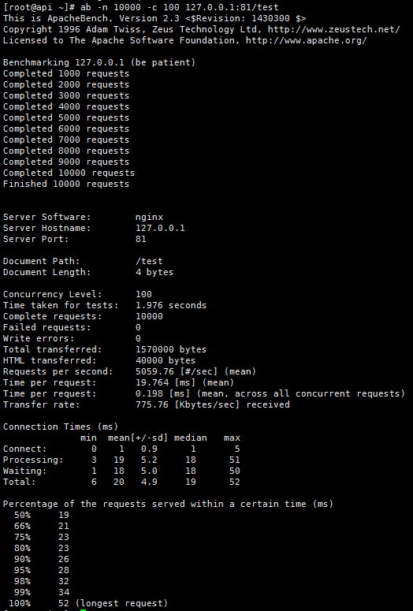
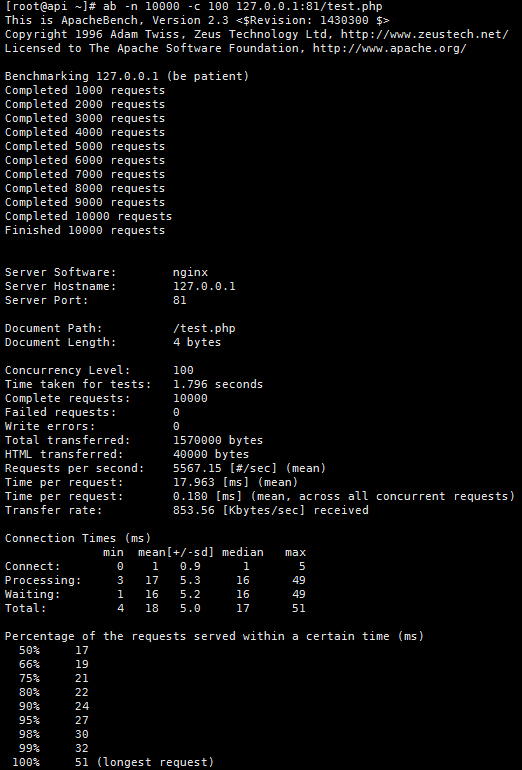
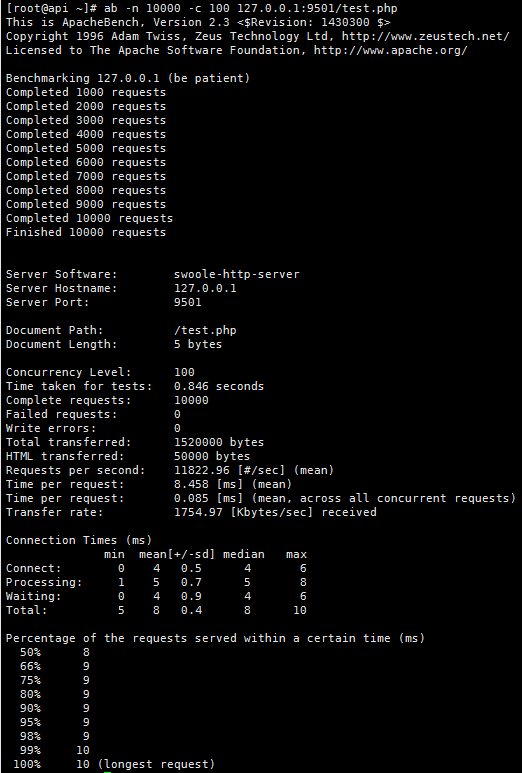
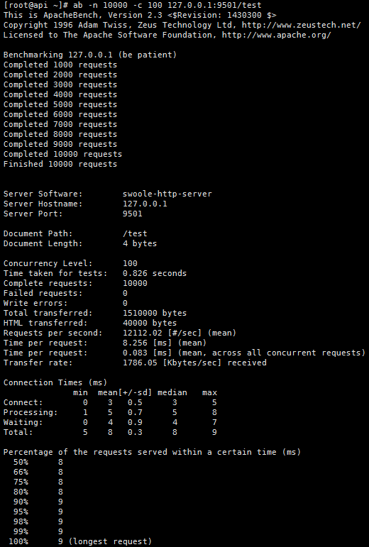

# Gene 简单编码，优雅生活！  
    Grace, fastest, flexibility, simple PHP extension framework！优雅、极速、灵活、简单的PHP扩展框架！     

    
欢迎来到 Gene 框架， 一种崭新的速度最快PHP扩展框架。开源、全功能栈、使用 C 编写、极致优化的高性能框架。身处在框架社区的繁荣之下，我们都在有意或无意地追逐，简单而不简单。极简而具有扩展性的架构设计、围绕常驻内存的方式而开发，提供了命令行、容器注入、钩子、路由、缓存等开发所需的众多开箱即用的组件。一份代码同时支持PHP-FPM模式、swoole常驻模式的唯一扩展框架，可以开发高性能的web应用或者常驻内存应用，让开发者不再为框架烦恼，不再为性能忧愁，写最少的代码，做最靓的仔！   

>   最新版本：3.3.1    
>   官方网站：Gene框架 http://www.php-gene.com/

框架核心特性：
* 优雅：优雅微架构，提供松耦合的、有一定的有界上下文的面向服务架构，按需组合，适应DDD领域驱动设计；
* 极速：运行速度最快的框架：Nginx+PHP-FPM模式、swoole模式下均是最快，没有之一；
* 灵活：支持传统MVC模式；同时支持MVCS模式：瘦MC模式，通过增加service层更好的实现模块封装；
* 简单：一分钟demo入门，优雅而简单；
* 场景：胜任WEB应用、微服务、常驻进程等场景；
* 路由：完整支持HTTP REST请求；底层采用二叉树查找算法，性能强劲；
* 钩子：路由支持全局前置、后置钩子；支持自定义前置钩子；
* 依赖注入：参考 Java Spring 的 Bean 设计思想，实现了简易好用的IoC；支持全局注入，局部控制反转等；
* 中间件：AOP (面向切面编程)，配置文件注册对象，调用方便且解耦；
* 工厂：提供工厂单例支持；
* 数据库：封装高性能PDO ORM类库,支持mysql、mariadb、mssql、postgresql、sqlite数据库；
* 配置：配置缓存到进程，修改自动更新；
* 验证：万能验证类，内置常用基础验证规则，支持自定义规则，灵活强大；
* 视图：方式一、使用编译模板引擎，支持模板标签，支持模板缓存；方式二、使用原生PHP做模板引擎；两种方式均支持布局、属性赋值、对象引用等；
* 长连接：按进程保持的长连接，支持Mysql/Redis/Memcached；持久连接断开自动检测；
* 命令行：封装了命令行开发基础设施，可快速开发控制台程序、守护进程；
* 缓存：支持两种缓存，一是方法级定时缓存；二是实时版本缓存（创新功能：高效的实时缓存方案，轻松解决复杂缓存的更新，比如分页数据的缓存）； 
* 自动加载：基于 PSR-4，支持自定义扩展类库加载目录；
* 完美支持Swoole（gene框架严格测试，常驻进程下低内存占用，无内存泄露）；
* 其他：redis、memcached类库二次封装；

## 一、简单应用（一分钟入门）  
### 第1步：应用入口index.php

   加载配置文件并启动：
   
    <?php
    $app = \Gene\Application::getInstance();
    $app
      ->load("router.ini.php")
      ->load("config.ini.php")
      ->run();  

### 第2步：路由文件router.ini.php   

   配置REST路由：支持指定类方法或者回调闭包函数；   
   
    <?php
    $router = new \Gene\Router();
    $router->clear()
    
    //定义get
    ->get("/", "\Controllers\Index@run")
    
    ->get("/test", "\Controllers\Index@test", "@clearAll")
    
    //定义post
    ->post("/",function(){
            echo "index post";
    })    
        
    //分组模式
    ->group("/admin")
        ->get("/:name/",function($params){
            var_dump($params);
        })
        ->get("/blog/:ext",function($params){
            var_dump($params);
        },"auth@clearAll")
    ->group()
    
    //定义静态页面
    ->get("/index.html",function(){
        echo 'index';
    }, "@clearAfter")
    
    //定义404
    ->error(404,function(){
        echo " 404 ";
    })
    
    //定义自定义钩子
    ->hook("auth",function(){
        echo " auth hook ";
        return true; // 返回false中断请求
    })
    
    //全局前置钩子
    ->hook("before", function(){
        echo " before hook ";
    })
    
    //全局后置钩子
    ->hook("after", function($params){
        echo " after hook ";
    });

### 第3步：配置文件config.ini.php

    配置应用变量或者对象；
    <?php
    $config = new \Gene\Config();
    $config->clear();
    
    //视图类注入配置
    $config->set("view", [
        'class' => '\Gene\View'
    ]);

    //http请求类注入配置
    $config->set("request", [
        'class' => '\Gene\Request'
    ]);

    //http响应类注入配置
    $config->set("response", [
        'class' => '\Gene\Response'
    ]);
    
    //数据库类注入配置
    $config->set("db", [
        'class' => '\Gene\Db\Mysql',
        'params' => [[
        'dsn' => 'mysql:dbname=gene_web;host=127.0.0.1;port=3306;charset=utf8',
        'username' => 'root',
        'password' => '',
        'options' => [PDO::ATTR_PERSISTENT => true]
            ]],
        'instance' => true
    ]);

    //缓存类注入配置
    $config->set("memcache", [
        'class' => '\Gene\Cache\Memcached',
        'params' => [[
        'servers' => [['host' => '127.0.0.1', 'port' => 11211]],
        'persistent' => true,
            ]],
        'instance' => true
    ]);
    
### 第4步：控制器文件\Controllers\Index:  

    namespace Controllers;
    class Index extends \Gene\Controller
    {
        /**
         * run
         */
        public function run()
        {
            echo 'hello world!';
        }
        
        /**
         * test
         */
        public function test()
        {
            // 模板赋值：配置文件里面配置view，调用$this->view自动注入到当前类空间 
            $this->view->title = "文档";
            // 调用父子模板
            $this->view->display('index', 'common');
        }    
    }

### 第5步：运行：在浏览器输入项目地址，比如：http://localhost/
    
## 二、命令行程序 
    <?php
    define('APP_ROOT', __dir__ . '/app/');

    $path = '';
    if (isset($_SERVER['argv'][1])) {
        $path = $_SERVER['argv'][1];
    } else {
        exit('This script is run as CLI');
    }

    $app = new Gene\Application();
    $app
        ->autoload(APP_ROOT)
        ->load("router.ini.php")
        ->load("config.ini.php")
        ->run('get', $path);
    

## 三、Swoole入口

    框架支持常驻进程，经过完整的内存泄露测试，完美适配swoole4.X版本；
    <?php
    define('APP_ROOT', dirname(__dir__) . '/app');

    $http = new swoole_http_server("127.0.0.1", 9501, SWOOLE_PROCESS);

    //配置
    $http->set([
        'worker_num' => 1, 
        'max_request' => 10000,
        'dispatch_mode'=> 2,
    ]);

    $http->on("start", function ($server) {
        echo "Swoole http server is started";
    });

    $http->on("request", function ($request, $response) {
        $type = $request->server['request_method'] ?? "get";
        $url = $request->server['request_uri'] ?? "/";
        \Gene\Request::init($request->get, $request->post, $request->cookie, $request->server, null, $request->files);
        \Gene\Di::set("response", $response);
        
        ob_start();
        $app = \Gene\Application::getInstance();
        $app
        ->autoload(APP_ROOT)
        ->load("router.ini.php")
        ->load("config.ini.php")
        ->run($type, $url);
        
        $out = ob_get_contents();
        ob_end_clean();
        $out && $response->end($out);
    });

    $http->start();
    
## 四、性能测试
### docker运行环境(php-fpm+nginx): Gene应用,访问地址：/test
   
### docker运行环境(php-fpm+nginx): 原生php,访问地址：/test.php
   
### swoole运行环境: Gene应用,访问地址：/test 
   
### swoole运行环境:  原生php,访问地址：/test.php
   
    
    上述测试中，原生php文件test.php的内容：
    <?php
    echo 'test';
    
而Gene应用包含了入口文件、路由文件、配置文件、控制器等至少4个文件，但测试数据只是略低，所以确定Gene框架没有产生格外的性能损失，这是不可思议的。证明gene框架是运行速度最快的框架：Nginx+PHP-FPM模式、swoole模式下均是最快，没有之一；欢迎下载demo测试：http://www.php-gene.com/static/test/demo.zip
    
## 五、快速安装
    
    phpize
    ./configure --enable-gene=shared
    make
    make install
    

## 六、案例 
    一：湖北省教育用户认证中心(全省几百万学生、教育用户的登录入口) ：http://open.e21.cn/
            
    二：尚动电子商务平台

    三：生材网 https://www.materialw.com/

## 七、其他 
php5的版本 ：https://github.com/sasou/php-gene （最新版本：2.1.0，还在使用php5的朋友使用）

windows版本：https://github.com/sasou/php-gene-for-windows （已编译x86平台下的NTS版本）

