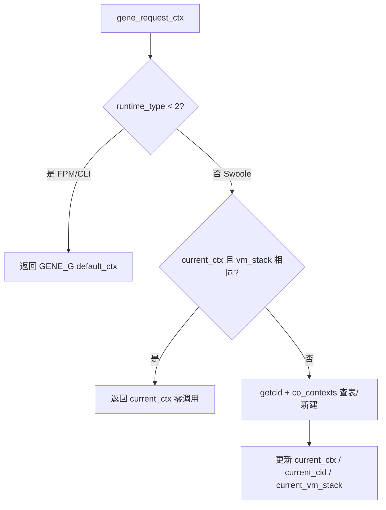

# Gene PHP Extension 审计报告 - FPM / Swoole 高并发与内存

## 版本信息

| 项 | 值 |
|---|---|
| **版本** | 5.6.4 |
| **日期** | 2026-05-25 |
| **审计类型** | 静态代码审计（非压测） |
| **审计目标** | FPM 与 Swoole 模式下的极致高并发性能及内存占用控制 |
| **主要源码** | `src/gene.c`、`src/gene.h`、`src/db/pool.c`、`src/cache/redis_pool.c` |
| **关联报告** | [AUDIT_REPORT_2026_05_24.md](./AUDIT_REPORT_2026_05_24.md)（悬垂指针修复） |

## 执行摘要

| 指标 | FPM / CLI | Swoole |
|---|---|---|
| 请求上下文获取 | O(1)，零分配 | 三层快路径，亚微秒级 |
| ctx 结构体池上限 | 不使用（单例 `default_ctx`） | 默认 256 × ~320B ≈ **80KB/worker** |
| 协程上下文表软上限 | 不适用 | `gene.co_contexts_max` 默认 **1024** |
| 跨请求悬垂指针 | 5.6.4 已修复 ~73 处 | 同左 |
| 连接池 | FPM：**不使用**（`runtime_type<2` 时 `gene_pool_get_pdo` 直接返回）；Swoole：`runtime_type>=2` 且配置 `pool` 键 | Channel + Atomic + Timer |

**结论**：Gene 5.6.4 在双运行模式下将「上下文获取」压到亚微秒级；内存策略为「稳态零拷贝 + 病态收敛」；连接池覆盖 TOCTOU、yield 穿透、overflow 自愈与两阶段关停。静态视角下已具备生产高并发部署条件。建议长期监控 `Pool::stats()` 的 `overflow` 与 worker RSS。

---

## 1. 运行时分流：`runtime_type` 决定一切

Gene 通过 INI `gene.runtime_type` 或运行期 `Application::setRuntimeType()` 选定路径（须在 workerStart / 首个请求前完成），分流点在 `gene_request_ctx()`（`src/gene.c`）。



### 1.1 FPM / CLI（`runtime_type < 2`）

| 机制 | 说明 |
|---|---|
| **单例 ctx** | `GENE_G(default_ctx)` 内嵌于模块全局，无每请求 `emalloc` |
| **RINIT** | `gene_request_context_init` 或 `reset`，复用 HashTable |
| **RSHUTDOWN** | `gene_request_context_destroy` + `gene_request_context_pool_drain` |
| **fn_cache** | 仅 FPM：RSHUTDOWN 销毁 `fn_cache`，避免路由闭包跨请求残留 |
| **连接池** | **不使用**；`gene_pool_get_pdo` 在 `runtime_type<2` 时 return 0，每请求新建 PDO |

热路径（`gene_request_ctx` 首分支）：

```635:638:src/gene.c
	/* Fast path: FPM mode — no coroutine overhead */
	if (EXPECTED(GENE_G(runtime_type) < 2)) {
		return &GENE_G(default_ctx);
	}
```

### 1.2 Swoole（`runtime_type >= 2`）

| 机制 | 说明 |
|---|---|
| **每协程一 ctx** | `co_contexts: HashTable[cid → gene_request_context*]`，初始 size=32 |
| **三层快路径** | ① `EG(vm_stack)` 与 `current_vm_stack` 相等 → ② `cid == current_cid` 且哈希校验一致 → ③ 查表/分配 |
| **resident_ctx** | `cid < 0`（如 `onWorkerStart`）使用独立驻留 ctx，不污染 `co_contexts` |
| **软上限 + sweep** | 元素数 ≥ `co_contexts_max` 时：`Coroutine::exists()` 精确清理；仍超限则按插入序淘汰至 cap 的 75% |
| **RSHUTDOWN 假设** | 框架假定 Swoole worker **仅在退出时**触发 RSHUTDOWN；每 HTTP 请求 RSHUTDOWN 的环境与常驻模型不兼容 |

**cid 复用安全**（v5.5.8）：仅比较 `current_cid` 不够，必须再探 `co_contexts`，否则 Swoole 复用 cid 会返回已死协程的 ctx。

```660:676:src/gene.c
	if (EXPECTED(GENE_G(current_ctx) != NULL && cid >= 0
			&& cid == GENE_G(current_cid)
			&& GENE_G(co_contexts) != NULL)) {
		ctx = zend_hash_index_find_ptr(GENE_G(co_contexts), (zend_ulong)cid);
		have_ctx_lookup = 1;
		if (EXPECTED(ctx == GENE_G(current_ctx))) {
			GENE_G(current_vm_stack) = (void *)EG(vm_stack);
			return ctx;
		}
		/* Identity mismatch: cid reused, or ctx silently evicted by sweep. */
		GENE_G(current_ctx) = NULL;
		...
	}
```

### 1.3 相关 INI

| INI | 默认 | 作用 |
|---|---|---|
| `gene.runtime_type` | 1 | `<2` FPM；`>=2` Swoole |
| `gene.co_contexts_max` | 1024（ini 显示 8192 为旧注释，代码默认 1024） | `co_contexts` 软上限 |
| `gene.ctx_pool_max` | 256 | 结构体池容量 |
| `gene.ctx_pool_prewarm` | 0 | 首次 RINIT 预暖池（Swoole） |

---

## 2. 请求上下文内存控制

### 2.1 结构体布局

`gene_request_context`（`src/gene.h`）约 **320 字节**：

- 8 个 `char*`：method、path、router_path、module、controller、action、child_views、lang（含缓存 `*_len`）
- 8 个内联 `zval`：path_params、request_attr、di_regs、response_obj、view_vars、db_*_history×4
- Benchmark 与时间字段

v5.5.8 起 `path_params` 由堆指针改为**内联 zval**，每请求省去一对 `emalloc`/`efree`（约 25–40 ns）。

### 2.2 path_params 桶饱和回收

当 `nTableSize > 128` 时整表丢弃并 `array_init_size(8)` 重建，防止单次病态请求（如 10k 路由参数）长期抬高 worker RSS。

```230:236:src/gene.c
		if (UNEXPECTED(Z_ARRVAL_P(pp)->nTableSize > 128)) {
			zval_ptr_dtor(pp);
			array_init_size(pp, 8);
			return;
		}
		zend_hash_clean(Z_ARRVAL_P(pp));
```

### 2.3 ctx 结构体池（仅 Swoole）

| 项 | 说明 |
|---|---|
| **实现** | 单链表，链接复用已释放 ctx 的 `path_params.value.ptr` 槽（此时 zval 为 UNDEF） |
| **acquire** | 池非空：1 load + 1 store + `array_init_size(path_params, 8)`；池空：`ecalloc` + `init` |
| **release** | 达 `ctx_pool_max` 则 `efree`，否则入池 |
| **prewarm** | `gene_request_context_pool_prewarm()`，worker 冷启前吸收分配压力 |
| **上限** | 256 × ~320B ≈ **80KB/worker** |

### 2.4 字段级回收策略

| 字段 | 类型 | 重置策略 | 理由 |
|---|---|---|---|
| `path_params` | inline zval(array) | size>128 整丢；否则 `zend_hash_clean` | 稳态零拷贝 + 病态收敛 |
| `request_attr` / `di_regs` / `view_vars` | inline zval(array) | `zval_ptr_dtor` + UNDEF | DI/视图桶可能膨胀 |
| `db_*_history` | inline zval(array) | 整体释放 | `GENE_DB_HISTORY_MAX=200`，worker 长存需收敛 |
| `bench_*` | inline scalars | 无条件清零 | ctx 复用时防止 Benchmark 串值 |
| method/path/... | emalloc 字符串 | efree + NULL | 每请求重建 |
| `log_file` / `log_level` | emalloc + scalar | efree + 标志归零 | 防止跨请求继承日志等级 |

`gene_request_context_free_fields` 对数组类字段采用**整表销毁**而非仅 `zend_hash_clean`，将病态请求的桶存储归还 ZMM（`src/gene.c` 注释 `[GENE_MEM:2026-04-24 v5.5.8]`）。

---

## 3. 连接池：极致并发与内存上限

`Gene\Pool`（`src/db/pool.c`）与 `Gene\Cache\RedisPool`（`src/cache/redis_pool.c`）架构对称：

- **空闲队列**：`Swoole\Coroutine\Channel`
- **计数**：`Swoole\Atomic`
- **回收**：`Swoole\Timer::tick` → `recycleIdle()`
- **C 层加速**：`gene_pool_named_cache` / `gene_redis_pool_named_cache`（`HashTable[name → zend_object*]`）

> Swoole 模式下禁用 `PDO::ATTR_PERSISTENT`（`pool_normalize_config`），持久 PDO 与协程不兼容。

### 3.1 `get()` 状态机

```
1. channel.pop(0.001)     非阻塞取空闲连接（跳过 isEmpty 防 TOCTOU）
2. Atomic::add(1)       先占后查：new_count <= max → 新建连接；否则 sub(1) 回滚
3. channel.pop(waitTimeout)  阻塞等待归还
4. 仍超时 → overflow 连接（count > max），E_NOTICE，不抛异常
```

**TOCTOU**：`Atomic::add(1)` 返回递增后值，两协程不能同时对同一槽位认为 `count <= max`。

### 3.2 `put()` 与自动收敛

| 行为 | 说明 |
|---|---|
| 跳过探活 | 不调用 `PDO::getAttribute` / `Redis::ping`，省 RTT；死连接由 `recycleIdle` 处理 |
| overflow 回收 | `count > max` 时直接 decrement，连接丢弃 |
| yield 安全 | **先** `ZVAL_COPY` + **再** `zend_update_property_null`，再 `channel.push`，避免 yield 期间属性仍指向未归还连接 |

### 3.3 热路径零分配优化

| 优化点 | 改造前 | 改造后 | 效果 |
|---|---|---|---|
| 类查找 | `static zend_string*` + `zend_lookup_class` | `gene_lookup_class_str` | 栈缓冲小写 + `EG(class_table)`；无跨请求悬垂 |
| 方法定位 | 每次 `hash_str_find_ptr` | `static zend_function*` 懒解析 | 约少 50ns/次 |
| 命名池 | `getInstance()` PHP 调用链 | C 层 `named_cache` 一次 `zend_hash_find_ptr` | 省 PHP 帧与静态属性读 |
| config | 每连接 `array_init` + dup | `__construct` 一次 `pool_normalize_config` | 突发建连不重复规范化 |
| channel 项 | 关联数组 `{conn, lastUsed}` | packed `[0]=conn, [1]=ts` | `zend_hash_index_find` |
| recycleIdle 计数 | 每轮 `atomic.get()` | 首读 + 本地 delta | 减少 Atomic 调用次数 |

### 3.4 关停协议

**`closeAll()`（两阶段）**

1. 全部标 `closed` + `stopTimers`，阻断新 `get()`
2. 快照 `instances`（`ZVAL_COPY` + addref）后依次 `close()`，免疫 yield 期间 HashTable rehash

**`close()`（协程内）**

- Phase A：非阻塞 drain idle（`pop(0.001)`，因 `pop(<=0)` 会永久阻塞）
- Phase B：短轮询等待 in-flight 归还
- Phase C：`Channel::close()` 唤醒阻塞 `get()`
- Phase D：`set_count(0)` + **立即 null channel 属性**，在 worker 内释放残余 PDO/Redis zval

**非协程 `onWorkerStop`**：跳过 A–C，仅 null channel（Swoole API 限制）。推荐：

```text
onWorkerExit  → Pool::stopTimers() + RedisPool::stopTimers()
onWorkerStop  → Pool::closeAll()   + RedisPool::closeAll()
```

### 3.5 named_cache 与 worker 生命周期

- 分配：`emalloc`（请求作用域堆）；Swoole worker 内跨 PHP 请求存活，与 `instances` 静态数组同寿
- 清理：`closeAll()` + `GENE_MSHUTDOWN_FUNCTION(pool/redis_pool)`
- 风险：进程异常退出未 `closeAll()` 时 valgrind 可见泄漏；正常运行无功能性问题

---

## 4. 跨请求内存安全（opcache.file_cache_only=1）

详见 [AUDIT_REPORT_2026_05_24.md](./AUDIT_REPORT_2026_05_24.md)。

| 修复手段 | 函数/宏 | 要点 |
|---|---|---|
| 类查找 | `gene_lookup_class_str` | 不缓存 `zend_string*`；快路径栈上小写探表 |
| 字符串 | `gene_interned_str_persistent` | 仅 `IS_STR_PERMANENT` 写入 slot |
| 自动全局 | `zend_is_auto_global_str` | `_COOKIE` 等不再缓存 interned 指针 |

性能代价：无 permanent 时约 **25 ns/site**，~73 处合计约 **2 µs/请求**，远小于一次 I/O。

`pool.c` / `redis_pool.c` 中 Swoole 类 CE 的 `static zend_class_entry*` / `static zend_function*` 缓存**安全**（内部类进程级有效，与 zend_string 悬垂无关）。

---

## 5. 风险面与可度量瓶颈

| 风险 | 触发条件 | 现状 | 建议 |
|---|---|---|---|
| co_contexts 雪球 | 未 `cleanup()` 且 `exists()` 不可用 | 插入序回退淘汰，可能误删长寿协程 | defer 清理；调大 cap 前确认 `exists()` |
| named_cache 失效 | 运行期切换 runtime_type（当前不可能） | 注释已标注 | 若支持热切换，改 pemalloc 或 MSHUTDOWN 清 |
| overflow 打爆下游 | 突发 + 短 waitTimeout | 仅 E_NOTICE | 监控 `stats()['overflow']`；合理设 max |
| fn_cache（Swoole） | 仅 MSHUTDOWN 释放 | 按 closure `handle` 去重 | 动态闭包场景定期检查表大小 |
| db_*_history | 单请求 >200 条 SQL | reset 整表 dtor | 可下调 `GENE_DB_HISTORY_MAX` 降 RSS |
| Channel API 约束 | workerStop 无协程 | 跳过 drain | 必须 `stopTimers` + `closeAll` 组合 |

---

## 6. 生产调优清单

### 6.1 php.ini — FPM

```ini
gene.runtime_type = 1
gene.use_namespace = 1
gene.view_compile = 1

opcache.enable = 1
opcache.file_cache_only = 0
```

若必须使用 `file_cache_only=1`：5.6.4 已无已知悬垂；额外开销约 2 µs/请求。

### 6.2 php.ini — Swoole

```ini
gene.runtime_type = 2
gene.co_contexts_max = 4096
gene.ctx_pool_max = 512
gene.ctx_pool_prewarm = 256
```

```php
// onWorkerStart — workerReady() 已自动 prewarm ctx 池（v5.5.8+），prewarmCtxPool() 可选
\Gene\Application::getInstance()->workerReady();

// onWorkerExit
\Gene\Pool::stopTimers();
\Gene\Cache\RedisPool::stopTimers();

// onWorkerStop
\Gene\Pool::closeAll();
\Gene\Cache\RedisPool::closeAll();
```

### 6.3 连接池参数

| 参数 | 默认 | 推荐 | 说明 |
|---|---|---|---|
| min | 1 | ≈ worker 常驻协程数 / 2 | 过高浪费连接；过低冷启抖动 |
| max | PDO 64 / Redis 构造默认 64（`rpool_get_max` 属性缺失时 fallback **10**） | 下游可承受并发 / worker 数 | 超出会触发 overflow 通知 |
| idleTimeout | 60s | 60–300s | timer 周期 = idleTimeout/2，最低 1s |
| waitTimeout | 3.0s | 0.5–2.0s | 宁可 overflow，少阻塞协程 |

---

## 7. 总体评价

Gene 5.6.4 在 **FPM** 与 **Swoole** 双模式下：

1. **性能**：上下文获取亚微秒级；连接池热路径消除 PHP 帧、重复哈希与每连接 config 拷贝。
2. **内存**：三道护栏——`path_params` 桶饱和阈值、`ctx_pool_max`、`co_contexts_max` + sweep；字段级「病态整表释放」防止 worker RSS 漂移。
3. **正确性**：协程 cid 复用校验、Atomic add-then-check、null-then-push、两阶段 closeAll；file_cache_only 悬垂已全库修复。

**建议长期指标**：

- `Gene\Pool::stats()` / `RedisPool::stats()` 中 `overflow` 持续 > 0 → 调高 `max` 或优化持有时间
- `Gene\Memory::stats()` 中 `co_contexts_items`、`ctx_pool_size`、`fn_cache_items`
- worker 进程常驻 RSS 与上述指标的相关性；RSS 漂移优先排查 **业务侧 static/global**

---

## 8. 参考资料

| 文档/源码 | 说明 |
|---|---|
| `src/gene.c` | `gene_request_ctx`、ctx 池、co_contexts sweep、RINIT/RSHUTDOWN |
| `src/gene.h` | `gene_request_context`、INI 相关全局、辅助函数声明 |
| `src/db/pool.c` | PDO 连接池、named_cache、get/put/closeAll |
| `src/cache/redis_pool.c` | Redis 连接池（对称实现） |
| `audit/AUDIT_REPORT_2026_05_24.md` | 悬垂指针专项审计 |
| `demo/public/swoole.php` | Swoole 部署参考（`workerReady` 自动 prewarm，无单独 `prewarmCtxPool`） |

---

## 9. 分析差异汇总

本节汇总 **本报告**、**二次架构探索**（子代理只读分析）、**Canvas 可视化摘要**、**历史审计/CHANGELOG** 之间的不一致结论，并以当前源码（5.6.4）为最终裁决依据。

### 9.1 差异对照表

| 议题 | 本报告 / Canvas | 二次探索 / 历史审计 | 源码裁决（5.6.4） |
|---|---|---|---|
| **`co_contexts_max` 默认值** | 1024；注释称 8192 为旧值 | CHANGELOG v5.5.x 引入时记 **8192**；`AUDIT_2026_05_10_v2` 记 v5.4.x 下调至 1024 | **1024**：`PHP_INI` 注册 `"1024"`（`src/gene.c:75`）；sweep fallback 硬编码 1024（`:584`）；函数注释仍写 `default 8192`（`:555`，**注释过时**） |
| **`runtime_type` 设定时机** | §1 写「进程启动 / MINIT 一次性选定」 | demo 在 Swoole `Server` 创建前调用 `setRuntimeType('swoole')` | INI 在 MINIT 加载；**运行期仍可** `Application::setRuntimeType()` 改写（须在首个请求 / workerStart 业务前完成）。写「仅 MINIT」不准确 |
| **ctx 池 prewarm 是否必做** | §6.2 示例同时写 `prewarmCtxPool()` + `workerReady()` | `demo/public/swoole.php` **只调** `workerReady()` | v5.5.8+：`workerReady()` 在 `runtime_type>=2` 且 `ctx_pool_size==0` 时**自动** `prewarm(-1)`（`application.c:1315-1316`）。显式 `prewarmCtxPool()` / INI `ctx_pool_prewarm` 为**可选**增强，非部署必选项 |
| **FPM 是否使用连接池** | §执行摘要仅写「runtime>=2 且配置 pool 键」 | 明确：**FPM 无连接池**，每请求新建 PDO | `gene_pool_get_pdo` / `gene_redis_pool_get` 在 `runtime_type < 2` 时 **return 0**（`pool.c:1337`、`redis_pool.c:1490`）。FPM 瓶颈含 **TCP+认证 RTT**，非框架 C 层可消 |
| **Swoole 下 RSHUTDOWN 频率** | §1.1/§1.2 描述 RSHUTDOWN 清理，未强调触发频率 | 框架假设：RSHUTDOWN **仅在 worker 退出**触发，非每 HTTP 请求 | `php_gene_close_request_globals()` 会销毁 `co_contexts`、释放 `app_root` 等（`gene.c:755-810`）。若 Swoole/PHP 配置导致**每请求 RSHUTDOWN**，将与常驻 worker 模型冲突 — **环境依赖风险**，本报告初版未单列 |
| **Redis 池 `max` 默认值** | §6.3 与 PDO 并列写默认 **64** | 同左 | `__construct` 默认 `max_val=64`（`redis_pool.c:745`）；`rpool_get_max()` 在属性缺失时 fallback **10**（`:453`）。正常 `create()` 路径为 64；**仅异常/残缺对象**才落到 10 |
| **`named_cache` MSHUTDOWN** | §3.5：`closeAll()` + MSHUTDOWN 清理 | 子代理建议「改 pemalloc」；`pool.c:47` 注释写「无 MSHUTDOWN handler」 | **已实现**：`GENE_MSHUTDOWN_FUNCTION(pool/redis_pool)` 均调 `*_named_cache_clear()`（`pool.c:1483-1485`、`redis_pool.c:1671-1673`）。`pool.c` 顶部 AUDIT 注释**过时**；子代理 pemalloc 建议为可选增强，非当前缺陷 |
| **`cleanup()` 语义** | §1.2 隐含「请求结束清理」 | 描述为 clearState + destroyContext **三阶段** | 实际：`cleanup()` 直接 `zend_hash_index_del(co_contexts, cid)` → `gene_co_context_dtor` → `destroy` + `pool_release`（`application.c:954-1000`、`gene.c:479-493`）。**无**先调 `clearState()` 的独立阶段；与 `destroyContext()` 效果等价 + 可选 `gc_collect_cycles()` |
| **性能量化（QPS）** | 本报告：**非压测**，无 QPS 数字 | 引用 README：FPM ~15k、Swoole ~47k QPS vs 原生 | 属**参考基准**，非本次静态审计实测；环境/硬件/业务差异大，**不宜写入本报告结论** |
| **FPM 优化空间判断** | 强调 ctx 零分配、路由缓存等 C 层成果 | `AUDIT_2026_05_05`：FPM C 层**已无显著优化空间**；瓶颈在进程模型与 I/O | **视角差异**：框架内优化到位，**整体 QPS 仍受 PHP-FPM 架构约束**；两者不矛盾 |
| **RSS 增长主因** | 聚焦框架内三道护栏（path_params / ctx_pool / co_contexts） | 子代理：**userland 静态变量 / 全局状态**是最常见长跑 RSS 源 | 框架侧有界；生产 RSS 漂移应**先查业务静态/global**，再查 `Memory::stats()` 与连接池 overflow |
| **长期监控指标** | §7：`Pool::stats()['overflow']`、worker RSS | 子代理追加 `Memory::stats()`（`co_contexts_items`、`ctx_pool_size`、`fn_cache_items`） | 建议**合并监控**：连接池 overflow + `Memory::stats()` + 进程 RSS |
| **未实现改进项** | §5 风险表部分覆盖 | 子代理列 5 项：Swoole RSHUTDOWN 守卫、fn_cache LRU、overflow 硬熔断、named_cache pemalloc、file_cache_only 压测回归 | 均为**可选演进**，非 5.6.4 已知 Bug；纳入差异记录供后续版本评估 |

### 9.2 本报告初版需修正的表述

结合上表，对本文档既有章节作如下勘误（正文已在下方小节同步修订）：

1. **§1**：`runtime_type` 由 INI **或** `setRuntimeType()` 设定，不限于 MINIT。
2. **§6.2**：`workerReady()` 已含 ctx 池自动 prewarm；`prewarmCtxPool()` 改为可选。
3. **§执行摘要 / §3**：补充 FPM **不使用** DB/Redis 连接池的明确说明。
4. **§6.3**：注明 Redis `rpool_get_max()` fallback=10 与构造默认 64 的差异。

### 9.3 分析来源与可信度

| 来源 | 范围 | 与本报告关系 |
|---|---|---|
| 本报告（§1–§8） | `gene.c`、`pool.c`、`redis_pool.c` 静态审计 | 主文档 |
| 二次架构探索 | 全仓只读 + demo 入口 + 历史 audit 交叉 | 补充生命周期、FPM 固有限制、监控项 |
| Canvas 摘要 | 本报告可视化版 | 与初版 §6.2 prewarm 示例一致；**未**反映 workerReady 自动 prewarm |
| CHANGELOG / AUDIT_2026_05_05 / _05_10_v2 | 版本演进与评分 | `co_contexts_max` 8192→1024 变更链；FPM A+ 评分语境 |

**统一结论**：5.6.4 在 C 层双模式分流、连接池并发协议、跨请求悬垂修复上**各来源一致**；差异主要集中在 **默认值文档滞后**、**部署示例过时**、**FPM/Swoole 能力边界表述粒度**、以及 **是否收录参考 QPS** 四类，不影响「生产可部署」的总体判断。

---

## 变更记录

| 日期 | 说明 |
|---|---|
| 2026-05-25 | 初版：FPM/Swoole 高并发与内存静态审计 |
| 2026-05-25 | 增补 §9 分析差异汇总；勘误 runtime_type 设定、prewarm 推荐、FPM 无连接池、Redis max fallback |
