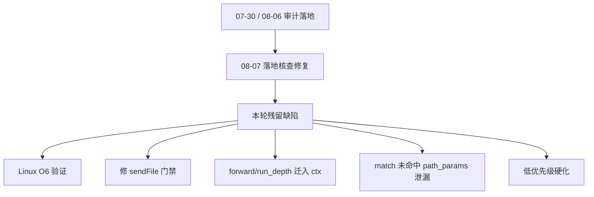

# 最近优化迭代审查与修复计划

## 总判

**方向正确，落地质量较高，但尚未达到「完美支持 FPM/Swoole + 极致高并发」。**

- 历史高危项（session 静态缓存 UAF、`named_cache` 跨请求悬垂、`app_stopped` 全局闩锁、pool CAS 半程修复）已正确闭环。
- 专项复核确认正确：[核查连接池与缓存修复](617cbb82-c111-4cc3-8d90-6df98763f826)（named_cache / CAS 回退 / TTL·mget·mset / DI release）、[核查DB构建器与核心协程](6bb92278-b7c6-48c3-b12b-3221d83fe32b)（union SEPARATE / join 防注入 / sweep·defer·ctx pool / stop per-ctx / monitor 所有权）。
- **阻塞「双模式正确性」的项**：`sendFile` 门禁写反；`forward_depth`/`run_depth` 挂 `GENE_G`；`Router::match` 未命中路径泄漏 `path_params`（[核查路由与HTTP修复](4926d04e-f650-45a3-82ac-6afee3d9c098) 发现，源码已确认）。
- Windows 环境无法关闭 O6；运行时「无泄漏」结论仍不能盖章。



---

## 已确认正确、无需回滚的主线

| 主题 | 证据 | 双模式含义 |
|------|------|------------|
| H1 session 插件 fn 缓存删除 | [`session.c`](src/session/session.c) 直查 | FPM 跨请求 UAF 已关 |
| M1 sweep cooldown + 栈分批 | [`gene.c`](src/gene.c) | Swoole 协程风暴防御 |
| F1 swoole_auto_cleanup defer | [`gene.c`](src/gene.c) | 漏调 cleanup 主压力源已抽掉 |
| named_cache 三件套 | [`pool.c:50-77`](src/db/pool.c)、redis_pool 同构 | FPM 不 populate |
| C1 CAS 对称 + rpool 回退 + PF1 | 两边 CAS/64/abandoned/get→sub | 多 worker Atomic 下溢窗口已堵 |
| `app_stopped` per-ctx | [`gene.h:177-182`](src/gene.h) + router 8 点 | Swoole 请求隔离正确 |
| memory TTL ↔ workerReady | 惰性删与免锁读互斥 | 高并发免锁读不被破坏 |
| union/join | 四驱动 SEPARATE + quote 白名单 | 无新增注入/泄漏 |
| Di alias/instance release | 含 E_ERROR 早退 | 无悬垂 |
| Session regenerateId/clear/all | ID/delete/cookie 链路闭合 | 功能可用（删旧窗口见 P2） |
| isDelete / isSecure | FPM/Swoole 经 getVal 一致 | API 对称已补齐 |

---

## 必须修复的缺陷（按严重度）

### P0 — `sendFile` 门禁写反

[`response.c:816-819`](src/http/response.c)：

```c
wrapper = php_stream_locate_url_wrapper(..., STREAM_LOCATE_WRAPPERS_ONLY);
if (!wrapper || wrapper != &php_plain_files_wrapper) RETURN_FALSE;
```

PHP 对无 scheme 本地路径在 `STREAM_LOCATE_WRAPPERS_ONLY` 下返回 `NULL`；`!wrapper` 当拒绝 → **FPM 合法本地文件全部失败**。

> 注：[核查路由与HTTP修复](4926d04e-f650-45a3-82ac-6afee3d9c098) 将此项判为「已正确」——与 php-src 对 `STREAM_LOCATE_WRAPPERS_ONLY` 的语义不符，**以本计划 P0 为准**。

**修法：** `locate(..., 0)` 后仅当 `wrapper != &php_plain_files_wrapper` 拒绝；Swoole 分支同等校验；`got < 0` 时 `RETURN_FALSE`。

### P1 — `forward_depth` / `run_depth` 迁入 `gene_request_context`

- [`controller.c:268-296`](src/mvc/controller.c)：跨协程共享 → 误杀；bailout 跳过 `--` → Swoole 整 worker 卡死。
- [`application.c:1406-1420`](src/app/application.c)：`run_depth` 串扰降级 auto-cleanup 的 `== 0` 判定。

**修法：** 字段迁入 ctx；reset/`free_fields` 清零；删除 `GENE_G` 双源。

### P1 — `Router::match` 未命中路径泄漏

[`router.c:2241`](src/router/router.c) `gene_router_reset_path_params()` 新建空数组后，未命中分支 [`2293-2300`](src/router/router.c) 直接 `ctx->path_params = saved_path_params` **覆盖而不 dtor**；成功路径 2344-2346 已正确释放。每次失败 `match()` 泄漏一个 HashTable。

**修法：** 覆盖前 `if (Z_TYPE(ctx->path_params) == IS_ARRAY) zval_ptr_dtor(&ctx->path_params);`（与成功路径对称）。

### P2 — 硬化批

| 项 | 说明 |
|----|------|
| `regenerateId` 窗口 | 先删旧再 dirty；建议先写新 id+save 再删旧，或文档强制随后 `save()` |
| `Memory::incr/decr` TTL | [`memory.c:1269`](src/cache/memory.c) 命中分支不查 `expired_nolock`，过期 key 仍累加而 get 报 miss |
| mssql `limit()` | 无 ORDER BY 时 OFFSET/FETCH 必然语法错；无 order 时补 `ORDER BY (SELECT NULL)` 或回退 TOP |
| mysql `limit($num,$offset)` | 生成 `LIMIT num,offset`，与 MySQL `LIMIT offset,count` 逗号语义相反——先确认是否既有契约再动 |
| prometheus | 同名指标重复 `# TYPE`（严格 exposition 不合格）+ 缺 `worker_id` |
| `View::render` | 模板异常时可能未 discard 缓冲；包 `zend_try` |
| healthCheck | 回推经 `pool_channel_push` 刷新 lastUsed，推迟 idle 回收——文档或改不刷新时间戳 |
| `mset` 数字键 | PHP 数字字符串键转 int 被跳过——文档或改键策略 |
| `gene_router_resolve_leaf` | 仍未抽出，维护风险（可选） |

---

## 高并发与双模式能力评价

**已具备（单 worker 协作）：** ctx second-chance cid、memory 免锁读、triple+TTL、双池 CAS、named_cache 仅 Server、sweep cooldown + defer cleanup。

**未达「极致」：** 池借还仍约 3 次跨界（PLAN P-1/P-2 需 profile）；`cache_max_items=0` 无界；缺 Linux O6；depth 闩锁与 match 泄漏未修前不能宣称双模式无缺陷。

**FPM：** 除 sendFile 回归与 match 失败泄漏外，请求生命周期静态正确。  
**Swoole：** `app_stopped`/co_contexts/auto_cleanup 正确；depth 全局闩锁是主要残留。

---

## 建议实施顺序

1. P0 `sendFile`
2. P1 depth 迁入 ctx + P1 match 未命中泄漏（同批小改）
3. P2 硬化：incr TTL、mssql limit、prometheus TYPE/worker_id、render try、regenerateId
4. 可选：`gene_router_resolve_leaf`；mysql limit 契约确认
5. profile 准入后的 PLAN P-1~P-4；F3/F4 维持设计批
6. Linux O6：编译/ASAN、多 worker 池计数、soak、sendFile 本地/wrapper、forward 协程交错、match 失败路径 Valgrind

---

## 验收标准（修复后）

- FPM：`sendFile` 本地成功、wrapper 失败；反复 `Router::match` 未命中后 RSS/HashTable 不涨。
- Swoole：协程 A `forward` 深度 3+yield 时 B 不受影响；bailout 后不永久撞上限。
- Swoole：嵌套/并发 `run()` 下降级 auto-cleanup 不误清、不漏清。
- `Memory::incr` 对已过期 TTL key 行为与 `get` miss 一致（按「不存在」重建）。
- 既有 Di/Hook/Database/Http/Cache 测试不回归；审计文档回写 P0/P1 闭环与 O6 项。
