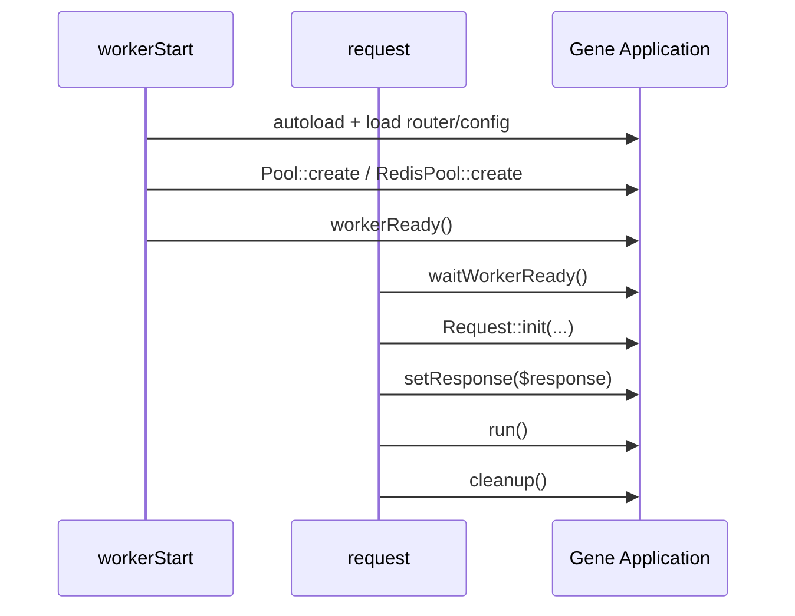

# Gene + Swoole 常驻模式

Gene 同一份业务代码可运行于 **FPM** 与 **Swoole**。本文仅描述 Swoole（`runtime_type` = `swoole` / `2`，或 `coroutine` / `3`）下的差异与必做事项。

**参考实现**：`demo/public/swoole.php`、`demo/config/config.ini.php`（`pool` 相关注释）。

---

## 1. 启用条件

| 项 | 要求 |
|----|------|
| PHP | 8.0+，`extension=gene` |
| Swoole | `extension=swoole`，建议开启协程 Hook |
| 入口 | 独立 `swoole.php`，**不要**与 FPM 共用会重复 `load()` 的脚本 |

启动前设置运行时：

```php
\Gene\Application::setRuntimeType('swoole');  // 或 setRuntimeType(2)
\Swoole\Runtime::enableCoroutine(SWOOLE_HOOK_ALL);
```

---

## 2. 请求生命周期（必记顺序）



| 阶段 | 调用 | 说明 |
|------|------|------|
| Worker 启动 | `autoload` → `load(router)` → `load(config)` → `setMode` | 每个 Worker 一次 |
| Worker 启动 | `Pool::create` / `RedisPool::create` | 从 Config 键读取连接参数 |
| Worker 启动 | **`workerReady()`** | 标记就绪；冻结进程级 Memory；预热请求上下文池 |
| 每次请求 | **`waitWorkerReady()`** | 防止首批请求早于 workerStart |
| 每次请求 | **`Request::init(...)`** | 注入 GET/POST/COOKIE/SERVER/FILES/HEADER |
| 每次请求 | **`setResponse($response)`** | 绑定 Swoole Response |
| 每次请求 | **`run()`** 无参 | 从 Request 上下文读 method/uri |
| 每次请求 | **`cleanup(true)`** | 释放协程上下文（`finally` 中必须执行） |
| Worker 退出 | `stopTimers()` | `onWorkerExit`，便于事件循环退出 |
| Worker 停止 | `closeAll()` | `onWorkerStop`，释放连接池 |

---

## 3. 完整入口模板

与 `demo/public/swoole.php` 对齐，可直接作为新项目起点：

```php
<?php
date_default_timezone_set('Asia/Shanghai');
define('APP_ROOT', dirname(__DIR__) . '/application');
define('CONF_DIR', dirname(__DIR__) . '/config');
define('WWW_ROOT', dirname(__DIR__) . '/public');

\Gene\Application::setRuntimeType('swoole');
\Swoole\Runtime::enableCoroutine(SWOOLE_HOOK_ALL);

$http = new \Swoole\Http\Server('0.0.0.0', 9501, SWOOLE_PROCESS);
$http->set([
    'worker_num'            => swoole_cpu_num(),
    'max_request'           => 10000,
    'enable_static_handler' => true,
    'document_root'         => WWW_ROOT,
]);

$http->on('workerStart', function ($server, $workerId) {
    \Gene\Application::getInstance()
        ->autoload(APP_ROOT)
        ->load('router.ini.php', CONF_DIR)
        ->load('config.ini.php', CONF_DIR)
        ->setMode(1, 1);

    \Gene\Pool::create('dbPool', 'db');
    \Gene\Cache\RedisPool::create('redisPool', 'redis');

    \Gene\Application::getInstance()->workerReady();
});

$http->on('workerExit', function () {
    \Gene\Pool::stopTimers();
    \Gene\Cache\RedisPool::stopTimers();
});

$http->on('workerStop', function () {
    \Gene\Pool::closeAll();
    \Gene\Cache\RedisPool::closeAll();
    gc_collect_cycles();
});

$http->on('request', function ($request, $response) {
    \Gene\Application::waitWorkerReady();

    \Gene\Request::init(
        $request->get,
        $request->post,
        $request->cookie,
        $request->server,
        null,
        $request->files,
        null,
        $request->header ?? []
    );
    \Gene\Application::setResponse($response);

    ob_start();
    $error = false;
    try {
        \Gene\Application::getInstance()->run();
    } catch (\Throwable $e) {
        $error = true;
        \Gene\Log::exception($e);
    } finally {
        $out = ob_get_clean();
        \Gene\Application::cleanup(true);
    }

    if ($error) {
        if ($response->isWritable()) {
            $response->redirect('/50x.html');
        }
        return;
    }
    if (!$response->isWritable()) {
        return;
    }
    $response->header('Content-Type', 'text/html; charset=utf-8');
    $response->end($out);
});

$http->start();
```

要点：

- **`run()` 不传 method/uri**，依赖 `Request::init` 写入的 server 数据（含自动大写的 `REQUEST_METHOD`、`REQUEST_URI`）。
- 业务代码仍用 **`$this->request`**（控制器/钩子），与 FPM 写法一致。
- 异常后检查 **`$response->isWritable()`**，避免重复写响应。

---

## 4. config.ini.php 与 FPM 的差异

### 4.1 数据库 `db`

```php
$config->set('db', [
    'class'    => '\Gene\Db\Mysql',
    'params'   => [[
        'dsn'      => 'mysql:dbname=app;host=127.0.0.1;charset=utf8',
        'username' => 'user',
        'password' => 'pass',
        'pool'     => 'dbPool',   // 与 Pool::create 第一个参数一致
        // 不要加 PDO::ATTR_PERSISTENT => true
    ]],
    'instance' => true,           // Swoole：每协程独立 Mysql 实例
]);
```

| FPM | Swoole |
|-----|--------|
| `instance => false` 常见 | **`instance => true`**（协程级 DI，避免 socket 跨协程绑定） |
| 无 `pool` 键 | **`pool` => 池名**，且 workerStart 中 `Pool::create` |
| 可用持久 PDO | **禁止** `PDO::ATTR_PERSISTENT`（进程级 socket，协程争用） |

`Gene\Db\Mysql` 在配置了 `pool` 后，内部从 `Gene\Pool` 借还 PDO，业务层仍写 `$this->db->select(...)`，无需手写 `get/put`。

### 4.2 Redis `redis`

```php
$config->set('redis', [
    'class'    => '\Gene\Cache\Redis',
    'params'   => [[
        'host'    => '127.0.0.1',
        'port'    => 6379,
        'timeout' => 1.0,
        'pool'    => 'redisPool',  // 与 RedisPool::create 第一个参数一致
        // Swoole 下勿依赖 pconnect；连接池使用 connect()
    ]],
    'instance' => true,
]);
```

`$this->redis` 或 `Di::get('redis')` 自动走池；需要时可 `$redis->release()` 提前归还（析构也会归还）。

### 4.3 其他组件

| 组件 | Swoole 建议 | 说明 |
|------|-------------|------|
| `memcache` / `redis`（无 pool 时） | `instance => true` | 单次调用无链式状态；协程 Hook 隔离 socket |
| `cache` (`Gene\Cache\Cache`) | `instance => false` 可按项目 | 代理层，按 FPM 习惯即可 |
| `session` | `instance => false` 或自定义 | 状态存外部驱动（redis/memcache） |
| `memory` (`Gene\Memory`) | `instance => true` | **仅在 `workerReady()` 之前** 写入；请求期只读 |

---

## 5. 连接池 API

### 5.1 `Gene\Pool`（PDO）

```php
// workerStart
\Gene\Pool::create('dbPool', 'db', [
    'min'         => 1,
    'max'         => 64,    // v5.4.3+ 默认 max=64
    'idleTimeout' => 60,
    'waitTimeout' => 3.0,
]);

// 手动借还（一般不需要，Mysql 已集成）
$pool = \Gene\Pool::getInstance('dbPool');
$pdo  = $pool->get();
try {
    // ...
} finally {
    $pool->put($pdo);
}

// 连接已死、不归还
$pool->remove();

// 监控
$pool->stats(); // total, idle, using, overflow, min, max, closed
```

`create` 的第二个参数 **`configKey`** 对应 `$config->set('db', ...)` 的键名，自动读取 `params[0]` 中的 `dsn/username/password/options`。

### 5.2 `Gene\Cache\RedisPool`

API 与 `Gene\Pool` 对称：

```php
\Gene\Cache\RedisPool::create('redisPool', 'redis', ['min' => 2, 'max' => 64]);
\Gene\Cache\RedisPool::getInstance('redisPool')->get();
\Gene\Cache\RedisPool::closeAll();
\Gene\Cache\RedisPool::stopTimers();
```

---

## 6. Application 专用方法

| 方法 | 时机 |
|------|------|
| `setRuntimeType('swoole'\|2)` | Server 创建前 |
| `waitWorkerReady()` | 每个 `request` 开头 |
| `workerReady()` | `workerStart` 末尾（加载完路由/配置/建池后） |
| `setResponse($response)` | 每个 `request`，在 `run()` 前 |
| `run()` | 无参；等价于自动检测当前 Request |
| `cleanup($gc = false)` | 每个 `request` 的 `finally`；推荐 `cleanup(true)` |
| `clearState()` / `destroyContext()` | 低层拆分清理；**优先用 `cleanup()`** |

### `workerReady()` 的副作用

1. 设置 Worker 就绪标记 → `waitWorkerReady()` 不再阻塞  
2. **冻结**进程级 `\Gene\Memory`：请求运行期调用 `Memory::set/del` 会告警并拒绝  
3. 自动预热请求上下文对象池（Swoole 下减少分配）

因此：**配置、路由预热、进程级缓存填充** 必须在 `workerReady()` **之前** 完成（通常在 `workerStart` 内 `load()` 之后、调用 `workerReady()` 之前）。

---

## 7. Request::init

Swoole 无 PHP 超全局，必须用 `init` 注入：

```php
\Gene\Request::init(
    $get,      // $request->get
    $post,     // $request->post
    $cookie,   // $request->cookie
    $server,   // $request->server（key 会自动补全大写副本）
    $env,      // 环境变量，可 null
    $files,    // $request->files
    $request,  // 合并参数，null 时自动 GET+POST
    $header    // $request->header（demo 第 8 参数）
);
```

请求结束后由 **`Application::cleanup()`** 清理，一般无需手动 `Request::clear()`。

---

## 8. 禁止与常见错误

| 错误做法 | 后果 / 正确做法 |
|----------|-----------------|
| 使用 `PDO::ATTR_PERSISTENT` | 多协程争用同一 socket → 用 **Pool** |
| 忘记 `cleanup()` | 协程上下文泄漏、内存上涨 |
| 忘记 `workerReady()` / `waitWorkerReady()` | 首批请求异常或竞态 |
| `workerReady()` 后在请求里 `Memory::set` | 运行期禁止写入；改 Redis 或 worker 启动前预热 |
| 闭包钩子里持有请求级大对象 | 常驻进程易泄漏；优先 **类钩子** `Hooks\*` |
| `run($method, $uri)` 与 `init` 混用不当 | Swoole 标准路径是 **init + run() 无参** |
| Worker 未 `closeAll()` 就退出 | 连接泄漏；`onWorkerStop` 必须关闭池 |

---

## 9. 与 FPM 的代码共用

- 控制器、Service、Model、路由、钩子 **无需为 Swoole 单独复制一套**  
- 仅入口文件、`config` 中 `instance`/`pool`、Server 事件回调不同  
- 若需判断环境：`Application::getRuntimeTypeName()` 返回 `fpm` / `swoole` / `coroutine`

---

## 10. 调试与演示

- Demo 路由：`/redis-demo`、`/redis-demo/performance`（`demo/application/Controllers/RedisDemo.php`）  
- 日志：`\Gene\Log::exception($e)`、`\Gene\Log::error($msg)`  
- 连接池状态：`Pool::getInstance('dbPool')->stats()`、`RedisPool::getInstance('redisPool')->stats()`

更多方法签名见 [reference.md](reference.md) 中 Application、Pool、RedisPool、Request 章节。
