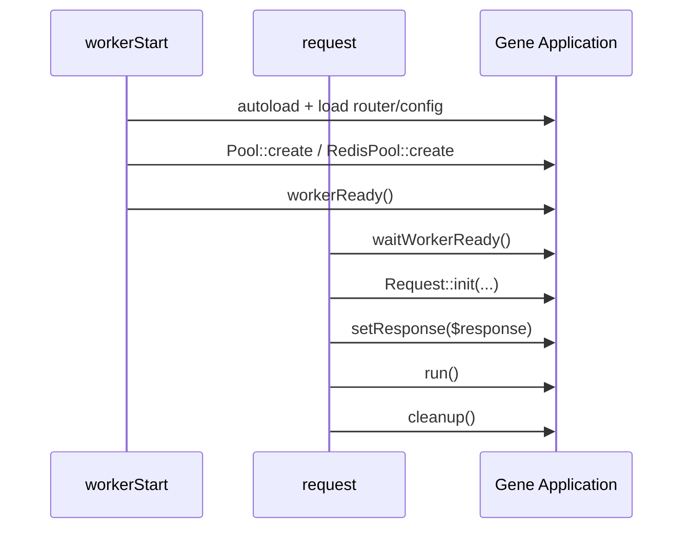

# Gene + Swoole 常驻模式

Gene 同一份业务代码可运行于 **FPM** 与 **Swoole**。本文仅描述 Swoole（`runtime_type` = `swoole` / `2`，或 `coroutine` / `3`）下的差异与必做事项。

**参考实现**：`demo/public/swoole.php`、`demo/config/config.ini.php`（`pool` 相关注释）。

---

## 1. 启用条件

| 项 | 要求 |
|----|------|
| PHP | 8.0+，`extension=gene` |
| Swoole | `extension=swoole`，建议开启协程 Hook |
| 入口 | 独立 `swoole.php`，**不要**与 FPM 共用会重复 `load()` 的脚本 |

启动前设置运行时：

```php
\Gene\Application::setRuntimeType('swoole');  // 或 setRuntimeType(2)
\Swoole\Runtime::enableCoroutine(SWOOLE_HOOK_ALL);
```

---

## 2. 请求生命周期（必记顺序）


```mermaid
sequenceDiagram
    participant W as workerStart
    participant R as request
    participant G as Gene Application

    W->>G: autoload + load router/config
    W->>G: Pool::create / RedisPool::create
    W->>G: workerReady()
    R->>G: waitWorkerReady()
    R->>G: Request::init(...)
    R->>G: setResponse($response)
    R->>G: run()
    R->>G: cleanup()
```

| 阶段 | 调用 | 说明 |
|------|------|------|
| Worker 启动 | `autoload` → `load(router)` → `load(config)` → `setMode` | 每个 Worker 一次 |
| Worker 启动 | `Pool::create` / `RedisPool::create` | 从 Config 键读取连接参数 |
| Worker 启动 | **`workerReady()`** | 标记就绪；冻结进程级 Memory；预热请求上下文池 |
| 每次请求 | **`waitWorkerReady()`** | 防止首批请求早于 workerStart |
| 每次请求 | **`Request::init(...)`** | 注入 GET/POST/COOKIE/SERVER/FILES/HEADER/RAW_CONTENT |
| 每次请求 | **`setResponse($response)`** | 绑定 Swoole Response |
| 每次请求 | **`run()`** 无参 | 从 Request 上下文读 method/uri |
| 每次请求 | **`cleanup(true)`** | 释放协程上下文（`finally` 中必须执行） |
| Worker 退出 | `stopTimers()` | `onWorkerExit`，便于事件循环退出 |
| Worker 停止 | `closeAll()` | `onWorkerStop`，释放连接池 |

---

## 3. 完整入口模板

与 `demo/public/swoole.php` 对齐，可直接作为新项目起点：

```php
<?php
date_default_timezone_set('Asia/Shanghai');
define('APP_ROOT', dirname(__DIR__) . '/application');
define('CONF_DIR', dirname(__DIR__) . '/config');
define('WWW_ROOT', dirname(__DIR__) . '/public');

\Gene\Application::setRuntimeType('swoole');
\Swoole\Runtime::enableCoroutine(SWOOLE_HOOK_ALL);

$http = new \Swoole\Http\Server('0.0.0.0', 9501, SWOOLE_PROCESS);
$http->set([
    'worker_num'            => swoole_cpu_num(),
    'max_request'           => 10000,
    'enable_static_handler' => true,
    'document_root'         => WWW_ROOT,
]);

$http->on('workerStart', function ($server, $workerId) {
    \Gene\Application::getInstance()
        ->autoload(APP_ROOT)
        ->load('router.ini.php', CONF_DIR)
        ->load('config.ini.php', CONF_DIR)
        ->setMode(1, 1);

    \Gene\Pool::create('dbPool', 'db');
    \Gene\Cache\RedisPool::create('redisPool', 'redis');

    \Gene\Application::getInstance()->workerReady();
});

$http->on('workerExit', function () {
    \Gene\Pool::stopTimers();
    \Gene\Cache\RedisPool::stopTimers();
});

$http->on('workerStop', function () {
    \Gene\Pool::closeAll();
    \Gene\Cache\RedisPool::closeAll();
    gc_collect_cycles();
});

$http->on('request', function ($request, $response) {
    \Gene\Application::waitWorkerReady();

    \Gene\Request::init(
        $request->get,
        $request->post,
        $request->cookie,
        $request->server,
        null,
        $request->files,
        null,
        $request->header ?? [],
        $request->rawContent()
    );
    \Gene\Application::setResponse($response);

    ob_start();
    $error = false;
    try {
        \Gene\Application::getInstance()->run();
    } catch (\Throwable $e) {
        $error = true;
        \Gene\Log::exception($e);
    } finally {
        $out = ob_get_clean();
        \Gene\Application::cleanup(true);
    }

    if ($error) {
        if ($response->isWritable()) {
            $response->redirect('/50x.html');
        }
        return;
    }
    if (!$response->isWritable()) {
        return;
    }
    $response->header('Content-Type', 'text/html; charset=utf-8');
    $response->end($out);
});

$http->start();
```

要点：

- **`run()` 不传 method/uri**，依赖 `Request::init` 写入的 server 数据（含自动大写的 `REQUEST_METHOD`、`REQUEST_URI`）。
- 业务代码仍用 **`$this->request`**（控制器/钩子），与 FPM 写法一致。
- 异常后检查 **`$response->isWritable()`**，避免重复写响应。

---

## 4. config.ini.php 与 FPM 的差异

### 4.1 数据库 `db`

```php
$config->set('db', [
    'class'    => '\Gene\Db\Mysql',
    'params'   => [[
        'dsn'      => 'mysql:dbname=app;host=127.0.0.1;charset=utf8',
        'username' => 'user',
        'password' => 'pass',
        'pool'     => 'dbPool',   // 与 Pool::create 第一个参数一致
        // PDO::ATTR_PERSISTENT 可保留 true：Swoole 模式下扩展自动改为 false
    ]],
    'instance' => true,           // 请求内按类名单例；FPM/Swoole 均可
]);
```

| FPM | Swoole |
|-----|--------|
| `instance => true/false` 均可（请求级，不跨请求复用） | 同左（协程级 `di_regs` 隔离，与 `instance` 无关） |
| 无 `pool` 键 | **`pool` => 池名**，且 workerStart 中 `Pool::create` |
| `ATTR_PERSISTENT => true` 可用（持久 TCP 连接） | 扩展自动改为 `false`（四驱动一致），配置可保留 `true` 适配双模式 |

`instance` 语义：`true` = 请求内按类名单例（同 class 不同 name 共享）；`false` = 请求内按 name 单例。两者均在请求结束随 `di_regs` 销毁，不跨请求/跨协程复用。协程隔离靠 `ctx->di_regs` 按协程 ID 分离，与 `instance` 无关。

`Gene\Db\Mysql` 在配置了 `pool` 后，内部从 `Gene\Pool` 借还 PDO，业务层仍写 `$this->db->select(...)`，无需手写 `get/put`。

### 4.2 Redis `redis`

```php
$config->set('redis', [
    'class'    => '\Gene\Cache\Redis',
    'params'   => [[
        'host'    => '127.0.0.1',
        'port'    => 6379,
        'timeout' => 1.0,
        'pool'    => 'redisPool',  // 与 RedisPool::create 第一个参数一致
        // Swoole 下勿依赖 pconnect；连接池使用 connect()
    ]],
    'instance' => true,
]);
```

`$this->redis` 或 `Di::get('redis')` 自动走池；需要时可 `$redis->release()` 提前归还（析构也会归还）。

### 4.3 Gene\Orm（ActiveRecord）

`Gene\Orm\Model` 继承 `Gene\Model`，通过 DI 取 `db`，内部对 `Gene\Db\*` 链式状态做 **reset 双保险**（终端方法 + `Query` 析构）。

```php
class User extends \Gene\Orm\Model {
    protected static string $table = 'sys_user';
    protected static string $primaryKey = 'user_id';
    protected static array $fields = ['user_id', 'user_name', 'status'];
    protected static bool $timestamps = true;       // 6.1.0+：自动填充 created_at/updated_at
}

User::find(1);
User::findMany([1, 2, 3]);                          // 6.1.0+：主键 IN 批量取
User::paginate(['status' => 1], 0, 20, 'user_id desc');
User::create($data);
User::createMany([$row1, $row2]);                   // 6.1.0+：批量插入
User::insertIgnore($data);                          // 6.1.0+：幂等写入
User::updateOrCreate(['name' => $n], $data);        // 6.1.0+：查到更新/否则插入
User::toggle($id, 'status');                        // 6.1.0+：CAS 状态翻转
User::query()
    ->fields(['u.user_id', 'u.user_name'])
    ->join('orders o', ['o.user_id' => 'u.user_id'], 'LEFT')
    ->where(['u.status' => 1])
    ->where('u.user_id', '>=', $anchor)             // 6.1.0+：比较简写
    ->whereLike('u.user_name', $kw)                 // 6.1.0+：LIKE %kw%（自动转义）
    ->selectSub('SELECT count(*) FROM orders WHERE user_id=u.user_id', 'oc')
    ->group('u.user_id')->having('oc >= 1')
    ->order('u.user_id desc')->limit(0, 20)
    ->all();
```

| 运行时 | 配置要求 | ORM 注意 |
|--------|----------|----------|
| FPM | `db.instance => false` 即可 | 每次新建 Db；仍会 reset |
| Swoole | `instance => true` + `pool` + `Pool::create` | 协程级 Db 单例；**禁止** `ATTR_PERSISTENT` |
| 请求结束 | `cleanup(true)` | meta 缓存随请求上下文释放；`clearState()` 会 rollBack 残留事务（6.1.0+） |

**事务卫生（6.1.0+，三道防线，共用 `gene_db_tx_hygiene()`）**：

1. **请求边界**：`clearState()`/`cleanup()`（及 FPM 的 RSHUTDOWN）扫描 DI 里的 Db 句柄，发现未提交事务则**先回滚、后告警**（E_WARNING 走 PHP 标准错误通道，**不经过** `set_error_handler`，避免「warning 转异常」的 handler 把回滚跳掉）。
2. **连接池边界**：`release()`/`free()`/析构归还 PDO 前同样检查 `inTransaction()`，脏连接先回滚再入池——覆盖未经 DI 的 `Pool::get()` 直取句柄（Swoole 下推荐形态）。
3. **裸句柄边界**：既不在 DI 也不走池的句柄（如直接 `new \Gene\Db\Mysql(...)`），`free()`/`__destruct` 在释放 PDO 前同样回滚 + 告警——补上 `ATTR_PERSISTENT` 裸用场景的缺口。

**回滚不抛异常（N6，6.1.0+）**：`gene_db_tx_hygiene()` 在 `rollBack()` 前后临时把 PDO `ATTR_ERRMODE` 置为 `ERRMODE_SILENT` 再还原，使清理路径**根本不会抛异常**。此前「先抛再丢」策略在 RSHUTDOWN 无栈帧时会升级为 E_ERROR + bailout，打印伪 `Uncaught PDOException [no active file]` 并截断后续 DI 条目的清理。SILENT 模式下 `rollBack()` 退化为返回 `false`，`gene_discard_current_exception()` 仍作为二道保险保留。

**异常寄存可重入（N8，6.1.0+）**：清理窗口内待处理业务异常保存在**局部变量**而非 `EG(prev_exception)`（`zend_exception_save/restore` 的寄存位），嵌套 hygiene 窗口（如 zval 释放级联触发另一个 Db 释放）不会互相干扰。`E_WARNING` 发射用 `zend_try` 包裹，保证用户 error handler 总被还原。

三道防线都是兜底而非鼓励残留事务：业务代码优先 `$this->db->transaction(function () { ... })`；手动路径仍应 `try { ... commit() } catch { rollBack(); throw; }`。

复杂 SQL（join / raw）继续用继承来的 `$this->db`。`Query` 是一次性构建器（构建→执行→丢弃），不可缓存复用，也不可交错构建两个（共享同一 DI Db 句柄）。

### 4.4 其他组件

| 组件 | Swoole 建议 | 说明 |
|------|-------------|------|
| `memcache` / `redis`（无 pool 时） | `instance => true` | 请求内按类名单例；协程隔离靠 `di_regs`，与 `instance` 无关 |
| `cache` (`Gene\Cache\Cache`) | `true`/`false` 均可 | 代理层，`instance` 只影响同 class 不同 name 是否共享 |
| `session` | `true`/`false` 均可 | 状态存外部驱动（redis/memcache）；`instance` 不影响隔离 |
| `memory` (`Gene\Memory`) | `instance => true` | **仅在 `workerReady()` 之前** 写入；请求期只读 |

---

## 5. 连接池 API

### 5.1 `Gene\Pool`（PDO）

```php
// workerStart
\Gene\Pool::create('dbPool', 'db', [
    'min'         => 1,
    'max'         => 64,    // v5.4.3+ 默认 max=64
    'idleTimeout' => 60,
    'waitTimeout' => 3.0,
]);

// 手动借还（一般不需要，Mysql 已集成）
$pool = \Gene\Pool::getInstance('dbPool');
$pdo  = $pool->get();
try {
    // ...
} finally {
    $pool->put($pdo);
}

// 连接已死、不归还
$pool->remove();

// 监控
$pool->stats(); // total, idle, using, overflow, min, max, closed
```

`create` 的第二个参数 **`configKey`** 对应 `$config->set('db', ...)` 的键名，自动读取 `params[0]` 中的 `dsn/username/password/options`。

### 5.2 `Gene\Cache\RedisPool`

API 与 `Gene\Pool` 对称：

```php
\Gene\Cache\RedisPool::create('redisPool', 'redis', ['min' => 2, 'max' => 64]);
\Gene\Cache\RedisPool::getInstance('redisPool')->get();
\Gene\Cache\RedisPool::closeAll();
\Gene\Cache\RedisPool::stopTimers();
```

---

## 6. Application 专用方法

| 方法 | 时机 |
|------|------|
| `setRuntimeType('swoole'\|2)` | Server 创建前 |
| `waitWorkerReady()` | 每个 `request` 开头 |
| `workerReady()` | `workerStart` 末尾（加载完路由/配置/建池后） |
| `setResponse($response)` | 每个 `request`，在 `run()` 前 |
| `run()` | 无参；等价于自动检测当前 Request |
| `cleanup($gc = false)` | 每个 `request` 的 `finally`；推荐 `cleanup(true)` |
| `clearState()` / `destroyContext()` | 低层拆分清理；**优先用 `cleanup()`**。`clearState()` 会检测仍开启的事务并 rollBack（6.1.0+），避免持久连接上脏事务跨请求泄漏 |

### `workerReady()` 的副作用

1. 设置 Worker 就绪标记 → `waitWorkerReady()` 不再阻塞  
2. **冻结**进程级 `\Gene\Memory`：请求运行期调用 `Memory::set/del` 会告警并拒绝  
3. 自动预热请求上下文对象池（Swoole 下减少分配）

因此：**配置、路由预热、进程级缓存填充** 必须在 `workerReady()` **之前** 完成（通常在 `workerStart` 内 `load()` 之后、调用 `workerReady()` 之前）。

---

## 7. Request::init

Swoole 无 PHP 超全局，必须用 `init` 注入：

```php
\Gene\Request::init(
    $get,        // $request->get
    $post,       // $request->post
    $cookie,     // $request->cookie
    $server,     // $request->server（key 会自动补全大写副本）
    $env,        // 环境变量，可 null
    $files,      // $request->files
    $request,    // 合并参数，null 时自动 GET+POST
    $header,     // $request->header（第 8 参数）
    $rawContent  // $request->rawContent()（第 9 参数，可选）
);
```

请求结束后由 **`Application::cleanup()`** 清理，一般无需手动 `Request::clear()`。

### 7.1 自动 cleanup 兜底（5.6.8+，`gene.swoole_auto_cleanup`）

`php.ini` 置 `gene.swoole_auto_cleanup=1`（默认 `0`）后，框架在首次为某协程分配请求上下文时注册一次性 `Swoole\Coroutine::defer` 归还回调：协程结束即自动归还上下文，**覆盖 `run()`、Timer tick、task worker、自建协程等全部入口**，业务漏调 `cleanup()` 不再造成上下文驻留。与手动 `cleanup()` 严格幂等（可共存，仍建议在 `finally` 中显式调用以尽早归还）。

> **覆盖范围要求**：自动 cleanup 兜底要求 Swoole 提供 `Coroutine::defer`。**旧版 Swoole 无 `Coroutine::defer` 时自动降级为仅 `run()` 派发后归还** —— 不走 `run()` 的协程（Timer tick、task worker、自建协程）**仍须在 `finally` 中手动 `cleanup(true)`**；该降级发生时会按 once 模式发一条 `E_NOTICE`（每 worker 一次）提示覆盖缺口。

生效情况经 `\Gene\Monitor::stats()` 的 `swoole_auto_cleanup_defers` / `swoole_auto_cleanup_reclaimed` 观测。另注：`gene_auto_cleanup_defer()` 是注册 defer 所需的**内部全局函数（@internal）**，禁止业务代码直接调用——直接调用会立即销毁当前协程的请求上下文，丢失路由/请求状态。

---

## 8. 禁止与常见错误

| 错误做法 | 后果 / 正确做法 |
|----------|-----------------|
| ~~使用 `PDO::ATTR_PERSISTENT`~~ | **已无需手动处理**：Swoole/coroutine 模式下扩展自动改为 `false`（四驱动一致），配置可保留 `true` 适配 FPM/Swoole 双模式 |
| 忘记 `cleanup()` | 协程上下文泄漏、内存上涨（5.6.8+ 可用 `gene.swoole_auto_cleanup=1` 兜底，见 §7.1） |
| 忘记 `workerReady()` / `waitWorkerReady()` | 首批请求异常或竞态 |
| `workerReady()` 后在请求里 `Memory::set` | 运行期禁止写入；改 Redis 或 worker 启动前预热 |
| 闭包钩子里持有请求级大对象 | 常驻进程易泄漏；优先 **类钩子** `Hooks\*` |
| `run($method, $uri)` 与 `init` 混用不当 | Swoole 标准路径是 **init + run() 无参** |
| Worker 未 `closeAll()` 就退出 | 连接泄漏；`onWorkerStop` 必须关闭池 |

---

## 9. 与 FPM 的代码共用

- 控制器、Service、Model、路由、钩子 **无需为 Swoole 单独复制一套**  
- 仅入口文件、`config` 中 `instance`/`pool`、Server 事件回调不同  
- 若需判断环境：`Application::getRuntimeTypeName()` 返回 `fpm` / `swoole` / `coroutine`

---

## 10. 调试与演示

- Demo 路由：`/redis-demo`、`/redis-demo/performance`（`demo/application/Controllers/RedisDemo.php`）  
- 日志：`\Gene\Log::exception($e)`、`\Gene\Log::error($msg)`  
- 连接池状态：`Pool::getInstance('dbPool')->stats()`、`RedisPool::getInstance('redisPool')->stats()`

更多方法签名见 [reference.md](reference.md) 中 Application、Pool、RedisPool、Request 章节。
