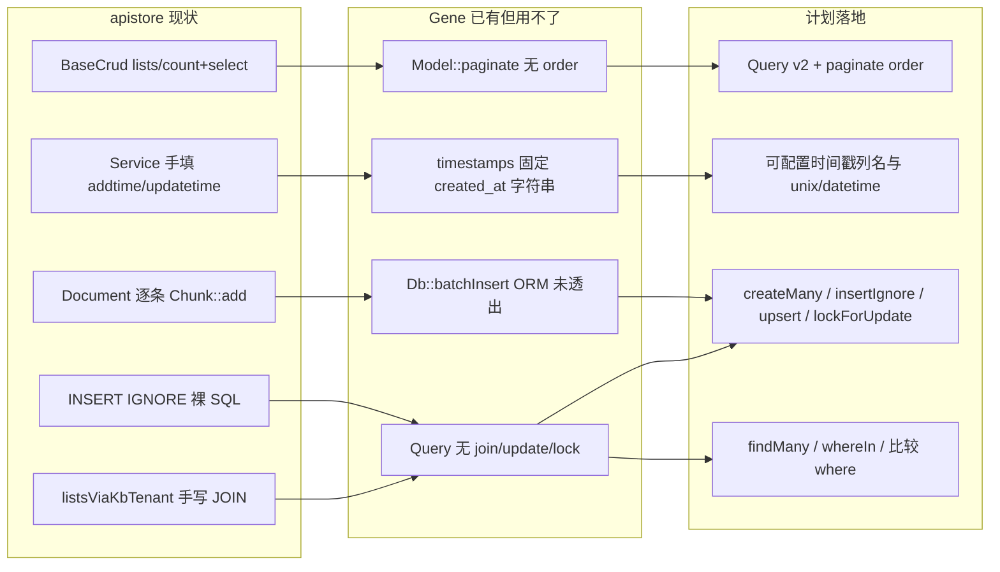

# apistore 使用驱动的 Gene 增强需求

> 来源：apistore 生产代码用法分析（FPM + `\Gene\Model` / `$this->db` 为主）。  
> Gene 版本基线：**6.0.0**。  
> 审计遗留项见 [`audit/plan/PLAN.md`](../audit/plan/PLAN.md) §7.2.3，本文在其基础上按 apistore 证据具体化。

**方案定位（评审结论）**：补齐 **Db ↔ ORM 对称性** 与少量约定（时间戳、批量写、锁、IN 批量读），**不是** Eloquent 式高度抽象（关联图、Scope、模型事件、Unit of Work）。C 层只加 apistore 重复 ≥3 处或热路径 API；框架补完后须迁移 `BaseCrud::lists` 等消费方，否则无收益。

---

## 一、apistore 用法画像

### 1.1 Model 分层

| 基类 | 规模 | 角色 |
|------|------|------|
| `\Gene\Orm\Model` | **1 个** | 仅 `application/Models/Agent/BaseCrud.php` |
| `\Gene\Model` | **约 49 个** | Admin/Shop/Learning/Erp 等旧业务 + `CapabilityConfig` |
| Agent `BaseCrud` 子类 | **约 38 个** | 后台 CRUD；热路径查询仍混用 `$this->db` |

ORM API 采用率极低：`fill()` **0 次**；`::query()` 几乎只在 `BaseCrud`；`Validate` 几乎闲置（主要见于 `Api/Webrtc.php`）。

### 1.2 重复模式（应进扩展）

```text
旧 Model lists()     ≥28 个文件   count + select 双查询，order/limit 手写
Agent BaseCrud       38+ 实体      ORM count + Db select 混搭
Service add/edit     每处写       addtime/updatetime = time()
RAG 切块             Document.php  逐条 Chunk::add()
INSERT IGNORE        3+ Model      TaskLog / EventIdempotency / IncomingNonce
FOR UPDATE           Task.php      调度器裸 SQL
全表再过滤           Skill 注入     allEnabled() 拉全表
会话记忆             MemoryManager  allBySession() 拉全量再 PHP 切 epoch
```

### 1.3 Gene 已有但 apistore 用不了

| Gene 能力 | 缺口 |
|-----------|------|
| `Model::paginate($where, $offset, $limit)` | 无 `order`、无字段投影；`BaseCrud::lists` 仍拆 count + select |
| `$timestamps` | 写死 `created_at`/`updated_at` 为 `Y-m-d H:i:s`；apistore 用 `addtime`/`updatetime` unix int |
| `Db::batchInsert()` | ORM 未透出；RAG 切块逐条 insert |
| `Query` | 无 join/update/lock；JOIN 列表全裸 SQL |
| `Db::in()` | 无数组形式 `whereIn`；Skill/DM-API 全表或 N 次 row |

### 1.4 配置与运行形态

- 生产：**FPM**，入口 `public/index.php`
- `config/config.dev.php`：`db.instance => true` + `PDO::ATTR_PERSISTENT`（为复用连接，与框架文档「FPM 用 false」相反）
- `public/swoole.php` 为旧样板，非当前运行形态

---

## 二、架构关系



---

## 三、P0 — 不补则 ORM 继续被绕开

### 3.1 Query 透出 Db 能力 + paginate 可排序

**证据**

- `application/Models/Agent/BaseCrud.php`：`static::query()->where()->count()` + `$this->db->select()->order('id desc')->limit()`
- 旧 Model `lists()` ≥28 个，如 `application/Models/Admin/User.php`
- JOIN：`BaseCrud::listsViaKbTenant`、`RunLog::paginateFiltered`、`Session::paginateByAgent` 全部裸 SQL

**规格**

**P0 首批（必做）** — 透出已有 Db 能力，不新增 SQL 语义：

| API | 说明 |
|-----|------|
| `join($table, $on, $type = 'INNER')` | 对齐 `Db::join`；`LEFT`/`RIGHT` 走 `$type`，**不**单独加 `leftJoin`/`rightJoin` |
| `group` / `having` | 对齐 Db |
| `first` | 等价 `limit(1)->row()` |
| `update` / `delete` | 对齐 Db；与 `Model::updateBy` / `destroy` 对称 |
| `where($col, $op, $val)` | 比较运算符：`>`, `>=`, `<`, `<=`, `!=` |
| `in($col, array $ids)` | 数组形式；现有 `in($sql, $bind)` 保留 |
| `Query::paginate($offset, $limit)` | 返回 `{count, list}`，继承当前 `order` |
| `Model::paginate($where, $offset, $limit, $order = null)` | 同上，补 `order` 参数 |
| `$listFields` / `$fields` 投影 | 对齐 `BaseCrud::resolveListSelectFields` |

**暂缓（出现第 3 处重复再立项）**：`union`、`pluck`、`exists`（`count() > 0` 可顶一阵）。

**JOIN 分页约束（重要）**

- `paginate` **仅保证单表**（或调用方显式传入与 list 一致的 count 条件）。
- JOIN 列表（`listsViaKbTenant`、`RunLog::paginateFiltered`）保持 **`count()` + `all()` 两步**，调用方自行保证 count SQL 与 list SQL 的 FROM/WHERE 一致；**不做**「自动推导 JOIN count」——易错且与 apistore 现状不符。

**apistore 替换点**：`BaseCrud::lists`、旧 `lists()` 模板；RunLog/Session JOIN 分页改为 `query()->join(...)->count()` + `query()->join(...)->order()->limit()->all()`

---

### 3.2 可配置 timestamps

**证据**

- `application/Services/Agent/BaseCrud.php`：`add` 写 `addtime`，`edit` 写 `updatetime`（unix int）
- `BaseCrud::status()` 手写 `updatetime=time()`
- Gene 现状：`src/orm/meta.c` `gene_orm_apply_timestamps()` 写死 `created_at`/`updated_at` 为 `Y-m-d H:i:s`

**规格**

```php
protected static $timestamps = true;
protected static $createdAt = 'addtime';
protected static $updatedAt = 'updatetime';
protected static $timestampFormat = 'unix'; // unix | datetime
```

- `create` / `save` / `updateBy` 自动填充；**业务 payload 已含时间戳列则不覆盖**
- `toggle`（P1）若落地：翻转字段时**可选**同步写 `$updatedAt`；**手写 `status()` 裸 SQL 不走 ORM**，仍须业务自行 `updatetime=time()` 或迁到 `toggle`

**apistore 替换点**：`Services/Agent/BaseCrud::add/edit`、各 Model `status()`（`toggle` 落地后可减样板）

---

### 3.3 ORM 批量写 + Db 幂等写

**证据**

- `application/Services/Agent/Document.php`：RAG 切块 `foreach` 逐条 `Chunk::add()`（数百次 insert）
- Db 层已有 `batchInsert()`，ORM 未透出
- `INSERT IGNORE`：`TaskLog.php`、`EventIdempotency.php`、`IncomingNonce.php`

**规格**

| API | 说明 |
|-----|------|
| `Model::createMany(array $rows): int` | 走 `batchInsert`，一次 round-trip |
| `Db::insertIgnore($table, $fields)` | MySQL 先落地 |
| `Db::upsert($table, $fields, $updateCols)` | `ON DUPLICATE KEY UPDATE`；其它驱动文档标明降级 |
| `Model::insertIgnore` / `Model::updateOrCreate` | ORM 薄封装 |

- 惰性执行约定保持：终端方法（`lastId` / `affectedRows` / `row` / `all` 等）才真正执行；**`createMany` 须在文档与测试中强调「须调终端方法」**，避免构建了批量 SQL 却未执行
- **驱动语义须在 ide-helper 标明**：`insertIgnore` / `upsert` 以 **MySQL 先落地**；其它驱动文档写清降级或 `UnsupportedOperationException`，业务不得当可移植 API 用
- 文档对比「循环 `create()`」与 `createMany` 的性能差（RAG 切块为**数量级**收益项）

**apistore 替换点**：`Document` 切块索引、`TaskLog` / 幂等表写入

---

### 3.4 lockForUpdate + 事务文档化

**证据**

- `application/Models/Agent/Task.php`：`SELECT ... FOR UPDATE` 裸 SQL
- `application/Services/Agent/Task/TaskScheduler.php`：调度器唯一认真用事务的路径

**规格**

- `Query::lockForUpdate()` / `Query::sharedLock()`
- 事务仍用现有 `beginTransaction` / `commit` / `rollBack`
- 文档提供「调度器式」样例
- **不做** ORM 自动包 `create()` 事务（审计 L4：仅文档化 `create()` = insert + lastId 无事务）

**apistore 替换点**：`Task::rowForUpdate`、`TaskScheduler`

---

### 3.5 findMany / whereIn / 比较 where

**证据**

- Skill 注入：`allEnabled()` 全表再 PHP 按 id 过滤
- DM-API：对每个 tool id 调 `Tool::row($id)`（N 次查找）
- `MemoryManager::prepareLlmMemory`：`Message::allBySession()` 拉全量再 `selectEpochMessages`

**规格**

| API | 说明 |
|-----|------|
| `Model::findMany(array $ids, bool $preserveOrder = false): array` | 按主键 `IN` 批量取；`$preserveOrder=true` 时结果顺序与 `$ids` 一致 |
| `Query::in($col, array $ids)` | 见 §3.1；空数组语义：返回空结果，不生成 `IN ()` |
| `Query::where($col, $op, $val)` | 见 §3.1；会话记忆游标用 `where('id', '>=', $anchor)->order(...)->limit(n)`，**不**单独加 `after()` 动词 |

**性能说明**：`findMany` / `IN` 替代全表 + N 次 `row` 为**数据量放大**项，与 §3.3 `createMany` 同属 P0 性能收益核心。

**apistore 替换点**：`MemoryManager`、`SkillInjector`、DM-API tool 批量加载

---

## 四、P1 — 明显减样板，复杂度可控

### 4.1 状态翻转与 LIKE 转义

**证据**

- `BaseCrud::status()`：`status=abs(status-1)`
- 旧后台同类模式；`Chunk::escapeLikePattern` 手写 LIKE 转义

**规格**

- `Model::toggle($id, 'status', $values = [0, 1])` 或 `toggle($id, 'status')` 默认 0/1 翻转；可选同步 `$updatedAt`（见 §3.2）
- where 数组 `['%keyword%', 'like']` 自动 escape `%`、`_`；**若业务已手转义（如 `Chunk::escapeLikePattern`），须文档说明勿双转义**

---

### 4.2 相关计数（selectSub）

**证据**

- `Session::paginateByAgent` / `paginateForChatSidebar`：每行相关子查询 `(SELECT COUNT(*) FROM agent_message ...)`

**规格**

- **只做** `Query::selectSub($sql, $alias)`（或等价 `selectRaw` 子查询别名）
- **不做** `withCount` 伪关联封装；**不做** hasMany / belongsTo

---

### 4.3 FPM 下 instance=true 链式隔离

**证据**

- `config/config.dev.php`：`db.instance => true` + `PDO::ATTR_PERSISTENT`
- 框架文档建议 FPM 用 `instance: false` 防链式污染；apistore 为性能选 true

**规格**

- 请求结束自动 `Db::reset()`（FPM RSHUTDOWN / `Application::cleanup`）
- **仅清链式构建状态**（where/order/limit/join 等），**不**隐式 `rollBack` 活动事务；有未提交事务时行为与现有一致（由调用方负责 commit/rollBack）
- 持久连接与链式状态脱钩，不改 apistore `instance=true` + `PDO::ATTR_PERSISTENT` 习惯

---

### 4.4 Validate 快捷绑定（不做中间件）

**证据**

- `$this->validate` 几乎只在 `Api/Webrtc.php`；Admin/Agent 全是 `intval($this->get/post)`

**规格**

- 文档 + 可选 `Controller` 示例：`$this->validate->init($data)->name('x')->required()->valid()`
- **不做**路由中间件（属 audit F4；apistore 钩子全是闭包）

---

## 五、P2 — 需求真实但不要先做

| 项 | 原因 |
|----|------|
| 全局 Scope（tenant_id） | `TenantScope` 有超管 `tenant_id=0` 跳过过滤；若做，只做 `static $globalScope` 回调 |
| casts / 模型事件 | json_encode 遍地但运行时自控；apistore 0 使用 |
| 软删除 | `status` 同时表示启用/禁用与 Message 软删，语义冲突 |
| 关联 `with()` | JOIN 点少，Query::join 足够 |
| `Query::whereJson` / `jsonUnquote` | 仅 `RunLog.php` 一处；重复 <3，业务静态方法拼 SQL 或文档示例即可 |
| `union` / `pluck` / `exists` | 见 §3.1 暂缓项 |
| Schema ensure / 热路径 ALTER | `BaseCrud::ensureColumn` 是项目债；Gene **不应**提供请求内 ALTER API |
| 树查询 | 仅 `Module` 依赖外部 `\Ext\Helper\Tree` |
| 路由中间件 / `Controller::init` | 已在 audit PLAN；apistore 未形成痛点 |

---

## 六、明确不进扩展

| 项 | 说明 |
|----|------|
| 三层 BaseCrud | Controller / Service / Model 重复 + `call_user_func([$model,'getInstance'])` — 项目结构债 |
| FULLTEXT + 中文 LIKE 回退 | `Chunk::searchFulltext` / `matchContentKeywords` — 业务检索策略 |
| Pay 事务内调第三方 HTTP | `Controllers/Admin/Pay.php` — 业务反模式 |
| 请求内 schema 迁移 | `ensureColumn` / `information_schema` — 应 CLI 迁移，不固化进框架 |

---

## 七、实现约束

1. **保持精简**：C 层只加「apistore 重复 ≥3 处或热路径」的 API；暂缓项见 §3.1 / §五
2. **惰性写语义不变**：`insert`/`batchInsert`/`update`/`delete` 构建 SQL；`all`/`row`/`lastId`/`affectedRows` 执行
3. **测试**：新 API 必须在 `test/OrmTest.php`、`test/DatabaseTest.php` 加用例
4. **文档同步**：`gene-ide-helper/`、`gene-ai-helper/skills/gene-framework/reference.md`；驱动差异（`insertIgnore`/`upsert`）必须写入
5. **与 audit 分工**：性能项（route_pc 预热、连接池泄漏等）留在 `audit/plan/PLAN.md`，不在此重复立项
6. **消费方迁移**：框架 API 落地后，apistore 须以 `BaseCrud::lists` 为第一迁移点，否则开发/性能收益为零

### 7.1 收益类型（避免误判）

| 类别 | 项 | 说明 |
|------|-----|------|
| **开发效率** | paginate+order、Query join、timestamps、toggle、selectSub | 减样板；count+list 双查询次数不变 |
| **运行性能（数量级）** | `createMany`、`findMany`/IN、会话游标 `where+limit` 替代全量拉取 | 少 round-trip / 少行 |
| **正确性 + 可配性能** | `lockForUpdate`、FPM `Db::reset()` | 非「更快」，但使 `instance=true` 可安全使用 |
| **勿夸大** | join 进 Query、timestamps、JSON helper | 与裸 SQL 同路径或仅语法糖 |

### 7.2 建议落地顺序

```text
阶段 A（P0 核心，可并行）
  3.1 Query 首批 + paginate order
  3.2 可配置 timestamps
  3.3 createMany + insertIgnore（upsert 可紧随）
  3.5 findMany + in(数组) + 比较 where
  3.4 lockForUpdate
  4.4 FPM Db::reset

阶段 B（P1，框架稳定后）
  4.1 toggle / LIKE escape
  4.2 selectSub
  4.4 Validate 文档

阶段 C（apistore 迁移）
  BaseCrud::lists → ORM paginate
  Document 切块 → createMany
  MemoryManager / SkillInjector → findMany + 游标 where
```

---

## 八、证据文件速查

| 主题 | 路径 |
|------|------|
| ORM 唯一入口 | `apistore/application/Models/Agent/BaseCrud.php` |
| Service 时间戳 | `apistore/application/Services/Agent/BaseCrud.php` |
| 旧 CRUD 样板 | `apistore/application/Models/Admin/User.php` |
| RAG 逐条 insert | `apistore/application/Services/Agent/Document.php` |
| INSERT IGNORE | `apistore/application/Models/Agent/TaskLog.php` 等 |
| FOR UPDATE | `apistore/application/Models/Agent/Task.php` |
| 会话记忆全量拉取 | `apistore/application/Services/Agent/Runtime/MemoryManager.php` |
| JSON SQL | `apistore/application/Models/Agent/RunLog.php` |
| 租户 Scope | `apistore/application/Services/Agent/TenantScope.php` |
| Gene timestamps 实现 | `gene/src/orm/meta.c` |
| Gene paginate 实现 | `gene/src/orm/model.c` |
| 审计 ORM 缺口 | `gene/audit/plan/PLAN.md` §7.2.3 |
