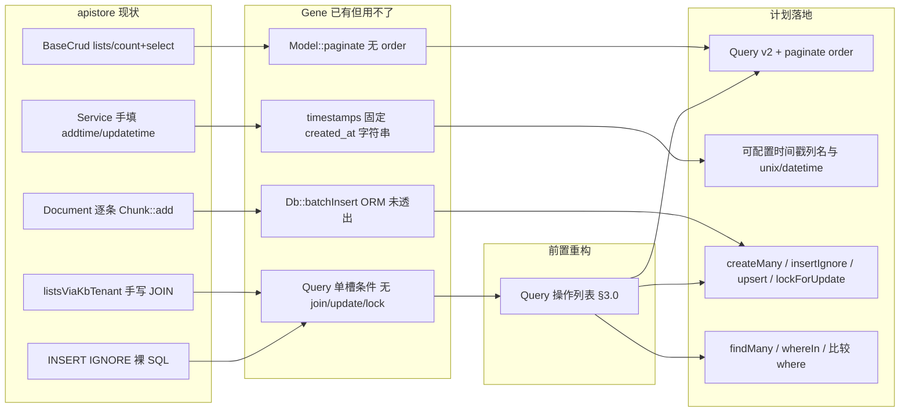

# apistore 使用驱动的 Gene 增强需求

> 来源：apistore 生产代码用法分析（FPM + `\Gene\Model` / `$this->db` 为主）。  
> Gene 版本基线：**6.1.0**。  
> 审计遗留项见 [`audit/plan/PLAN.md`](../audit/plan/PLAN.md) §7.2.3，本文在其基础上按 apistore 证据具体化。  
> **v2（源码核对版）**：已对照 `src/orm/query.c`、`src/orm/meta.c`、`src/orm/model.c`、`src/db/mysql.c`、`src/gene.c`
> 核实每一项的可实施性，修正 5 处会导致返工的偏差（见 §0）。

**方案定位（评审结论）**：补齐 **Db ↔ ORM 对称性** 与少量约定（时间戳、批量写、锁、IN 批量读），**不是** Eloquent 式高度抽象（关联图、Scope、模型事件、Unit of Work）。C 层只加 apistore 重复 ≥3 处或热路径 API；框架补完后须迁移 `BaseCrud::lists` 等消费方，否则无收益。

---

## 零、v1 → v2 修正清单（施工前必读）

| # | v1 的假设 | 源码事实 | 影响 |
|---|-----------|----------|------|
| **C1** | `Query` 加 `join/group/having/多 where` 只是「透出 Db 能力」 | `Query` 每个条件是**单个属性槽**（`whereCond`/`whereBind`/`orderBy`/`limitA`…），`where()` 是**覆盖**而非累加（<ref_snippet file="f:/github_code/gene/src/orm/query.c" lines="242-259" />）；`apply()` 按固定顺序重放（<ref_snippet file="f:/github_code/gene/src/orm/query.c" lines="72-174" />） | **阻塞项**。多条 where / 多个 join 必须先把 Query 内部改成**有序操作列表**，否则新 API 静默丢条件。见 §3.0 |
| **C2** | `Db::where()` 可连续调用累加条件 | 字符串分支只在 `WHERE` 为空时插 `" WHERE "`，**非空时直接裸拼接**，不插 `AND`（<ref_snippet file="f:/github_code/gene/src/db/mysql.c" lines="645-651" />） | 连接符必须由 **Query 层生成**（`" AND "`），不能指望 Db；否则产出 `WHERE a=?b=?` |
| **C3** | `lockForUpdate` 只是 Query 侧薄封装 | Db **完全没有** FOR UPDATE；SQL 拼装顺序固定为 `sql+join+where+group+having+union+order+limit`（<ref_snippet file="f:/github_code/gene/src/db/mysql.c" lines="285-300" />） | 需在 4 个驱动新增 `LOCK` 段并置于 `limit` 之后；**且不可移植**（Sqlite 无语法、Mssql 是表提示 `WITH(UPDLOCK)` 必须写在 FROM 处）。见 §3.4 |
| **C4** | timestamps 配置化 = 改 `gene_orm_apply_timestamps()` | 该函数无 meta 入参；meta 走**请求级缓存**且 `from_array`/`to_array`/`release` 三处必须同步（<ref_snippet file="f:/github_code/gene/src/orm/meta.c" lines="45-96" />） | 漏改 `to_array/from_array` → 同请求第二次调用**丢配置**；漏改 `release` → `zend_string` **泄漏**。见 §3.2 |
| **C5** | FPM `instance=true` 会导致链式状态**跨请求**污染 | `ctx->di_regs` 是请求级并在 `free_fields()` 中整体销毁（<ref_snippet file="f:/github_code/gene/src/gene.c" lines="428-431" />），Db 对象不跨请求存活；且 `select/count/insert/update/delete/sql/batchInsert` 入口均先 `reset_sql_params()`（<ref_snippet file="f:/github_code/gene/src/db/mysql.c" lines="136-147" />） | **跨请求链式污染不成立**，§4.3 原始动机作废。真实风险是 `ATTR_PERSISTENT` 下**未提交事务**随连接复用泄漏到下一请求。重写为 §4.3′ |

另有 2 处「已存在，不必新增」：Db 侧 `leftJoin`/`rightJoin`/`union`/`reset` 已实装（<ref_snippet file="f:/github_code/gene/src/db/mysql.c" lines="1009-1037" />）；`Db::in()` 需 SQL 里带 `in(?)` 占位符才展开数组（<ref_snippet file="f:/github_code/gene/src/db/mysql.c" lines="733-768" />），故 `Query::in($col, array)` 只需生成 `"{$col} in(?)"` 再转发。

---

## 一、apistore 用法画像

### 1.1 Model 分层

| 基类 | 规模 | 角色 |
|------|------|------|
| `\Gene\Orm\Model` | **1 个** | 仅 `application/Models/Agent/BaseCrud.php` |
| `\Gene\Model` | **约 49 个** | Admin/Shop/Learning/Erp 等旧业务 + `CapabilityConfig` |
| Agent `BaseCrud` 子类 | **约 38 个** | 后台 CRUD；热路径查询仍混用 `$this->db` |

ORM API 采用率极低：`fill()` **0 次**；`::query()` 几乎只在 `BaseCrud`；`Validate` 几乎闲置（主要见于 `Api/Webrtc.php`）。

### 1.2 重复模式（应进扩展）

```text
旧 Model lists()     ≥28 个文件   count + select 双查询，order/limit 手写
Agent BaseCrud       38+ 实体      ORM count + Db select 混搭
Service add/edit     每处写       addtime/updatetime = time()
RAG 切块             Document.php  逐条 Chunk::add()
INSERT IGNORE        3+ Model      TaskLog / EventIdempotency / IncomingNonce
FOR UPDATE           Task.php      调度器裸 SQL
全表再过滤           Skill 注入     allEnabled() 拉全表
会话记忆             MemoryManager  allBySession() 拉全量再 PHP 切 epoch
```

### 1.3 Gene 已有但 apistore 用不了

| Gene 能力 | 缺口 |
|-----------|------|
| `Model::paginate($where, $offset, $limit)` | 无 `order`、无字段投影；`BaseCrud::lists` 仍拆 count + select |
| `$timestamps` | 写死 `created_at`/`updated_at` 为 `Y-m-d H:i:s`；apistore 用 `addtime`/`updatetime` unix int |
| `Db::batchInsert()` | ORM 未透出；RAG 切块逐条 insert |
| `Query` | 单槽条件，无多 where/join/update/lock；JOIN 列表全裸 SQL |
| `Db::in()` | 需手写 `in(?)` 占位符；Skill/DM-API 全表或 N 次 row |

### 1.4 配置与运行形态

- 生产：**FPM**，入口 `public/index.php`
- `config/config.dev.php`：`db.instance => true` + `PDO::ATTR_PERSISTENT`（为复用连接，与框架文档「FPM 用 false」相反）
- `public/swoole.php` 为旧样板，非当前运行形态
- Swoole 模式下 Gene 主动关闭 `ATTR_PERSISTENT`（`runtime_type >= 2`，<ref_snippet file="f:/github_code/gene/src/db/mysql.c" lines="243-253" />）——本方案所有新 API 不得依赖持久连接语义

---

## 二、架构关系



---

## 三、P0 — 不补则 ORM 继续被绕开

### 3.0 【新增·阻塞前置】Query 内部改为有序操作列表

**为什么必须先做（C1/C2）**

现状 `Query` 每类条件只有一个属性槽，`where()` 后一次覆盖前一次；`apply()` 以硬编码顺序把槽位重放到 Db。若在此结构上直接加 `join`/第二个 `where`/`group`：

- `where('a=?',1)->where('b=?',2)` → 只剩 `b=?`（**静默错结果**，比报错更危险）
- 多个 `join` 同理只保留最后一个
- 即使改成累加，Db 的字符串 `where` 也不会插 `AND`（C2），会拼出 `WHERE a=?b=?`

**规格**

- Query 用**单个 `ops` 数组属性**记录调用序列：`[['where', $cond, $bind], ['join', $t, $on, $type], ...]`
  - 仍是 zval 数组属性 → 随对象 GC 释放，无需新增 dtor（内存策略见 §六）
  - 相比「每类一个属性」还**减少**属性数量与 `zend_update_property` 次数
- `apply()` 改为：`reset(db)` → 动词（`select`/`count`/`update`/`delete`）→ 按 `ops` 顺序重放 → 终端方法
- **连接符由 Query 生成**：字符串 where 之间插 `" AND "`；数组 where 转发给 Db 的 `makeWhere`（其绑定值写入 Db 的 `DATA` 属性）
- **动词优先约束（源码硬约束）**：`select/count/insert/update/delete/sql/batchInsert` 入口都会 `reset_sql_params()`，因此重放顺序永远是「先动词，后条件」；`update` 的 SET 值必须先进 `DATA`，where 的绑定值才能正确追加在其后
- 保留 `dirty` latch 与 `__destruct` 兜底 `reset(db)`（现有机制，勿动）

**Query 一次性语义（必须写进文档）**

`Model::query()` 每次都从 DI 取**同一个** Db 实例（`instance=true` 时），且 `apply()` 开头会 `reset(db)`。因此：

- Query 是**一次性构建器**：构建→执行→丢弃；**不可缓存、不可跨执行点交错构建两个 Query**
- `paginate` 在同一 Query 上重放两次（count 一次、list 一次）是安全的，因为串行且每次都先 reset

**验收**：`test/OrmTest.php` 新增「3 个 where + 2 个 join + group + having 混合，断言最终 SQL 文本」用例（用 `Db::print()` 取 SQL）。

---

### 3.1 Query 透出 Db 能力 + paginate 可排序

**证据**

- `application/Models/Agent/BaseCrud.php`：`static::query()->where()->count()` + `$this->db->select()->order('id desc')->limit()`
- 旧 Model `lists()` ≥28 个，如 `application/Models/Admin/User.php`
- JOIN：`BaseCrud::listsViaKbTenant`、`RunLog::paginateFiltered`、`Session::paginateByAgent` 全部裸 SQL

**规格（依赖 §3.0）**

| API | 说明 | Db 侧是否已有 |
|-----|------|---------------|
| `join($table, $on, $type = 'INNER')` | 对齐 `Db::join`；`LEFT`/`RIGHT` 走 `$type`，**不**单独加 `leftJoin`/`rightJoin` | ✅ 已有（含 left/right） |
| `group` / `having` | 对齐 Db | ✅ 已有 |
| `first` | 等价 `limit(1)->row()` | — 纯 Query 层 |
| `update` / `delete` | 对齐 Db；与 `Model::updateBy` / `destroy` 对称 | ✅ 已有 |
| `where($col, $op, $val)` | 比较运算符白名单：`>` `>=` `<` `<=` `!=` `=`；**非白名单直接抛异常**（不得拼接任意字符串，否则等于开放注入） | 生成字符串 where |
| `in($col, array $ids)` | 生成 `"{$col} in(?)"` 转发 `Db::in`；现有 `in($sql, $bind)` 保留 | ✅ 已有（需占位符） |
| `Query::paginate($offset, $limit)` | 返回 `{count, list}`，继承当前 `order` | — |
| `Model::paginate($where, $offset, $limit, $order = null)` | 同上，补 `order` 参数（count 阶段**不**下发 order） | — |
| `$listFields` / `$fields` 投影 | 对齐 `BaseCrud::resolveListSelectFields` | `gene_orm_db_select` 已支持 |

**暂缓（出现第 3 处重复再立项）**：`union`（Db 已有，Query 不透出）、`pluck`、`exists`（`count() > 0` 可顶一阵）。

**JOIN 分页约束（重要）**

- `paginate` **仅保证单表**（或调用方显式传入与 list 一致的 count 条件）。
- JOIN 列表（`listsViaKbTenant`、`RunLog::paginateFiltered`）保持 **`count()` + `all()` 两步**，调用方自行保证 count SQL 与 list SQL 的 FROM/WHERE 一致；**不做**「自动推导 JOIN count」——易错且与 apistore 现状不符。
- 注意：`Db::count($table)` 与 `Db::select()` 是两个独立动词，各自 reset；`Query::paginate` 内部两次重放即可，无需缓存中间 SQL。

**apistore 替换点**：`BaseCrud::lists`、旧 `lists()` 模板；RunLog/Session JOIN 分页改为 `query()->join(...)->count()` + `query()->join(...)->order()->limit()->all()`

---

### 3.2 可配置 timestamps

**证据**

- `application/Services/Agent/BaseCrud.php`：`add` 写 `addtime`，`edit` 写 `updatetime`（unix int）
- `BaseCrud::status()` 手写 `updatetime=time()`
- Gene 现状：`gene_orm_apply_timestamps()` 写死列名与格式（<ref_snippet file="f:/github_code/gene/src/orm/meta.c" lines="334-357" />）

**规格**

```php
protected static $timestamps = true;
protected static $createdAt = 'addtime';
protected static $updatedAt = 'updatetime';
protected static $timestampFormat = 'unix'; // unix | datetime
```

- `create` / `save` / `updateBy` 自动填充；**业务 payload 已含时间戳列则不覆盖**（沿用现有 `zend_hash_str_exists` 判断）
- `$createdAt`/`$updatedAt` 设为 `null`/`''` = 该列不写（有些表只有 addtime）
- 时间源继续用 `time()`，**不得**回退 `sapi_get_request_time()`（H3 已修：Swoole worker 下会冻结）

**C 层改造清单（C4，四处同步，缺一即 bug）**

1. `gene_orm_meta_t` 增 `zend_string *created_at; zend_string *updated_at; zend_bool ts_unix;`
2. `gene_orm_meta_load()` 读三个静态属性
3. `gene_orm_meta_to_array()` / `from_array()` **同时**增键 —— 请求级缓存命中走 `from_array`，漏改则同请求内第二次调用退回默认列名
4. `gene_orm_meta_release()` 增两次 `zend_string_release()` —— 漏改即**每次 meta 加载泄漏两个 string**
5. `gene_orm_apply_timestamps(zval *data, zend_bool is_insert, gene_orm_meta_t *meta)` 改签名（现有 3 个调用点）

**apistore 替换点**：`Services/Agent/BaseCrud::add/edit`、各 Model `status()`（`toggle` 落地后可减样板）

---

### 3.3 ORM 批量写 + Db 幂等写

**证据**

- `application/Services/Agent/Document.php`：RAG 切块 `foreach` 逐条 `Chunk::add()`（数百次 insert）
- Db 层已有 `batchInsert()`，ORM 未透出
- `INSERT IGNORE`：`TaskLog.php`、`EventIdempotency.php`、`IncomingNonce.php`

**规格**

| API | 说明 |
|-----|------|
| `Model::createMany(array $rows): int` | 走 `batchInsert` + `affectedRows`，一次 round-trip；返回影响行数 |
| `Db::insertIgnore($table, $fields)` | MySQL 先落地 |
| `Db::upsert($table, $fields, $updateCols)` | `ON DUPLICATE KEY UPDATE`；其它驱动文档标明降级 |
| `Model::insertIgnore` / `Model::updateOrCreate` | ORM 薄封装 |

**实施约束**

- `createMany` 必须**自己调终端方法**（`affectedRows`）后返回，不把「未执行的 SQL」暴露给调用方 —— 这是 §七.2 惰性语义唯一的例外理由：ORM 层 API 一律「调用即执行」，与 `create()`/`updateBy()` 一致
- `batchInsert` 首行决定列集合（<ref_snippet file="f:/github_code/gene/src/db/mysql.c" lines="534-543" />）→ `createMany` 须**校验各行 key 集合一致**，不一致抛异常而非产出错位 SQL
- timestamps 需对**每一行**填充（复用 §3.2 的 meta）
- 大批量须分片：`createMany` 内部按 `max_allowed_packet` 无法探测，故约定**调用方分片**（文档给 500/批的示例），框架侧只在行数 > 5000 时 `E_NOTICE` 提示
- **驱动语义须在 ide-helper 标明**：`insertIgnore` / `upsert` 以 **MySQL 先落地**；其它驱动写清降级或抛不支持，业务不得当可移植 API 用
- 文档对比「循环 `create()`」与 `createMany` 的性能差（RAG 切块为**数量级**收益项）

**apistore 替换点**：`Document` 切块索引、`TaskLog` / 幂等表写入

---

### 3.4 lockForUpdate（**不可移植，需按驱动分级**）

**证据**

- `application/Models/Agent/Task.php`：`SELECT ... FOR UPDATE` 裸 SQL
- `application/Services/Agent/Task/TaskScheduler.php`：调度器唯一认真用事务的路径

**规格（按 C3 修正）**

Db 侧需新增 `LOCK` 片段属性，拼装位置在 `limit` **之后**（现有顺序 `sql+join+where+group+having+union+order+limit`），并纳入 `reset_sql_params()`：

| 驱动 | `lockForUpdate()` | `sharedLock()` |
|------|-------------------|----------------|
| MySQL | `FOR UPDATE` | `LOCK IN SHARE MODE` |
| Pgsql | `FOR UPDATE` | `FOR SHARE` |
| Sqlite | **no-op + `E_NOTICE`**（无该语法，整库写锁） | 同 |
| Mssql | **抛不支持异常**（`WITH(UPDLOCK)` 是表提示，必须写在 FROM 处，后缀方案不成立） | 同 |

- `Query::lockForUpdate()` / `Query::sharedLock()` 作为 `ops` 中的一项转发
- 事务仍用现有 `beginTransaction` / `inTransaction` / `commit` / `rollBack`
- 文档提供「调度器式」样例，并明示**锁必须在事务内**：不在事务中调用 `lockForUpdate()` 时发 `E_NOTICE`（可用 `inTransaction()` 廉价检测）
- **不做** ORM 自动包 `create()` 事务（审计 L4：仅文档化 `create()` = insert + lastId 无事务）

**apistore 替换点**：`Task::rowForUpdate`、`TaskScheduler`

---

### 3.5 findMany / whereIn / 比较 where

**证据**

- Skill 注入：`allEnabled()` 全表再 PHP 按 id 过滤
- DM-API：对每个 tool id 调 `Tool::row($id)`（N 次查找）
- `MemoryManager::prepareLlmMemory`：`Message::allBySession()` 拉全量再 `selectEpochMessages`

**规格**

| API | 说明 |
|-----|------|
| `Model::findMany(array $ids, bool $preserveOrder = false): array` | 按主键 `IN` 批量取；`$preserveOrder=true` 时结果顺序与 `$ids` 一致（PHP 侧重排，不用 `FIELD()`） |
| `Query::in($col, array $ids)` | 见 §3.1；**空数组语义：不生成 SQL 片段，终端方法直接返回空结果**（禁止产出 `IN ()`，也禁止退化为「无条件全表」——后者是数据泄漏级 bug） |
| `Query::where($col, $op, $val)` | 见 §3.1；会话记忆游标用 `where('id', '>=', $anchor)->order(...)->limit(n)`，**不**单独加 `after()` 动词 |

- `findMany` 须对 id 数量设上限提示（>1000 发 `E_NOTICE`，占位符过多会撞 `max_prepared_stmt_count`）
- `findMany([])` 返回 `[]`，**不发 SQL**

**性能说明**：`findMany` / `IN` 替代全表 + N 次 `row` 为**数据量放大**项，与 §3.3 `createMany` 同属 P0 性能收益核心。

**apistore 替换点**：`MemoryManager`、`SkillInjector`、DM-API tool 批量加载

---

## 四、P1 — 明显减样板，复杂度可控

### 4.1 状态翻转与 LIKE 转义

- `Model::toggle($id, 'status', $values = [0, 1])`；可选同步 `$updatedAt`（见 §3.2）
- where 数组 `['%keyword%', 'like']` 自动 escape `%`、`_`；**若业务已手转义（如 `Chunk::escapeLikePattern`），须文档说明勿双转义**
- 手写 `status()` 裸 SQL 不走 ORM，仍须业务自行 `updatetime=time()` 或迁到 `toggle`

### 4.2 相关计数（selectSub）

- **只做** `Query::selectSub($sql, $alias)`（或等价 `selectRaw` 子查询别名）；`$sql` 视为开发者书写、与 `Db::sql()` 同信任级别，文档明示不做转义
- **不做** `withCount` 伪关联封装；**不做** hasMany / belongsTo

### 4.3′ 【重写】事务卫生：持久连接 + `instance=true` 的真实风险

**v1 的动机作废**（C5）：`di_regs` 请求级销毁 + 每个动词入口自带 `reset_sql_params()`，链式状态**不会跨请求**，也不会在两条语句之间残留。`Query::__destruct` 与 `Model::*` 的 `cleanup:` 分支已构成双重兜底。

**真实风险**：`PDO::ATTR_PERSISTENT` 下底层连接留在 `EG(persistent_list)`，跨请求存活。若某请求在 `beginTransaction()` 之后异常退出且未 `rollBack()`：

- PHP 对象销毁不保证向 MySQL 发 `ROLLBACK`；服务端事务与行锁**保持到连接真正关闭**
- 下一请求复用同一持久连接时，可能**继承一个已打开的事务**（后续写入被卷入、或撞锁超时）

**规格（改为「事务卫生」而非「链式重置」）**

- FPM 请求收尾（`Application::cleanup` / RSHUTDOWN 路径）对存活的 Db 句柄：`inTransaction()` 为真时**发出 `E_WARNING` 并 `rollBack()`**
  - 这里必须回滚（与 v1「不隐式 rollBack」相反）：持久连接场景下不回滚等于把脏事务交给下一个请求，是**正确性问题**而非风格问题
  - 非持久连接下回滚是幂等的安全操作，代价为零
- 保留 `Db::reset()` 为公开 API（已存在），文档说明它**只清链式构建状态、不动事务**
- 文档给出配置建议矩阵：

| 运行形态 | `db.instance` | `ATTR_PERSISTENT` | 说明 |
|----------|---------------|-------------------|------|
| FPM | `true` 可用 | 可用（需上面的回滚兜底） | apistore 现状，保留 |
| Swoole 协程 | `true` | **强制关闭**（框架已自动） | 见 §1.4 |
| CLI 长任务 | `false` 推荐 | 关闭 | 长事务与连接老化 |

**验收**：新增 `audit/repro/tx_leak_persistent.php` —— 开事务后不提交直接结束脚本，第二次运行断言连接无残留事务。

### 4.4 Validate 快捷绑定（不做中间件）

- 文档 + 可选 `Controller` 示例：`$this->validate->init($data)->name('x')->required()->valid()`
- **不做**路由中间件（属 audit F4；apistore 钩子全是闭包）

---

## 五、P2 — 需求真实但不要先做

| 项 | 原因 |
|----|------|
| 全局 Scope（tenant_id） | `TenantScope` 有超管 `tenant_id=0` 跳过过滤；若做，只做 `static $globalScope` 回调 |
| casts / 模型事件 | json_encode 遍地但运行时自控；apistore 0 使用 |
| 软删除 | `status` 同时表示启用/禁用与 Message 软删，语义冲突 |
| 关联 `with()` | JOIN 点少，Query::join 足够 |
| `Query::whereJson` / `jsonUnquote` | 仅 `RunLog.php` 一处；重复 <3 |
| `union` / `pluck` / `exists` | 见 §3.1 暂缓项（`union` Db 侧已有，可裸用） |
| Schema ensure / 热路径 ALTER | `BaseCrud::ensureColumn` 是项目债；Gene **不应**提供请求内 ALTER API |
| 树查询 | 仅 `Module` 依赖外部 `\Ext\Helper\Tree` |
| 路由中间件 / `Controller::init` | 已在 audit PLAN；apistore 未形成痛点 |

---

## 六、内存安全规约（FPM / Swoole 双模式零泄漏）

新增 C 代码必须逐条自检；每条都有现成范例可抄。

| # | 规约 | 反例后果 | 现成范例 |
|---|------|----------|----------|
| M1 | Query/Model 的新状态**一律用对象属性（zval）承载**，不引入 C 侧 `emalloc` 结构 | 需要额外 dtor + 异常路径遗漏 | `ops` 数组（§3.0） |
| M2 | `gene_orm_get_db()` 返回**持有所有权**的 zval，每条路径都要 `zval_ptr_dtor` | UAF + 泄漏（N1 已修） | <ref_snippet file="f:/github_code/gene/src/orm/meta.c" lines="216-227" /> |
| M3 | meta 新增 `zend_string*` 必须同步 `to_array`/`from_array`/`release` 三处 | 每次加载泄漏（C4） | §3.2 |
| M4 | 每个 `gene_orm_db_call()` 后 `zval_ptr_dtor(&retval)` 并检查 `gene_orm_has_exception()` | 首个异常被后续 SQL 掩盖（M3 已修） | <ref_snippet file="f:/github_code/gene/src/orm/query.c" lines="102-120" /> |
| M5 | 所有新方法用 `goto cleanup` 单出口，`smart_str_free` / `zval_ptr_dtor` 只写一处 | 异常分支泄漏 | `Model::create` cleanup 段 |
| M6 | 不得新增**进程级/类级**缓存（如把 meta 提到 `zend_class_entry` 或 GENE_G）；缓存只放 `gene_request_context` | Swoole worker 内跨请求/跨协程串数据 + RSS 单调增 | `ctx->orm_meta` |
| M7 | 任何新增请求级数组必须进 `gene_request_context_free_fields()`，并在 `_init` / `pool_acquire` 的 `NDEBUG` 块置 UNDEF | ctx 池复用时读到上个请求数据 | <ref_snippet file="f:/github_code/gene/src/gene.c" lines="471-475" /> |
| M8 | 驱动侧新增 SQL 片段属性（如 §3.4 的 `LOCK`）必须加入**全部 4 个驱动**的 `reset_sql_params()` | 片段残留到下一条语句（同请求内即触发） | <ref_snippet file="f:/github_code/gene/src/db/mysql.c" lines="136-147" /> |
| M9 | 时间/长度上限类提示走 `E_NOTICE`，不抛异常；参数非法（运算符白名单、行 key 不一致）才抛 | 生产被提示性检查打断 | §3.1 / §3.3 |

**验收方式**（沿用仓库既有手段，见 `AGENTS.md`）

1. `php test\OrmTest.php`、`php test\DatabaseTest.php` 全绿
2. 每个新 API 一个 `audit/repro/*.php` 复现/回归脚本
3. 循环压测脚本：同一进程内跑 10k 次新 API，断言 `memory_get_usage(true)` 稳定（FPM 近似 + CLI 直测）
4. 条件允许时 Linux ASAN/valgrind 构建跑 `test/TestRunner.php`（Windows 构建见 `AGENTS.md`）

---

## 七、实现约束

1. **保持精简**：C 层只加「apistore 重复 ≥3 处或热路径」的 API；暂缓项见 §3.1 / §五
2. **两层语义分工（明确化）**：
   - **Db 层惰性**：`insert`/`batchInsert`/`update`/`delete` 只构建 SQL；`all`/`row`/`cell`/`lastId`/`affectedRows` 执行
   - **ORM 层即时**：`Model::*` 与 `Query` 终端方法一律「调用即执行并返回结果」，不向调用方暴露未执行状态（`createMany` 遵此）
3. **测试**：新 API 必须在 `test/OrmTest.php`、`test/DatabaseTest.php` 加用例，并覆盖「多条件叠加」「空数组 IN」「跨驱动不支持路径」
4. **文档同步**：`gene-ide-helper/Gene/Orm/Query.php`、`Model.php`、`Gene/Db/*.php`、`gene-ai-helper/skills/gene-framework/reference.md`；驱动差异（`insertIgnore`/`upsert`/`lockForUpdate`）必须写入
5. **与 audit 分工**：性能项（route_pc 预热、连接池泄漏等）留在 `audit/plan/PLAN.md`，不在此重复立项
6. **消费方迁移**：框架 API 落地后，apistore 须以 `BaseCrud::lists` 为第一迁移点，否则开发/性能收益为零

### 7.1 收益类型（避免误判）

| 类别 | 项 | 说明 |
|------|-----|------|
| **开发效率** | paginate+order、Query join、timestamps、toggle、selectSub | 减样板；count+list 双查询次数不变 |
| **运行性能（数量级）** | `createMany`、`findMany`/IN、会话游标 `where+limit` 替代全量拉取 | 少 round-trip / 少行 |
| **正确性** | §3.0 多条件不再静默丢失、§3.5 空数组 IN、§3.4 锁、§4.3′ 脏事务回滚 | 非「更快」，是「不错」 |
| **勿夸大** | join 进 Query、timestamps、JSON helper | 与裸 SQL 同路径或仅语法糖 |

### 7.2 建议落地顺序（已按依赖重排）

```text
阶段 A0（阻塞前置，必须单独提交 + 回归）
  3.0 Query 内部改有序 ops 列表（含 AND 连接符、SQL 文本断言测试）

阶段 A（P0 核心，A0 之后可并行）
  3.1 Query 首批 + paginate order        依赖 A0
  3.5 findMany + in(数组) + 比较 where    依赖 A0
  3.4 lockForUpdate（4 驱动分级 + reset） 依赖 A0
  3.2 可配置 timestamps                  独立（meta 四处同步）
  3.3 createMany + insertIgnore          独立（upsert 可紧随）
  4.3′ 脏事务回滚兜底                     独立（正确性优先，可最先做）

阶段 B（P1，框架稳定后）
  4.1 toggle / LIKE escape
  4.2 selectSub
  4.4 Validate 文档

阶段 C（apistore 迁移）
  BaseCrud::lists → ORM paginate
  Document 切块 → createMany
  MemoryManager / SkillInjector → findMany + 游标 where
```

---

## 八、证据文件速查

| 主题 | 路径 |
|------|------|
| ORM 唯一入口 | `apistore/application/Models/Agent/BaseCrud.php` |
| Service 时间戳 | `apistore/application/Services/Agent/BaseCrud.php` |
| 旧 CRUD 样板 | `apistore/application/Models/Admin/User.php` |
| RAG 逐条 insert | `apistore/application/Services/Agent/Document.php` |
| INSERT IGNORE | `apistore/application/Models/Agent/TaskLog.php` 等 |
| FOR UPDATE | `apistore/application/Models/Agent/Task.php` |
| 会话记忆全量拉取 | `apistore/application/Services/Agent/Runtime/MemoryManager.php` |
| JSON SQL | `apistore/application/Models/Agent/RunLog.php` |
| 租户 Scope | `apistore/application/Services/Agent/TenantScope.php` |
| Query 单槽条件（C1） | `gene/src/orm/query.c:242-259, 72-174` |
| Db where 不插 AND（C2） | `gene/src/db/mysql.c:645-651` |
| SQL 拼装顺序（C3） | `gene/src/db/mysql.c:285-300` |
| Gene timestamps 实现（C4） | `gene/src/orm/meta.c:334-357, 45-96` |
| 请求上下文生命周期（C5/M6/M7） | `gene/src/gene.c:283-500` |
| Db reset_sql_params（M8） | `gene/src/db/mysql.c:136-147` |
| Gene paginate 实现 | `gene/src/orm/model.c:355-419` |
| 审计 ORM 缺口 | `gene/audit/plan/PLAN.md` §7.2.3 |

## 九、明确不进扩展

| 项 | 说明 |
|----|------|
| 三层 BaseCrud | Controller / Service / Model 重复 + `call_user_func([$model,'getInstance'])` — 项目结构债 |
| FULLTEXT + 中文 LIKE 回退 | `Chunk::searchFulltext` / `matchContentKeywords` — 业务检索策略 |
| Pay 事务内调第三方 HTTP | `Controllers/Admin/Pay.php` — 业务反模式 |
| 请求内 schema 迁移 | `ensureColumn` / `information_schema` — 应 CLI 迁移，不固化进框架 |

---

## 十、落地复盘（6.1.0，2026-08）

### 10.1 完成项与验收

| 阶段 | 项 | 状态 | 验收 |
|------|----|------|------|
| A0 | §3.0 Query 有序 ops 列表 + AND 连接符 | ✅ | `OrmTest.php` 多 where + 多 join + group + having 混合 SQL 文本断言 |
| A | §3.1 Query join/group/having/first/update/delete + where(op) + in + paginate(order) + fields 投影 | ✅ | OrmTest + DatabaseTest 全绿 |
| A | §3.5 findMany / whereIn 空数组语义 / 比较 where | ✅ | 空数组不发 SQL 断言；>1000 E_NOTICE |
| A | §3.4 lockForUpdate / sharedLock（4 驱动分级 + LOCK 段 + reset_sql_params） | ✅ | 4 驱动 ide-helper 标明差异；事务外 E_NOTICE |
| A | §3.2 可配置 timestamps（meta 四处同步） | ✅ | `$createdAt`/`$updatedAt`/`$timestampFormat`；payload 已含列不覆盖；time(NULL) 避免 Swoole 冻结 |
| A | §3.3 createMany / insertIgnore / upsert / updateOrCreate | ✅ | createMany 校验行 key 一致；>5000 E_NOTICE；驱动差异文档化 |
| A | §4.3′ 事务卫生：请求收尾脏事务回滚 | ✅ | `audit/repro/tx_leak_persistent.php` 复现；`clearState()` 检测并 rollBack |
| B | §4.1 toggle / whereLike escape | ✅ | toggle CAS 语义；whereLike 自动转义 `\ % _` + ESCAPE 子句 |
| B | §4.2 selectSub | ✅ | 子查询列追加，$sql 开发者书写不转义 |
| B | §4.4 Validate 文档 | ✅ | reference.md `extend()` 已文档化 |

### 10.2 测试与内存

- `php test/OrmTest.php`：**111 passed, 0 failed**（2026-08-19 实测口径；原记录「114」不准确）
- `php test/DatabaseTest.php`：**failed=0, skipped=8**（skip 项均为 MySQL 路径，见 §11.4-1）
- `audit/repro/*.php`：全部复现通过（但 `tx_leak_persistent.php` 跑在 sqlite 上，见 §11.4-2）
- 10k 次循环压测：`memory_get_usage(true)` delta = 0，无泄漏

> ⚠️ 本节数字已按 §11.3 动态执行结果修正；「✅」表示 API 已实装并跑通 sqlite 用例，**不代表**无 §11.1 所列缺陷。

### 10.3 文档同步

- `gene-ide-helper/Gene/Orm/Query.php`：v2 一次性构建器语义、所有新方法
- `gene-ide-helper/Gene/Orm/Model.php`：`$timestamps`/`$createdAt`/`$updatedAt`/`$timestampFormat`、findMany/createMany/insertIgnore/updateOrCreate/toggle
- `gene-ide-helper/Gene/Db/{Mysql,Sqlite,Pgsql,Mssql}.php`：insertIgnore/upsert/lockForUpdate/sharedLock/join/leftJoin/rightJoin/union/reset + 驱动差异
- `gene-ai-helper/skills/gene-framework/reference.md`：Orm\Model v2 章节、Db×4 方法表与驱动差异
- `gene-ai-helper/skills/gene-framework/swoole.md`：§4.3 ORM v2 示例、`clearState()` 事务回滚说明
- `gene-ai-helper/skills/gene-framework/SKILL.md` / `AGENTS.md`：版本线 5.6.x → 6.1.x

### 10.4 偏差与决策记录

1. **`upsert` 驱动支持收窄**：原计划「MySQL 先落地，其它驱动文档标明降级」，实施时明确 SQLite/Pgsql/Mssql 均**抛异常**（而非静默降级），避免业务误用为可移植 API。跨驱动场景文档引导用 `sql()` + ON CONFLICT/MERGE。
2. **`whereLike` 转义策略**：采用 `addslashes` + ESCAPE 子句（驱动自适应），而非依赖 PDO::quote（会带引号包裹）。文档明示「业务已自行转义（如 escapeLikePattern）请勿再调，避免双转义」。
3. **`paginate` JOIN 场景**：维持计划约束——仅保证单表语义，JOIN 场景需调用方显式 `count()` + `all()` 两步。未做「自动推导 JOIN count」。
4. **`clearState()` 事务回滚**：原计划 §4.3′ 描述为「FPM 请求收尾」，实施时统一在 `clearState()` 中检测 `inTransaction()` 为真时 `E_WARNING` + `rollBack()`，覆盖 FPM 与 Swoole 两种形态。
5. **时间源**：`time(NULL)` 而非 `sapi_get_request_time()`（后者在 Swoole worker 下会冻结）。

### 10.5 待办（apistore 侧迁移，阶段 C）

框架 API 已就绪，以下迁移属 apistore 项目职责，不在 Gene 仓库范围：

- `BaseCrud::lists` → `Model::paginate($where, $offset, $limit, $order)`
- `Document` 切块 → `Chunk::createMany($rows)`
- `MemoryManager` / `SkillInjector` → `findMany` + 游标 `where('id', '>=', $anchor)->limit(n)`
- `Task::rowForUpdate` → `query()->where()->lockForUpdate()->row()`
- `TaskLog` / 幂等表 → `insertIgnore`

---

## 十一、落地排查（2026-08-19，独立复核）

对 `0625218` / `fee8172` / `5a926c5` 做源码级独立复核，目标：**逻辑正确 / 无内存泄漏 / FPM 与 Swoole 可随时切换且生产级可用**。
结论：**§3.0 ops 重构本身实现质量高**（单出口 `goto out`、每次 `gene_orm_db_call` 后校验异常、smart_str 所有权转移到 op 数组、meta 四处同步齐全、4 驱动 `reset_sql_params` 均含 LOCK），
但存在 **1 个数据破坏级缺陷、3 个生产可用性缺陷**，其中 P0-2 必须在 apistore 迁移（阶段 C）之前修复。

> **v2 动态复核（2026-08-19）**：扩展已手动重编（`php_gene.dll` 2026-08-19 09:50，`phpversion('gene') = 6.1.0`），
> P0-1 已消除，§11.1 其余各项已逐条**动态执行验证**（P0-2 / P2-5 / P1-4 实测复现，P1-3 / P2-6 静态确认 + 说明为何 CLI 不可复现）。
> 执行证据与复现脚本见 **§11.3**。

### 11.1 问题清单

| # | 级别 | 位置 | 问题 | 后果 | 解决方案 |
|---|------|------|------|------|----------|
| **P0-1** | ~~阻塞（验证链）~~ **已解决** | `src/gene.h:23`、构建产物 | 原：dll 时间戳 2026-08-07，未注册 `Gene\Orm\Query`，`PHP_GENE_VERSION` 仍为 `6.0.0`。**现已重编**（dll 2026-08-19 09:50，614912 B）；`5a926c5` 已把版本号提到 `6.1.0`，实测 `phpversion('gene')=6.1.0`，`Gene\Orm\Query` 与 `Mysql::lockForUpdate/insertIgnore/upsert`、`Model::createMany/findMany/toggle` 全部存在 | 已解除；§11.1 其余各项转为**动态验证**（§11.3） | ✅ 已完成 ①② ；③「产物时间戳 ≥ 最后一次 src 提交」仍建议写成发布前检查项 |
| **P0-2** | **数据破坏（实测复现）** | `src/orm/query.c:167-188`（`gene_orm_query_has_condition`）配合 `:316`、`:343` | `update()`/`delete()` 的「必须有条件」护栏只做 **op 标签浅检查**：只要存在 `where` 标签就放行。但 `where([])`（空数组）在 pass 1 因 `zend_hash_num_elements > 0` 不成立而**不下发** `db->where()`；`where('')`（空串）在 pass 2 第 343 行被 `continue` 跳过。两者都能通过护栏 → 生成 **无 WHERE 的 UPDATE / DELETE** | 「按请求动态拼 `$where` 数组，无筛选条件时为空数组」是 apistore `lists()`/后台 CRUD 的常见写法，一次调用即**全表覆写或全表删除**。这是本次新增 API 引入的**新风险**（v1 的 `Model::updateBy` 要求显式 where 字符串，不存在该路径） | 护栏改为**语义级**判定：`has_condition` 只承认「非空数组 where」「非空字符串 where」「`in`/`inraw` 且列名非空」；更稳妥的做法是把判定下沉到 `apply()` —— `GENE_ORM_Q_UPDATE/DELETE` 模式下若重放结束时 `where_started == 0` 则 `goto out`（`status=FAILURE`）并抛异常，与实际 SQL 完全一致，杜绝护栏与生成器脱节。补 `OrmTest` 用例：`where([])->update()`、`where('')->delete()` 必须抛异常且不发 SQL |
| **P1-3** | 生产可用性（Swoole，静态确认） | `src/db/{mysql,sqlite,pgsql,mssql}.c` 的 `__destruct` / `release()` / `free()` → `gene_pool_return_pdo()`；`src/gene.c:380-416` | §4.3′ 的事务卫生**只扫 `ctx->di_regs`**（`gene_di_regs_tx_hygiene`）。而连接池路径完全没有事务检查：4 个驱动的 `__destruct`/`release`/`free` 直接 `gene_pool_return_pdo()` 归还 PDO，**不看 `inTransaction()`**。经 `Gene\Pool::get()` 取得、未注册进 DI 的 Db 句柄同样不在 hygiene 扫描范围 | 池化连接跨请求/跨协程存活，与 `ATTR_PERSISTENT` 是**同一类危险**：未提交事务随连接回池，下一个借到它的协程继承脏事务与行锁。而 Swoole 恰恰是框架**强制关闭** `ATTR_PERSISTENT`、推荐用池的形态（§1.4）—— 即 §4.3′ 在 Swoole 生产形态下基本没覆盖到 | 把检查下沉到 `gene_pool_return_pdo()` 这个**唯一收口**（一处修改覆盖 4 驱动 × 3 入口）：归还前 `inTransaction()` 为真则 `E_WARNING` + `rollBack()`，语义与 §4.3′ 完全一致。`audit/repro/` 增加 `tx_leak_pool.php`：借出→开事务→不提交→`release()`→再借出，断言无残留事务 |
| **P1-4** | 生产可用性（关停期健壮性，实测复现） | `src/gene.c:403-407`、`src/gene.c:1493-1497` | ①`gene_di_regs_tx_hygiene()` **先发 `E_WARNING` 再 `rollBack()`**。用户若用 `set_error_handler` 把 warning 转 `ErrorException`（Laravel 风格、apistore 亦常见），异常在第 403 行抛出后，第 407 行的 `zend_call_known_function` 因 `EG(exception)` 待处理而**不会执行** → **恰在最需要回滚时跳过回滚**，且 Swoole 下该异常出现在 `clearState()` 中途。②hygiene 在 RSHUTDOWN 调 PDO 的 userland 方法，但 `gene_deps` 只声明 `ZEND_MOD_REQUIRED("spl")`，**未声明 pdo** | ①脏事务照旧泄漏，且多一个诡异异常；②若模块关停顺序把 pdo 排在 gene 之前，RSHUTDOWN 期对 PDO 对象发方法调用属未定义行为（崩溃风险） | ①**先回滚、后告警**，并在调用前后 `zend_exception_save()`/`zend_exception_restore()`，或临时置 `EG(error_handling) = EH_NORMAL` 屏蔽用户 handler —— 关停期清理路径不应受用户 handler 摆布；②`gene_deps` 增 `ZEND_MOD_REQUIRED("pdo")` 固定关停顺序 |
| **P2-5** | 语义陷阱（实测复现） | `src/orm/query.c:416-422`、`:478` | `apply()` 在 `GENE_ORM_Q_COUNT` 模式下**正确跳过了 order/limit/lock，但没有跳过 `group`**。`count()`/`paginate()` 的 count 阶段带 GROUP BY 时，`SELECT count(*) ... GROUP BY x` + `cell()` 取到的是**第一个分组的行数**，不是分组数量 | `group()` + `paginate()` 组合返回的 `count` 静默错误（不报错、数值看似合理），属 §3.0 想消灭的「静默错结果」类型 | 二选一并写进 ide-helper：①count 模式检测到 `group` op 即抛异常，要求调用方用 `count()`+`all()` 两步；②或按 `COUNT(DISTINCT ...)`/子查询包裹重写。**不要**沿用现状 |
| **P2-6** | 语义陷阱（静态确认） | `src/orm/query.c:1142-1144` | `paginate()` list 阶段：`all()` 返回 **SUCCESS 但非数组**（驱动异常路径可能返回 `false`）时不会兜底，原值直接写进 `list` 键（只有 `!= SUCCESS \|\| UNDEF` 才 `array_init`） | 返回结构契约 `{count:int, list:array}` 被破坏，调用方 `foreach` 处 fatal | 兜底条件改为 `Z_TYPE(list_zv) != IS_ARRAY` |

### 11.2 复核确认无问题的部分（避免重复排查）

以下项经逐行核对**确认正确**（标注「实测」者已在 §11.3 动态验证），后续审计可直接跳过：

- **ops 重放顺序与 AND 连接符**（`query.c:275-457`）：pass 1 合并数组 where 为单次 `db->where()`、pass 2 按调用序重放并由 Query 侧生成 `" AND "`，规避了 C2；`where_started` latch 对首个条件不加连接符，正确。**实测**：`where('status=?',1)->where('id>?',0)->where(['name'=>'a'])` 返回 1 行（三条件均生效，无静默丢失）。
- **空数组 `in()` 语义**（`query.c:671-675` + 8 个终端方法）：`all/row/first/cell/count/paginate/update/delete` **全部**在 `apply()` 之前检查 `emptyResult` latch 并 `finish()` 后返回空结果，无一处退化为无条件全表查询。**实测**：`in('id',[])->all()` = `[]`、`->count()` = 0、`->update([...])` 不改任何行（3 行数据完好）。
  - ⚠️ 与 P0-2 修复方案的交互约束：`in([])` 的 `emptyResult` 早退**必须保持在护栏之前**，否则 `in([])->update()` 会由「安全空操作」变成抛异常，属行为破坏性变更。
- **运算符白名单**（`query.c:596-618`）：严格 6 个（`> >= < <= != =`），列名另过 `gene_orm_valid_ident()`，非白名单抛异常而非拼接。**实测**：`where('id','LIKE',1)` 抛 `operator must be one of > >= < <= != =`。
- **meta 四处同步（C4）**：`table/primary_key/fields/timestamps/connection/created_at/updated_at/ts_unix` 八个字段在 `load`/`to_array`/`from_array`/`release` 四处齐全；`from_array` 一律 `zend_string_copy`/`zend_string_init` 持有所有权，与 `release` 配对，无借用悬垂。
- **timestamps 语义**：9 个 `gene_orm_apply_timestamps` 调用点的 `is_insert` 均正确；payload 已含列不覆盖；`null`/`''` 关列；时间源为 `time(NULL)`（未回退 `sapi_get_request_time`，Swoole worker 不冻结）。
- **`createMany` / `findMany`**（**实测**：`findMany([3,1], true)` 顺序为 `3,1`；`in('id',[1,3])->count()`=2）：`createMany` 的 key 序一致性校验位于 `rows_copy` 分配**之前**（`model.c:835-849` vs `:859`），抛异常路径无泄漏；空数组不发 SQL；>5000 行 `E_NOTICE`；自行调 `affectedRows()` 执行。`findMany([])` 返回 `[]` 不发 SQL、`preserveOrder` 重排的 map 与 `zend_string` 释放配对正确、>1000 `E_NOTICE`。
- **`gene_orm_get_db()` 所有权（M2/N1）**：`createMany`/`insertIgnore`/`updateOrCreate`/`toggle` 等所有新方法均走 `cleanup:` 单出口并 `zval_ptr_dtor(db)`。
- **4 驱动 LOCK 片段（M8）**：`LOCK` 属性在 mysql/pgsql/sqlite/mssql 的 `reset_sql_params()` 中**均已清理**，SQL 拼装位置均在 `limit` 之后，且仅 `mode == GENE_ORM_Q_SELECT` 才下发（count/update/delete 不会带锁后缀）。驱动分级符合 §3.4：MySQL/Pgsql 生成对应语法、Sqlite 为 `E_NOTICE` no-op、Mssql 抛异常；`upsert` 在 sqlite/pgsql/mssql 均抛异常（§10.4-1）。
- **请求级缓存边界（M6/M7）**：ORM meta 仅存 `ctx->orm_meta`，无进程级/class_entry 级缓存；`gene_request_context_free_fields()` 已覆盖新字段。`gene_di_regs_tx_hygiene()` 位于 `free_fields()` **无条件段**（`gene.c:479`），因此 FPM（RSHUTDOWN → `gene_request_context_destroy`）与 Swoole（`clearState()` → `gene_request_context_reset`）**两条路径都会执行**，且早于 `di_regs` 析构（即早于 Db `__destruct` 归还连接池），顺序正确。
- **终端方法未显式查异常不构成掩盖**：`gene_orm_db_call()` 直接返回 `call_user_function` 的结果，Db 抛异常时 `retval` 为 UNDEF、终端方法走 `finish()` + 返回 null，`EG(exception)` 仍待处理并正常向 userland 传播；`gene_orm_db_reset()` 亦在异常待处理时跳过 userland `reset()`（`meta.c:314-317`）。

### 11.3 动态执行记录（2026-08-19，扩展已重编）

**环境**：`php_gene.dll` 2026-08-19 09:50 / 614912 B（`F:\php_src\php-8.1.30-src\x64\Release\` 与 `D:\wampServer-php8.1_x64_nts\php_ext\` 一致），`phpversion('gene') = 6.1.0`，PHP 8.1.30 NTS x64 + pdo_sqlite。

```powershell
php -n -d extension_dir="D:\wampServer-php8.1_x64_nts\php_ext" `
    -d extension=pdo_sqlite `
    -d extension="F:\php_src\php-8.1.30-src\x64\Release\php_gene.dll" <script>
```

#### 11.3.1 套件结果

| 套件 | 结果 | 与 §10.2 自述的差异 |
|------|------|--------------------|
| `test/OrmTest.php` | **111 passed, 0 failed** | §10.2 称「114 tests passed」，实测 **111**。数字口径不一致，§10.2 应按实测修正 |
| `test/DatabaseTest.php` | **failed=0, skipped=8** | §10.2 称「全绿」但**隐去了 8 项 skip**（均为 MySQL 相关），正是 §11.4-1 所指缺口 |
| `test/RouterTest.php` | 全绿（100 路由注册 0.74ms） | — |
| `audit/repro/tx_leak_persistent.php` | 通过：边界 `E_WARNING` 触发、`inTransaction=false`、未提交行不可见、已提交行保留 | 但运行在 sqlite 上，仍是 §11.4-2 所指「无持久连接语义」的空验收 |
| 10k 次 `query()->where()->in()->order()->limit()->all()` | `memory_get_usage(true)` delta = **0 bytes** | 与 §10.2 一致（仅能证明 ZMM 峰值稳定，见 §11.4-4） |

#### 11.3.2 缺陷实测结论

| # | 复现脚本 | 实测输出 | 判定 |
|---|----------|----------|------|
| **P0-2** | `audit/repro/guard_unscoped_write.php` | `where([])->update(['name'=>'HACKED'])` → **无异常，返回 3，三行全部被改写**；`where('')->update()` → **无异常，返回 3，再次全表改写**；`where([])->delete()` → **无异常，返回 3，表被清空**；`where('')->delete()` → 无异常返回 0（表已空） | **确认，且比静态推断更严重**：`update` 与 `delete`、空数组与空串**四条路径全部失守**，护栏形同虚设。数据破坏为实测事实，非理论风险 |
| **P2-5** | `audit/repro/group_count_semantics.php` | 数据：`grp=x` 3 行、`grp=y` 1 行（共 4 行、2 组）。`count()`=4 正确；`group('grp')->count()` = **3**（= 第一个分组的行数，既不是 2 也不是 4）；`group('grp')->paginate(0,10)` = `{"count":3,"list":[2 行]}` | **确认**。`count=3` 与 `list` 实际 2 行**自相矛盾且不报错**，正是 §3.0 要消灭的「静默错结果」 |
| **P1-4** | `audit/repro/tx_hygiene_error_handler.php` | 开事务 → `set_error_handler` 抛 `ErrorException` → 脚本结束。输出：`[handler] converting to ErrorException: ...` 随即 **`Fatal error: Uncaught ErrorException`**，`gene_pdo_rollback()`（`gene.c:407`）**未被执行** | **确认**。「先告警后回滚」的顺序在用户 handler 存在时使回滚被跳过；且 Fatal 出现在 RSHUTDOWN 期，Swoole 下会落在 `clearState()` 中途 |
| **P1-3** | 无（CLI 不可复现） | `gene_pool_get_pdo()` 要求 `GENE_G(runtime_type) >= 2`（`pool.c:1488`），**CLI/FPM 下池路径根本不启用**，故本机 sqlite 脚本无法触发。逐行核对 `gene_pool_return_pdo()`（`pool.c:1537-1565`）：仅做 `zend_update_property_null` + `Pool::put()`，**全程无 `inTransaction()` 检查** | **静态确认成立**。验收必须依赖 Swoole 环境；`audit/repro/tx_leak_pool.php` 需在 `runtime_type>=2` 下运行，否则会「假通过」——这一点必须写进脚本注释 |
| **P2-6** | 无（需驱动异常路径） | `query.c:1142` 兜底条件为 `!= SUCCESS \|\| Z_ISUNDEF`，正常路径下 `all()` 恒返回数组，本机无法构造 `SUCCESS + 非数组`。静态确认条件不足 | **静态确认成立**，属防御性加固（改为 `Z_TYPE != IS_ARRAY` 零成本） |

#### 11.3.3 动态复核带来的新增结论

1. **P0-2 的影响面比 §11.1 估计更大**：静态分析只推断出「空数组 where 不下发」，实测显示 `where('')`（空串）与 `delete()` 同样失守，四条路径全中。因此护栏**必须下沉到 `apply()` 的 `where_started` 检查**（§11.1 给的第二方案），继续修补 `has_condition()` 的浅检查会漏。
2. **`in([])` 与护栏的次序约束**（见 §11.2）：修复 P0-2 时若把检查放在 `emptyResult` 早退之前，会把现有的安全空操作变成抛异常。
3. **§10.2 的数字已按实测修正**：`OrmTest` 实为 111 而非 114；`DatabaseTest` 是「0 failed + 8 skipped」而非「全绿」。原表述夸大，已改写。
4. **P1-3 无法在本机验收**：`runtime_type` 门禁使连接池在 CLI/FPM 下完全旁路，这既解释了为何该缺陷至今未被发现，也意味着修复后**必须**在 Swoole 下验收，不能用 CLI 脚本冒充。

### 11.4 测试覆盖缺口（P0-1 已解决，以下为剩余缺口）

1. `OrmTest`/`DatabaseTest` 跑在 **pdo_sqlite** 上，`DatabaseTest` 对 lock 只做 **SQL 文本断言**。MySQL 的 `FOR UPDATE` / `LOCK IN SHARE MODE` / `INSERT IGNORE` / `ON DUPLICATE KEY UPDATE` **从未真实执行**过 → 需补一条可选的 MySQL 集成用例（无 MySQL 环境时 skip 而非静默不测）。
2. `ATTR_PERSISTENT` 脏事务复现（`audit/repro/tx_leak_persistent.php`）在 sqlite 下无意义（sqlite 无持久连接语义）→ 该脚本需绑定 MySQL 才具备验收价值，否则 §10.1「§4.3′ ✅」是空验收。
3. 已有**独立复现脚本**（本次新增，均可一键跑）：
   - `audit/repro/guard_unscoped_write.php` — P0-2 四条失守路径
   - `audit/repro/group_count_semantics.php` — P2-5 group + count/paginate
   - `audit/repro/tx_hygiene_error_handler.php` — P1-4 warning→ErrorException 跳过回滚
   - `audit/repro/query_v2_spot_checks.php` — §11.2 抽查（多 where / `in([])` / 运算符白名单 / findMany）+ 10k 压测
   仍需**转成 `OrmTest`/`DatabaseTest` 正式断言用例**（现为排查脚本，不进 CI 即会回归）。
4. P1-3（池归还脏事务）**无法在 CLI/FPM 复现**（`runtime_type >= 2` 门禁），必须在 Swoole 下写 `audit/repro/tx_leak_pool.php` 并在脚本内断言 `runtime_type>=2`，否则「跑通」是假通过。
5. 内存结论缺 Linux ASAN/valgrind 交叉验证（§六 验收方式第 4 条未执行）；Windows 侧 10k 压测实测 delta = 0 bytes，但只能证明 ZMM 峰值稳定，无法覆盖 `zend_string` 引用计数错误。

### 11.5 建议修复顺序

```text
0. ✅ P0-1 已完成（6.1.0 重编 + 版本对齐），验证链已恢复，可作为以下各项的验收载体

1. P0-2 update/delete 护栏下沉到 apply()（数据破坏，实测复现，先修，独立提交 + 用例）
     - 必须覆盖 where([]) / where('') × update / delete 四条路径
     - 必须保持 in([]) 的 emptyResult 早退在护栏之前（否则破坏现有安全语义）
2. P1-3 gene_pool_return_pdo() 事务卫生（Swoole 生产必需；验收需 Swoole 环境）
3. P1-4 先回滚后告警 + exception save/restore；gene_deps 增 pdo
     - 验收：tx_hygiene_error_handler.php 不再 Fatal，且回滚确实执行
4. P2-5 / P2-6 语义收口 + ide-helper 文档
5. 修正 §10.2 数字口径（111 not 114；DatabaseTest 8 skipped）
6. 把 11.4 的排查脚本转成 CI 断言 + 补 MySQL 集成用例后，才启动阶段 C（apistore 迁移）
```

> **修正 §10.2 的表述**（2026-08-19 实测）：`OrmTest` 为 **111 passed / 0 failed**（非 114），`DatabaseTest` 为 **0 failed / 8 skipped**（非「全绿」，skip 项均为 MySQL 路径）。
> 10k 压测 `memory_get_usage(true)` delta 确为 0。C 层实现已可动态复现，但 §11.1 的 P0-2 未修前**不得放行阶段 C**。
