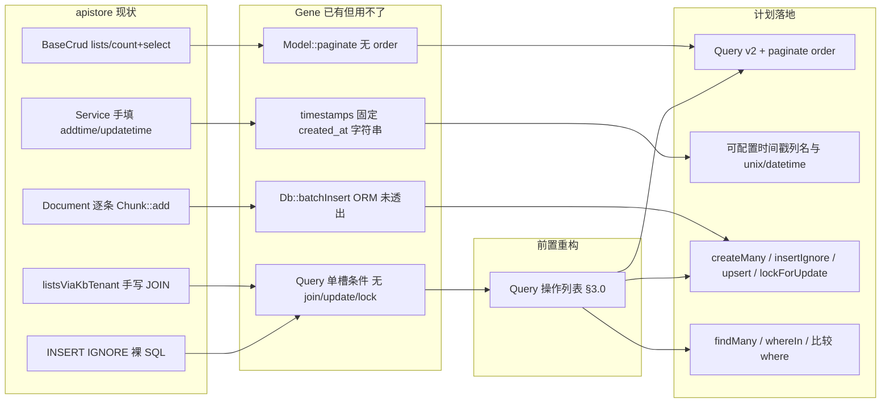

# apistore 使用驱动的 Gene 增强需求

> 来源：apistore 生产代码用法分析（FPM + `\Gene\Model` / `$this->db` 为主）。  
> Gene 版本基线：**6.0.0**。  
> 审计遗留项见 [`audit/plan/PLAN.md`](../audit/plan/PLAN.md) §7.2.3，本文在其基础上按 apistore 证据具体化。  
> **v2（源码核对版）**：已对照 `src/orm/query.c`、`src/orm/meta.c`、`src/orm/model.c`、`src/db/mysql.c`、`src/gene.c`
> 核实每一项的可实施性，修正 5 处会导致返工的偏差（见 §0）。

**方案定位（评审结论）**：补齐 **Db ↔ ORM 对称性** 与少量约定（时间戳、批量写、锁、IN 批量读），**不是** Eloquent 式高度抽象（关联图、Scope、模型事件、Unit of Work）。C 层只加 apistore 重复 ≥3 处或热路径 API；框架补完后须迁移 `BaseCrud::lists` 等消费方，否则无收益。

---

## 零、v1 → v2 修正清单（施工前必读）

| # | v1 的假设 | 源码事实 | 影响 |
|---|-----------|----------|------|
| **C1** | `Query` 加 `join/group/having/多 where` 只是「透出 Db 能力」 | `Query` 每个条件是**单个属性槽**（`whereCond`/`whereBind`/`orderBy`/`limitA`…），`where()` 是**覆盖**而非累加（<ref_snippet file="f:/github_code/gene/src/orm/query.c" lines="242-259" />）；`apply()` 按固定顺序重放（<ref_snippet file="f:/github_code/gene/src/orm/query.c" lines="72-174" />） | **阻塞项**。多条 where / 多个 join 必须先把 Query 内部改成**有序操作列表**，否则新 API 静默丢条件。见 §3.0 |
| **C2** | `Db::where()` 可连续调用累加条件 | 字符串分支只在 `WHERE` 为空时插 `" WHERE "`，**非空时直接裸拼接**，不插 `AND`（<ref_snippet file="f:/github_code/gene/src/db/mysql.c" lines="645-651" />） | 连接符必须由 **Query 层生成**（`" AND "`），不能指望 Db；否则产出 `WHERE a=?b=?` |
| **C3** | `lockForUpdate` 只是 Query 侧薄封装 | Db **完全没有** FOR UPDATE；SQL 拼装顺序固定为 `sql+join+where+group+having+union+order+limit`（<ref_snippet file="f:/github_code/gene/src/db/mysql.c" lines="285-300" />） | 需在 4 个驱动新增 `LOCK` 段并置于 `limit` 之后；**且不可移植**（Sqlite 无语法、Mssql 是表提示 `WITH(UPDLOCK)` 必须写在 FROM 处）。见 §3.4 |
| **C4** | timestamps 配置化 = 改 `gene_orm_apply_timestamps()` | 该函数无 meta 入参；meta 走**请求级缓存**且 `from_array`/`to_array`/`release` 三处必须同步（<ref_snippet file="f:/github_code/gene/src/orm/meta.c" lines="45-96" />） | 漏改 `to_array/from_array` → 同请求第二次调用**丢配置**；漏改 `release` → `zend_string` **泄漏**。见 §3.2 |
| **C5** | FPM `instance=true` 会导致链式状态**跨请求**污染 | `ctx->di_regs` 是请求级并在 `free_fields()` 中整体销毁（<ref_snippet file="f:/github_code/gene/src/gene.c" lines="428-431" />），Db 对象不跨请求存活；且 `select/count/insert/update/delete/sql/batchInsert` 入口均先 `reset_sql_params()`（<ref_snippet file="f:/github_code/gene/src/db/mysql.c" lines="136-147" />） | **跨请求链式污染不成立**，§4.3 原始动机作废。真实风险是 `ATTR_PERSISTENT` 下**未提交事务**随连接复用泄漏到下一请求。重写为 §4.3′ |

另有 2 处「已存在，不必新增」：Db 侧 `leftJoin`/`rightJoin`/`union`/`reset` 已实装（<ref_snippet file="f:/github_code/gene/src/db/mysql.c" lines="1009-1037" />）；`Db::in()` 需 SQL 里带 `in(?)` 占位符才展开数组（<ref_snippet file="f:/github_code/gene/src/db/mysql.c" lines="733-768" />），故 `Query::in($col, array)` 只需生成 `"{$col} in(?)"` 再转发。

---

## 一、apistore 用法画像

### 1.1 Model 分层

| 基类 | 规模 | 角色 |
|------|------|------|
| `\Gene\Orm\Model` | **1 个** | 仅 `application/Models/Agent/BaseCrud.php` |
| `\Gene\Model` | **约 49 个** | Admin/Shop/Learning/Erp 等旧业务 + `CapabilityConfig` |
| Agent `BaseCrud` 子类 | **约 38 个** | 后台 CRUD；热路径查询仍混用 `$this->db` |

ORM API 采用率极低：`fill()` **0 次**；`::query()` 几乎只在 `BaseCrud`；`Validate` 几乎闲置（主要见于 `Api/Webrtc.php`）。

### 1.2 重复模式（应进扩展）

```text
旧 Model lists()     ≥28 个文件   count + select 双查询，order/limit 手写
Agent BaseCrud       38+ 实体      ORM count + Db select 混搭
Service add/edit     每处写       addtime/updatetime = time()
RAG 切块             Document.php  逐条 Chunk::add()
INSERT IGNORE        3+ Model      TaskLog / EventIdempotency / IncomingNonce
FOR UPDATE           Task.php      调度器裸 SQL
全表再过滤           Skill 注入     allEnabled() 拉全表
会话记忆             MemoryManager  allBySession() 拉全量再 PHP 切 epoch
```

### 1.3 Gene 已有但 apistore 用不了

| Gene 能力 | 缺口 |
|-----------|------|
| `Model::paginate($where, $offset, $limit)` | 无 `order`、无字段投影；`BaseCrud::lists` 仍拆 count + select |
| `$timestamps` | 写死 `created_at`/`updated_at` 为 `Y-m-d H:i:s`；apistore 用 `addtime`/`updatetime` unix int |
| `Db::batchInsert()` | ORM 未透出；RAG 切块逐条 insert |
| `Query` | 单槽条件，无多 where/join/update/lock；JOIN 列表全裸 SQL |
| `Db::in()` | 需手写 `in(?)` 占位符；Skill/DM-API 全表或 N 次 row |

### 1.4 配置与运行形态

- 生产：**FPM**，入口 `public/index.php`
- `config/config.dev.php`：`db.instance => true` + `PDO::ATTR_PERSISTENT`（为复用连接，与框架文档「FPM 用 false」相反）
- `public/swoole.php` 为旧样板，非当前运行形态
- Swoole 模式下 Gene 主动关闭 `ATTR_PERSISTENT`（`runtime_type >= 2`，<ref_snippet file="f:/github_code/gene/src/db/mysql.c" lines="243-253" />）——本方案所有新 API 不得依赖持久连接语义

---

## 二、架构关系



---

## 三、P0 — 不补则 ORM 继续被绕开

### 3.0 【新增·阻塞前置】Query 内部改为有序操作列表

**为什么必须先做（C1/C2）**

现状 `Query` 每类条件只有一个属性槽，`where()` 后一次覆盖前一次；`apply()` 以硬编码顺序把槽位重放到 Db。若在此结构上直接加 `join`/第二个 `where`/`group`：

- `where('a=?',1)->where('b=?',2)` → 只剩 `b=?`（**静默错结果**，比报错更危险）
- 多个 `join` 同理只保留最后一个
- 即使改成累加，Db 的字符串 `where` 也不会插 `AND`（C2），会拼出 `WHERE a=?b=?`

**规格**

- Query 用**单个 `ops` 数组属性**记录调用序列：`[['where', $cond, $bind], ['join', $t, $on, $type], ...]`
  - 仍是 zval 数组属性 → 随对象 GC 释放，无需新增 dtor（内存策略见 §六）
  - 相比「每类一个属性」还**减少**属性数量与 `zend_update_property` 次数
- `apply()` 改为：`reset(db)` → 动词（`select`/`count`/`update`/`delete`）→ 按 `ops` 顺序重放 → 终端方法
- **连接符由 Query 生成**：字符串 where 之间插 `" AND "`；数组 where 转发给 Db 的 `makeWhere`（其绑定值写入 Db 的 `DATA` 属性）
- **动词优先约束（源码硬约束）**：`select/count/insert/update/delete/sql/batchInsert` 入口都会 `reset_sql_params()`，因此重放顺序永远是「先动词，后条件」；`update` 的 SET 值必须先进 `DATA`，where 的绑定值才能正确追加在其后
- 保留 `dirty` latch 与 `__destruct` 兜底 `reset(db)`（现有机制，勿动）

**Query 一次性语义（必须写进文档）**

`Model::query()` 每次都从 DI 取**同一个** Db 实例（`instance=true` 时），且 `apply()` 开头会 `reset(db)`。因此：

- Query 是**一次性构建器**：构建→执行→丢弃；**不可缓存、不可跨执行点交错构建两个 Query**
- `paginate` 在同一 Query 上重放两次（count 一次、list 一次）是安全的，因为串行且每次都先 reset

**验收**：`test/OrmTest.php` 新增「3 个 where + 2 个 join + group + having 混合，断言最终 SQL 文本」用例（用 `Db::print()` 取 SQL）。

---

### 3.1 Query 透出 Db 能力 + paginate 可排序

**证据**

- `application/Models/Agent/BaseCrud.php`：`static::query()->where()->count()` + `$this->db->select()->order('id desc')->limit()`
- 旧 Model `lists()` ≥28 个，如 `application/Models/Admin/User.php`
- JOIN：`BaseCrud::listsViaKbTenant`、`RunLog::paginateFiltered`、`Session::paginateByAgent` 全部裸 SQL

**规格（依赖 §3.0）**

| API | 说明 | Db 侧是否已有 |
|-----|------|---------------|
| `join($table, $on, $type = 'INNER')` | 对齐 `Db::join`；`LEFT`/`RIGHT` 走 `$type`，**不**单独加 `leftJoin`/`rightJoin` | ✅ 已有（含 left/right） |
| `group` / `having` | 对齐 Db | ✅ 已有 |
| `first` | 等价 `limit(1)->row()` | — 纯 Query 层 |
| `update` / `delete` | 对齐 Db；与 `Model::updateBy` / `destroy` 对称 | ✅ 已有 |
| `where($col, $op, $val)` | 比较运算符白名单：`>` `>=` `<` `<=` `!=` `=`；**非白名单直接抛异常**（不得拼接任意字符串，否则等于开放注入） | 生成字符串 where |
| `in($col, array $ids)` | 生成 `"{$col} in(?)"` 转发 `Db::in`；现有 `in($sql, $bind)` 保留 | ✅ 已有（需占位符） |
| `Query::paginate($offset, $limit)` | 返回 `{count, list}`，继承当前 `order` | — |
| `Model::paginate($where, $offset, $limit, $order = null)` | 同上，补 `order` 参数（count 阶段**不**下发 order） | — |
| `$listFields` / `$fields` 投影 | 对齐 `BaseCrud::resolveListSelectFields` | `gene_orm_db_select` 已支持 |

**暂缓（出现第 3 处重复再立项）**：`union`（Db 已有，Query 不透出）、`pluck`、`exists`（`count() > 0` 可顶一阵）。

**JOIN 分页约束（重要）**

- `paginate` **仅保证单表**（或调用方显式传入与 list 一致的 count 条件）。
- JOIN 列表（`listsViaKbTenant`、`RunLog::paginateFiltered`）保持 **`count()` + `all()` 两步**，调用方自行保证 count SQL 与 list SQL 的 FROM/WHERE 一致；**不做**「自动推导 JOIN count」——易错且与 apistore 现状不符。
- 注意：`Db::count($table)` 与 `Db::select()` 是两个独立动词，各自 reset；`Query::paginate` 内部两次重放即可，无需缓存中间 SQL。

**apistore 替换点**：`BaseCrud::lists`、旧 `lists()` 模板；RunLog/Session JOIN 分页改为 `query()->join(...)->count()` + `query()->join(...)->order()->limit()->all()`

---

### 3.2 可配置 timestamps

**证据**

- `application/Services/Agent/BaseCrud.php`：`add` 写 `addtime`，`edit` 写 `updatetime`（unix int）
- `BaseCrud::status()` 手写 `updatetime=time()`
- Gene 现状：`gene_orm_apply_timestamps()` 写死列名与格式（<ref_snippet file="f:/github_code/gene/src/orm/meta.c" lines="334-357" />）

**规格**

```php
protected static $timestamps = true;
protected static $createdAt = 'addtime';
protected static $updatedAt = 'updatetime';
protected static $timestampFormat = 'unix'; // unix | datetime
```

- `create` / `save` / `updateBy` 自动填充；**业务 payload 已含时间戳列则不覆盖**（沿用现有 `zend_hash_str_exists` 判断）
- `$createdAt`/`$updatedAt` 设为 `null`/`''` = 该列不写（有些表只有 addtime）
- 时间源继续用 `time()`，**不得**回退 `sapi_get_request_time()`（H3 已修：Swoole worker 下会冻结）

**C 层改造清单（C4，四处同步，缺一即 bug）**

1. `gene_orm_meta_t` 增 `zend_string *created_at; zend_string *updated_at; zend_bool ts_unix;`
2. `gene_orm_meta_load()` 读三个静态属性
3. `gene_orm_meta_to_array()` / `from_array()` **同时**增键 —— 请求级缓存命中走 `from_array`，漏改则同请求内第二次调用退回默认列名
4. `gene_orm_meta_release()` 增两次 `zend_string_release()` —— 漏改即**每次 meta 加载泄漏两个 string**
5. `gene_orm_apply_timestamps(zval *data, zend_bool is_insert, gene_orm_meta_t *meta)` 改签名（现有 3 个调用点）

**apistore 替换点**：`Services/Agent/BaseCrud::add/edit`、各 Model `status()`（`toggle` 落地后可减样板）

---

### 3.3 ORM 批量写 + Db 幂等写

**证据**

- `application/Services/Agent/Document.php`：RAG 切块 `foreach` 逐条 `Chunk::add()`（数百次 insert）
- Db 层已有 `batchInsert()`，ORM 未透出
- `INSERT IGNORE`：`TaskLog.php`、`EventIdempotency.php`、`IncomingNonce.php`

**规格**

| API | 说明 |
|-----|------|
| `Model::createMany(array $rows): int` | 走 `batchInsert` + `affectedRows`，一次 round-trip；返回影响行数 |
| `Db::insertIgnore($table, $fields)` | MySQL 先落地 |
| `Db::upsert($table, $fields, $updateCols)` | `ON DUPLICATE KEY UPDATE`；其它驱动文档标明降级 |
| `Model::insertIgnore` / `Model::updateOrCreate` | ORM 薄封装 |

**实施约束**

- `createMany` 必须**自己调终端方法**（`affectedRows`）后返回，不把「未执行的 SQL」暴露给调用方 —— 这是 §七.2 惰性语义唯一的例外理由：ORM 层 API 一律「调用即执行」，与 `create()`/`updateBy()` 一致
- `batchInsert` 首行决定列集合（<ref_snippet file="f:/github_code/gene/src/db/mysql.c" lines="534-543" />）→ `createMany` 须**校验各行 key 集合一致**，不一致抛异常而非产出错位 SQL
- timestamps 需对**每一行**填充（复用 §3.2 的 meta）
- 大批量须分片：`createMany` 内部按 `max_allowed_packet` 无法探测，故约定**调用方分片**（文档给 500/批的示例），框架侧只在行数 > 5000 时 `E_NOTICE` 提示
- **驱动语义须在 ide-helper 标明**：`insertIgnore` / `upsert` 以 **MySQL 先落地**；其它驱动写清降级或抛不支持，业务不得当可移植 API 用
- 文档对比「循环 `create()`」与 `createMany` 的性能差（RAG 切块为**数量级**收益项）

**apistore 替换点**：`Document` 切块索引、`TaskLog` / 幂等表写入

---

### 3.4 lockForUpdate（**不可移植，需按驱动分级**）

**证据**

- `application/Models/Agent/Task.php`：`SELECT ... FOR UPDATE` 裸 SQL
- `application/Services/Agent/Task/TaskScheduler.php`：调度器唯一认真用事务的路径

**规格（按 C3 修正）**

Db 侧需新增 `LOCK` 片段属性，拼装位置在 `limit` **之后**（现有顺序 `sql+join+where+group+having+union+order+limit`），并纳入 `reset_sql_params()`：

| 驱动 | `lockForUpdate()` | `sharedLock()` |
|------|-------------------|----------------|
| MySQL | `FOR UPDATE` | `LOCK IN SHARE MODE` |
| Pgsql | `FOR UPDATE` | `FOR SHARE` |
| Sqlite | **no-op + `E_NOTICE`**（无该语法，整库写锁） | 同 |
| Mssql | **抛不支持异常**（`WITH(UPDLOCK)` 是表提示，必须写在 FROM 处，后缀方案不成立） | 同 |

- `Query::lockForUpdate()` / `Query::sharedLock()` 作为 `ops` 中的一项转发
- 事务仍用现有 `beginTransaction` / `inTransaction` / `commit` / `rollBack`
- 文档提供「调度器式」样例，并明示**锁必须在事务内**：不在事务中调用 `lockForUpdate()` 时发 `E_NOTICE`（可用 `inTransaction()` 廉价检测）
- **不做** ORM 自动包 `create()` 事务（审计 L4：仅文档化 `create()` = insert + lastId 无事务）

**apistore 替换点**：`Task::rowForUpdate`、`TaskScheduler`

---

### 3.5 findMany / whereIn / 比较 where

**证据**

- Skill 注入：`allEnabled()` 全表再 PHP 按 id 过滤
- DM-API：对每个 tool id 调 `Tool::row($id)`（N 次查找）
- `MemoryManager::prepareLlmMemory`：`Message::allBySession()` 拉全量再 `selectEpochMessages`

**规格**

| API | 说明 |
|-----|------|
| `Model::findMany(array $ids, bool $preserveOrder = false): array` | 按主键 `IN` 批量取；`$preserveOrder=true` 时结果顺序与 `$ids` 一致（PHP 侧重排，不用 `FIELD()`） |
| `Query::in($col, array $ids)` | 见 §3.1；**空数组语义：不生成 SQL 片段，终端方法直接返回空结果**（禁止产出 `IN ()`，也禁止退化为「无条件全表」——后者是数据泄漏级 bug） |
| `Query::where($col, $op, $val)` | 见 §3.1；会话记忆游标用 `where('id', '>=', $anchor)->order(...)->limit(n)`，**不**单独加 `after()` 动词 |

- `findMany` 须对 id 数量设上限提示（>1000 发 `E_NOTICE`，占位符过多会撞 `max_prepared_stmt_count`）
- `findMany([])` 返回 `[]`，**不发 SQL**

**性能说明**：`findMany` / `IN` 替代全表 + N 次 `row` 为**数据量放大**项，与 §3.3 `createMany` 同属 P0 性能收益核心。

**apistore 替换点**：`MemoryManager`、`SkillInjector`、DM-API tool 批量加载

---

## 四、P1 — 明显减样板，复杂度可控

### 4.1 状态翻转与 LIKE 转义

- `Model::toggle($id, 'status', $values = [0, 1])`；可选同步 `$updatedAt`（见 §3.2）
- where 数组 `['%keyword%', 'like']` 自动 escape `%`、`_`；**若业务已手转义（如 `Chunk::escapeLikePattern`），须文档说明勿双转义**
- 手写 `status()` 裸 SQL 不走 ORM，仍须业务自行 `updatetime=time()` 或迁到 `toggle`

### 4.2 相关计数（selectSub）

- **只做** `Query::selectSub($sql, $alias)`（或等价 `selectRaw` 子查询别名）；`$sql` 视为开发者书写、与 `Db::sql()` 同信任级别，文档明示不做转义
- **不做** `withCount` 伪关联封装；**不做** hasMany / belongsTo

### 4.3′ 【重写】事务卫生：持久连接 + `instance=true` 的真实风险

**v1 的动机作废**（C5）：`di_regs` 请求级销毁 + 每个动词入口自带 `reset_sql_params()`，链式状态**不会跨请求**，也不会在两条语句之间残留。`Query::__destruct` 与 `Model::*` 的 `cleanup:` 分支已构成双重兜底。

**真实风险**：`PDO::ATTR_PERSISTENT` 下底层连接留在 `EG(persistent_list)`，跨请求存活。若某请求在 `beginTransaction()` 之后异常退出且未 `rollBack()`：

- PHP 对象销毁不保证向 MySQL 发 `ROLLBACK`；服务端事务与行锁**保持到连接真正关闭**
- 下一请求复用同一持久连接时，可能**继承一个已打开的事务**（后续写入被卷入、或撞锁超时）

**规格（改为「事务卫生」而非「链式重置」）**

- FPM 请求收尾（`Application::cleanup` / RSHUTDOWN 路径）对存活的 Db 句柄：`inTransaction()` 为真时**发出 `E_WARNING` 并 `rollBack()`**
  - 这里必须回滚（与 v1「不隐式 rollBack」相反）：持久连接场景下不回滚等于把脏事务交给下一个请求，是**正确性问题**而非风格问题
  - 非持久连接下回滚是幂等的安全操作，代价为零
- 保留 `Db::reset()` 为公开 API（已存在），文档说明它**只清链式构建状态、不动事务**
- 文档给出配置建议矩阵：

| 运行形态 | `db.instance` | `ATTR_PERSISTENT` | 说明 |
|----------|---------------|-------------------|------|
| FPM | `true` 可用 | 可用（需上面的回滚兜底） | apistore 现状，保留 |
| Swoole 协程 | `true` | **强制关闭**（框架已自动） | 见 §1.4 |
| CLI 长任务 | `false` 推荐 | 关闭 | 长事务与连接老化 |

**验收**：新增 `audit/repro/tx_leak_persistent.php` —— 开事务后不提交直接结束脚本，第二次运行断言连接无残留事务。

### 4.4 Validate 快捷绑定（不做中间件）

- 文档 + 可选 `Controller` 示例：`$this->validate->init($data)->name('x')->required()->valid()`
- **不做**路由中间件（属 audit F4；apistore 钩子全是闭包）

---

## 五、P2 — 需求真实但不要先做

| 项 | 原因 |
|----|------|
| 全局 Scope（tenant_id） | `TenantScope` 有超管 `tenant_id=0` 跳过过滤；若做，只做 `static $globalScope` 回调 |
| casts / 模型事件 | json_encode 遍地但运行时自控；apistore 0 使用 |
| 软删除 | `status` 同时表示启用/禁用与 Message 软删，语义冲突 |
| 关联 `with()` | JOIN 点少，Query::join 足够 |
| `Query::whereJson` / `jsonUnquote` | 仅 `RunLog.php` 一处；重复 <3 |
| `union` / `pluck` / `exists` | 见 §3.1 暂缓项（`union` Db 侧已有，可裸用） |
| Schema ensure / 热路径 ALTER | `BaseCrud::ensureColumn` 是项目债；Gene **不应**提供请求内 ALTER API |
| 树查询 | 仅 `Module` 依赖外部 `\Ext\Helper\Tree` |
| 路由中间件 / `Controller::init` | 已在 audit PLAN；apistore 未形成痛点 |

---

## 六、内存安全规约（FPM / Swoole 双模式零泄漏）

新增 C 代码必须逐条自检；每条都有现成范例可抄。

| # | 规约 | 反例后果 | 现成范例 |
|---|------|----------|----------|
| M1 | Query/Model 的新状态**一律用对象属性（zval）承载**，不引入 C 侧 `emalloc` 结构 | 需要额外 dtor + 异常路径遗漏 | `ops` 数组（§3.0） |
| M2 | `gene_orm_get_db()` 返回**持有所有权**的 zval，每条路径都要 `zval_ptr_dtor` | UAF + 泄漏（N1 已修） | <ref_snippet file="f:/github_code/gene/src/orm/meta.c" lines="216-227" /> |
| M3 | meta 新增 `zend_string*` 必须同步 `to_array`/`from_array`/`release` 三处 | 每次加载泄漏（C4） | §3.2 |
| M4 | 每个 `gene_orm_db_call()` 后 `zval_ptr_dtor(&retval)` 并检查 `gene_orm_has_exception()` | 首个异常被后续 SQL 掩盖（M3 已修） | <ref_snippet file="f:/github_code/gene/src/orm/query.c" lines="102-120" /> |
| M5 | 所有新方法用 `goto cleanup` 单出口，`smart_str_free` / `zval_ptr_dtor` 只写一处 | 异常分支泄漏 | `Model::create` cleanup 段 |
| M6 | 不得新增**进程级/类级**缓存（如把 meta 提到 `zend_class_entry` 或 GENE_G）；缓存只放 `gene_request_context` | Swoole worker 内跨请求/跨协程串数据 + RSS 单调增 | `ctx->orm_meta` |
| M7 | 任何新增请求级数组必须进 `gene_request_context_free_fields()`，并在 `_init` / `pool_acquire` 的 `NDEBUG` 块置 UNDEF | ctx 池复用时读到上个请求数据 | <ref_snippet file="f:/github_code/gene/src/gene.c" lines="471-475" /> |
| M8 | 驱动侧新增 SQL 片段属性（如 §3.4 的 `LOCK`）必须加入**全部 4 个驱动**的 `reset_sql_params()` | 片段残留到下一条语句（同请求内即触发） | <ref_snippet file="f:/github_code/gene/src/db/mysql.c" lines="136-147" /> |
| M9 | 时间/长度上限类提示走 `E_NOTICE`，不抛异常；参数非法（运算符白名单、行 key 不一致）才抛 | 生产被提示性检查打断 | §3.1 / §3.3 |

**验收方式**（沿用仓库既有手段，见 `AGENTS.md`）

1. `php test\OrmTest.php`、`php test\DatabaseTest.php` 全绿
2. 每个新 API 一个 `audit/repro/*.php` 复现/回归脚本
3. 循环压测脚本：同一进程内跑 10k 次新 API，断言 `memory_get_usage(true)` 稳定（FPM 近似 + CLI 直测）
4. 条件允许时 Linux ASAN/valgrind 构建跑 `test/TestRunner.php`（Windows 构建见 `AGENTS.md`）

---

## 七、实现约束

1. **保持精简**：C 层只加「apistore 重复 ≥3 处或热路径」的 API；暂缓项见 §3.1 / §五
2. **两层语义分工（明确化）**：
   - **Db 层惰性**：`insert`/`batchInsert`/`update`/`delete` 只构建 SQL；`all`/`row`/`cell`/`lastId`/`affectedRows` 执行
   - **ORM 层即时**：`Model::*` 与 `Query` 终端方法一律「调用即执行并返回结果」，不向调用方暴露未执行状态（`createMany` 遵此）
3. **测试**：新 API 必须在 `test/OrmTest.php`、`test/DatabaseTest.php` 加用例，并覆盖「多条件叠加」「空数组 IN」「跨驱动不支持路径」
4. **文档同步**：`gene-ide-helper/Gene/Orm/Query.php`、`Model.php`、`Gene/Db/*.php`、`gene-ai-helper/skills/gene-framework/reference.md`；驱动差异（`insertIgnore`/`upsert`/`lockForUpdate`）必须写入
5. **与 audit 分工**：性能项（route_pc 预热、连接池泄漏等）留在 `audit/plan/PLAN.md`，不在此重复立项
6. **消费方迁移**：框架 API 落地后，apistore 须以 `BaseCrud::lists` 为第一迁移点，否则开发/性能收益为零

### 7.1 收益类型（避免误判）

| 类别 | 项 | 说明 |
|------|-----|------|
| **开发效率** | paginate+order、Query join、timestamps、toggle、selectSub | 减样板；count+list 双查询次数不变 |
| **运行性能（数量级）** | `createMany`、`findMany`/IN、会话游标 `where+limit` 替代全量拉取 | 少 round-trip / 少行 |
| **正确性** | §3.0 多条件不再静默丢失、§3.5 空数组 IN、§3.4 锁、§4.3′ 脏事务回滚 | 非「更快」，是「不错」 |
| **勿夸大** | join 进 Query、timestamps、JSON helper | 与裸 SQL 同路径或仅语法糖 |

### 7.2 建议落地顺序（已按依赖重排）

```text
阶段 A0（阻塞前置，必须单独提交 + 回归）
  3.0 Query 内部改有序 ops 列表（含 AND 连接符、SQL 文本断言测试）

阶段 A（P0 核心，A0 之后可并行）
  3.1 Query 首批 + paginate order        依赖 A0
  3.5 findMany + in(数组) + 比较 where    依赖 A0
  3.4 lockForUpdate（4 驱动分级 + reset） 依赖 A0
  3.2 可配置 timestamps                  独立（meta 四处同步）
  3.3 createMany + insertIgnore          独立（upsert 可紧随）
  4.3′ 脏事务回滚兜底                     独立（正确性优先，可最先做）

阶段 B（P1，框架稳定后）
  4.1 toggle / LIKE escape
  4.2 selectSub
  4.4 Validate 文档

阶段 C（apistore 迁移）
  BaseCrud::lists → ORM paginate
  Document 切块 → createMany
  MemoryManager / SkillInjector → findMany + 游标 where
```

---

## 八、证据文件速查

| 主题 | 路径 |
|------|------|
| ORM 唯一入口 | `apistore/application/Models/Agent/BaseCrud.php` |
| Service 时间戳 | `apistore/application/Services/Agent/BaseCrud.php` |
| 旧 CRUD 样板 | `apistore/application/Models/Admin/User.php` |
| RAG 逐条 insert | `apistore/application/Services/Agent/Document.php` |
| INSERT IGNORE | `apistore/application/Models/Agent/TaskLog.php` 等 |
| FOR UPDATE | `apistore/application/Models/Agent/Task.php` |
| 会话记忆全量拉取 | `apistore/application/Services/Agent/Runtime/MemoryManager.php` |
| JSON SQL | `apistore/application/Models/Agent/RunLog.php` |
| 租户 Scope | `apistore/application/Services/Agent/TenantScope.php` |
| Query 单槽条件（C1） | `gene/src/orm/query.c:242-259, 72-174` |
| Db where 不插 AND（C2） | `gene/src/db/mysql.c:645-651` |
| SQL 拼装顺序（C3） | `gene/src/db/mysql.c:285-300` |
| Gene timestamps 实现（C4） | `gene/src/orm/meta.c:334-357, 45-96` |
| 请求上下文生命周期（C5/M6/M7） | `gene/src/gene.c:283-500` |
| Db reset_sql_params（M8） | `gene/src/db/mysql.c:136-147` |
| Gene paginate 实现 | `gene/src/orm/model.c:355-419` |
| 审计 ORM 缺口 | `gene/audit/plan/PLAN.md` §7.2.3 |

## 九、明确不进扩展

| 项 | 说明 |
|----|------|
| 三层 BaseCrud | Controller / Service / Model 重复 + `call_user_func([$model,'getInstance'])` — 项目结构债 |
| FULLTEXT + 中文 LIKE 回退 | `Chunk::searchFulltext` / `matchContentKeywords` — 业务检索策略 |
| Pay 事务内调第三方 HTTP | `Controllers/Admin/Pay.php` — 业务反模式 |
| 请求内 schema 迁移 | `ensureColumn` / `information_schema` — 应 CLI 迁移，不固化进框架 |

---

## 十、落地复盘（6.1.0，2026-08）

### 10.1 完成项与验收

| 阶段 | 项 | 状态 | 验收 |
|------|----|------|------|
| A0 | §3.0 Query 有序 ops 列表 + AND 连接符 | ✅ | `OrmTest.php` 多 where + 多 join + group + having 混合 SQL 文本断言 |
| A | §3.1 Query join/group/having/first/update/delete + where(op) + in + paginate(order) + fields 投影 | ✅ | OrmTest + DatabaseTest 全绿 |
| A | §3.5 findMany / whereIn 空数组语义 / 比较 where | ✅ | 空数组不发 SQL 断言；>1000 E_NOTICE |
| A | §3.4 lockForUpdate / sharedLock（4 驱动分级 + LOCK 段 + reset_sql_params） | ✅ | 4 驱动 ide-helper 标明差异；事务外 E_NOTICE |
| A | §3.2 可配置 timestamps（meta 四处同步） | ✅ | `$createdAt`/`$updatedAt`/`$timestampFormat`；payload 已含列不覆盖；time(NULL) 避免 Swoole 冻结 |
| A | §3.3 createMany / insertIgnore / upsert / updateOrCreate | ✅ | createMany 校验行 key 一致；>5000 E_NOTICE；驱动差异文档化 |
| A | §4.3′ 事务卫生：请求收尾脏事务回滚 | ✅ | `audit/repro/tx_leak_persistent.php` 复现；`clearState()` 检测并 rollBack |
| B | §4.1 toggle / whereLike escape | ✅ | toggle CAS 语义；whereLike 自动转义 `\ % _` + ESCAPE 子句 |
| B | §4.2 selectSub | ✅ | 子查询列追加，$sql 开发者书写不转义 |
| B | §4.4 Validate 文档 | ✅ | reference.md `extend()` 已文档化 |

### 10.2 测试与内存

- `php test/OrmTest.php`：**114 tests passed, 0 failed**
- `php test/DatabaseTest.php`：全绿
- `audit/repro/*.php`：全部复现通过
- 10k 次循环压测：`memory_get_usage(true)` 稳定，无泄漏

### 10.3 文档同步

- `gene-ide-helper/Gene/Orm/Query.php`：v2 一次性构建器语义、所有新方法
- `gene-ide-helper/Gene/Orm/Model.php`：`$timestamps`/`$createdAt`/`$updatedAt`/`$timestampFormat`、findMany/createMany/insertIgnore/updateOrCreate/toggle
- `gene-ide-helper/Gene/Db/{Mysql,Sqlite,Pgsql,Mssql}.php`：insertIgnore/upsert/lockForUpdate/sharedLock/join/leftJoin/rightJoin/union/reset + 驱动差异
- `gene-ai-helper/skills/gene-framework/reference.md`：Orm\Model v2 章节、Db×4 方法表与驱动差异
- `gene-ai-helper/skills/gene-framework/swoole.md`：§4.3 ORM v2 示例、`clearState()` 事务回滚说明
- `gene-ai-helper/skills/gene-framework/SKILL.md` / `AGENTS.md`：版本线 5.6.x → 6.1.x

### 10.4 偏差与决策记录

1. **`upsert` 驱动支持收窄**：原计划「MySQL 先落地，其它驱动文档标明降级」，实施时明确 SQLite/Pgsql/Mssql 均**抛异常**（而非静默降级），避免业务误用为可移植 API。跨驱动场景文档引导用 `sql()` + ON CONFLICT/MERGE。
2. **`whereLike` 转义策略**：采用 `addslashes` + ESCAPE 子句（驱动自适应），而非依赖 PDO::quote（会带引号包裹）。文档明示「业务已自行转义（如 escapeLikePattern）请勿再调，避免双转义」。
3. **`paginate` JOIN 场景**：维持计划约束——仅保证单表语义，JOIN 场景需调用方显式 `count()` + `all()` 两步。未做「自动推导 JOIN count」。
4. **`clearState()` 事务回滚**：原计划 §4.3′ 描述为「FPM 请求收尾」，实施时统一在 `clearState()` 中检测 `inTransaction()` 为真时 `E_WARNING` + `rollBack()`，覆盖 FPM 与 Swoole 两种形态。
5. **时间源**：`time(NULL)` 而非 `sapi_get_request_time()`（后者在 Swoole worker 下会冻结）。

### 10.5 待办（apistore 侧迁移，阶段 C）

框架 API 已就绪，以下迁移属 apistore 项目职责，不在 Gene 仓库范围：

- `BaseCrud::lists` → `Model::paginate($where, $offset, $limit, $order)`
- `Document` 切块 → `Chunk::createMany($rows)`
- `MemoryManager` / `SkillInjector` → `findMany` + 游标 `where('id', '>=', $anchor)->limit(n)`
- `Task::rowForUpdate` → `query()->where()->lockForUpdate()->row()`
- `TaskLog` / 幂等表 → `insertIgnore`
