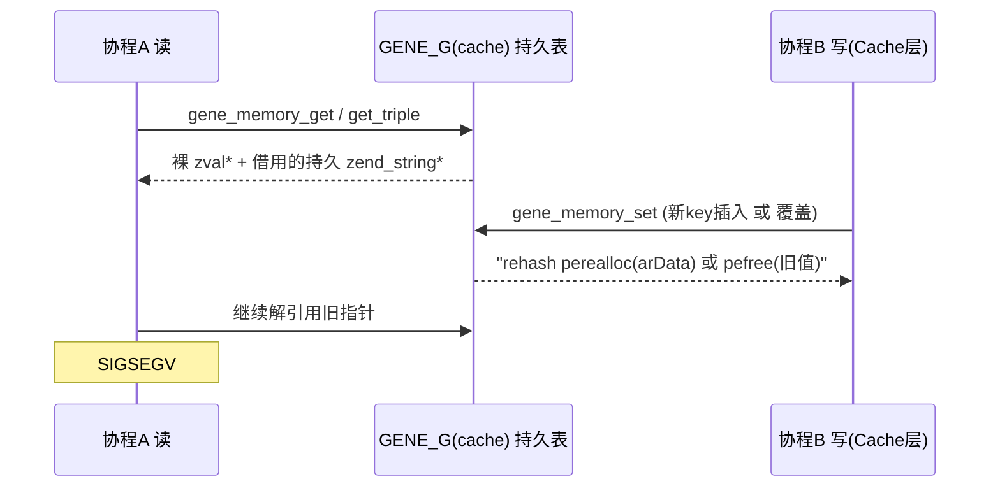

> 结论先行：不是泄漏，是 **use-after-free**。`signal=11` + "压测把表撑大后才崩" + "崩一次后又正常" 三个现象共同指向 `GENE_G(cache)` 的桶数组在请求期被 `perealloc`/`pefree`，而在飞的协程仍持有旧指针。

# Gene 框架 Swoole 段错误根因与最小改动修复

## 1. 根因链（已在代码中逐行坐实）

设计不变式写在 [src/cache/memory.c](f:/github_code/gene/src/cache/memory.c) 第 672-681 行的注释里：

```672:681:src/cache/memory.c
/** {{{ void gene_memory_get(char *keyString, size_t keyString_len)
 * [GENE_AUDIT:2026-03-25] Returns pointer into persistent cache. The read lock
 * is released before return, so the pointer is valid only as long as no concurrent
 * write (set/del/clean) modifies this key. This is safe by design invariant:
 * persistent cache (routes, configs) is written at startup (MINIT or workerStart)
 * and only read during request handling.
```

这条"启动后只读"的不变式**被 `Gene\Cache` 层自己打破了**。`gene_memory_write_allowed` 对 `cache_layer_memory_write_depth > 0` 无条件放行（`memory.c:239-250`），于是 `processCached` / `processCachedVersion` / `cachedBatch` / `cachedVersionBatch` 共 5 处在**请求期**写持久表（`cache.c:1500 / 1586 / 1605 / 1879 / 2220`）。

由此产生三个独立的崩溃机制：

- **M1 借用指针被 pefree（对应现象 1）**
  `gene_memory_zval_local` 对字符串走 `ZVAL_STR(dst, Z_STR_P(source))`——直接把持久 `zend_string*` 塞进请求 zval，不加引用计数（`memory.c:379-380`）；`gene_memory_hash_copy_local` 对 bucket key 同样直接复用持久指针（`memory.c:350-351`）。`processCachedVersion` 命中缓存时正是走这条路（`cache.c:1594`）。另一个协程一旦因版本 bump 走到 `gene_memory_set` 覆盖分支，`gene_memory_zval_edit_persistent` 会**先 pefree 旧值再重建**（`memory.c:297-306`），前一个协程手里那个 PHP 数组的 value 和 key 立刻全部悬垂。这解释了"访问一次正常 → 异常退出 → 又正常"：崩的是版本刚好翻转那一拍，翻完就稳了。

- **M2 请求期插入触发 rehash，路由/DI 的裸桶指针集体失效（对应现象 2）**
  新 key 走 `gene_symtable_update(GENE_G(cache), ...)`（`memory.c:652`）。一旦 `nNumUsed == nTableSize`，`zend_hash_do_resize` 把整个 `arData` `perealloc` 搬走。而路由派发用 `gene_memory_get_triple` 拿 `leaf` 裸 `zval*`（`memory.c:716-741`），DI/config 用 `gene_memory_get_by_config` 并且**明确在锁外遍历嵌套表**（`memory.c:747-753` 注释自认）。这些指针在整个请求内被持有。压测把业务分区从初始几项撑到跨过 2 的幂边界，那一次 resize 就让在飞请求全部读到搬移后的野地址——完全吻合"ab 打完 login 之后再访问 /doc 才 500"。

- **M3 冻结后读路径无锁**
  ```25:28:src/cache/memory.h
  #define GENE_CACHE_RDLOCK()    do { if (!GENE_G(worker_ready)) gene_rwlock_rdlock(&GENE_G(cache_lock)); } while(0)
  ```
  免锁的前提是"写已停止"，而 M1/M2 的写恰恰发生在这之后。M3 本身在单线程 worker 里不致命，但它去掉了唯一能观测到问题的护栏。



## 2. 附带确认的次级缺陷（同一批一起修，成本极低）

- `gene_memory_zval_persistent` / `_edit_persistent` / `_local` 三个 switch 都缺 `case IS_REFERENCE:` 和 `default:`（`memory.c:271-293`、`297-330`、`363-403`）。dst 是**栈上未初始化 zval**，命中空洞就把栈垃圾写进持久表，随后 `gene_memory_zval_dtor` 按垃圾 type 走 `pefree`。
- `IS_OBJECT/IS_RESOURCE` 的 `zend_error(E_ERROR)` 发生在 `GENE_CACHE_WRLOCK()` 之后（`memory.c:639 → 650`），bailout 会跳过 `WRUNLOCK`，写锁永久泄漏 → worker 假死。
- `gene.route_precompile=1` 时 `route_pc` 借用 `fn_cache` 的 `zval*` 且以 leaf HashTable **地址**为 key，`Router::clear()` 销毁 fn_cache 却不失效 route_pc（`router.c:3087-3095`）。默认为 0，**先确认线上没打开**即可排除。

## 3. 最小改动修复方案

### 改动 1（必做，治 M2）冻结后禁止表结构变化
在 `workerReady()` 里对 `GENE_G(cache)` 做一次 `zend_hash_extend(GENE_G(cache), n + reserve, 0)` 预留容量（新增 `gene.cache_reserve`，默认 4096），并在 `gene_memory_set` 的**新 key 插入分支**（`memory.c:649-660`）前加护栏：`worker_ready && nNumUsed >= nTableSize` 时直接放弃写入并计数（缓存 miss 而非崩溃）。这样冻结后 `arData` 地址恒定，M2 彻底消失，路由/DI 的裸指针假设重新成立。

### 改动 2（必做，治 M1）业务分区读路径不再借用
新增 `gene_memory_zval_local_copy()`：与现有 `gene_memory_zval_local` 同构，但字符串一律 `zend_string_init(..., 0)`、bucket key 一律重建请求态副本。**只替换 `cache.c` 的 4 个业务读点**（`1493`、`1594`，以及 `1870`、`2204` 附近的 batch 版本）；`config`/`route`/`DI` 的框架元数据读路径保持零拷贝不变，性能不受影响。

### 改动 3（必做，治覆盖竞态）swap-then-free
把 `gene_memory_set` 的覆盖分支（`memory.c:662`）从"原地先释放再重建"改为"先构造新持久 zval → `ZVAL_COPY_VALUE` 就地换入 → 再释放旧值"，杜绝"释放到一半被并发读到"的窗口。

### 改动 4（低成本加固）
- 三个 switch 补 `case IS_REFERENCE:`（`ZVAL_DEREF` 后递归）与 `default: ZVAL_NULL(dst);`。
- 把不支持类型的 `E_ERROR` 前移到取 `WRLOCK` 之前，消除写锁泄漏。
- `GENE_CACHE_RDLOCK` 的冻结免锁条件改为 `!worker_ready || cache_business_dirty`，新增全局标志由首次业务写置位。

## 4. 线上验证与二分（不改代码即可先做）

请先贴出生产 php.ini 的 `gene.*` 全部取值。据此优先确认：
- `gene.route_precompile` —— 必须为 `0`；若为 1，先关掉复测，可能直接消失。
- `gene.cache_max_items` —— 若 `> 0`，LRU 淘汰会额外在请求期 `pefree` 业务条目，会显著放大 M1；临时设为 `0` 做对照。
- `gene.co_contexts_max` / `gene.swoole_auto_cleanup` —— 用于排除协程上下文回收这条次要嫌疑。

对照实验：`worker_num=1` + 关掉 `processCached`/`processCachedVersion`（临时改走 `cachedVersion` 外部缓存）后重跑同样的 ab，若不再崩，M1/M2 即被确证。

## 5. 回归

- `php test\OrmTest.php`、`DatabaseTest.php`、`RouterTest.php` 全绿。
- 新增 `audit\repro\swoole_cache_uaf.php`：单进程内模拟"读取业务缓存数组 → 覆盖同 key → 再访问先前返回的数组"，修复前必崩、修复后必过。
- Windows 构建按 [AGENTS.md](f:/github_code/gene/AGENTS.md) 的 phpsdk-vs16-x64 流程验证；上线前建议在 Linux 测试机用 `phpize` + ASAN 跑一遍 ab。

---

# 第二轮：上述方案上线后仍崩溃（2026-08-23）

> 结论先行：第一轮的 M1/M2/M3 已落地并核对无误，但**线上现象未消失**。新拿到的 core 显示崩溃 PC 在
> `opcache.so` 的无符号代码区，整个栈里**没有任何 gene 帧**。当前证据不再支持把这次崩溃归因到
> `GENE_G(cache)`；首要嫌疑转为 **opcache JIT × Swoole 协程**。

## 6. 复现序列与 core 解读

线上复现顺序（重启后手工访问 `/doc/autoload.html` 正常）：

```bash
docker restart geneweb
ab -n 100000 -c 10  http://127.0.0.1:81/admin/login.html
ab -n 10000  -c 100 http://127.0.0.1:81/admin/login.html
ab -n 10000  -c 100 http://127.0.0.1:81/login.html
ab -n 10000  -c 100 http://127.0.0.1:81/
ab -n 10000  -c 100 http://127.0.0.1:81/admin/login.html
# 随后访问 /doc/autoload.html → worker signal 11
```

`gdb /data/app/php/bin/php core.php.75 -ex 'bt full'` 的三条可信信息：

### 6.1 崩溃 PC 在 opcache 映射区且无符号

```
#0  0x00007fc4216c3fe6 in ?? () from .../no-debug-non-zts-20210902/opcache.so
```

崩的指令既不在 PHP core 也不在 `gene.so`。opcache 映射区里"没有符号的可执行代码"最典型的来源就是
**JIT 生成的机器码**（jit buffer 落在 opcache 的共享段内，gdb 归属到 `opcache.so`）。

### 6.2 #1–#6 与 #9–#14 是假帧，`bt` 不可用

`#3 0x68`、`#4 0x03`、`#6 0x01` 不可能是返回地址。#9 之后的"地址"解码为 ASCII 正是文档页 HTML：

| 栈上 8 字节 | ASCII |
|---|---|
| `0x227261622d656c67` | `gle-bar"` |
| `0x6f6d2d76616e2d79` | `y-nav-mo` |
| `0x63206e6170733c20` | ` <span c` |
| `0x6170732f3c3e2265` | `e"></spa` |
| `0x7274223d6e656464` | `dden="tr` |

这**不是** HTML 溢出到栈上，而是 JIT 代码不产生可回溯栈帧，gdb 把栈上残留的活数据误读为返回地址。
即：此 core 的 `bt full` 信息量已耗尽。

### 6.3 唯一有语义的帧：一次读到垃圾 zend_string 的字符串比较

```
#7 zend_binary_strcmp (len2=23234304, s2=0x7fc419a77690 "\001",
                       len1=140480356119488, s1=0x7fc421b8aa48 "\002")
#8 zendi_smart_strcmp (s1=0x7fc421b8aa30, ...)
        oflow2 = 32708
```

`len1 ≈ 0x7FC4_21B8_AA40`（一个指针值）、`oflow2 = 32708 = 0x7FC4`——字段整体**错位 8 字节**。
说明拿到的 `zend_string*` 并未指向真正的 zend_string 头部：已释放并被复用，或指针被错位解释。

### 6.4 关键否定结论

栈中**无 gene 帧**，且第一轮已消除持久串借用（`gene_memory_zval_local` 现已一律
`zend_string_init(..., 0)` 深拷贝）。因此"文档页崩溃 = 持久缓存 UAF"这一因果链**当前无证据支持**，
不应据此继续在 `memory.c` 里加改动。

## 7. P0 — 先排除 JIT（不改代码，一次实验即可定性）

```bash
php -i | grep -E 'jit|opcache.enable'
```

若 `opcache.jit` 非 `disable`：

```ini
opcache.jit=disable
opcache.jit_buffer_size=0
```

重跑 6 节**完全相同**的序列。

判据与理由：JIT（尤其 tracing JIT 的类型特化）在 Swoole 协程下换栈执行是已知崩溃来源，而
"压测把热点函数打到触发 JIT 编译/trace，随后第一个走**不同**代码路径的页面才崩"与本次复现顺序
完全吻合——热点由压测产生，受害者是之后第一个 `/doc` 请求。若关闭后不再崩，则 gene 侧无需继续深挖；
若仍崩，进入 P1 取证。

## 8. P1 — 把下一个 core 变成可用证据

当前 core 无法回溯，不解决可观测性则后续每步都是猜测。

- `gene.so` 与 php 二进制带符号且不 strip：至少 `-g -O2 -fno-omit-frame-pointer`，定位期可用 `-g -O0`。
- 取栈命令换成：

```bash
gdb /data/app/php/bin/php core.php.<pid> \
  -ex 'thread apply all bt full' \
  -ex 'info registers' \
  -ex 'info sharedlibrary' \
  -ex quit
```

- 若 P0 已排除 JIT：测试机用 ASAN 构建复跑同一 ab 序列（`CFLAGS="-fsanitize=address -g"`，
 Swoole 需一并重编）。UAF 会直接给出 alloc / free / use 三处栈，一步定位。

## 9. P2 — 与本次 core 是否同源无关、但必须修的三处缺陷

这三处在第一轮改动后仍然存在，会持续制造"半截条目"与写锁泄漏，并且**会掩盖真实故障**。

### 9.1 类型预检只覆盖顶层（写锁泄漏 + 协程内 bailout）

UAF-4 的前置检查只看最外层：

```726:731:src/cache/memory.c
		zval *check = zvalue;
		ZVAL_DEREF(check);
		if (UNEXPECTED(Z_TYPE_P(check) == IS_OBJECT || Z_TYPE_P(check) == IS_RESOURCE)) {
			zend_error(E_ERROR, "An unsupported data type");
			return;
		}
```

而 `processCached*` 存入的 payload 是 `{data: ..., version: ...}` 嵌套数组。`data` 内任意层级含对象
（DateTime / ORM Model / 闭包）时，`gene_memory_hash_copy` → `gene_memory_zval_persistent` 里的
`zend_error(E_ERROR)` 会在**已持有 `GENE_CACHE_WRLOCK()`** 的情况下 bailout：写锁永久泄漏，
且在 Swoole 协程栈上 longjmp 本身即可能致崩。

**改法**：把预检改为递归全量扫描（数组深度遍历，命中 object/resource 即在**取锁前**返回失败），
`gene_memory_zval_persistent` / `_edit_persistent` 内部的 `E_ERROR` 退化为不可达的防御分支。

### 9.2 `cacheData` 未判空即解引用

```1583:1599:src/cache/cache.c
		zval *cacheData = zend_hash_str_find(Z_ARRVAL_P(cached_val), ZEND_STRL("data"));
		zval *cacheVersion = zend_hash_str_find(Z_ARRVAL_P(cached_val), ZEND_STRL("version"));
		if (cacheVersion == NULL || checkVersion(cacheVersion, &cur_version, mode) == 0) {
			/* ... 重算并写回 ... */
		}
		/* [GENE_FIX:2026-08-23 UAF-2] Deep copy, see processCached. */
		gene_memory_zval_local_copy(return_value, cacheData);
```

条目若为"有 version、无 data"（9.1 的 bailout 恰好能造出这种半截条目），这里就是 `ZVAL_DEREF(NULL)`。
`processCachedVersionBatch`（`cache.c:2217`）同一形态。

**改法**：`cacheData == NULL` 时按 miss 走重算分支，而非解引用。

### 9.3 `cache_reserve` 与 `cache_max_items` 配置互相矛盾

线上取值 `gene.cache_reserve=4096`、`gene.cache_max_items=10000`：预留槽位**小于**业务上限，
于是 LRU 淘汰永不触发，表填满后所有新业务键被护栏静默拒写（仅累加 `cache_insert_refused`），
业务缓存整体失效。

**改法**：`workerReady()` 时校验 `cache_reserve > cache_max_items`，不满足则 `E_WARNING`；
线上先把 `gene.cache_reserve` 提到 `65536`。

### 9.4 落地记录（2026-08-23，已实现并回归通过）

三处均已按"改法"落地，Windows 构建（phpsdk-vs16-x64，产物
`F:\php_src\php-8.1.30-src\x64\Release\php_gene.dll`）+ 全量回归通过：

- **9.1 → `gene_memory_zval_is_supported()`（memory.c）**：新增递归全量预检，
  `ZVAL_DEREF` 后非数组只看 object/resource；数组用 `GC_TRY_PROTECT_RECURSION` 做
  深度遍历，命中 object/resource **或自引用数组**（`GC_IS_RECURSIVE`）即拒绝——顺带堵住了
  自引用数组在 `gene_memory_hash_copy` 里无限递归的潜在缺陷。`gene_memory_set` 的顶层
  预检替换为该函数；拒写语义由 `E_ERROR` 改为 **`E_WARNING` + 拒绝写入（退化为缓存
  miss）**，彻底消除协程栈 longjmp 与写锁泄漏。三个 copy 函数内的 `E_ERROR` 保留为
  router/startup 写入路径的防御分支（该路径不经过预检）。
- **9.2 → 6 处全部加固（计划只点名 2 处，实际同形态共 6 处）**：`cachedVersion`
  （cache.c:1263）、`localCachedVersion`（1357）、`processCachedVersion`（1587）、
  `cachedVersionBatch`（2004）、`localCachedVersionBatch`（2115 附近）、
  `processCachedVersionBatch`（2224 附近）。命中分支条件统一改为
  `cacheData == NULL || cacheVersion == NULL || checkVersion(...) == 0`（单条）/
  `cacheData && cacheVersion && checkVersion(...)`（batch），半截条目一律按 miss 重算。
  apcu/外部 hook 存储同样可能写出半截条目，故 4 处 hook/apcu 路径一并修复。
- **9.3 → `PHP_METHOD(gene_application, workerReady)`（application.c）**：`cache_max_items > 0
  && cache_reserve <= cache_max_items` 时 `E_WARNING`（格式用 `ZEND_LONG_FMT`，
  **PHP 的 printf 族不支持 `%pd`**，误用会触发 `E_CORE_ERROR`）。检查无条件生效
  （不依赖 runtime_type），便于 CLI 下验证。

验证（全部 PASS）：

| 项 | 结果 |
|---|---|
| `audit\repro\p2_defects.php`（新增） | 8/8：嵌套对象/自引用数组拒写且进程健康；cachedVersion/cachedVersionBatch 半截条目重算不崩；workerReady 矛盾配置 E_WARNING、合理配置静默 |
| `audit\repro\swoole_cache_uaf.php` | PASS（STEP E 已同步为新拒写语义，子脚本 `swoole_cache_uaf_obj.php` 同步改写） |
| OrmTest / DatabaseTest / RouterTest / CacheTest | 全绿（CacheTest 的 `cachedVersion() returned null` 为**本 CLI 环境既有行为**：hook store 冷启动返回 false 时按设计 RETURN_NULL，旧 dll 同样复现，与本次改动无关） |

行为变化提示：用户态 `Gene\Memory::set($k, $obj)` 由 fatal `E_ERROR` 变为 `E_WARNING` +
拒写（返回无、键不存在）。这是 9.1"在取锁前返回失败"的直接要求，已有 repro 覆盖。

## 10. P3 — 上线后的观测点

`Gene\Monitor::stats` / `Gene\Memory::stats` 中盯三个计数器，非零即说明进程内缓存容量配置需重算：

| 计数器 | 含义 | 期望 |
|---|---|---|
| `cache_insert_refused` | 冻结后新键插入被护栏拒绝的次数 | 恒为 0 |
| `cache_business_items` | 业务分区（LRU 跟踪集）条目数 | 远小于 `cache_max_items` |
| `closure_src_cache_flushes` | 闭包源码缓存整表清空次数 | 恒为 0（Swoole 下该缓存本就禁用） |

## 11. 执行顺序

P0（线上，一次实验）→ 若仍崩则 P1（取证）→ P2（无论如何都改，可与 P0 并行准备）→ P3（上线后观测）。
**P2 在 P0 结论出来之前不作为"修复本次崩溃"提交**，避免把无关改动记账成根因修复。