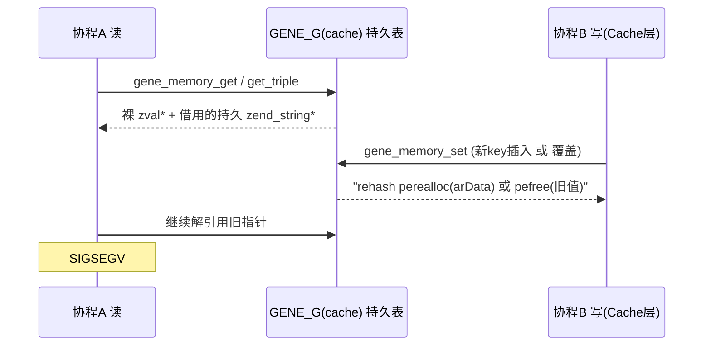

> 结论先行：不是泄漏，是 **use-after-free**。`signal=11` + "压测把表撑大后才崩" + "崩一次后又正常" 三个现象共同指向 `GENE_G(cache)` 的桶数组在请求期被 `perealloc`/`pefree`，而在飞的协程仍持有旧指针。

# Gene 框架 Swoole 段错误根因与最小改动修复

## 1. 根因链（已在代码中逐行坐实）

设计不变式写在 [src/cache/memory.c](f:/github_code/gene/src/cache/memory.c) 第 672-681 行的注释里：

```672:681:src/cache/memory.c
/** {{{ void gene_memory_get(char *keyString, size_t keyString_len)
 * [GENE_AUDIT:2026-03-25] Returns pointer into persistent cache. The read lock
 * is released before return, so the pointer is valid only as long as no concurrent
 * write (set/del/clean) modifies this key. This is safe by design invariant:
 * persistent cache (routes, configs) is written at startup (MINIT or workerStart)
 * and only read during request handling.
```

这条"启动后只读"的不变式**被 `Gene\Cache` 层自己打破了**。`gene_memory_write_allowed` 对 `cache_layer_memory_write_depth > 0` 无条件放行（`memory.c:239-250`），于是 `processCached` / `processCachedVersion` / `cachedBatch` / `cachedVersionBatch` 共 5 处在**请求期**写持久表（`cache.c:1500 / 1586 / 1605 / 1879 / 2220`）。

由此产生三个独立的崩溃机制：

- **M1 借用指针被 pefree（对应现象 1）**
  `gene_memory_zval_local` 对字符串走 `ZVAL_STR(dst, Z_STR_P(source))`——直接把持久 `zend_string*` 塞进请求 zval，不加引用计数（`memory.c:379-380`）；`gene_memory_hash_copy_local` 对 bucket key 同样直接复用持久指针（`memory.c:350-351`）。`processCachedVersion` 命中缓存时正是走这条路（`cache.c:1594`）。另一个协程一旦因版本 bump 走到 `gene_memory_set` 覆盖分支，`gene_memory_zval_edit_persistent` 会**先 pefree 旧值再重建**（`memory.c:297-306`），前一个协程手里那个 PHP 数组的 value 和 key 立刻全部悬垂。这解释了"访问一次正常 → 异常退出 → 又正常"：崩的是版本刚好翻转那一拍，翻完就稳了。

- **M2 请求期插入触发 rehash，路由/DI 的裸桶指针集体失效（对应现象 2）**
  新 key 走 `gene_symtable_update(GENE_G(cache), ...)`（`memory.c:652`）。一旦 `nNumUsed == nTableSize`，`zend_hash_do_resize` 把整个 `arData` `perealloc` 搬走。而路由派发用 `gene_memory_get_triple` 拿 `leaf` 裸 `zval*`（`memory.c:716-741`），DI/config 用 `gene_memory_get_by_config` 并且**明确在锁外遍历嵌套表**（`memory.c:747-753` 注释自认）。这些指针在整个请求内被持有。压测把业务分区从初始几项撑到跨过 2 的幂边界，那一次 resize 就让在飞请求全部读到搬移后的野地址——完全吻合"ab 打完 login 之后再访问 /doc 才 500"。

- **M3 冻结后读路径无锁**
  ```25:28:src/cache/memory.h
  #define GENE_CACHE_RDLOCK()    do { if (!GENE_G(worker_ready)) gene_rwlock_rdlock(&GENE_G(cache_lock)); } while(0)
  ```
  免锁的前提是"写已停止"，而 M1/M2 的写恰恰发生在这之后。M3 本身在单线程 worker 里不致命，但它去掉了唯一能观测到问题的护栏。



## 2. 附带确认的次级缺陷（同一批一起修，成本极低）

- `gene_memory_zval_persistent` / `_edit_persistent` / `_local` 三个 switch 都缺 `case IS_REFERENCE:` 和 `default:`（`memory.c:271-293`、`297-330`、`363-403`）。dst 是**栈上未初始化 zval**，命中空洞就把栈垃圾写进持久表，随后 `gene_memory_zval_dtor` 按垃圾 type 走 `pefree`。
- `IS_OBJECT/IS_RESOURCE` 的 `zend_error(E_ERROR)` 发生在 `GENE_CACHE_WRLOCK()` 之后（`memory.c:639 → 650`），bailout 会跳过 `WRUNLOCK`，写锁永久泄漏 → worker 假死。
- `gene.route_precompile=1` 时 `route_pc` 借用 `fn_cache` 的 `zval*` 且以 leaf HashTable **地址**为 key，`Router::clear()` 销毁 fn_cache 却不失效 route_pc（`router.c:3087-3095`）。默认为 0，**先确认线上没打开**即可排除。

## 3. 最小改动修复方案

### 改动 1（必做，治 M2）冻结后禁止表结构变化
在 `workerReady()` 里对 `GENE_G(cache)` 做一次 `zend_hash_extend(GENE_G(cache), n + reserve, 0)` 预留容量（新增 `gene.cache_reserve`，默认 4096），并在 `gene_memory_set` 的**新 key 插入分支**（`memory.c:649-660`）前加护栏：`worker_ready && nNumUsed >= nTableSize` 时直接放弃写入并计数（缓存 miss 而非崩溃）。这样冻结后 `arData` 地址恒定，M2 彻底消失，路由/DI 的裸指针假设重新成立。

### 改动 2（必做，治 M1）业务分区读路径不再借用
新增 `gene_memory_zval_local_copy()`：与现有 `gene_memory_zval_local` 同构，但字符串一律 `zend_string_init(..., 0)`、bucket key 一律重建请求态副本。**只替换 `cache.c` 的 4 个业务读点**（`1493`、`1594`，以及 `1870`、`2204` 附近的 batch 版本）；`config`/`route`/`DI` 的框架元数据读路径保持零拷贝不变，性能不受影响。

### 改动 3（必做，治覆盖竞态）swap-then-free
把 `gene_memory_set` 的覆盖分支（`memory.c:662`）从"原地先释放再重建"改为"先构造新持久 zval → `ZVAL_COPY_VALUE` 就地换入 → 再释放旧值"，杜绝"释放到一半被并发读到"的窗口。

### 改动 4（低成本加固）
- 三个 switch 补 `case IS_REFERENCE:`（`ZVAL_DEREF` 后递归）与 `default: ZVAL_NULL(dst);`。
- 把不支持类型的 `E_ERROR` 前移到取 `WRLOCK` 之前，消除写锁泄漏。
- `GENE_CACHE_RDLOCK` 的冻结免锁条件改为 `!worker_ready || cache_business_dirty`，新增全局标志由首次业务写置位。

## 4. 线上验证与二分（不改代码即可先做）

请先贴出生产 php.ini 的 `gene.*` 全部取值。据此优先确认：
- `gene.route_precompile` —— 必须为 `0`；若为 1，先关掉复测，可能直接消失。
- `gene.cache_max_items` —— 若 `> 0`，LRU 淘汰会额外在请求期 `pefree` 业务条目，会显著放大 M1；临时设为 `0` 做对照。
- `gene.co_contexts_max` / `gene.swoole_auto_cleanup` —— 用于排除协程上下文回收这条次要嫌疑。

对照实验：`worker_num=1` + 关掉 `processCached`/`processCachedVersion`（临时改走 `cachedVersion` 外部缓存）后重跑同样的 ab，若不再崩，M1/M2 即被确证。

## 5. 回归

- `php test\OrmTest.php`、`DatabaseTest.php`、`RouterTest.php` 全绿。
- 新增 `audit\repro\swoole_cache_uaf.php`：单进程内模拟"读取业务缓存数组 → 覆盖同 key → 再访问先前返回的数组"，修复前必崩、修复后必过。
- Windows 构建按 [AGENTS.md](f:/github_code/gene/AGENTS.md) 的 phpsdk-vs16-x64 流程验证；上线前建议在 Linux 测试机用 `phpize` + ASAN 跑一遍 ab。