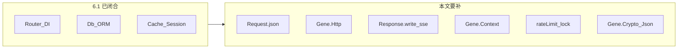

# Gene 全生命周期原语补齐

> 基线：Gene **6.1.x**。ORM v2 已闭环，本文**不**再立项 ORM。  
> 定位：补齐「开发 → 入站 → 出站 → 流式响应 → 配额/锁 → 观测」中框架仍缺的**无业务语义**原语，使一份代码在 FPM / Swoole 下都能简单写出高性能应用。  
> 与 [`orm-v2.md`](orm-v2.md) 分工：那篇是 Db↔ORM 对称性（已落地）；本文是 MVC 之外的生命周期缺口。

---

## 一、现状：中间层厚，两端空

Gene 已覆盖路由 / DI / 四驱动 Db + ORM / 版本缓存 / Session / Validate / Log / Monitor / Memory / 连接池。缺的是应用全生命周期两端：

| 生命周期 | 已有 | 缺口 |
|----------|------|------|
| 入站 | `Request::{get,post,header,rawContent}` | 无 `json()`；非法 JSON 无统一失败语义 |
| 鉴权配额 | Session、Redis `__call` 透传 | 无原子限流、无分布式锁一等 API |
| 出站 | 无 | 无 HTTP 客户端；Swoole 下裸 curl 会阻塞 worker |
| 流式响应 | `Response::json` / `end` / `sendFile` | 无 chunk `write()`，无 SSE 头与事件帧 |
| 请求隔离 | 请求级 DI / `cleanup` | 无 userland 请求袋；常驻进程下静态上下文会串请求 |
| 观测 | `Log`（已支持 `$context`）、`Monitor` | Log 不自动带 `request_id`；demo 缺标准钩子 |
| 加解密 / ID | PHP 标准库 | 无 HMAC 令牌、无安全随机 ID、无 AEAD 封装 |
| 队列 / 迁移 / 云 SDK | — | **刻意不做**（见 §五） |



---

## 二、原则

1. C 层只加 **典型 Web 应用会重复、且无业务语义** 的原语；不做 Guzzle / JWT / OpenTelemetry / 队列协议。
2. FPM 与 Swoole **同一套 API**；`runtime_type >= 2` 时禁止阻塞整个 worker 的 `curl_exec`。
3. 已有能力优先接线（`rawContent`、`Log`、`Monitor`、`Memory::incr`），不要重造。
4. 新增状态一律请求级：进 `gene_request_context`，`cleanup` / `RSHUTDOWN` 释放（内存规约 M1–M9）。
5. 路由级中间件管道（audit F4）继续推迟：缺 Linux/O6 回归时不改派发链。CORS / RequestId 用现有 Hook 约定。
6. 不把租户模型、业务错误码、LLM/支付签名、厂商 SDK 下沉到扩展。

---

## 三、P0 — 不补则业务继续自造

### 3.1 `\Gene\Http` 出站客户端

Swoole 协程下裸 curl 阻塞 worker，是「一份代码两种运行环境」目前最大的缺口。

```php
$r = \Gene\Http::request([
    'method'  => 'POST',
    'url'     => $url,
    'headers' => ['Authorization' => 'Bearer ...'],
    'json'    => $payload,        // 与 body 二选一；自动 Content-Type
    'timeout' => 60,
    'connect_timeout' => 3,
    'ssl_verify' => true,         // 默认 true
    'retry'   => 0,               // 仅 GET/HEAD；5xx/超时才重试，指数退避上限 3
    'stream'  => function (string $chunk) {},
]);
// ['status'=>int, 'headers'=>array, 'body'=>string]
```

- **后端**：`runtime_type < 2` 调 PHP `curl_*`（`ZEND_MOD_OPTIONAL("curl")`，缺失则抛清晰异常）；`>= 2` 且存在 `Swoole\Coroutine\Http\Client` 则走协程客户端。 **不** 编译链接 libcurl。
- `stream` 只回调原始字节，不解析入站 SSE/MCP。
- 不内置熔断、不跨请求连接池（FPM 仅请求内复用 curl 句柄；Swoole `keep_alive` 可配置）。
- URL、签名、业务 header 仍由调用方提供。

**验收**：`test/HttpTest.php`（本地 server 或 mock）；Swoole 分支用 `runtime_type>=2` 门禁（无环境则 SKIP，禁止假通过）。

### 3.2 `Response::write` + SSE

已有 `end()`（Swoole `$response->end`，FPM `php_write`），缺的是**不结束响应的分块写出**。

```php
\Gene\Response::sseStart();
\Gene\Response::sseEvent($event, $data);
\Gene\Response::write($chunk);   // FPM: php_write+flush；Swoole: $response->write
\Gene\Response::sseEnd();        // 等价 end()
```

- `sseStart`：`text/event-stream`、关 gzip / output_buffering、`X-Accel-Buffering: no`。
- 事件名与 payload 语义不进框架。
- 不做 WebSocket 服务端。

### 3.3 `\Gene\Context` 请求袋

框架不实现租户/用户模型，只提供随请求销毁的 KV，避免常驻进程静态变量串请求。

```php
\Gene\Context::set('request_id', $id);
\Gene\Context::get('request_id');
\Gene\Context::all();
```

- HashTable 挂在 `gene_request_context`，必须进 `free_fields()`（M6/M7）。
- `Log::*` 自动把袋中的 `request_id` 合并进 `$context`。
- demo 钩子：无入站 `X-Request-Id` 则 `bin2hex(random_bytes(8))`，并回写响应头。

### 3.4 Redis / Memory `rateLimit` + `lock`

`Redis::__call` 已能透传，一等 API 的价值是 **原子脚本**（INCR 与 EXPIRE 竞态、锁的 compare-and-del）。

```php
$this->redis->rateLimit($key, $max, $windowSec): bool;
$this->redis->lock($key, $ttlSec): string|false;   // SET key token NX EX
$this->redis->unlock($key, $token): bool;          // Lua 比对后 DEL
```

- `Memory::rateLimit` 仅单进程 / 单 worker；文档写清多 worker 不共享。
- 限流：`SET key 1 EX window NX` 失败再 `INCR`，或 Lua；超限返回 `false`，不抛。
- 不做基于 SQL COUNT 的限流；不做幂等表。

---

## 四、P1 — 减样板

### 4.1 `Request::json()` + `\Gene\Json`

```php
Request::json(): ?array;      // rawContent；空 body → null；非法 JSON 抛异常
Json::encode($data): string;  // UNESCAPED_UNICODE|UNESCAPED_SLASHES，失败抛
Json::decode($str): mixed;    // 失败抛，禁止静默 []
```

`common.c` 已有 `is_json()`，可复用。`?: []` 会吞掉损坏载荷，框架必须响亮失败。

### 4.2 `\Gene\Crypto`（不是 JWT）

```php
Crypto::base64UrlEncode / Decode
Crypto::hmacToken($payload, $secret, $ttl = 0): string;
Crypto::hmacVerify($token, $secret): array;   // 校验 exp，失败抛
Crypto::randomId($prefix, $bytes = 16): string;
Crypto::encrypt / decrypt($plain, $key);      // AES-256-GCM
```

- 不做 JWT/JWE/JWKS/密钥轮换；`purpose` / `aud` 由调用方放进 payload。
- 密钥从 config/env 注入，**禁止**从数据库口令派生。
- 旧 CBC 密文兼容不进框架。

### 4.3 demo + skill 钩子约定（零 C，不实现 F4）

- `Hooks\Cors@handle`：OPTIONS 短路；Origin **白名单**，禁止反射任意 Origin。
- `Hooks\RequestId@handle`：写 Context + `X-Request-Id`。
- JSON API 用 `Response::json` / `Controller::data`，文档禁止 `echo`+`exit`。
- 入站 body 用 `Request::json()`，禁止直接读 `php://input`。
- skill 将 `Log` / `Validate` / `Monitor` / `Memory` 标为默认要用，不是新 API。

---

## 五、明确不做

| 项 | 原因 |
|----|------|
| ORM 继续加关联/Scope/软删除 | 6.1.0 已按「非 Eloquent」收口 |
| 路由中间件管道 F4 | O6 未过不改派发链 |
| `Controller::init` F3 | 已 revert |
| 队列协议 | 各家 API 不同，留应用 Ext |
| schema 迁移 / 种子 / 测试运行器 | 项目治理 |
| 邮件、短信、对象存储、云厂商 SDK | 厂商协议 |
| 完整 JWT、熔断、OTLP C 客户端 | 过重或重复不足 |
| WS 服务端、入站 SSE 协议解析 | 协议属应用 |
| 租户模型、业务错误码 | 域逻辑 |
| 请求内 ALTER TABLE | 审计已否决 |

---

## 六、落地顺序与验收

```text
A0  Context + Log 自动合并 request_id
A1  Request::json + Json::encode/decode
A2  Response::write + sseStart/sseEvent/sseEnd
B   Gene\Http（curl + Swoole 分支，依赖 A1）
C   Redis/Memory rateLimit + lock/unlock
D   Crypto hmacToken / randomId / GCM
E   demo 钩子 + ide-helper + reference.md + SKILL.md（随 A–D）
```

每项必须：

1. `test/` 正式断言（Http/SSE 覆盖 FPM 与 `runtime_type>=2` 两条路径，无环境则显式 SKIP）。
2. `audit/repro/` 一条可一键复现。
3. `gene-ide-helper` + `gene-ai-helper/skills/gene-framework/reference.md` 同步。
4. 新请求级字段进 `gene_request_context_free_fields()`；循环压测 `memory_get_usage(true)` delta = 0。

---

## 七、收益口径

| 类别 | 项 | 说明 |
|------|-----|------|
| 运行性能 | Http 协程后端、rateLimit 替代 SQL COUNT | 少阻塞 / 少 DB round-trip |
| 正确性 | 分布式锁 Lua、非法 JSON 抛异常、SSL 默认校验 | 不错结果、不静默 |
| 开发效率 | json/sse/hmac/randomId、Context | 砍掉每项目复制的样板 |
| 勿夸大 | Crypto、Json、Hook 文档 | 与手写 PHP 同量级，收益在一致性 |

---

## 八、落地记录（2026-08-22）

状态：**已落地并在本机验证**。C 扩展 + demo 钩子 + ide-helper + skill + 测试。FPM/CLI 与 Swoole 同一套 API；新请求级字段均进 `gene_request_context_free_fields()`。

构建：PHP 8.1 NTS x64 / VS2019。新增 `.c` 后须在 SDK 环境执行 `buildconf.bat`（刷新 `configure.js` 内嵌的 `config.w32`）再 `config.nice.bat` + `nmake php_gene.dll`。改 `gene_request_context` 布局后必须重编全部 gene `.obj`，否则 RSHUTDOWN 会 ACCESS_VIOLATION。

### 验证（CLI = FPM 同路径 `runtime_type < 2`）

免部署：`php.exe -n -d extension_dir=...\php_ext -d extension=curl -d extension=openssl -d extension=<Release>\php_gene.dll`。

| 项 | 结果 |
|----|------|
| `test/LifecycleTest.php` | Context / Log `request_id` / Json / Request::json / write+SSE / Crypto / Memory rateLimit+lock 全部 ✓ |
| Redis `rateLimit`/`lock` | **SKIP**（本机未加载 ext-redis / 无 Redis 服务）。逻辑为 Lua INCR+EXPIRE、SET NX EX、比对 DEL |
| `test/HttpClientTest.php` curl | GET / POST json / stream / 5xx+retry ✓（本地 `php -S` echo） |
| `test/HttpClientTest.php` Swoole | **SKIP Swoole Http (no environment)**。禁止假通过。`runtime_type >= 2` 走 `Swoole\Coroutine\Http\Client`，不调用 `curl_exec` |
| `audit/repro/lifecycle_apis.php` | LIFECYCLE APIS OK |
| `audit/repro/lifecycle_leak_probe.php` | **LEAK PROBE OK**：Context+cleanup / Json / Crypto / Memory lock / Request::json+SSE 均为 `memory_get_usage(true)` **+0 B** |

### 实现对照

| 项 | 实现 | 请求级状态 |
|----|------|------------|
| A0 Context + Log `request_id` | `\Gene\Context::{set,get,all}`；Log 自动合并（调用方优先） | `user_bag`：reset 复用小表 / destroy 释放 |
| A1 Request::json + Json | 空 body → `null`；非法 JSON / 非对象数组抛；encode 用 UNESCAPED_UNICODE\|SLASHES | 无新增（走 rawContent 缓存） |
| A2 write / SSE | FPM `php_write`+`sapi_flush`；Swoole `$response->write`。`sseStart` 在非 CLI SAPI 丢弃隐式 output_buffering（CLI 保留以便单测 `ob_start`） | 无 |
| B Gene\Http | `runtime_type < 2` → PHP `curl_*`（`ZEND_MOD_OPTIONAL("curl")`）；`>= 2` → 协程客户端。请求内复用 curl 句柄 | `http_curl` / `http_stream_cb`；`http_body_buf` 仅调用栈 |
| C rateLimit / lock | Redis：Lua INCR+EXPIRE、SET NX EX、Lua 比对 DEL。Memory：写锁内 NX+TTL；**单 worker** | Memory 走进程表；无 ctx 字段 |
| D Crypto | hmacToken/Verify、randomId、AES-256-GCM（key 必须 32 字节）；`ZEND_MOD_OPTIONAL("openssl")` | 无 |
| E demo / docs | `Hooks\Cors` Origin 白名单 + OPTIONS 短路；`Hooks\RequestId`；BeforeHook 串联。ide-helper / reference.md / SKILL.md / swoole.md | — |

### Swoole / 多 worker 已知限制

- 请求结束必须 `cleanup()`，否则 `user_bag` / curl 句柄会随协程 ctx 泄漏到池复用前的 destroy。
- `Memory::rateLimit/lock` 在 `workerReady()` 之后与 `Memory::set` 一样被冻结并 E_WARNING；多 worker **不共享** Memory，请用 Redis。
- `Gene\Http` 在 `runtime_type>=2` **不会**调用阻塞 `curl_exec`。本机无 Swoole 扩展，协程路径未实跑，仅静态保证 + 测试 SKIP。
- Crypto 不是 JWT；GCM key 禁止从 DB 口令派生。

