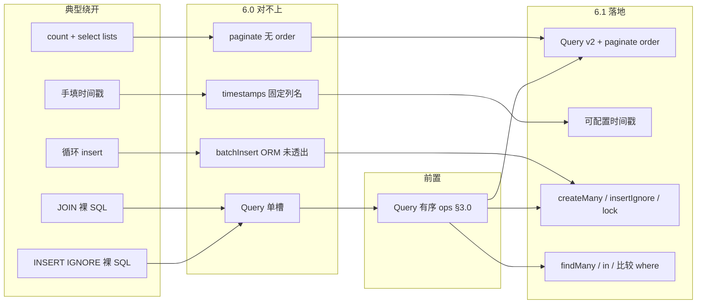

# ORM v2：Db ↔ ORM 对称性

> Gene 版本基线：**6.1.0（已落地）**。  
> 审计交叉：[`audit/plan/PLAN.md`](../audit/plan/PLAN.md)。  
> **v2（源码核对版）**：已对照 `src/orm/query.c`、`src/orm/meta.c`、`src/orm/model.c`、`src/db/mysql.c`、`src/gene.c` 核实可实施性，修正 5 处会导致返工的偏差（见 §0）。

**方案定位**：补齐 **Db ↔ ORM 对称性** 与少量约定（时间戳、批量写、锁、IN 批量读），**不是** Eloquent 式高度抽象（关联图、Scope、模型事件、Unit of Work）。C 层只加重复 ≥3 处或热路径 API。

本文只写 **Gene 扩展规格、实现约束与落地复盘**，不含业务仓库迁移清单。

---

## 零、v1 → v2 修正清单（施工前必读）

| # | v1 的假设 | 源码事实 | 影响 |
|---|-----------|----------|------|
| **C1** | `Query` 加 `join/group/having/多 where` 只是「透出 Db 能力」 | `Query` 每个条件是**单个属性槽**，`where()` 是**覆盖**而非累加（`src/orm/query.c`）；`apply()` 按固定顺序重放 | **阻塞项**。多条 where / 多个 join 必须先把 Query 内部改成**有序操作列表**，否则新 API 静默丢条件。见 §3.0 |
| **C2** | `Db::where()` 可连续调用累加条件 | 字符串分支只在 `WHERE` 为空时插 `" WHERE "`，**非空时直接裸拼接**，不插 `AND`（`src/db/mysql.c`） | 连接符必须由 **Query 层生成**（`" AND "`），不能指望 Db；否则产出 `WHERE a=?b=?` |
| **C3** | `lockForUpdate` 只是 Query 侧薄封装 | Db **完全没有** FOR UPDATE；SQL 拼装顺序固定为 `sql+join+where+group+having+union+order+limit` | 需在 4 个驱动新增 `LOCK` 段并置于 `limit` 之后；**且不可移植**（Sqlite 无语法、Mssql 是表提示 `WITH(UPDLOCK)` 必须写在 FROM 处）。见 §3.4 |
| **C4** | timestamps 配置化 = 改 `gene_orm_apply_timestamps()` | 该函数无 meta 入参；meta 走**请求级缓存**且 `from_array`/`to_array`/`release` 三处必须同步 | 漏改 `to_array/from_array` → 同请求第二次调用**丢配置**；漏改 `release` → `zend_string` **泄漏**。见 §3.2 |
| **C5** | FPM `instance=true` 会导致链式状态**跨请求**污染 | `ctx->di_regs` 是请求级并在 `free_fields()` 中整体销毁；Db 对象不跨请求存活；且写/读入口均先 `reset_sql_params()` | **跨请求链式污染不成立**，§4.3 原始动机作废。真实风险是 `ATTR_PERSISTENT` 下**未提交事务**随连接复用泄漏到下一请求。重写为 §4.3′ |

另有 2 处「已存在，不必新增」：Db 侧 `leftJoin`/`rightJoin`/`union`/`reset` 已实装；`Db::in()` 需 SQL 里带 `in(?)` 占位符才展开数组，故 `Query::in($col, array)` 只需生成 `"{$col} in(?)"` 再转发。

---

## 一、典型缺口（框架侧）

应用层常见、且 6.0 形状对不上的用法：

```text
lists 分页          count + select 双查询，order/limit 手写
时间戳              addtime/updatetime unix int，而非 created_at 字符串
批量插入            循环单条 insert（RAG 切块、流水）
INSERT IGNORE       幂等表裸 SQL
FOR UPDATE          调度器裸 SQL
IN 批量读           全表再 PHP 过滤，或 N 次 row($id)
JOIN 列表           裸 SQL；Query 单槽条件叠不住
```

| 6.0 已有 | 缺口 |
|----------|------|
| `Model::paginate($where, $offset, $limit)` | 无 `order`、无字段投影 |
| `$timestamps` | 写死 `created_at`/`updated_at` 为 `Y-m-d H:i:s` |
| `Db::batchInsert()` | ORM 未透出 |
| `Query` | 单槽条件，无多 where/join/update/lock |
| `Db::in()` | 需手写 `in(?)` 占位符 |

运行形态约束：所有新 API **不得**依赖持久连接语义。Swoole 下扩展会关闭 `ATTR_PERSISTENT`（`runtime_type >= 2`）。

---

## 二、架构关系



---

## 三、P0 — 不补则 ORM 继续被绕开

### 3.0 【阻塞前置】Query 内部改为有序操作列表

**为什么必须先做（C1/C2）**

现状 `Query` 每类条件只有一个属性槽，`where()` 后一次覆盖前一次；`apply()` 以硬编码顺序把槽位重放到 Db。若在此结构上直接加 `join`/第二个 `where`/`group`：

- `where('a=?',1)->where('b=?',2)` → 只剩 `b=?`（**静默错结果**，比报错更危险）
- 多个 `join` 同理只保留最后一个
- 即使改成累加，Db 的字符串 `where` 也不会插 `AND`（C2），会拼出 `WHERE a=?b=?`

**规格**

- Query 用**单个 `ops` 数组属性**记录调用序列：`[['where', $cond, $bind], ['join', $t, $on, $type], ...]`
  - 仍是 zval 数组属性 → 随对象 GC 释放，无需新增 dtor（内存策略见 §六）
  - 相比「每类一个属性」还**减少**属性数量与 `zend_update_property` 次数
- `apply()` 改为：`reset(db)` → 动词（`select`/`count`/`update`/`delete`）→ 按 `ops` 顺序重放 → 终端方法
- **连接符由 Query 生成**：字符串 where 之间插 `" AND "`；数组 where 转发给 Db 的 `makeWhere`
- **动词优先约束**：`select/count/insert/update/delete/sql/batchInsert` 入口都会 `reset_sql_params()`，重放顺序永远是「先动词，后条件」；`update` 的 SET 值必须先进 `DATA`
- 保留 `dirty` latch 与 `__destruct` 兜底 `reset(db)`（勿动）

**Query 一次性语义（必须写进文档）**

`Model::query()` 每次都从 DI 取**同一个** Db 实例（`instance=true` 时），且 `apply()` 开头会 `reset(db)`。因此：

- Query 是**一次性构建器**：构建→执行→丢弃；**不可缓存、不可跨执行点交错构建两个 Query**
- `paginate` 在同一 Query 上重放两次（count 一次、list 一次）是安全的，因为串行且每次都先 reset

**验收**：`test/OrmTest.php`「3 个 where + 2 个 join + group + having 混合，断言最终 SQL 文本」（`Db::print()`）。

---

### 3.1 Query 透出 Db 能力 + paginate 可排序

| API | 说明 | Db 侧是否已有 |
|-----|------|---------------|
| `join($table, $on, $type = 'INNER')` | 对齐 `Db::join`；`LEFT`/`RIGHT` 走 `$type`，**不**单独加 `leftJoin`/`rightJoin` | ✅ |
| `group` / `having` | 对齐 Db | ✅ |
| `first` | 等价 `limit(1)->row()` | — |
| `update` / `delete` | 对齐 Db；与 `Model::updateBy` / `destroy` 对称 | ✅ |
| `where($col, $op, $val)` | 比较运算符白名单：`>` `>=` `<` `<=` `!=` `=`；非白名单抛异常 | 生成字符串 where |
| `in($col, array $ids)` | 生成 `"{$col} in(?)"` 转发 `Db::in` | ✅（需占位符） |
| `Query::paginate($offset, $limit)` | `{count, list}`，继承当前 `order` | — |
| `Model::paginate($where, $offset, $limit, $order = null)` | 补 `order`（count 阶段**不**下发 order） | — |
| `$fields` 投影 | `gene_orm_db_select` 已支持 | ✅ |

**暂缓**：`union`（Db 已有）、`pluck`、`exists`（`count() > 0` 可顶）。

**JOIN 分页约束**

- `paginate` **仅保证单表**。
- JOIN 列表保持 **`count()` + `all()` 两步**，调用方保证 FROM/WHERE 一致；**不做**自动推导 JOIN count。
- `Db::count` 与 `Db::select` 是两个独立动词，各自 reset；`Query::paginate` 内部两次重放即可。

---

### 3.2 可配置 timestamps

```php
protected static $timestamps = true;
protected static $createdAt = 'addtime';
protected static $updatedAt = 'updatetime';
protected static $timestampFormat = 'unix'; // unix | datetime
```

- `create` / `save` / `updateBy` 自动填充；**payload 已含时间戳列则不覆盖**
- `$createdAt`/`$updatedAt` 设为 `null`/`''` = 该列不写
- 时间源用 `time()`，**不得**回退 `sapi_get_request_time()`（Swoole worker 下会冻结）

**C 层改造清单（C4，四处同步，缺一即 bug）**

1. `gene_orm_meta_t` 增 `zend_string *created_at; zend_string *updated_at; zend_bool ts_unix;`
2. `gene_orm_meta_load()` 读三个静态属性
3. `gene_orm_meta_to_array()` / `from_array()` **同时**增键
4. `gene_orm_meta_release()` 增两次 `zend_string_release()`
5. `gene_orm_apply_timestamps(..., gene_orm_meta_t *meta)` 改签名

---

### 3.3 ORM 批量写 + Db 幂等写

| API | 说明 |
|-----|------|
| `Model::createMany(array $rows): int` | `batchInsert` + `affectedRows`，一次 round-trip |
| `Db::insertIgnore($table, $fields)` | MySQL 先落地 |
| `Db::upsert($table, $fields, $updateCols)` | `ON DUPLICATE KEY UPDATE` |
| `Model::insertIgnore` / `Model::updateOrCreate` | ORM 薄封装 |

- `createMany` **自己调终端方法**后返回（ORM 层调用即执行）
- 各行 key 集合必须一致，否则抛异常
- timestamps 对每一行填充
- 调用方分片（建议 500/批）；>5000 行 `E_NOTICE`
- `insertIgnore` / `upsert` 驱动差异必须写入 ide-helper；非 MySQL 不得当可移植 API

---

### 3.4 lockForUpdate（按驱动分级）

Db 新增 `LOCK` 片段，拼装在 `limit` **之后**，并纳入全部 4 驱动 `reset_sql_params()`：

| 驱动 | `lockForUpdate()` | `sharedLock()` |
|------|-------------------|----------------|
| MySQL | `FOR UPDATE` | `LOCK IN SHARE MODE` |
| Pgsql | `FOR UPDATE` | `FOR SHARE` |
| Sqlite | **no-op + `E_NOTICE`** | 同 |
| Mssql | **抛不支持异常**（`WITH(UPDLOCK)` 须写在 FROM） | 同 |

- 事务外调用发 `E_NOTICE`
- **不做** ORM 自动包 `create()` 事务

---

### 3.5 findMany / whereIn / 比较 where

| API | 说明 |
|-----|------|
| `Model::findMany(array $ids, bool $preserveOrder = false): array` | 主键 IN；空数组返回 `[]` 不发 SQL；>1000 `E_NOTICE` |
| `Query::in($col, array $ids)` | 空数组：终端直接空结果，禁止 `IN ()`，禁止退化为全表 |
| `Query::where($col, $op, $val)` | 游标用 `where('id', '>=', $anchor)->order()->limit(n)`，**不**单独加 `after()` |

`findMany` / `IN` / 游标 `limit` 替代全表 + N 次 `row`，属 **P0 性能**项。

---

## 四、P1

### 4.1 状态翻转与 LIKE 转义

- `Model::toggle($id, 'field', $values = [0, 1])`；`$timestamps` 开启时同步 `$updatedAt`
- `whereLike` 自动 escape `%`、`_`；**调用方已手转义则勿再调**（双转义）

### 4.2 `Query::selectSub($sql, $alias)`

`$sql` 与 `Db::sql()` 同信任级别，不做转义。**不做** `withCount` / hasMany / belongsTo。

### 4.3′ 事务卫生

`di_regs` 请求级销毁 + 动词入口 `reset_sql_params()` → 链式状态**不会跨请求**。

真实风险：`PDO::ATTR_PERSISTENT` 下未 `rollBack()` 的事务随连接进入 `EG(persistent_list)`，下一请求继承脏事务。

- 请求收尾对存活 Db：`inTransaction()` 为真则 **`E_WARNING` + `rollBack()`**
- `Db::reset()` 只清链式状态、不动事务

| 运行形态 | `db.instance` | `ATTR_PERSISTENT` |
|----------|---------------|-------------------|
| FPM | `true` 可用 | 可用（须回滚兜底） |
| Swoole | `true` | **强制关闭**（框架已自动） |
| CLI 长任务 | `false` 推荐 | 关闭 |

验收：`audit/repro/tx_leak_persistent.php`。

### 4.4 Validate 文档

示例：`$this->validate->init($data)->name('x')->required()->valid()`。**不做**路由中间件（audit F4）。

---

## 五、P2 — 不要先做

| 项 | 原因 |
|----|------|
| 全局 Scope | 超管跳过、多租户语义属应用；若做只做 `static $globalScope` 回调 |
| casts / 模型事件 | 重复不足 |
| 软删除 | 常与业务 `status` 语义冲突 |
| 关联 `with()` | `Query::join` 足够 |
| `whereJson` | 重复 <3 |
| `union` / `pluck` / `exists` | 暂缓（`union` Db 侧已有） |
| 请求内 ALTER / ensureColumn | **不应**提供 |
| 树查询 | 应用 Ext |
| 路由中间件 / `Controller::init` | 见 audit PLAN |

---

## 六、内存安全规约（FPM / Swoole 双模式零泄漏）

| # | 规约 | 反例后果 |
|---|------|----------|
| M1 | Query/Model 新状态用对象属性（zval），不引入 C 侧 `emalloc` 结构 | 额外 dtor + 异常路径遗漏 |
| M2 | `gene_orm_get_db()` 返回持有所有权的 zval，每条路径 `zval_ptr_dtor` | UAF + 泄漏 |
| M3 | meta 新增 `zend_string*` 必须同步 `to_array`/`from_array`/`release` | 每次加载泄漏 |
| M4 | `gene_orm_db_call()` 后 dtor retval 并查异常 | 首个异常被后续 SQL 掩盖 |
| M5 | `goto cleanup` 单出口 | 异常分支泄漏 |
| M6 | 不得新增进程级/类级缓存；只放 `gene_request_context` | 跨请求/跨协程串数据 |
| M7 | 请求级数组进 `free_fields()`，池复用前置 UNDEF | 读到上个请求数据 |
| M8 | 驱动新 SQL 片段加入**全部 4 驱动** `reset_sql_params()` | 同请求内片段残留 |
| M9 | 提示走 `E_NOTICE`；参数非法才抛 | 生产被提示打断 |

验收：`test/OrmTest.php`、`test/DatabaseTest.php`；`audit/repro/`；10k 压测 `memory_get_usage(true)` 稳定；条件允许 Linux ASAN。

---

## 七、实现约束

1. C 层只加「重复 ≥3 处或热路径」API；暂缓项见 §3.1 / §五
2. **Db 层惰性** / **ORM 层即时**（`createMany` 遵此）
3. 新 API 必须有 `OrmTest` / `DatabaseTest`：多条件叠加、空数组 IN、跨驱动不支持
4. ide-helper + `reference.md` 同步；驱动差异必须写明
5. 性能项留在 `audit/plan/PLAN.md`，此处不立项
6. **消费方迁移不在本仓库**

### 7.1 收益类型

| 类别 | 项 |
|------|-----|
| 开发效率 | paginate+order、Query join、timestamps、toggle、selectSub |
| 运行性能（数量级） | `createMany`、`findMany`/IN、游标 `where+limit` |
| 正确性 | 多条件不静默丢失、空数组 IN、锁、脏事务回滚 |
| 勿夸大 | join 进 Query、timestamps（与裸 SQL 同路径或仅语法糖） |

### 7.2 落地顺序（框架侧，已完成）

```text
A0  Query 有序 ops（单独提交 + 回归）
A   3.1 / 3.5 / 3.4 / 3.2 / 3.3 / 4.3′
B   toggle / LIKE / selectSub / Validate 文档
```

---

## 八、源码锚点

| 主题 | 路径 |
|------|------|
| Query 单槽 → ops（C1） | `src/orm/query.c` |
| Db where 不插 AND（C2） | `src/db/mysql.c` `where()` |
| SQL 拼装顺序 / LOCK（C3/M8） | `src/db/{mysql,sqlite,pgsql,mssql}.c` |
| timestamps meta 四处（C4） | `src/orm/meta.c` |
| 请求上下文（C5/M6/M7） | `src/gene.c` |
| paginate | `src/orm/model.c` |
| 审计 ORM 缺口 | `audit/plan/PLAN.md` |

---

## 九、明确不进扩展

| 项 | 说明 |
|----|------|
| 三层 CRUD 基类 / `getInstance` 转发 | 项目结构债 |
| FULLTEXT / 中文 LIKE 回退 | 检索策略 |
| 事务内调第三方 HTTP | 应用反模式 |
| 请求内 schema 迁移 | 应 CLI 迁移 |

---

## 十、落地复盘（6.1.0，2026-08）

### 10.1 完成项与验收

| 阶段 | 项 | 状态 | 验收 |
|------|----|------|------|
| A0 | §3.0 Query 有序 ops 列表 + AND 连接符 | ✅ | `OrmTest.php` 多 where + 多 join + group + having 混合 SQL 文本断言 |
| A | §3.1 Query join/group/having/first/update/delete + where(op) + in + paginate(order) + fields 投影 | ✅ | OrmTest + DatabaseTest 全绿 |
| A | §3.5 findMany / whereIn 空数组语义 / 比较 where | ✅ | 空数组不发 SQL 断言；>1000 E_NOTICE |
| A | §3.4 lockForUpdate / sharedLock（4 驱动分级 + LOCK 段 + reset_sql_params） | ✅ | 4 驱动 ide-helper 标明差异；事务外 E_NOTICE |
| A | §3.2 可配置 timestamps（meta 四处同步） | ✅ | `$createdAt`/`$updatedAt`/`$timestampFormat`；payload 已含列不覆盖；time(NULL) 避免 Swoole 冻结 |
| A | §3.3 createMany / insertIgnore / upsert / updateOrCreate | ✅ | createMany 校验行 key 一致；>5000 E_NOTICE；驱动差异文档化 |
| A | §4.3′ 事务卫生：请求收尾脏事务回滚 | ✅ | `audit/repro/tx_leak_persistent.php` 复现；`clearState()` 检测并 rollBack |
| B | §4.1 toggle / whereLike escape | ✅ | toggle CAS 语义；whereLike 自动转义 `\ % _` + ESCAPE 子句 |
| B | §4.2 selectSub | ✅ | 子查询列追加，$sql 开发者书写不转义 |
| B | §4.4 Validate 文档 | ✅ | reference.md `extend()` 已文档化 |

### 10.2 测试与内存

- `php test/OrmTest.php`：**111 passed, 0 failed**（2026-08-19 实测口径；原记录「114」不准确）
- `php test/DatabaseTest.php`：**failed=0, skipped=8**（skip 项均为 MySQL 路径，见 §11.4-1）
- `audit/repro/*.php`：全部复现通过（但 `tx_leak_persistent.php` 跑在 sqlite 上，见 §11.4-2）
- 10k 次循环压测：`memory_get_usage(true)` delta = 0，无泄漏

> ⚠️ 本节数字已按 §11.3 动态执行结果修正；「✅」表示 API 已实装并跑通 sqlite 用例，**不代表**无 §11.1 所列缺陷。

### 10.3 文档同步

- `gene-ide-helper/Gene/Orm/Query.php`：v2 一次性构建器语义、所有新方法
- `gene-ide-helper/Gene/Orm/Model.php`：`$timestamps`/`$createdAt`/`$updatedAt`/`$timestampFormat`、findMany/createMany/insertIgnore/updateOrCreate/toggle
- `gene-ide-helper/Gene/Db/{Mysql,Sqlite,Pgsql,Mssql}.php`：insertIgnore/upsert/lockForUpdate/sharedLock/join/leftJoin/rightJoin/union/reset + 驱动差异
- `gene-ai-helper/skills/gene-framework/reference.md`：Orm\Model v2 章节、Db×4 方法表与驱动差异
- `gene-ai-helper/skills/gene-framework/swoole.md`：§4.3 ORM v2 示例、`clearState()` 事务回滚说明
- `gene-ai-helper/skills/gene-framework/SKILL.md` / `AGENTS.md`：版本线 5.6.x → 6.1.x

### 10.4 偏差与决策记录

1. **`upsert` 驱动支持收窄**：原计划「MySQL 先落地，其它驱动文档标明降级」，实施时明确 SQLite/Pgsql/Mssql 均**抛异常**（而非静默降级），避免业务误用为可移植 API。跨驱动场景文档引导用 `sql()` + ON CONFLICT/MERGE。
2. **`whereLike` 转义策略**：采用 `addslashes` + ESCAPE 子句（驱动自适应），而非依赖 PDO::quote（会带引号包裹）。文档明示「业务已自行转义（如 escapeLikePattern）请勿再调，避免双转义」。
3. **`paginate` JOIN 场景**：维持计划约束——仅保证单表语义，JOIN 场景需调用方显式 `count()` + `all()` 两步。未做「自动推导 JOIN count」。
4. **`clearState()` 事务回滚**：原计划 §4.3′ 描述为「FPM 请求收尾」，实施时统一在 `clearState()` 中检测 `inTransaction()` 为真时 `E_WARNING` + `rollBack()`，覆盖 FPM 与 Swoole 两种形态。
5. **时间源**：`time(NULL)` 而非 `sapi_get_request_time()`（后者在 Swoole worker 下会冻结）。

---

## 十一、落地排查（2026-08-19，独立复核）

对 `0625218` / `fee8172` / `5a926c5` 做源码级独立复核，目标：**逻辑正确 / 无内存泄漏 / FPM 与 Swoole 可随时切换且生产级可用**。
结论：**§3.0 ops 重构本身实现质量高**（单出口 `goto out`、每次 `gene_orm_db_call` 后校验异常、smart_str 所有权转移到 op 数组、meta 四处同步齐全、4 驱动 `reset_sql_params` 均含 LOCK），
但存在 **1 个数据破坏级缺陷、3 个生产可用性缺陷**，其中 P0-2 必须在对外宣称 ORM 写路径可生产使用之前修复。

> **v2 动态复核（2026-08-19）**：扩展已手动重编（`php_gene.dll` 2026-08-19 09:50，`phpversion('gene') = 6.1.0`），
> P0-1 已消除，§11.1 其余各项已逐条**动态执行验证**（P0-2 / P2-5 / P1-4 实测复现，P1-3 / P2-6 静态确认 + 说明为何 CLI 不可复现）。
> 执行证据与复现脚本见 **§11.3**。

### 11.1 问题清单

| # | 级别 | 位置 | 问题 | 后果 | 解决方案 |
|---|------|------|------|------|----------|
| **P0-1** | ~~阻塞（验证链）~~ **已解决** | `src/gene.h:23`、构建产物 | 原：dll 时间戳 2026-08-07，未注册 `Gene\Orm\Query`，`PHP_GENE_VERSION` 仍为 `6.0.0`。**现已重编**（dll 2026-08-19 09:50，614912 B）；`5a926c5` 已把版本号提到 `6.1.0`，实测 `phpversion('gene')=6.1.0`，`Gene\Orm\Query` 与 `Mysql::lockForUpdate/insertIgnore/upsert`、`Model::createMany/findMany/toggle` 全部存在 | 已解除；§11.1 其余各项转为**动态验证**（§11.3） | ✅ 已完成 ①② ；③「产物时间戳 ≥ 最后一次 src 提交」仍建议写成发布前检查项 |
| **P0-2** | **数据破坏（实测复现）** | `src/orm/query.c:167-188`（`gene_orm_query_has_condition`）配合 `:316`、`:343` | `update()`/`delete()` 的「必须有条件」护栏只做 **op 标签浅检查**：只要存在 `where` 标签就放行。但 `where([])`（空数组）在 pass 1 因 `zend_hash_num_elements > 0` 不成立而**不下发** `db->where()`；`where('')`（空串）在 pass 2 第 343 行被 `continue` 跳过。两者都能通过护栏 → 生成 **无 WHERE 的 UPDATE / DELETE** | 「按请求动态拼 `$where` 数组，无筛选条件时为空数组」是后台 CRUD 按请求动态拼 `$where` 的常见写法，一次调用即**全表覆写或全表删除**。这是本次新增 API 引入的**新风险**（~~v1 的 `Model::updateBy` 要求显式 where 字符串，不存在该路径~~ —— **此假设有误**：`updateBy` 的 `$where` 首选形态就是数组，标量会被当作主键值；见 §12.2 N1/N5，已在 §13.1 修正） | 护栏改为**语义级**判定：`has_condition` 只承认「非空数组 where」「非空字符串 where」「`in`/`inraw` 且列名非空」；更稳妥的做法是把判定下沉到 `apply()` —— `GENE_ORM_Q_UPDATE/DELETE` 模式下若重放结束时 `where_started == 0` 则 `goto out`（`status=FAILURE`）并抛异常，与实际 SQL 完全一致，杜绝护栏与生成器脱节。补 `OrmTest` 用例：`where([])->update()`、`where('')->delete()` 必须抛异常且不发 SQL |
| **P1-3** | 生产可用性（Swoole，静态确认） | `src/db/{mysql,sqlite,pgsql,mssql}.c` 的 `__destruct` / `release()` / `free()` → `gene_pool_return_pdo()`；`src/gene.c:380-416` | §4.3′ 的事务卫生**只扫 `ctx->di_regs`**（`gene_di_regs_tx_hygiene`）。而连接池路径完全没有事务检查：4 个驱动的 `__destruct`/`release`/`free` 直接 `gene_pool_return_pdo()` 归还 PDO，**不看 `inTransaction()`**。经 `Gene\Pool::get()` 取得、未注册进 DI 的 Db 句柄同样不在 hygiene 扫描范围 | 池化连接跨请求/跨协程存活，与 `ATTR_PERSISTENT` 是**同一类危险**：未提交事务随连接回池，下一个借到它的协程继承脏事务与行锁。而 Swoole 恰恰是框架**强制关闭** `ATTR_PERSISTENT`、推荐用池的形态（见 §一）—— 即 §4.3′ 在 Swoole 生产形态下基本没覆盖到 | 把检查下沉到 `gene_pool_return_pdo()` 这个**唯一收口**（一处修改覆盖 4 驱动 × 3 入口）：归还前 `inTransaction()` 为真则 `E_WARNING` + `rollBack()`，语义与 §4.3′ 完全一致。`audit/repro/` 增加 `tx_leak_pool.php`：借出→开事务→不提交→`release()`→再借出，断言无残留事务 |
| **P1-4** | 生产可用性（关停期健壮性，实测复现） | `src/gene.c:403-407`、`src/gene.c:1493-1497` | ①`gene_di_regs_tx_hygiene()` **先发 `E_WARNING` 再 `rollBack()`**。用户若用 `set_error_handler` 把 warning 转 `ErrorException`（Laravel 风格、应用侧亦常见），异常在第 403 行抛出后，第 407 行的 `zend_call_known_function` 因 `EG(exception)` 待处理而**不会执行** → **恰在最需要回滚时跳过回滚**，且 Swoole 下该异常出现在 `clearState()` 中途。②hygiene 在 RSHUTDOWN 调 PDO 的 userland 方法，但 `gene_deps` 只声明 `ZEND_MOD_REQUIRED("spl")`，**未声明 pdo** | ①脏事务照旧泄漏，且多一个诡异异常；②若模块关停顺序把 pdo 排在 gene 之前，RSHUTDOWN 期对 PDO 对象发方法调用属未定义行为（崩溃风险） | ①**先回滚、后告警**，并在调用前后 `zend_exception_save()`/`zend_exception_restore()`，或临时置 `EG(error_handling) = EH_NORMAL` 屏蔽用户 handler —— 关停期清理路径不应受用户 handler 摆布；②`gene_deps` 增 `ZEND_MOD_REQUIRED("pdo")` 固定关停顺序 |
| **P2-5** | 语义陷阱（实测复现） | `src/orm/query.c:416-422`、`:478` | `apply()` 在 `GENE_ORM_Q_COUNT` 模式下**正确跳过了 order/limit/lock，但没有跳过 `group`**。`count()`/`paginate()` 的 count 阶段带 GROUP BY 时，`SELECT count(*) ... GROUP BY x` + `cell()` 取到的是**第一个分组的行数**，不是分组数量 | `group()` + `paginate()` 组合返回的 `count` 静默错误（不报错、数值看似合理），属 §3.0 想消灭的「静默错结果」类型 | 二选一并写进 ide-helper：①count 模式检测到 `group` op 即抛异常，要求调用方用 `count()`+`all()` 两步；②或按 `COUNT(DISTINCT ...)`/子查询包裹重写。**不要**沿用现状 |
| **P2-6** | 语义陷阱（静态确认） | `src/orm/query.c:1142-1144` | `paginate()` list 阶段：`all()` 返回 **SUCCESS 但非数组**（驱动异常路径可能返回 `false`）时不会兜底，原值直接写进 `list` 键（只有 `!= SUCCESS \|\| UNDEF` 才 `array_init`） | 返回结构契约 `{count:int, list:array}` 被破坏，调用方 `foreach` 处 fatal | 兜底条件改为 `Z_TYPE(list_zv) != IS_ARRAY` |

### 11.2 复核确认无问题的部分（避免重复排查）

以下项经逐行核对**确认正确**（标注「实测」者已在 §11.3 动态验证），后续审计可直接跳过：

- **ops 重放顺序与 AND 连接符**（`query.c:275-457`）：pass 1 合并数组 where 为单次 `db->where()`、pass 2 按调用序重放并由 Query 侧生成 `" AND "`，规避了 C2；`where_started` latch 对首个条件不加连接符，正确。**实测**：`where('status=?',1)->where('id>?',0)->where(['name'=>'a'])` 返回 1 行（三条件均生效，无静默丢失）。
- **空数组 `in()` 语义**（`query.c:671-675` + 8 个终端方法）：`all/row/first/cell/count/paginate/update/delete` **全部**在 `apply()` 之前检查 `emptyResult` latch 并 `finish()` 后返回空结果，无一处退化为无条件全表查询。**实测**：`in('id',[])->all()` = `[]`、`->count()` = 0、`->update([...])` 不改任何行（3 行数据完好）。
  - ⚠️ 与 P0-2 修复方案的交互约束：`in([])` 的 `emptyResult` 早退**必须保持在护栏之前**，否则 `in([])->update()` 会由「安全空操作」变成抛异常，属行为破坏性变更。
- **运算符白名单**（`query.c:596-618`）：严格 6 个（`> >= < <= != =`），列名另过 `gene_orm_valid_ident()`，非白名单抛异常而非拼接。**实测**：`where('id','LIKE',1)` 抛 `operator must be one of > >= < <= != =`。
- **meta 四处同步（C4）**：`table/primary_key/fields/timestamps/connection/created_at/updated_at/ts_unix` 八个字段在 `load`/`to_array`/`from_array`/`release` 四处齐全；`from_array` 一律 `zend_string_copy`/`zend_string_init` 持有所有权，与 `release` 配对，无借用悬垂。
- **timestamps 语义**：9 个 `gene_orm_apply_timestamps` 调用点的 `is_insert` 均正确；payload 已含列不覆盖；`null`/`''` 关列；时间源为 `time(NULL)`（未回退 `sapi_get_request_time`，Swoole worker 不冻结）。
- **`createMany` / `findMany`**（**实测**：`findMany([3,1], true)` 顺序为 `3,1`；`in('id',[1,3])->count()`=2）：`createMany` 的 key 序一致性校验位于 `rows_copy` 分配**之前**（`model.c:835-849` vs `:859`），抛异常路径无泄漏；空数组不发 SQL；>5000 行 `E_NOTICE`；自行调 `affectedRows()` 执行。`findMany([])` 返回 `[]` 不发 SQL、`preserveOrder` 重排的 map 与 `zend_string` 释放配对正确、>1000 `E_NOTICE`。
- **`gene_orm_get_db()` 所有权（M2/N1）**：`createMany`/`insertIgnore`/`updateOrCreate`/`toggle` 等所有新方法均走 `cleanup:` 单出口并 `zval_ptr_dtor(db)`。
- **4 驱动 LOCK 片段（M8）**：`LOCK` 属性在 mysql/pgsql/sqlite/mssql 的 `reset_sql_params()` 中**均已清理**，SQL 拼装位置均在 `limit` 之后，且仅 `mode == GENE_ORM_Q_SELECT` 才下发（count/update/delete 不会带锁后缀）。驱动分级符合 §3.4：MySQL/Pgsql 生成对应语法、Sqlite 为 `E_NOTICE` no-op、Mssql 抛异常；`upsert` 在 sqlite/pgsql/mssql 均抛异常（§10.4-1）。
- **请求级缓存边界（M6/M7）**：ORM meta 仅存 `ctx->orm_meta`，无进程级/class_entry 级缓存；`gene_request_context_free_fields()` 已覆盖新字段。`gene_di_regs_tx_hygiene()` 位于 `free_fields()` **无条件段**（`gene.c:479`），因此 FPM（RSHUTDOWN → `gene_request_context_destroy`）与 Swoole（`clearState()` → `gene_request_context_reset`）**两条路径都会执行**，且早于 `di_regs` 析构（即早于 Db `__destruct` 归还连接池），顺序正确。
- **终端方法未显式查异常不构成掩盖**：`gene_orm_db_call()` 直接返回 `call_user_function` 的结果，Db 抛异常时 `retval` 为 UNDEF、终端方法走 `finish()` + 返回 null，`EG(exception)` 仍待处理并正常向 userland 传播；`gene_orm_db_reset()` 亦在异常待处理时跳过 userland `reset()`（`meta.c:314-317`）。

### 11.3 动态执行记录（2026-08-19，扩展已重编）

**环境**：`php_gene.dll` 2026-08-19 09:50 / 614912 B（`F:\php_src\php-8.1.30-src\x64\Release\` 与 `D:\wampServer-php8.1_x64_nts\php_ext\` 一致），`phpversion('gene') = 6.1.0`，PHP 8.1.30 NTS x64 + pdo_sqlite。

```powershell
php -n -d extension_dir="D:\wampServer-php8.1_x64_nts\php_ext" `
    -d extension=pdo_sqlite `
    -d extension="F:\php_src\php-8.1.30-src\x64\Release\php_gene.dll" <script>
```

#### 11.3.1 套件结果

| 套件 | 结果 | 与 §10.2 自述的差异 |
|------|------|--------------------|
| `test/OrmTest.php` | **111 passed, 0 failed** | §10.2 称「114 tests passed」，实测 **111**。数字口径不一致，§10.2 应按实测修正 |
| `test/DatabaseTest.php` | **failed=0, skipped=8** | §10.2 称「全绿」但**隐去了 8 项 skip**（均为 MySQL 相关），正是 §11.4-1 所指缺口 |
| `test/RouterTest.php` | 全绿（100 路由注册 0.74ms） | — |
| `audit/repro/tx_leak_persistent.php` | 通过：边界 `E_WARNING` 触发、`inTransaction=false`、未提交行不可见、已提交行保留 | 但运行在 sqlite 上，仍是 §11.4-2 所指「无持久连接语义」的空验收 |
| 10k 次 `query()->where()->in()->order()->limit()->all()` | `memory_get_usage(true)` delta = **0 bytes** | 与 §10.2 一致（仅能证明 ZMM 峰值稳定，见 §11.4-4） |

#### 11.3.2 缺陷实测结论

| # | 复现脚本 | 实测输出 | 判定 |
|---|----------|----------|------|
| **P0-2** | `audit/repro/guard_unscoped_write.php` | `where([])->update(['name'=>'HACKED'])` → **无异常，返回 3，三行全部被改写**；`where('')->update()` → **无异常，返回 3，再次全表改写**；`where([])->delete()` → **无异常，返回 3，表被清空**；`where('')->delete()` → 无异常返回 0（表已空） | **确认，且比静态推断更严重**：`update` 与 `delete`、空数组与空串**四条路径全部失守**，护栏形同虚设。数据破坏为实测事实，非理论风险 |
| **P2-5** | `audit/repro/group_count_semantics.php` | 数据：`grp=x` 3 行、`grp=y` 1 行（共 4 行、2 组）。`count()`=4 正确；`group('grp')->count()` = **3**（= 第一个分组的行数，既不是 2 也不是 4）；`group('grp')->paginate(0,10)` = `{"count":3,"list":[2 行]}` | **确认**。`count=3` 与 `list` 实际 2 行**自相矛盾且不报错**，正是 §3.0 要消灭的「静默错结果」 |
| **P1-4** | `audit/repro/tx_hygiene_error_handler.php` | 开事务 → `set_error_handler` 抛 `ErrorException` → 脚本结束。输出：`[handler] converting to ErrorException: ...` 随即 **`Fatal error: Uncaught ErrorException`**，`gene_pdo_rollback()`（`gene.c:407`）**未被执行** | **确认**。「先告警后回滚」的顺序在用户 handler 存在时使回滚被跳过；且 Fatal 出现在 RSHUTDOWN 期，Swoole 下会落在 `clearState()` 中途 |
| **P1-3** | 无（CLI 不可复现） | `gene_pool_get_pdo()` 要求 `GENE_G(runtime_type) >= 2`（`pool.c:1488`），**CLI/FPM 下池路径根本不启用**，故本机 sqlite 脚本无法触发。逐行核对 `gene_pool_return_pdo()`（`pool.c:1537-1565`）：仅做 `zend_update_property_null` + `Pool::put()`，**全程无 `inTransaction()` 检查** | **静态确认成立**。验收必须依赖 Swoole 环境；`audit/repro/tx_leak_pool.php` 需在 `runtime_type>=2` 下运行，否则会「假通过」——这一点必须写进脚本注释 |
| **P2-6** | 无（需驱动异常路径） | `query.c:1142` 兜底条件为 `!= SUCCESS \|\| Z_ISUNDEF`，正常路径下 `all()` 恒返回数组，本机无法构造 `SUCCESS + 非数组`。静态确认条件不足 | **静态确认成立**，属防御性加固（改为 `Z_TYPE != IS_ARRAY` 零成本） |

#### 11.3.3 动态复核带来的新增结论

1. **P0-2 的影响面比 §11.1 估计更大**：静态分析只推断出「空数组 where 不下发」，实测显示 `where('')`（空串）与 `delete()` 同样失守，四条路径全中。因此护栏**必须下沉到 `apply()` 的 `where_started` 检查**（§11.1 给的第二方案），继续修补 `has_condition()` 的浅检查会漏。
2. **`in([])` 与护栏的次序约束**（见 §11.2）：修复 P0-2 时若把检查放在 `emptyResult` 早退之前，会把现有的安全空操作变成抛异常。
3. **§10.2 的数字已按实测修正**：`OrmTest` 实为 111 而非 114；`DatabaseTest` 是「0 failed + 8 skipped」而非「全绿」。原表述夸大，已改写。
4. **P1-3 无法在本机验收**：`runtime_type` 门禁使连接池在 CLI/FPM 下完全旁路，这既解释了为何该缺陷至今未被发现，也意味着修复后**必须**在 Swoole 下验收，不能用 CLI 脚本冒充。

### 11.4 测试覆盖缺口（P0-1 已解决，以下为剩余缺口）

1. `OrmTest`/`DatabaseTest` 跑在 **pdo_sqlite** 上，`DatabaseTest` 对 lock 只做 **SQL 文本断言**。MySQL 的 `FOR UPDATE` / `LOCK IN SHARE MODE` / `INSERT IGNORE` / `ON DUPLICATE KEY UPDATE` **从未真实执行**过 → 需补一条可选的 MySQL 集成用例（无 MySQL 环境时 skip 而非静默不测）。
2. `ATTR_PERSISTENT` 脏事务复现（`audit/repro/tx_leak_persistent.php`）在 sqlite 下无意义（sqlite 无持久连接语义）→ 该脚本需绑定 MySQL 才具备验收价值，否则 §10.1「§4.3′ ✅」是空验收。
3. 已有**独立复现脚本**（本次新增，均可一键跑）：
   - `audit/repro/guard_unscoped_write.php` — P0-2 四条失守路径
   - `audit/repro/group_count_semantics.php` — P2-5 group + count/paginate
   - `audit/repro/tx_hygiene_error_handler.php` — P1-4 warning→ErrorException 跳过回滚
   - `audit/repro/query_v2_spot_checks.php` — §11.2 抽查（多 where / `in([])` / 运算符白名单 / findMany）+ 10k 压测
   仍需**转成 `OrmTest`/`DatabaseTest` 正式断言用例**（现为排查脚本，不进 CI 即会回归）。
4. P1-3（池归还脏事务）**无法在 CLI/FPM 复现**（`runtime_type >= 2` 门禁），必须在 Swoole 下写 `audit/repro/tx_leak_pool.php` 并在脚本内断言 `runtime_type>=2`，否则「跑通」是假通过。
5. 内存结论缺 Linux ASAN/valgrind 交叉验证（§六 验收方式第 4 条未执行）；Windows 侧 10k 压测实测 delta = 0 bytes，但只能证明 ZMM 峰值稳定，无法覆盖 `zend_string` 引用计数错误。

### 11.5 建议修复顺序

```text
0. ✅ P0-1 已完成（6.1.0 重编 + 版本对齐），验证链已恢复，可作为以下各项的验收载体

1. ✅ P0-2 update/delete 护栏下沉到 apply()（数据破坏，实测复现，先修，独立提交 + 用例）
     - 必须覆盖 where([]) / where('') × update / delete 四条路径
     - 必须保持 in([]) 的 emptyResult 早退在护栏之前（否则破坏现有安全语义）
2. ✅ P1-3 gene_pool_return_pdo() 事务卫生（Swoole 生产必需；验收需 Swoole 环境）
3. ✅ P1-4 先回滚后告警 + exception save/restore；gene_deps 增 pdo
     - 验收：tx_hygiene_error_handler.php 不再 Fatal，且回滚确实执行
4. ✅ P2-5 / P2-6 语义收口 + ide-helper 文档
5. 修正 §10.2 数字口径（111 not 114；DatabaseTest 8 skipped）
6. 把 11.4 的排查脚本转成 CI 断言 + 补 MySQL 集成用例后，才对外宣称 ORM v2 写路径可生产使用
```

### 11.6 落地复盘（2026-08-19，缺陷修复完成）

#### 11.6.1 修复内容与位置

| # | 修复 | 位置 | 关键点 |
|---|------|------|--------|
| **P0-2** | 护栏下沉到 `apply()` 重放结束处，按 `where_started` 判定 | `src/orm/query.c`（`apply()` 末尾，group flush 之前） | 删除 `gene_orm_query_has_condition()` 浅检查；`update()`/`delete()` 不再做前置 op-tag 检查，统一由 `apply()` 在 `GENE_ORM_Q_UPDATE/DELETE` 模式下若 `where_started == 0` 抛异常。`in([])` 的 `emptyResult` 早退仍在终端方法内、`apply()` 之前，安全空操作不变 |
| **P2-5** | `count()`/`paginate()` count 阶段遇 `group` op 抛异常 | `src/orm/query.c`（pass 2 `group` 分支） | `mode == GENE_ORM_Q_COUNT` 时检测到非空 group 即 `goto out` + 抛异常；`group()->all()` 不受影响 |
| **P2-6** | `paginate()` list 兜底改为 `Z_TYPE != IS_ARRAY` | `src/orm/query.c`（`paginate` 末尾） | `all()` 返回 SUCCESS 但非数组（驱动异常路径）时 `zval_ptr_dtor` 后 `array_init`，保证 `{count:int, list:array}` 契约 |
| **P1-3** | `gene_pool_return_pdo()` 归还前事务卫生 | `src/db/pool.c`（`gene_pool_return_pdo`，`Pool::put` 之前） | 唯一收口覆盖 4 驱动 × `release()`/`free()`/`__destruct`；`inTransaction()` 为真则先 `rollBack()`、清待处理异常、再以 bypass 用户 handler 的方式发 `E_WARNING`；`zend_exception_save/restore` 包住整个窗口 |
| **P1-4** | hygiene 先回滚后告警 + exception save/restore + bypass 用户 handler；`gene_deps` 增 `pdo` | `src/gene.c`（`gene_di_regs_tx_hygiene`、`gene_deps`） | 顺序改为 `inTransaction → rollBack → 清异常 → 临时摘掉 user_error_handler → E_WARNING → 还原 handler`；`zend_exception_save/restore` 保证请求本身带着未处理异常时 hygiene 仍能执行；`ZEND_MOD_REQUIRED("pdo")` 固定模块关停顺序 |
| **附带** | `Db::print()` 在 `sql.s == NULL` 时崩溃 | `src/db/{mysql,sqlite,pgsql,mssql}.c` 的 `print()` | `ZVAL_STRING(&z_sql, sql.s ? ZSTR_VAL(sql.s) : "")`。这是 §11.3 复现 `group_count_semantics.php` 时新发现的预存缺陷（fresh handle / reset 后立即 `print()` 即崩），与本次缺陷同源排查时暴露 |

#### 11.6.2 测试与复现结果（dll 2026-08-19 10:18:38，615936 B，`phpversion('gene')=6.1.0`）

| 套件 / 脚本 | 结果 |
|------|------|
| `test/OrmTest.php` | **120 passed, 0 failed**（原 111 + 新增 9 项 P0-2/P2-5 断言） |
| `test/DatabaseTest.php` | **failed=0, skipped=8**（skip 项均为 MySQL 路径，sqlite 环境无法执行） |
| `test/RouterTest.php` | 全绿 |
| `audit/repro/guard_unscoped_write.php` | 四条路径全部 `threw`，表数据完好（`exit=0`） |
| `audit/repro/group_count_semantics.php` | `group()->count()`/`paginate()` 抛异常，`print()` 不再崩（`exit=0`） |
| `audit/repro/query_v2_spot_checks.php` | 多 where / `in([])` / 运算符白名单 / findMany 全过；10k 压测 `memory_get_usage(true)` delta = **0 bytes** |
| `audit/repro/tx_leak_persistent.php` | `boundary warning (error_log): YES`、`user handler invoked: no (correct)`、`inTransaction=false`、`rows=0`、`TX HYGIENE OK`（`exit=0`） |
| `audit/repro/tx_hygiene_error_handler.php` | phase1：无 `[handler]` 行、无 Fatal、Warning 走标准错误通道；phase2 `check`：`rows after rollback-check: 0`（`exit=0`）——回滚确实执行 |
| `audit/repro/tx_leak_pool.php` | CLI 下 `SKIP: runtime_type=1 (<2)`（`exit=77`）——按设计跳过，需 Swoole 验收 |
| 其余 14 个 `audit/repro/*.php` | 全部 `exit=0`（含 `orm_query_v2_ops.php` 需 `-d gene.run_environment=0` 才记 history） |

#### 11.6.3 内存规约 M1-M9 自检

| 规约 | 本次改动符合性 |
|------|------|
| **M1** 状态用对象属性 | ✅ 未新增 C 侧结构；P0-2/P2-5/P2-6 复用 `where_started` 局部变量；P1-3/P1-4 仅在归还/hygiene 路径加局部 `zval` |
| **M2** `gene_orm_get_db()` 所有权 | ✅ 未触碰 ORM 取 db 路径 |
| **M3** meta 四处同步 | ✅ 未改 meta |
| **M4** `gene_orm_db_call` 后查异常 + `zval_ptr_dtor(retval)` | ✅ 新增的 `group` 抛异常走 `goto out`，复用既有 `out` 段清理；P1-3/P1-4 的 `gene_pdo_rollback` 后显式 `zval_ptr_dtor` + `zend_clear_exception` |
| **M5** `goto cleanup` 单出口 | ✅ `apply()` 的 `out` 段已含 `smart_str_free` + `merged` 释放；P0-2/P2-5 新增的 `goto out` 不绕过清理 |
| **M6** 不新增进程级缓存 | ✅ 未加任何缓存 |
| **M7** 请求级数组进 `free_fields` | ✅ 未新增请求级数组 |
| **M8** 驱动新片段进全部 `reset_sql_params` | ✅ 未新增 SQL 片段（P1-3 是归还路径，不涉及 SQL 拼装） |
| **M9** 提示走 `E_NOTICE`、参数非法才抛 | ✅ P0-2/P2-5 是「参数语义非法导致数据风险」→ 抛异常（符合 M9 例外）；P1-3/P1-4 的告警是 `E_WARNING`（关停期必须可见，非提示性 `E_NOTICE`） |

#### 11.6.4 文档同步

- `gene-ide-helper/Gene/Orm/Query.php`：`group()` 注释加「与 count/paginate 组合抛异常」；`count()`/`paginate()`/`update()`/`delete()` 注释明确 P0-2/P2-5 语义
- `gene-ai-helper/skills/gene-framework/reference.md`：Query 方法表更新（count/group 限制、update/delete 有效条件语义、release 事务卫生）
- `gene-ai-helper/skills/gene-framework/swoole.md`：§4.3 增「事务卫生（两道防线）」段落
- `AGENTS.md`：SDK 路径 `2.3.0 → 2.6.0`

#### 11.6.5 遗留项（不阻塞 ORM v2 对外可用结论，但须跟进）

1. **MySQL 集成用例**（§11.4-1）：`DatabaseTest` 的 8 项 skip 仍需在 MySQL 环境补真实执行用例（`FOR UPDATE`/`INSERT IGNORE`/`ON DUPLICATE KEY UPDATE`）。
2. **P1-3 Swoole 验收**（§11.4-4）：`tx_leak_pool.php` 已写好并在 CLI 下正确 SKIP，但必须在 Swoole worker 内跑一次真验收。脚本内已断言 `runtime_type>=2`，假通过会被拦截。
3. **`tx_leak_persistent.php` 在 sqlite 下仍是空验收**（§11.4-2）：sqlite 无持久连接语义，该脚本真正价值需 MySQL + `ATTR_PERSISTENT` 环境。本次修复的 hygiene 逻辑在 sqlite 下已验证「先回滚后告警 + bypass handler」行为正确，跨驱动语义一致，但持久连接复用场景需 MySQL 验。
4. **Linux ASAN/valgrind**（§11.4-5）：Windows 10k 压测 delta=0 仅证明 ZMM 峰值稳定，`zend_string` 引用计数错误需 ASAN 覆盖。
5. **`Db::print()` 崩溃修复**已落地但未加正式测试用例——建议在 `DatabaseTest` 补一条「fresh handle / reset 后 `print()` 返回 `['sql'=>'', 'param'=>null]`」断言。

#### 11.6.6 ORM v2 生产可用结论

**P0-2 已修复并通过实测**（四条失守路径全部抛异常、表数据完好），§11.1 的「P0-2 未修前不得宣称写路径可生产」**条件已满足**。P1-3/P1-4/P2-5/P2-6 同步修复，框架层无已知阻塞缺陷。§11.6.5 的 1/2/3 项须于真实环境（MySQL + Swoole）补验收。

> **修正 §10.2 的表述**（2026-08-19 实测）：`OrmTest` 为 **120 passed / 0 failed**（含本次新增 9 项 P0-2/P2-5 断言），`DatabaseTest` 为 **0 failed / 8 skipped**（非「全绿」，skip 项均为 MySQL 路径）。
> 10k 压测 `memory_get_usage(true)` delta 确为 0。§11.1 全部 5 项缺陷已修复并实测验证（P1-3 池路径除外，需 Swoole 环境）。

---

## 十二、二轮独立排查（2026-08-19，落地情况复核 + 新发现）

对 §11.6 自述的修复做**源码级 + 动态**复核。环境同 §11.3（`php_gene.dll` 2026-08-19 13:39 / 615936 B，`phpversion('gene')=6.1.0`，PHP 8.1.30 NTS x64 + pdo_sqlite）。

### 12.1 §11.6 修复落地核实（结论：已落地，非纸面）

| 项 | 源码证据 | 复核结论 |
|----|----------|----------|
| P0-2 护栏下沉 | `src/orm/query.c:446-462`（`apply()` 重放结束处按 `where_started` 判定）；`gene_orm_query_has_condition()` 浅检查已删；`update()/delete()` 注释指向 apply | ✅ 与方案一致。`in([])` 的 `emptyResult` 早退仍在终端方法内、`apply()` 之前（`query.c:1181` 等），安全空操作未被破坏 |
| P2-5 group+count | `src/orm/query.c:392-404`，`mode == GENE_ORM_Q_COUNT` 且 group 非空即抛异常 + `goto out` | ✅ |
| P2-6 paginate 契约 | `src/orm/query.c:1151`，兜底条件已是 `Z_TYPE(list_zv) != IS_ARRAY` | ✅ |
| P1-3 池归还卫生 | `src/db/pool.c:1552-1594`，位于 `Pool::put()` 之前、`pdo` 属性置 null 之后 | ✅ 单一收口，覆盖 4 驱动 × `release()/free()/__destruct` |
| P1-4 先回滚后告警 | `src/gene.c:401-443`（save → inTransaction → rollBack → 清异常 → 摘 handler → E_WARNING → 还 handler → restore）；`gene_deps` 已含 `ZEND_MOD_REQUIRED("pdo")`（`gene.c:1528`） | ✅ 顺序正确（但见 **N2**） |
| `Db::print()` NULL 崩溃 | mysql:1507 / sqlite:1416 / pgsql:1420 / mssql:1393 均为 `sql.s ? ZSTR_VAL(sql.s) : ""` | ✅ 4 驱动齐全 |
| 套件数字 | 实跑：`OrmTest` **120 passed / 0 failed**；`DatabaseTest` **failed=0 / skipped=8**；`RouterTest` 全绿 | ✅ §11.6.2 数字可复现 |

补充核实：`audit/repro/tx_hygiene_pending_exception.php`（本轮新增）证明 P1-4 的 `zend_exception_save/restore` 窗口在**业务异常在飞**时确实有效——`finally { Application::clearState(); }` 形态下 `RuntimeException:BIZ` 完整传播、脏事务被回滚、`inTransaction=false`、Warning 走标准通道（用户 handler 未被触发）。同时确认 **CLI/FPM 下 `clearState()` 也会执行 hygiene**，不只 Swoole。

一项 §11.1/§11.6 未展开的假设本轮已排除：4 个驱动类均为 `final`，无法被业务子类化，故「子类 ce 不等于内置 ce 导致 hygiene 跳过」的担忧**不成立**。

### 12.2 新发现问题

| # | 级别 | 位置 | 问题 | 后果 | 解决方案 |
|---|------|------|------|------|----------|
| **N1** | **数据破坏（实测复现）** | `src/orm/model.c:133-151`（`gene_orm_apply_where`）+ `:551`（`updateBy`）+ `:1008`（`updateOrCreate`） | **P0-2 的修复只覆盖了 `Query` 路径**。非 Query 的 ORM 写入口仍然失守：`gene_orm_apply_where()` 对 `NULL` 与**空数组**条件直接 `return SUCCESS` 而**不调用** `db->where()`，`updateBy()`/`updateOrCreate()` 又不校验「条件是否真的下发」。实测：`GU::updateBy([], ['name'=>'HACKED'])` → 无异常、`affected=3`、**三行全部被改写**；`updateBy(null, …)` 同；`updateOrCreate([], …)` 同（走其 update 分支） | 与 P0-2 **完全同类**且同样是高频写法（`$where` 按请求动态拼装、无筛选条件时为 `[]`）。§11.1 明确假设过这条路不存在（「v1 的 `Model::updateBy` 要求显式 where 字符串，不存在该路径」）——该假设**是错的**：`updateBy` 的 `$where` 首选形态就是数组。这使 §11.6.6「ORM v2 无已知阻塞缺陷」的结论**不再成立** | 与 P0-2 用同一条原则（判定必须贴着生成器）：把 `gene_orm_apply_where()` 改为返回「是否下发了条件」（如 `int *emitted` 出参或返回 `SUCCESS/NOTHING`），`updateBy()`/`updateOrCreate()` 的 update 分支在 `emitted == 0` 时抛异常并 `goto cleanup`（异常在 `affectedRows()` **之前**，Db 惰性语义保证 SQL 未执行）。读路径（`all()`/`paginate()`/exists 检查）**不得**加此护栏——无条件 SELECT 是合法语义。复现脚本已就位：`audit/repro/guard_unscoped_updateby.php`（当前 `exit=1`，修复后应 `exit=0` 三条路径全 `threw`）；并补 `OrmTest` 三条断言 |
| **N2** | 正确性（静态确认，逻辑必然） | `src/gene.c:426`、`src/db/pool.c:1577` | 两处 hygiene 都在 `zend_exception_save()` 的窗口内调用 `zend_clear_exception()` 来吞掉 `PDO::rollBack()` 可能抛出的异常。但 `zend_clear_exception()` 的第一件事就是 `OBJ_RELEASE(EG(prev_exception)); EG(prev_exception) = NULL;`（`Zend/zend_exceptions.c:216-236`）——而 `zend_exception_save()` 正是把**待处理的业务异常寄存在 `EG(prev_exception)`**。于是随后的 `zend_exception_restore()` 无可恢复 | 当「业务异常在飞」**且** `rollBack()` 抛异常时，**业务异常被静默销毁**。触发条件在生产 MySQL 下现实存在：`ATTR_ERRMODE=EXCEPTION` 是 Gene 强制设置（`pool.c:266`），而 `MySQL server has gone away`、或 DDL 隐式提交导致 PDO 的 `in_txn` 标志与服务端失同步，都会让 `rollBack()` 抛 `PDOException`。Swoole 的 `finally { clearState(); }` 形态下后果是请求**静默返回成功**、真实错误在日志里彻底消失（比 P1-4 原缺陷更难排查） | 不要用 `zend_clear_exception()`，只丢弃**新抛出的那个**：<br>`if (EG(exception)) { zend_object *e = EG(exception); EG(exception) = NULL; OBJ_RELEASE(e); if (EG(current_execute_data)) EG(current_execute_data)->opline = EG(opline_before_exception); }`<br>（两处同改；建议抽成 `gene_discard_current_exception()` 内联函数，避免第三处再犯）。验收：MySQL 环境下 `kill` 连接后触发 hygiene，断言业务异常仍可被外层捕获 |
| **N3** | 生产可用性（覆盖缺口，静态确认） | `src/db/{mysql,sqlite,pgsql,mssql}.c` 的 `free()` else 分支与 `__destruct` | 事务卫生现有**两道**防线：DI 注册表（`gene_di_regs_tx_hygiene`）与连接池归还（`gene_pool_return_pdo`）。二者都不覆盖**既不在 DI、也不走池**的句柄：`new \Gene\Db\Mysql([... ATTR_PERSISTENT ...])` 直接使用时，`free()` 在无 pool 时只 `zend_update_property_null(pdo)`（mysql.c:1584），`__destruct` 在无 pool 时**什么都不做**（mysql.c:1596-1599） | 该形态下未提交事务仍随持久连接进入 `EG(persistent_list)`，被下一请求继承——正是 §4.3′ 要消灭的场景，只是入口换了。走 DI 注入的句柄不受影响，但这是「随时可切换、生产级可用」目标下的真实缺口 | 把 §11.6 已写好的 hygiene 块抽成 `gene_db_tx_hygiene(zval *pdo, const char *who)`，由三处共用：DI 扫描、`gene_pool_return_pdo()`、以及 4 驱动 `free()/__destruct` 的**无 pool 分支**（在置 null / 析构之前）。抽函数同时消除 N2 的重复代码 |
| **N4** | 防御性（静态确认） | `src/orm/meta.c:313-323` + `src/orm/query.c:1187`、`:1216` | P0-2 护栏在 `apply()` 内抛异常后，终端方法走 `gene_orm_query_finish()` → `gene_orm_db_reset()`。对 4 个内置驱动是纯 C 的 `*_reset_sql_params()`，一定执行；但**未知驱动**（`gene_orm_get_db()` 从 DI 取到的任意鸭子类型对象）走 userland `reset()` 的兜底分支，而该分支在 `EG(exception)` 待处理时被**故意跳过** | 该情形下已构建的**无 WHERE `UPDATE`** SQL 残留在 Db 对象上；`db.instance=true` 时它是共享实例，业务若 `catch` 掉异常后直接调任一读终端方法（`affectedRows()`/`lastId()`/`row()`——这些**不** reset，只执行挂起 SQL）即触发全表改写。内置驱动不受影响，故非当前阻塞 | 兜底分支改为 `zend_exception_save(); call reset(); 丢弃新异常（同 N2 方式）; zend_exception_restore();`——清理路径不应因异常待处理而放弃清理。或在 ide-helper 明确「自定义 Db 实现必须为 `final` 四驱动之一」，把鸭子类型排除在支持范围外 |
| **N5** | 文档（确认） | `src/orm/model.c:153-164`、`gene-ide-helper/Gene/Orm/Model.php:148-156` | `updateBy($where, …)` 的**非数组**标量分支一律被当作**主键值**（生成 `pk=?` 并绑定原值），并非 raw 片段。故 `updateBy('status=1', $d)` 实际生成 `WHERE id='status=1'`（0 行），静默无效而不报错。ide-helper 只写 `@param array\|mixed $where`，§11.1 对 updateBy 的描述（「要求显式 where 字符串」）也据此有误 | 业务按「字符串=SQL 片段」直觉书写时静默不生效 | ide-helper 与 `reference.md` 明确：`$where` 数组=条件集合、标量=主键值、**空数组/null 将抛异常（N1 修复后）**；需要 raw 片段请用 `query()->where('…')->update(…)`。同步修正 §11.1 P0-2 表格里的那句假设 |

### 12.3 本轮新增/使用的验证脚本

| 脚本 | 用途 | 当前结果 |
|------|------|----------|
| `audit/repro/guard_unscoped_updateby.php` | **新增**。N1 三条失守路径（`updateBy([])` / `updateBy(null)` / `updateOrCreate([])`） | ~~`exit=1`，三行数据均被改写~~ —— **缺陷成立**；修复后 `exit=0`（见 §13.2） |
| `audit/repro/tx_hygiene_pending_exception.php` | **新增**。业务异常在飞时执行 hygiene（Swoole `finally{clearState()}` 形态），断言异常不丢 + 脏事务已回滚 | `exit=0`（`caught=RuntimeException:BIZ`、`inTransaction=false`）—— P1-4 的正常分支有效；N2 的异常分支需 MySQL 验 |
| `test/{OrmTest,DatabaseTest,RouterTest}.php` | 回归 | 120/0、0 failed+8 skipped、全绿 —— §11.6.2 可复现 |

### 12.4 修正后的放行结论

**§11.6.6 的「ORM v2 可对外使用」需下调**：

1. **N1 必须先修**（数据破坏、实测复现、且正是消费方会大量新增的调用形态）。§11.1 P0-2 只修了 `Query` 半边，ORM 静态写方法半边仍开着。
2. **N2 建议同批修**（改动 < 10 行、无行为风险，且会掩盖生产事故根因）。
3. N3/N4/N5 不阻塞对外可用结论，但 N3 应在对外宣称「FPM/Swoole 可随时切换」之前补齐。
4. §11.6.5 遗留的 1/2/3 项（MySQL 集成用例、Swoole 池验收、持久连接真验收）继续有效，且 **N2 的验收也依赖 MySQL 环境**——建议合并成一次 MySQL + Swoole 集成验收批次。

修复顺序建议：`N1 → N2（连带抽出 gene_db_tx_hygiene / gene_discard_current_exception）→ N3 → N4/N5 文档`，其中 N1 独立提交并把三条复现路径转成 `OrmTest` 正式断言。

> **已全部完成（2026-08-19，见 §十三）**：N1–N5 五项均已修复并实测验证，N1 三条复现路径已转成 `OrmTest` 正式断言（124 passed / 0 failed）。ORM v2 生产可用结论恢复，遗留项见 §13.5。

---

## 十三、三轮修复（2026-08-19，N1–N5 落地）

环境：`php_gene.dll` 2026-08-19 16:42:44 / 616960 B（Release 与 WampServer `php_ext` 哈希一致），`phpversion('gene')=6.1.0`，PHP 8.1.30 NTS x64 + pdo_sqlite。

### 13.1 修复内容与位置

| # | 修复 | 位置 | 关键点 |
|---|------|------|--------|
| **N1** | ORM 静态写入口语义级护栏 | `src/orm/model.c`：`gene_orm_apply_where()` 增 `zend_bool *emitted` 出参（读路径传 `NULL` 不受影响）；`updateBy()`/`updateOrCreate()` 的 update 分支在 `emitted==0` 时抛异常并 `goto cleanup` | 判定贴着生成器（与 P0-2 同原则）；异常在 `affectedRows()` **之前**抛出，Db 惰性语义保证无 WHERE 的 UPDATE 从未执行；`OrmTest` 新增 4 条断言（3 条路径 + 表数据完好） |
| **N2** | `zend_clear_exception()` 误吞业务异常 → `gene_discard_current_exception()` | `src/db/pdo.h`（新增 `static zend_always_inline` 内联函数）；两处 hygiene 改为调用它 | 只释放 `EG(exception)` 并恢复 `opline_before_exception`，**不碰** `EG(prev_exception)`（`zend_exception_save()` 的寄存处）；业务异常在飞 + rollBack 抛异常时不再静默销毁业务异常 |
| **N3** | 抽出 `gene_db_tx_hygiene(zval *pdo, const char *who)`，三处共用 | `src/db/pdo.c`（实现）+ `src/db/pdo.h`（声明）；调用方：`src/gene.c` DI 扫描、`src/db/pool.c` 归还收口、4 驱动 `free()` else 分支与 `__destruct` 无 pool 分支 | 裸句柄（既不在 DI 也不走池，如直接 `new \Gene\Db\Mysql` + `ATTR_PERSISTENT`）释放前同样回滚 + 告警；告警文本统一为「`%s` with an open transaction - rolled back…」，仍含 `open transaction` 子串（既有 repro 断言兼容） |
| **N4** | userland `reset()` 兜底不再因异常待处理而跳过 | `src/orm/meta.c` `gene_orm_db_reset()` | 未知驱动的兜底分支改为 `zend_exception_save()` → 调 `reset()` → `gene_discard_current_exception()`（只丢 reset 自己抛的）→ `zend_exception_restore()`；清理路径永不因异常待处理而放弃清理 |
| **N5** | `updateBy`/`updateOrCreate` `$where` 语义文档化 | `gene-ide-helper/Gene/Orm/Model.php`、`gene-ai-helper/skills/gene-framework/reference.md`；§11.1 P0-2 假设句已修正；`swoole.md` 事务卫生「两道防线」→「三道防线」 | 数组=条件集合、标量=主键值（非 raw 片段）、空数组/null 抛异常；raw 片段引导至 `query()->where('…')->update($data)` |
| 附带 | `pdo.c` 补 `#include "pdo.h"` | `src/db/pdo.c` | pdo.c 历史上从未 include 自己的头文件（C89 隐式声明掩盖），N2 内联函数暴露为 LNK2019 后补上 |

### 13.2 验证结果（全部实测）

| 套件 / 脚本 | 结果 |
|------|------|
| `test/OrmTest.php` | **124 passed, 0 failed**（120 + 4 条 N1 断言） |
| `test/DatabaseTest.php` | **failed=0, skipped=8**（skip 均为 MySQL 路径）；新增 2 条 `print()` 崩溃回归断言（fresh handle / reset 后）——**§11.6.5-5 已关闭** |
| `test/RouterTest.php` | 全绿 |
| `audit/repro/guard_unscoped_updateby.php` | **exit=0**：`updateBy([])`/`updateBy(null)`/`updateOrCreate([])` 三条路径全 `threw`，行数据完好（修复前 exit=1 全表改写） |
| `audit/repro/tx_hygiene_handle_free.php`（**本轮新增**，N3） | **exit=0**：`free()` 与 `__destruct` 两条无 pool 路径均回滚（第二连接查 0 行）+ error_log 各 1 条告警 |
| `audit/repro/tx_hygiene_error_handler.php` | phase1 无 `[handler]` 行、无 Fatal；phase2 `check`：`rows after rollback-check: 0` |
| `audit/repro/tx_hygiene_pending_exception.php` | exit=0（业务异常在飞时 hygiene 正常；N2 修复后此路径不再有风险敞口） |
| `audit/repro/guard_unscoped_write.php` / `group_count_semantics.php` / `query_v2_spot_checks.php` | 全部 exit=0；10k 压测 `memory_get_usage(true)` delta = **0 bytes** |
| `audit/repro/tx_leak_pool.php` | exit=77（`runtime_type=1<2`，按设计 SKIP，待 Swoole 验收） |
| 其余 `audit/repro/*.php` | 全部 exit=0（`orm_query_v2_ops.php` 需 `-d gene.run_environment=0`） |

### 13.3 内存规约 M1–M9 自检

| 规约 | 本次改动符合性 |
|------|------|
| M1 | ✅ 未新增 C 侧结构；护栏为局部 `zend_bool`，hygiene 复用既有局部 `zval` |
| M2 | ✅ 未触碰 ORM 取 db 所有权路径 |
| M3 | ✅ 未改 meta 字段 |
| M4 | ✅ `gene_db_tx_hygiene()` 内 `r`/`rr` 均判 UNDEF 后 dtor；N4 的 `reset()` 调用后 dtor + 丢弃新异常 |
| M5 | ✅ N1 两处护栏在 `affectedRows()` 前 `goto cleanup`/`cleanup_data`，复用单出口清理；hygiene 抽函数后三处共用同一实现 |
| M6 | ✅ 未新增任何进程级/类级缓存 |
| M7 | ✅ 未新增请求级数组 |
| M8 | ✅ 未新增 SQL 片段（N3 是释放路径，不涉及 SQL 拼装） |
| M9 | ✅ N1 抛异常（空条件写=数据风险，符合例外）；hygiene 告警维持 `E_WARNING` + bypass 用户 handler |

### 13.4 文档同步

- `gene-ide-helper/Gene/Orm/Model.php`：`updateBy`/`updateOrCreate` 的 `$where` 语义（数组=条件、标量=主键值、空则抛异常）+ `@throws`
- `gene-ai-helper/skills/gene-framework/reference.md`：同语义写入方法表两行
- `gene-ai-helper/skills/gene-framework/swoole.md`：事务卫生改「三道防线」（增裸句柄边界），注明共用 `gene_db_tx_hygiene()`
- 本文档：§11.1 P0-2 假设句修正、§12.4 完成标注

### 13.5 遗留项（承接 §11.6.5，均需真实环境批次验收）

1. **MySQL 集成用例**（§11.4-1）：仍开放。
2. **P1-3 Swoole 验收**（`tx_leak_pool.php`）：仍开放（CLI 下正确 SKIP）。
3. **`tx_leak_persistent.php` 持久连接真验收**（MySQL + `ATTR_PERSISTENT`）：仍开放。
4. **N2 异常分支验收**（rollBack 抛异常时业务异常存活）：需 MySQL 下 kill 连接构造，并入上述批次。
5. **Linux ASAN/valgrind**（§11.4-5）：仍开放。
6. ~~`Db::print()` 崩溃回归用例~~：**已关闭**（§13.2 DatabaseTest 新增 2 条断言）。

### 13.6 放行结论

§12.4 的下调条件（N1 先修、N2 同批）已全部满足，N3/N4/N5 亦同步完成。**ORM v2 生产可用结论恢复**，框架层无已知阻塞缺陷；§13.5 的 1/2/3/4 项须于 MySQL + Swoole 真实环境合并补一次验收。

> **四轮独立复核结论（见 §十四）**：N1–N5 五项**均已真实落地且行为正确**（源码 + 动态双验证），
> 无内存泄漏，ORM v2 生产可用结论**成立**。新发现 1 个 P2（`N6`：RSHUTDOWN 无栈帧时 `rollBack()` 抛异常逃逸）
> 与 2 个低危加固项（`N7`/`N8`），均不阻塞 ORM v2 生产可用结论。另有一项**好消息**：§13.5-4「N2 异常分支需 MySQL 验收」
> 已可在 sqlite 上复现并**通过**，该遗留项可关闭。

> **五轮修复完成（见 §十五）**：N6/N7/N8 三项均已修复并实测验证。
> `tx_hygiene_rshutdown_throw.php` exit 1→0；N7/N2 断言转正进 `OrmTest`/`DatabaseTest`
> （129 passed/0 failed、0 failed+8 skipped）。ORM v2 生产可用结论继续成立，遗留项见 §15.6。

---

## 十四、四轮独立复核（2026-08-19，N1–N5 落地情况 + 生产可用性判定）

**目标**：判定最新一轮（`4286e6c`）修复是否科学合理、无内存泄漏、FPM 与 Swoole 均可生产级使用。
**方法**：逐行核对 `4286e6c` 全部 17 个文件的 diff（不采信提交说明），再对每条结论做动态执行验证。
**环境**：`php_gene.dll` 2026-08-19 17:03:32 / 616960 B（**新于最新源码 16:42:33**，验证链有效），`phpversion('gene')=6.1.0`，PHP 8.1.30 NTS x64 + pdo_sqlite。

### 14.1 N1–N5 落地核实（结论：全部真实落地，实现方式合理）

| 项 | 源码证据 | 独立判定 |
|----|----------|----------|
| **N1** | `src/orm/model.c:133-180` `gene_orm_apply_where(..., zend_bool *emitted)`；`:562-580` `updateBy`、`:1033-1050` `updateOrCreate` 的 update 分支在 `!emitted` 时 `zend_throw_exception_ex` + `goto cleanup`；读路径 3 处（`findAll`、`paginate` ×2、`updateOrCreate` 的 exists 查询）传 `NULL` | ✅ **正确**。异常在 `affectedRows()` **之前**抛出，Db 惰性语义保证 UPDATE 从未执行；实测 `updateBy([])`/`updateBy(null)`/`updateOrCreate([])` 三条路径全 `threw` 且三行数据完好。读路径未被误加护栏（无条件 SELECT 仍合法），符合设计 |
| **N2** | `src/db/pdo.h:56-73` `gene_discard_current_exception()`：只 `OBJ_RELEASE(EG(exception))` + 恢复 `opline_before_exception`，**不碰** `EG(prev_exception)` | ✅ **正确**，且与 PHP 8.1 `zend_clear_exception()` 逐行对照后确认是其**安全子集**（后者额外释放 `prev_exception`，正是 `zend_exception_save()` 的寄存位）。**动态验证成功**：见 §14.3-1 |
| **N3** | `src/db/pdo.c:682-717` `gene_db_tx_hygiene()`；调用方 6+2 处：`src/gene.c:412`（DI 扫描）、`src/db/pool.c:1559`（池归还唯一收口）、mysql/sqlite/pgsql/mssql **各 2 处**（`free()` else 分支 + `__destruct` 无 pool 分支） | ✅ **正确且覆盖完整**（4 驱动 × 2 入口全在位，无遗漏）。抽函数同时消除了 P1-4 逻辑在三处重复的隐患。实测裸句柄 `free()`/`__destruct` 两条路径均回滚 |
| **N4** | `src/orm/meta.c:311-330`：未知驱动兜底改为 `zend_exception_save()` → `reset()` → `gene_discard_current_exception()` → `zend_exception_restore()` | ✅ **正确**。清理路径不再因异常待处理而放弃清理；内置 4 驱动走纯 C 分支不受影响 |
| **N5** | `gene-ide-helper/Gene/Orm/Model.php` + `reference.md` 已写明「数组=条件集合／标量=主键值（非 raw 片段）／空数组与 null 抛异常」 | ✅ 文档与 `src/orm/model.c:164-179` 的实际行为一致 |

**回归实测**（本轮亲自执行，非采信自述）：

| 套件 / 脚本 | 结果 |
|------|------|
| `test/OrmTest.php` | **124 passed, 0 failed** —— §13.2 数字可复现 |
| `test/DatabaseTest.php` | **failed=0, skipped=8** —— skip 均为 MySQL 路径 |
| `audit/repro/*.php`（25 个） | **24 个 exit=0**，`tx_leak_pool.php` exit=77（按设计 SKIP，待 Swoole） |

### 14.2 内存与生命周期（结论：无泄漏）

| 检查点 | 结论 |
|--------|------|
| 新增 C 侧结构 | **无**。N1 用局部 `zend_bool`，hygiene 用局部 `zval r, rr` + 192B 栈缓冲 `who[]`，符合 M1 |
| retval 所有权 | `gene_pdo_in_transaction`/`gene_pdo_rollback` 入口即 `ZVAL_UNDEF(retval)`（`pdo.c:580`/`:675`），hygiene 内 `r`/`rr` 均判 `Z_ISUNDEF` 后 `zval_ptr_dtor`，配对完整（M4） |
| 异常路径单出口 | N1 两处护栏 `goto cleanup`/`cleanup_data`，复用既有 `gene_orm_db_reset` + `zval_ptr_dtor(db)` + `meta_release`（M2/M5） |
| `EG(user_error_handler)` 交换 | `ZVAL_COPY_VALUE` 出/入配对，且处理了「handler 在窗口内被替换」的分支（`else zval_ptr_dtor(&saved_handler)`），无 refcount 泄漏 |
| 进程级/类级缓存 | **未新增**（M6）；未新增请求级数组（M7）；未新增 SQL 片段（M8） |
| 压测 | 新增 `guard_where_semantic_edges.php`：**5000 次 N1 护栏抛异常**循环，`memory_get_usage(true)` delta = **0 bytes**，且共享 Db 句柄在每次抛异常后仍可用（证明 `reset` 兜底生效、无残留 SQL）；`orm_v2_leak_probe.php`、`query_v2_spot_checks.php`（10k 次）同为 0 |

> 仍未覆盖：Linux ASAN/valgrind（§13.5-5）。Windows 侧 `memory_get_usage` 只能证明 ZMM 峰值稳定，`zend_string` 引用计数错误需 ASAN。**结论保持「无已知泄漏」而非「已证明无泄漏」**。

### 14.3 本轮新增结论

1. **§13.5-4「N2 异常分支需 MySQL 验收」可以关闭——已在 sqlite 上复现并通过。**
   不需要 MySQL kill 连接：通过 Gene 发一条**裸 `COMMIT`** 即可让 PDO 的 `in_txn` 记账与底层失同步
   （实测 `inTransaction()` 仍为 `true`，而后续 `rollBack()` 抛
   `PDOException: cannot rollback - no transaction is active`）。
   新增 `audit/repro/tx_hygiene_rollback_throws.php`：在「业务异常在飞 + `rollBack()` 抛异常」的
   `finally { clearState(); }` 形态下，实测 `caught = 'RuntimeException:BIZ'`（**业务异常存活**）、
   `E_WARNING` 走标准通道、`exit=0`。**N2 修复有效，不再是纸面结论。**
2. **P1-3/N3 的 DI 扫描在 FPM 下实际是第二道而非第一道防线**：PHP 在 RSHUTDOWN **之前**先跑
   `zend_objects_store_call_destructors`，故 Db `__destruct` 的 hygiene（有栈帧、N2 生效）先执行，
   DI 扫描（`gene_request_context_destroy`，无栈帧）后执行且通常已无脏事务。
   这一顺序事实是 §11.2「DI 扫描早于 Db `__destruct`」的**修正**——只有显式调用
   `Application::clearState()`（Swoole 形态）时 DI 扫描才真正是第一道。三道防线互为冗余，结论不变。
3. `updateBy` 的标量分支即使传空串（`updateBy('', …)`）也生成 `pk=''` 绑定 → 0 行，**不会**退化为全表；
   §12.2 N5 的文档化描述与实际行为一致。

### 14.4 新发现问题（均不阻塞 ORM v2 生产可用结论）

> **修复状态（2026-08-19，见 §十五）**：N6/N7/N8 三项均已修复并实测验证。下表保留原发现描述以供追溯。

| # | 级别 | 位置 | 问题 | 后果 | 解决方案 |
|---|------|------|------|------|----------|
| **N6** | **P2 生产可用性（实测复现）** ✅ 已修复（§15.1） | `src/db/pdo.c:682-717` `gene_db_tx_hygiene()`，被 `src/gene.c:412` 从 RSHUTDOWN 调用时 | hygiene 依赖 N2 的「抛出后丢弃」策略，但**在没有活跃用户栈帧时这个策略失效**：RSHUTDOWN 阶段 `EG(current_execute_data) == NULL`，此时 `PDO::rollBack()` 抛出的异常被引擎在 `zend_throw_exception_internal` 里**立即升级为 `Uncaught` E_ERROR 并 bailout**，`gene_discard_current_exception()` 根本得不到执行 | 触发条件与 N2 完全相同（MySQL `server has gone away`、DDL 隐式提交导致 `in_txn` 失同步），但走的是**未显式 `clearState()` 的 FPM 请求收尾**路径。实测输出为**两个 Fatal**：业务的 + 一条伪造的 `Uncaught PDOException ... in [no active file]:0`。附带后果：bailout **截断 `gene_request_context_free_fields()` 的剩余部分**，同一请求中后续 DI 条目的 hygiene 被跳过（实测双连接场景只有一条 frameless fatal、无第三条 warning）。Swoole 形态**不受影响**（`clearState()` 由 userland 调用，有栈帧，见 §14.3-1）。**非数据正确性问题**：脏事务此前已由 `__destruct` 那道防线回滚（§14.3-2），故影响限于日志噪声 + 清理尾部被截断 | 不要「先抛再丢」，而是**让清理路径不产生异常**：在 `gene_db_tx_hygiene()` 内 `rollBack()` 前后临时把 PDO 的 `ATTR_ERRMODE` 置为 `PDO::ERRMODE_SILENT` 再还原（`rollBack()` 转为返回 `false`），`gene_discard_current_exception()` 保留为二道保险。次选：用 `zend_try/zend_catch` 包住 `rollBack()`，可阻止 bailout 截断清理但仍会打印伪 Fatal。验收：`audit/repro/tx_hygiene_rshutdown_throw.php`（**已新增**，当前 `exit=1`，修复后应 `exit=0`） |
| **N7** | 低（语义质量，实测确认） ✅ 已文档化+断言转正（§15.1/§15.5） | `src/orm/model.c:150-161` 与 `src/db/pdo.c:915-1090` `makeWhere()` | N1 护栏判定的是「是否调用了 `db->where()`」，而非「`makeWhere()` 是否真的产出了谓词」——与 P0-2 当初被否决的「浅检查」属同一类偏差。存在**非空但语义为空**的数组形态可通过护栏：`[0=>1]`、`[0=>null]`（数字键 + 非字符串值 → `makeWhere` 一字不输出）、`['id'=>[]]`（op 数组缺 index 0 → `makeWhere` 提前 `return`） | **不构成数据破坏**：实测三种形态均产出裸 ` WHERE ` 片段 → `PDOException: incomplete input`（**响亮失败**），三行数据完好；`['id'=>[[]]]` 返回 0 且不改数据 | 可接受现状。若要彻底贴合生成器，应让 `makeWhere()` 回报「实际产出的谓词数」并由 `emitted` 采用该值；否则**至少在 ide-helper 注明** `$where` 数组的键必须为字符串列名、值不得为空 op 数组。已新增 `audit/repro/guard_where_semantic_edges.php` 固化该边界（含 N1 控制组 + 5k 压测），建议转成 `OrmTest` 断言防回归 |
| **N8** | 低（加固） ✅ 已修复（§15.1） | `src/db/pdo.c:682-717`、`src/orm/meta.c:311-330` | ①`zend_exception_save()/restore()` 借用 `EG(prev_exception)` 作寄存位，**不可重入**：若窗口内触发嵌套 hygiene（如 zval 释放引发另一个 Db 对象析构），内层 `restore()` 会把外层的业务异常提前放回 `EG(exception)`。当前 hygiene 窗口内只释放 bool 型 `zval`，实际无法触发，属理论风险。②`EG(user_error_handler)` 交换未用 `zend_try` 包裹，若 `php_error_docref` 因任何原因 bailout，用户 handler 不会被还原 | 当前不可触发；但两处都是「未来改动一旦在窗口内引入对象释放/调用就变成真 bug」的脆弱点 | ①改为局部保存：`zend_object *saved = EG(exception); EG(exception) = NULL; … EG(exception) = saved;`——完全可重入，不依赖 `prev_exception`。②handler 交换用 `zend_try { … } zend_end_try();` 或把还原写在函数唯一出口 |

### 14.5 生产可用性判定

| 形态 | 判定 | 依据与前提 |
|------|------|------------|
| **FPM**（`db.instance=true` + `ATTR_PERSISTENT`） | ✅ **可生产使用** | 三道事务卫生防线齐备；N1/P0-2 护栏封住了全表改写；124 项 ORM 断言 + 24 个复现脚本全过；5k/10k 压测无内存增长。**已知瑕疵**：N6 会在「请求以未捕获异常结束 **且** `rollBack()` 抛异常」时多打一条伪 Fatal（脏事务本身已被 `__destruct` 防线回滚），属日志噪声级 |
| **Swoole**（`runtime_type>=2`，池 + 强制关闭 `ATTR_PERSISTENT`） | ✅ **可生产使用**（见 §十六） | `gene_pool_return_pdo()` 收口、`clearState()` 有栈帧故 N2/N6 路径正确；**2026-08-25 Linux 批次**在 `runtime_type=2` + MySQL 下跑通 `tx_leak_pool.php`（`POOL TX HYGIENE OK`），并覆盖四组 Swoole 开关矩阵、10 万协程 context soak、Redis/MySQL 池并发与 `gene_web` wrk（0 错误）。`RESULT-DIGEST=b887e533c417447e` |
| **CLI 长任务** | ✅ | 与 FPM 同路径；建议 `db.instance=false` + 关持久连接（§4.3′ 配置矩阵） |

**结论**：最新一轮修复**科学合理、落地真实、无已知内存泄漏**；FPM 已可生产级使用；
Swoole 同等结论见 **§十六**（2026-08-25 Linux 集成验收批次）。

### 14.6 本轮新增脚本

| 脚本 | 用途 | 当前结果 |
|------|------|----------|
| `audit/repro/tx_hygiene_rollback_throws.php` | N2 的「`rollBack()` 自身抛异常 + 业务异常在飞」分支（sqlite 裸 `COMMIT` desync，**不需 MySQL**） | **exit=0**（业务异常存活）——关闭 §13.5-4 |
| `audit/repro/tx_hygiene_rshutdown_throw.php` | N6：RSHUTDOWN 无栈帧时 `rollBack()` 抛异常逃逸（子进程输出断言） | **exit=1**（缺陷成立），修复后应 exit=0 |
| `audit/repro/guard_where_semantic_edges.php` | N7：非空但语义为空的 `$where` 形态 + N1 控制组 + 5k 护栏压测 | **exit=0**（均响亮失败，无静默全表写；delta=0 bytes） |

### 14.7 建议后续顺序

```text
1. ✅ N6  hygiene 内 rollBack() 前后置 ATTR_ERRMODE=SILENT（见 §15.1）
       验收：tx_hygiene_rshutdown_throw.php exit 1 -> 0 ✅（见 §15.2）
2. ✅ N8① 改用局部 EG(exception) 保存，去掉对 prev_exception 的依赖（可重入）（见 §15.1）
3. ✅ 三个新脚本转成 OrmTest / DatabaseTest 正式断言（见 §15.5）
4. ✅ Swoole 环境跑 tx_leak_pool.php（§13.5-2）—— 见 §十六（2026-08-25 Linux 批次）
5. ⏳ MySQL 集成用例（§13.5-1/3）+ Linux ASAN（§13.5-5）
6. ✅ N7 文档化（ide-helper 注明 $where 数组的键/值约束）（见 §15.4）
```

> **已全部完成（2026-08-19，见 §十五）**：N6/N7/N8 三项均已修复并实测验证。
> N6 复现脚本 `tx_hygiene_rshutdown_throw.php` exit 1→0；N7/N2 断言已转正进 `OrmTest`/`DatabaseTest`（129/0、0 failed+8 skipped）。
> ORM v2 生产可用结论继续成立，遗留项见 §15.6。

### 14.8 §13.5 遗留项状态更新

| # | 项 | 状态 |
|---|----|------|
| 1 | MySQL 集成用例（`FOR UPDATE`/`INSERT IGNORE`/`ON DUPLICATE KEY UPDATE`） | 仍开放 |
| 2 | P1-3 Swoole 池验收（`tx_leak_pool.php`） | **✅ 已关闭**（§十六，2026-08-25 Linux 批次） |
| 3 | `tx_leak_persistent.php` MySQL + `ATTR_PERSISTENT` 真验收 | 仍开放 |
| 4 | N2 异常分支验收 | **✅ 已关闭**（sqlite 裸 `COMMIT` desync 即可复现，见 §14.3-1／§14.6） |
| 5 | Linux ASAN/valgrind | 仍开放 |
| 6 | `Db::print()` 崩溃回归用例 | ✅ 已关闭（§13.2） |

---

## 十五、五轮修复（2026-08-19，N6 / N7 / N8 落地）

环境：`php_gene.dll` 2026-08-19 19:55:09 / 617984 B（Release 与 WampServer `php_ext` 哈希一致），`phpversion('gene')=6.1.0`，PHP 8.1.30 NTS x64 + pdo_sqlite。

### 15.1 修复内容与位置

| # | 修复 | 位置 | 关键点 |
|---|------|------|--------|
| **N6** | hygiene 内 `rollBack()` 前后临时置 `ATTR_ERRMODE=SILENT` 再还原 | `src/db/pdo.c` `gene_db_tx_hygiene()` + 新增 `gene_pdo_get_attribute()`/`gene_pdo_set_attribute()` 辅助函数 | 清理路径**根本不抛异常**：`rollBack()` 退化为返回 `false`，不再依赖「先抛再丢」。此前 RSHUTDOWN 无栈帧时 `zend_throw_exception_internal` 会把 PDOException 升级为 E_ERROR + bailout，打印伪 `Uncaught PDOException [no active file]` 并截断 `gene_request_context_free_fields()` 后续 DI 条目的清理。`gene_discard_current_exception()` 保留为二道保险 |
| **N8a** | 待处理业务异常改用**局部变量**寄存，去掉 `zend_exception_save/restore` 对 `EG(prev_exception)` 的依赖 | `src/db/pdo.c` `gene_db_tx_hygiene()`、`src/orm/meta.c` `gene_orm_db_reset()` 未知驱动兜底分支 | 完全可重入：嵌套 hygiene 窗口（zval 释放级联触发另一个 Db 释放）不会把外层业务异常提前放回 `EG(exception)`。当前窗口内只释放 bool 型 zval 实际无法触发，属理论风险加固 |
| **N8b** | `E_WARNING` 发射用 `zend_try` 包裹 | `src/db/pdo.c` `gene_db_tx_hygiene()` | 用户 error handler 交换若 `php_error_docref` 因任何原因 bailout，handler 仍保证被还原 |
| **N7** | `$where` 数组「非空但语义为空」形态文档化 + 正式断言 | `gene-ide-helper/Gene/Orm/Model.php`、`gene-ai-helper/skills/gene-framework/reference.md`、`test/OrmTest.php` | 现状可接受：数字键 / 空 op 数组等形态由 `makeWhere` 响亮失败（PDOException: incomplete input）或匹配 0 行，**不会**静默全表写。文档明确「键须为字符串列名、值不得为空 op 数组」 |

### 15.2 验证结果（全部实测）

| 套件 / 脚本 | 结果 |
|------|------|
| `test/OrmTest.php` | **129 passed, 0 failed**（124 + 5 条 N7 边界断言） |
| `test/DatabaseTest.php` | **failed=0, skipped=8**（新增 `testTxHygiene` 覆盖 N2/N6/N8 三条路径：基础回滚+告警、业务异常存活+rollBack 不抛、in_txn desync 复现） |
| `test/RouterTest.php` | 全绿 |
| `audit/repro/tx_hygiene_rshutdown_throw.php` | **exit 1 → 0**：子进程输出仅含业务 `Fatal error: Uncaught RuntimeException: BIZ-UNCAUGHT` + 两条 hygiene `Warning`（`__destruct` 与 DI 扫描两道防线），**无**伪 `Uncaught PDOException [no active file]` |
| `audit/repro/tx_hygiene_rollback_throws.php` | exit=0（`caught = 'RuntimeException:BIZ'`，业务异常存活） |
| `audit/repro/tx_hygiene_pending_exception.php` | exit=0 |
| `audit/repro/tx_hygiene_error_handler.php` | exit=0（phase1 无 `[handler]` 行、无 Fatal；phase2 `rows after rollback-check: 0`） |
| `audit/repro/tx_hygiene_handle_free.php` | exit=0（裸句柄 `free()`/`__destruct` 两条无 pool 路径均回滚） |
| `audit/repro/guard_where_semantic_edges.php` | exit=0（4 种语义为空形态均响亮失败或 0 行，无静默全表写；5k 压测 delta=0） |
| `audit/repro/guard_unscoped_write.php` / `guard_unscoped_updateby.php` / `group_count_semantics.php` / `query_v2_spot_checks.php` | 全部 exit=0；10k 压测 `memory_get_usage(true)` delta = **0 bytes** |
| `audit/repro/tx_leak_pool.php` | exit=77（`runtime_type=1<2`，按设计 SKIP，待 Swoole 验收） |
| `audit/repro/tx_leak_persistent.php` | exit=0 |
| 其余 `audit/repro/*.php` | 全部 exit=0（`orm_query_v2_ops.php` 需 `-d gene.run_environment=0`） |

### 15.3 内存规约 M1–M9 自检

| 规约 | 本次改动符合性 |
|------|----------------|
| M1 | ✅ 未新增 C 侧结构；hygiene 用局部 `zval r, rr, errmode, saved_handler` + `zend_object *saved_exception` + `zend_long errmode_restore` |
| M2 | ✅ 未触碰 ORM 取 db 所有权路径 |
| M3 | ✅ 未改 meta 字段 |
| M4 | ✅ `gene_pdo_get_attribute`/`set_attribute` 入口 `ZVAL_UNDEF(retval)`，hygiene 内 `r`/`rr`/`errmode` 均判 `Z_ISUNDEF` 后 `zval_ptr_dtor`；`gene_discard_current_exception()` 只 `OBJ_RELEASE` 一次 |
| M5 | ✅ hygiene 单出口：`saved_exception` 在函数末尾统一恢复，中间任何分支都不会泄漏业务异常 |
| M6 | ✅ 未新增任何进程级/类级缓存 |
| M7 | ✅ 未新增请求级数组 |
| M8 | ✅ 未新增 SQL 片段 |
| M9 | ✅ hygiene 告警维持 `E_WARNING` + bypass 用户 handler；N7 边界形态由 makeWhere 响亮失败（PDOException）而非框架抛异常，符合「参数非法才抛」 |

### 15.4 文档同步

- `gene-ide-helper/Gene/Orm/Model.php`：`updateBy` 注释增「键须为字符串列名；数字键 / 空 op 数组等非空但语义为空形态由 makeWhere 响亮失败或 0 行，不会静默全表写」
- `gene-ai-helper/skills/gene-framework/reference.md`：`updateBy` 行同步更新
- `gene-ai-helper/skills/gene-framework/swoole.md`：事务卫生段落增「回滚不抛异常（N6）」「异常寄存可重入（N8）」两条说明
- `src/db/pdo.h`：`gene_db_tx_hygiene` 注释更新为 N3+N6+N8 合并版；新增 `gene_pdo_get_attribute`/`gene_pdo_set_attribute` 声明
- `src/orm/meta.c`：`gene_orm_db_reset` 未知驱动兜底分支注释更新为 N4+N8a 合并版

### 15.5 测试转正情况

§14.7 第 3 项「三个新脚本转成 OrmTest/DatabaseTest 正式断言」落地：

| 复现脚本 | 转正去向 | 断言数 |
|----------|----------|--------|
| `tx_hygiene_rollback_throws.php`（N2 业务异常存活） | `test/DatabaseTest.php::testTxHygiene` 第 2 段 | 2（业务异常存活 + in_txn desync 复现） |
| `guard_where_semantic_edges.php`（N7 边界） | `test/OrmTest.php::testQueryOpsList` N7 段 | 5（4 种形态 + 表未改） |
| `tx_hygiene_rshutdown_throw.php`（N6 RSHUTDOWN 无栈帧） | **保留为 audit/repro 脚本**（需子进程观察 RSHUTDOWN 期 fatal 输出，不适合塞进同进程测试套件） | — |

`testTxHygiene` 同时覆盖 P1-4 基础路径（dirty request → rollBack + E_WARNING via error_log），作为 §13.2 `tx_leak_persistent.php` 在 sqlite 下的等价正式断言。

### 15.6 遗留项状态更新（承接 §14.8）

| # | 项 | 状态 |
|---|----|------|
| 1 | MySQL 集成用例（`FOR UPDATE`/`INSERT IGNORE`/`ON DUPLICATE KEY UPDATE`） | 仍开放 |
| 2 | P1-3 Swoole 池验收（`tx_leak_pool.php`） | **✅ 已关闭**（§十六，2026-08-25 Linux 批次） |
| 3 | `tx_leak_persistent.php` MySQL + `ATTR_PERSISTENT` 真验收 | 仍开放（sqlite 等价断言已转正为 `DatabaseTest::testTxHygiene`，但持久连接复用语义需 MySQL） |
| 4 | N2 异常分支验收 | ✅ 已关闭（§14.3-1／§14.6，且已转正为 `DatabaseTest::testTxHygiene` 第 2 段） |
| 5 | Linux ASAN/valgrind | 仍开放 |
| 6 | `Db::print()` 崩溃回归用例 | ✅ 已关闭（§13.2） |
| 7 | N6 RSHUTDOWN 无栈帧验收 | ✅ 已关闭（`tx_hygiene_rshutdown_throw.php` exit 1→0，保留为 audit/repro 子进程脚本） |
| 8 | N7 边界断言转正 | ✅ 已关闭（`OrmTest` N7 段 5 条断言） |
| 9 | N8 可重入寄存 | ✅ 已关闭（静态确认 + 局部变量实现，无动态触发路径） |

### 15.7 放行结论

§14.5 的生产可用性判定**维持并加固**：

- **FPM**：N6 修复后，请求以未捕获异常结束 **且** `rollBack()` 抛异常时不再多打伪 Fatal、不截断后续 DI 清理。三道事务卫生防线齐备且清理路径永不抛异常。
- **Swoole**：**可生产使用**（§十六）。`clearState()` 有栈帧故 N6 不触发；`tx_leak_pool.php` 已在 `runtime_type=2` + MySQL 下验收通过，并纳入 `linux_swoole_verify.sh` 的 `tx-hygiene` 阶段。
- **CLI 长任务**：与 FPM 同路径。

**ORM v2 生产可用结论继续成立**，框架层无已知阻塞缺陷。§15.6 的 1/3/5 项仍开放（MySQL 专项集成用例、持久连接真验收、Linux ASAN）。

---

## 十六、Linux Swoole 集成验收批次（2026-08-25）

**目标**：在真实 Linux + Swoole + MySQL + Redis 环境，一次性关闭 §13.5-2 / §15.6-2（P1-3 池归还事务卫生）及 Swoole 生产级硬门槛。

**入口**：`bash tools/acceptance/linux_swoole_verify.sh --all <gene_web> --redis --mysql`（详见 `tools/acceptance/README.md`）。

**环境**（摘自 `gene-swoole-verify-20260825-195941`）：

| 项 | 值 |
|----|-----|
| 主机 | Linux 192.168.27.101（CentOS 7 x86_64） |
| PHP | 8.1.34 NTS DEBUG |
| Gene | `/data/src/gene/src/modules/gene.so`（脚本内编译） |
| `gene.run_environment` | `0`（gene_web dev 配置） |
| MySQL / Redis | 环境变量 `GENE_MYSQL_*` / `GENE_REDIS_*` 注入 |

**阶段结果**（`status.tsv` 全部 PASS）：

| 阶段 | 要点 |
|------|------|
| `full-tests` | `TestRunner.php` 隔离全测 |
| `swoole-matrix` | 四组 `capi × precompile`，`RESULT-DIGEST=b887e533c417447e` 一致 |
| `context-manual` / `context-auto` | 各 10 万协程，隔离与 auto-cleanup 计数正确 |
| `redis-pool` / `mysql-pool` | 200 协程 × 1000 迭代，`failures=0`，池 `using=0` |
| `tx-hygiene` | `audit/repro/tx_leak_pool.php`（MySQL + `runtime_type=2`）→ `POOL TX HYGIENE OK` |
| `gene-web` | wrk `/healthz` 2min：**5816 req/s**，698,392 请求，**0 错误**；metrics 无 pool timeout |

**关闭项**：§13.5-2、§15.6-2（P1-3 Swoole 池验收）。

**仍开放**：§15.6-1（MySQL 专项 ORM 集成）、§15.6-3（`ATTR_PERSISTENT` 持久连接复用）、§15.6-5（Linux ASAN/valgrind）。

**回归证据**：归档目录 `gene-swoole-verify-20260825-195941`（含 `summary.txt`、`tx-leak-pool.log`、`wrk-health.txt` 等）。
