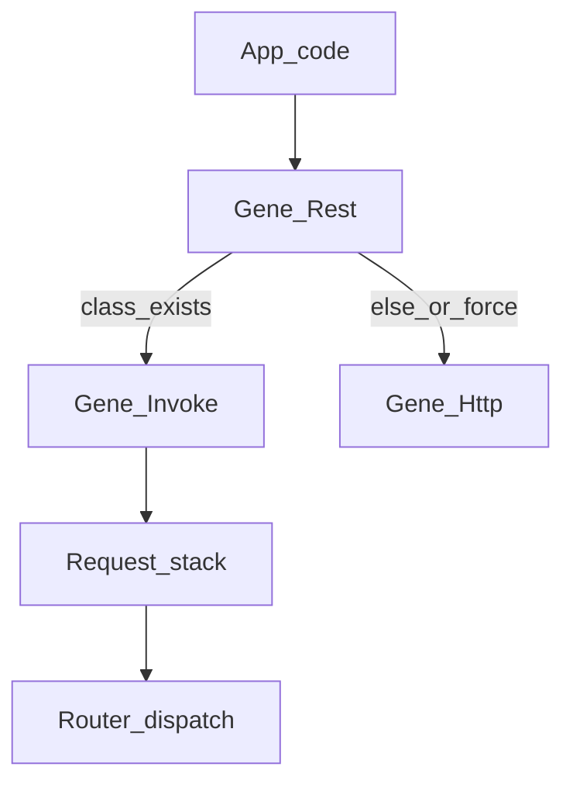

# Gene 框架级 REST 互调

> 基线：Gene **6.1.x**。`Gene\Http` / `Context` / `cleanup()` 已按 [lifecycle-completeness.md](lifecycle-completeness.md) 落地。  
> 定位：补齐**进程内隔离调用**与**命名出站 REST**，同一套 API 覆盖 **FPM/CLI** 与 **Swoole 协程**，请求级生命周期、无业务语义。  
> 本文只写扩展：`src/`、ide-helper、`test/`、`demo/`、`gene-ai-helper`。不写业务仓库迁移。

---

## 一、为何立项

业务侧反复出现同一模式（证据在典型用法，不把那些项目的类下沉到扩展）：

1. **同进程优先**：`api_path` 能落到本进程 `Api\{Class}::{action}` 时直接调方法，否则才 HTTP。
2. **本地调用污染入站 Request**：用 `Request::init` 覆盖 GET/POST/FILES，调用结束不恢复；嵌套互调串参；Swoole 下还会脏到下一请求。
3. **出站样板**：每项目自研 curl，FPM 尚可、Swoole 会堵 worker；无请求内 keep-alive、无统一 multipart。
4. **共享可变客户端**：DI `instance=true` 上写 `serviceName`，协程交错不安全。

框架已有：`Http::request`（双后端）、`Router::dispatch`、`Controller::forward`（不切 Request）、请求级 `gene_request_context`。缺的是 **Request 栈**、**隔离 Invoke**、**命名 Rest 句柄**。



---

## 二、原则

1. **无业务语义**：不做注册中心、app_key、签名、`api_param` 映射、业务信封 `code`、httpmq/队列、熔断、服务发现。
2. **一套 API，两种运行时**：`runtime_type < 2`（FPM/CLI）与 `>= 2`（Swoole）行为一致；Swoole **禁止**阻塞 `curl_exec`。
3. **状态一律请求/协程级**：进 `gene_request_context`；FPM 靠 RSHUTDOWN；Swoole 靠每请求 `cleanup()`。禁止模块全局、禁止 worker 级 Rest 游标。
4. **本地路径不发 HTTP**；远程路径只走已有 `Gene\Http`。
5. **可覆盖应用互调，但不实现应用**：能力清单以「应用还能否自己写薄门面」为验收，不在扩展里复刻网关。

---

## 三、能力必须覆盖的应用需求（反推，非实现清单）

应用门面（`init(app)->call/sync/uploadFile`、Redis 节点、鉴权）仍由应用写。框架需让门面只剩「查元数据 + 调下面 API」：

| 应用需要 | 框架能力 |
|----------|----------|
| 同机 `Api\*` 热路径 | `Invoke::local` / `Rest::call` 本地枝 |
| 本地结束后外层 Controller 仍读原 Request | Request 快照栈，异常也 restore |
| 跨机 `base_url + path` | `Rest::http` → `Http::request` |
| JSON POST / 上传文件 | `json` + **multipart `files`** |
| 超时 / SSL / 内网 HTTP | 调用级 + 命名服务默认值 |
| 透传排障 ID | 可选合并入站 `X-Request-Id` / Context `request_id` |
| `$this->rest` DI 单例 + 连续 `init(A)/init(B)` | **不可变 proxy**，无共享可变当前服务 |
| FPM 短请求 + Swoole worker 复用 | 句柄与栈随 ctx 销毁 |
| 异步 `sync` / 计划任务 | **不做**；应用队列消费时再调同一 `call` |
| 网关鉴权 / 注册表 | **不做** |

覆盖即止：应用能删掉自研 curl 与 `Request::init` 覆盖，不必改扩展才能接队列。

---

## 四、运行时与泄漏约束

### 4.1 双模式

| | FPM / CLI (`runtime_type < 2`) | Swoole (`>= 2`) |
|--|-------------------------------|-----------------|
| 出站 | PHP `curl_*`，`ctx->http_curl` 请求内 `curl_reset` 复用 | `Swoole\Coroutine\Http\Client`；`keep_alive` 按 `host:port:ssl` 存在 **当前协程 ctx** |
| 本地 | 同；Request 栈在当前 request ctx | 同；ctx 必须是协程隔离（已有模型） |
| 结束 | RSHUTDOWN → `free_fields`：弹空栈、dtor curl | 请求末 **`Application::cleanup()`**：同上 + 协程 Client 全部释放 |
| 禁止 | 把 Rest「当前服务」放模块全局 | 裸 curl、跨请求/跨协程复用 Client、本地调用后不 restore |

### 4.2 内存与安全（必须测）

- Request 栈深度 **上限 8**；超限失败，不无限 push。
- `snapshot`/`restore` 成对：`zend_try` 统一出口；`free_fields` 若栈非空则循环 restore（防异常/提前 return）。
- snapshot 只拷贝 get/post/files/request/header/raw；**不替换** cookie/server（本地互调不是伪造整请求）。
- `Invoke::local` **每次 new Controller**（`Factory::create(..., false)`），禁止单例 Controller 残留属性。
- 与 `forward` 深度分开计数或共用上限（建议 Invoke 自计，超限抛 Exception，与 Http 一致）。
- `Http` 调用期间 `http_body_buf` / `http_header_buf` 仍仅栈上有效；嵌套 `Http::request` 若出现，须可重入或明确禁止（建议：**禁止 Rest 本地枝内再重入同一 curl 回调脏 buf**；本地枝不走 Http，远程枝串行即可）。
- DI `instance=true` 的 `Gene\Rest`：**配置只读**；`use('name')` 返回新 proxy，不写回共享实例。

### 4.3 并发

- 一请求内多次 `http`：FPM 复用一只 curl；Swoole `keep_alive=true` 复用同 peer Client。
- 不做跨请求连接池（与现网 Http 文档一致）。
- POST 默认 **不重试**（防写放大）；GET/HEAD 仍用现有 `retry` 规则。

---

## 五、API 规格

### 5.1 `Gene\Request` 栈

```php
\Gene\Request::snapshot(): int;   // 返回新深度
\Gene\Request::restore(): bool;   // 栈空则 false
\Gene\Request::scope(array $get, array $post, ?array $files = null, ?array $request = null): void;
```

- `scope` 只改入参袋；`$request === null` 时按现 `init` 规则合并 get+post。
- 文档：业务互调应走 `Invoke`/`Rest`，不要自己 `init` 整包覆盖。

### 5.2 `Gene\Invoke`

```php
\Gene\Invoke::local(string $class, string $action, array $params = [], array $files = []): mixed
```

1. 深度 +1，超限抛 Exception。  
2. `snapshot` + `scope($params, $params, $files, $params)`。  
3. `Router::dispatch($class, $action, [])`（动作从 Request 取参，兼容现有 Api Controller）。  
4. `finally`：`restore`，深度 -1。  
5. 只返回 action 返回值，不改全局输出。

与 `Controller::forward`：**forward** 把 `$params` 当方法参数、不切 Request；**Invoke** 切 Request。两者都保留。

### 5.3 `Gene\Rest`

构造只收**无业务**配置：

```php
$config->set('rest', [
    'class' => '\Gene\Rest',
    'params' => [[
        'timeout' => 5,
        'connect_timeout' => 2,
        'ssl_verify' => true,
        'keep_alive' => true,
        'headers' => ['Accept' => 'application/json'],
        'pass_request_id' => true,
        'services' => [
            'user' => [
                'base_url' => 'http://127.0.0.1:8081',
                'local' => 'Api\\',   // 空则只 HTTP
                'timeout' => 8,
            ],
        ],
    ]],
    'instance' => true,
]);
```

```php
$rest->use('user'): Gene\Rest;   // 新 proxy，共享只读配置
$rest->local(string $class, string $action, array $params = [], array $files = []): mixed;
$rest->http(string $method, string $path, array $options = []): array;
$rest->call(string $class, string $action, array $params = [], array $options = []): mixed;
```

- `http`：`base_url` + path（path 必须以 `/` 开头）；`options` 对齐并扩展 `Http::request`（`json`/`body`/`headers`/`files`/`timeout`…）。返回 `{status, headers, body}`；`options['decode']===true` 时对 body 做 `Gene\Json` 解码（失败不吞，抛或 status 保留 + body 原样，建议抛）。
- `call`：`class_exists` 且 `method_exists`（或可 dispatch）→ `local`；否则要求 `options['path']` + 当前服务 `base_url` 走 `http`。不猜测 URL。
- `pass_request_id`：若 Context/`Request` 已有 id，合并到出站 header，不覆盖调用方已设的同名头。
- **无** `__call`、无 `init(app_key)`：避免和业务门面同名抢语义。

实现：C 类或 C 栈 + 薄 PHP 均可；热路径（栈、dispatch、Http）必须在 C。Rest 配置解析可 C。

### 5.4 `Gene\Http` 增量

在现有 `request($options)` 上增加 **`files`**：`array<string, string|array>`（路径或 `['tmp_name','name','type']`），与 `json` 互斥，走 multipart。FPM：`CURLFile`；Swoole：Client 等价上传 API。缺此则应用上传仍会自造 curl。

---

## 六、文件与落地顺序

| 顺序 | 项 | 位置 |
|------|----|------|
| 1 | Request 栈 + `free_fields` 排空 | `src/http/request.c`、`src/gene.c`、`gene.h` |
| 2 | `Gene\Invoke` | 新 `src/http/invoke.c` 或挂 `router.c` |
| 3 | `Gene\Rest` + 只读 proxy | 新 `src/http/rest.c` |
| 4 | Http `files` | `src/http/http.c` |
| 5 | ide-helper、`reference.md`、SKILL 出站约定 | 禁止互调再裸 curl |
| 6 | 测试 / demo | 见下 |

**测试（必须双模式意识）**

- `test/RestInvokeTest.php`：外层已 `init` 真实入站 → 内层 `local` 改参 → 返回后外层 Request 不变；内层抛异常同样还原；深度超限。
- `test/HttpClientTest.php`：multipart；`decode` 行为。
- Swoole：有环境则跑「调用后 `cleanup()`，下一协程 Request/Http 句柄为空」；无环境 SKIP，禁止假绿。
- 嵌套 8 层 + 中途 Exception，无泄漏（Windows 以 PHP 用例为准；ASAN 跟现有 audit 节奏）。

**demo**：`Api\Ping::pong` + CLI `Rest->use('demo')->call(...)`，配置写死 `base_url`，无 Redis。

---

## 七、刻意不做

注册中心、加权选节点、鉴权、业务 code、异步投递、跨请求连接池、熔断、HTTP/2 专项、并行 fan-out、SSE/MCP 客户端解析、魔术方法服务调用。

---

## 八、与生命周期文档的关系

[lifecycle-completeness.md](lifecycle-completeness.md) §3.1 的 `Gene\Http` 是运输层。本文是其上的 **互调原语**（隔离本地 + 命名客户端）。不重复实现第二套 HTTP 后端。
