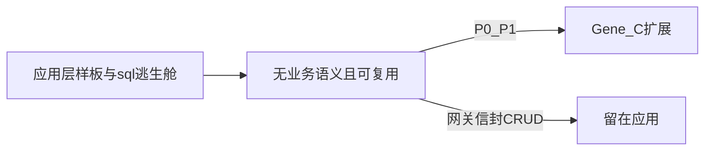
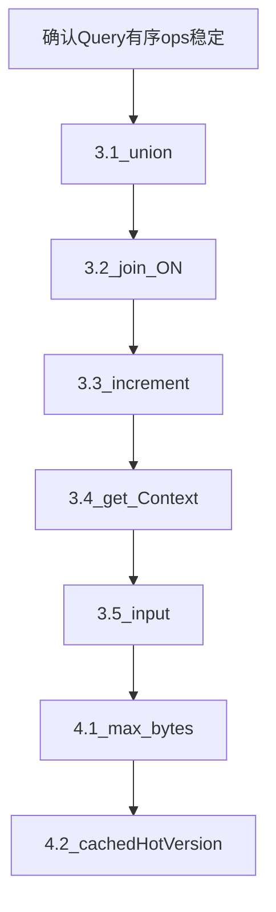

# 典型用法驱动：Gene 6.1 后续增强

> Gene 版本基线：**6.1.x（ORM v2、生命周期原语、REST 互调已落地）**。  
> 交叉引用：[orm-v2.md](orm-v2.md) · [lifecycle-completeness.md](lifecycle-completeness.md) · [rest-invoke.md](rest-invoke.md) · [audit/plan/PLAN.md](../audit/plan/PLAN.md)  
> **立项依据**：典型 Web 应用在全面采用 6.1 能力后，仍反复出现的样板代码、`sql()` 逃生舱与 FPM/Swoole 分叉——且**无业务语义**、多项目可复用。

**方案定位**：补齐 ORM / 请求态 / 出站 HTTP / 版本缓存 上「Db 已有或文档已约定、但 Query / MVC 未闭合」的薄 API。**不是**网关注册表、业务 CRUD 基类、厂商 SDK、FULLTEXT 报表下沉。

本文只写 **Gene 扩展规格、实现约束与验收**，不含任何业务仓库迁移清单，不出现具体产品或项目名。

---

## 零、与已落地能力的关系

6.1 已闭合的能力矩阵（应用侧常见「还没用满」项见 §二末，**不重复立项**）：

| 领域 | 已落地（6.1） | 本文要补 |
|------|---------------|----------|
| ORM 读 | `query()->where/join/in/paginate/lockForUpdate`、`findMany` | `union` 透出、JOIN ON 字符串、原子 `increment` |
| ORM 写 | `createMany` / `upsert` / `toggle` | 表达式 `col=col+?` |
| 入站 | `Request::json()`、`rawContent()` | 默认 JSON→POST 合并、`Request::input()` |
| 请求态 | `Gene\Context`、`Log` 合并 `request_id` | `__get` 回退读 Context |
| 出站 | `Http::request` / `multi` / `files` | `max_bytes` 下载中止 |
| 缓存 | `cachedVersion` / `localCachedVersion` | `cachedHotVersion` 运行时分流 |
| 互调 | `Invoke::local`、Request 栈 | —（应用改门面即可） |



---

## 一、筛选原则

### 1.1 纳入

- 多项目会再写一遍（重复 ≥3 或热路径）。
- FPM / Swoole **同一套 API**，行为由扩展保证。
- 不绑定租户、支付、LLM、厂商协议、业务错误码信封。

### 1.2 不纳入（应用自研门面）

| 模式 | 原因 |
|------|------|
| 带 Redis 注册表 / 权限缓存的 REST 网关 | 有业务语义；同进程互调应切 `Invoke::local`（见 [rest-invoke.md](rest-invoke.md)） |
| 出站 HTTP 再包 `ok/code/data` 信封 | 各项目响应形状不同 |
| 带 `versionTable` 的业务 CRUD 基类 | 版本键命名与字段格式化属业务 |
| FULLTEXT、多层报表子查询、复杂统计 | 方言重；重复度不足以支撑通用薄 API |
| 支付 / 公众号 / 第三方 SDK | 协议与签名属业务 |

### 1.3 已有能力、应用未用满（文档约定 + 应用收口，**不立项**）

| 框架已有 | 应用常见替代 | 收口动作 |
|----------|--------------|----------|
| `Http::multi` | 自研 `curl_multi` 类 | 并行出站改 `multi`；Swoole 无 Native CURL 时接受顺序降级 + `E_NOTICE` |
| `Http::request` 的 `files` | multipart 原生 curl 回退 | 上传分支改 `files` 选项 |
| `findMany` / `Query::in` | 循环 `find($id)` 或全表过滤 | Model 列表批量读 |
| `Invoke::local` | 本地互调 `Request::init` 覆盖入站 | 网关 `localCall` 改 `Invoke::local` + Request 栈 |

---

## 二、典型缺口（用法模式证据）

以下模式在采用 6.1 ORM + Http + Context 的典型应用中仍反复出现；证据为**可复现的 SQL / 钩子 / HTTP 形态**，不绑定具体仓库。

```text
双向关系列表     SELECT ... UNION SELECT ... 去重（好友、会话对手）
JOIN 条件扩展    LEFT JOIN t ON a.id=b.id AND b.flag=0（未读/有效态挂在 ON）
计数器更新       UPDATE t SET hit_count = hit_count + 1 WHERE ...
请求用户双写     Context::set('user') + Di::set('user') 供 $this->user
JSON 三次合并    FPM 钩子 init + Swoole 入口 init + 应用 input() 再 merge
下载体积防护     先收全 body 再 strlen，超限才失败
缓存运行时 if    FPM 用 localCachedVersion，Swoole 用 cachedVersion
```

| 6.1 已有 | 缺口 |
|----------|------|
| `Db::union()` | `Query` 未透出；ORM 列表仍 `sql()` |
| `Db::join($table, array $on)` | ON 仅列等值；带 `AND flag=?` 仍裸 SQL |
| `Query::update(['col'=>v])` | 无 `col = col + ?` |
| `Context::set/get` | `Controller/Service::__get` 不读 Context |
| `Request::json()` | 无统一 `input()`；JSON 合并靠应用钩子 |
| `Http::request` | 无传输层 `max_bytes` 中止 |
| `localCachedVersion` + `cachedVersion` | 无按运行时分流的薄封装 |

---

## 三、P0 — 不补则应用继续 sql() / 双写

### 3.1 `Query::union` / `unionAll`

**用法模式**：双向关系去重列表（A→B ∪ B→A），或同构子查询合并。

**现状**：四驱动 `Db::union($query, $all = false)` 已实装；`Gene\Orm\Query` 无对应 op。

**规格**

```php
$q1 = User::query()->fields('friend_id')->where('user_id', $uid);
$q2 = User::query()->fields('user_id AS friend_id')->where('friend_id', $uid);
$list = $q1->union($q2)->order('friend_id')->all();
// unionAll($q2) 等价 Db::union($sql, true)
```

- Query `ops` 新增 `union` / `unionAll`：参数为**另一条已构建的 Query** 或**已冻结的子查询 SQL + 绑定**（二选一，优先 Query 对象）。
- 共享同一 Db 句柄时：子 Query **不得**交错执行；`apply()` 前将子 Query **物化为 `(sql, binds)` 克隆**，再 `Db::union()`。
- 终端：`all()` / `row()` / `cell()` / `paginate()` 在含 union 时按 Db 拼装顺序执行（`... group having union order limit lock`）。
- **限制**：`update()` / `delete()` 与 union 互斥，调用即抛异常（与 join 一致）。
- Sqlite / Pgsql / Mssql 语义对齐现有 Db `union`；无 union 的驱动在 `apply()` 时抛清晰异常。

**测试**：双分支 UNION 去重；绑定参数不串；子 Query 多 where/join 不丢；与 `lockForUpdate` 组合（若 Db 支持）。

**收益**：热点关系列表去掉裸 `sql()`，绑定与标识符引用与 join 路径一致。

---

### 3.2 JOIN ON 非等值 / 附加谓词

**用法模式**：

```sql
LEFT JOIN message m ON m.from_user = c.to_user AND m.is_read = 0
```

未读计数、有效记录过滤、游标条件常挂在 **ON** 而非 WHERE。

**现状**：`join($table, array $on, $type)` 仅 `leftCol => rightCol` 等值 AND；Query 与 Db 同限制。

**规格**

```php
// 形式 A：保持现有数组等值（不变）
$q->join('msg m', ['m.from_user' => 'c.to_user'], 'LEFT');

// 形式 B：原始 ON 片段 + 绑定（新增）
$q->join('msg m', 'm.from_user = c.to_user AND m.is_read = ?', [0], 'LEFT');
```

- **先改 Db 四驱动**，再 Query 透出；避免 ORM/Db 分叉。
- 字符串 ON：**仅允许占位符 `?`** 与用户数据绑定；表名/列名由调用方写死标识符（与 `where` 字符串分支一致），**不**自动引用用户输入片段。
- 数组 ON 与字符串 ON **不可混在同一 `join()` 调用**；多次 `join()` 仍按调用顺序累加。
- `update()` / `delete()` 不支持 join（已有约束保持）。

**测试**：ON 附加谓词 + GROUP BY 聚合计数；注入负例（用户片段进 ON 无绑定应拒绝或文档禁止）；多 join 顺序。

**收益**：聚合计数热路径可走 Query，减少手写 SQL 与表别名错误。

---

### 3.3 原子增量 `increment` / `decrement`

**用法模式**：`hit_count = hit_count + 1`、浏览量、配额、库存（无业务锁语义时）。

**现状**：仅 `update(['col' => $v])` 全量赋值；应用用 `sql('UPDATE ... SET col = col + 1')`。

**规格**

```php
// Query 终端前
static::query()->where('hash_key', $key)->increment('hit_count');
static::query()->where('id', $id)->decrement('stock', 2);

// 可选语法糖
static::incrementBy(['hash_key' => $key], 'hit_count', 1);
```

- 列名 **白名单**：`[A-Za-z0-9_.]`，否则抛异常。
- 生成 `SET \`col\` = \`col\` + ?`（decrement 为 `- ?`）；**不**实现任意 `SET expr`（防 SQL 注入）。
- 惰性执行语义与 `update()` 一致；`affectedRows()` 触发执行。
- 可与 `lockForUpdate()` + 事务组合（应用负责事务边界）。

**测试**：正负步长；非法列名；与 `where`/`in` 空数组（0 行更新）；事务回滚后计数不变。

**收益**：去掉表达式 `sql()`；与行锁路径一致。

---

### 3.4 `__get` 回退 `Gene\Context`

**用法模式**：认证钩子 `Context::set('user', $row)`，但 `$this->user` 经 `Controller` / `Service` `__get` 只查 Di，导致 **Context + Di 双写**。

**规格**

- `Gene\Controller`、`Gene\Service`、`Gene\Hook` 的 `__get($name)`：
  1. 先走现有 Di / 配置组件解析；
  2. **未命中**时 `Context::get($name, null)`，非 null 则返回。
- **禁止**把 Context 键自动注册进 Di（避免 Swoole worker 脏写）。
- Context 仍请求级；FPM `RSHUTDOWN` / Swoole `cleanup()` 清空。
- 若 Di 与 Context 同名且 Di 有值：**Di 优先**（配置组件不被请求态覆盖）。

**测试**：仅 Context 有 `user` 时 `$this->user` 可读；Di 有 `db` 时不读 Context；请求结束 Context 清空后 `__get` 失败；嵌套 `Invoke::local` 栈内 Context 隔离（与现有 Request 栈一致）。

**收益**：应用只写 Context；去掉双写与漏 `Di::set` 导致属性为空。

---

### 3.5 入站 JSON 一次语义：`Request::input()` + 可选默认合并

**用法模式**：

1. FPM：`before` 钩子检测 `application/json`，`Request::init` 把 `json()` 并进 POST；
2. Swoole：入口再次合并；
3. 应用封装 `input()`：`request()` + `json()` 第三次 merge。

同一 body 可能 **解析两次**；FPM/Swoole 行为靠复制逻辑维持一致。

**规格**

```php
// 新增
\Gene\Request::input();  // request() 与 json 数组合并，json 字段覆盖同名键

// 可选配置（config 或 ini，名待定，默认建议 false 保兼容）
// merge_json_post = true 时，在 run/init 路径上：
//   Content-Type 含 application/json → 合法 json 合并进 POST（非法 json 保持原 POST）
```

- `Request::json()` 语义不变；`rawContent()` **禁止**被合并逻辑修改（webhook 验签）。
- 默认 **关闭**自动合并，避免破坏依赖「POST 为空、仅从 raw 读」的旧应用；demo 与文档推荐开启。
- Swoole `public/swoole.php` 与 FPM `Application::run` **共用同一合并函数**（C 层或内部静态方法），消除双份 PHP 钩子。

**测试**：GET+JSON POST 合并；非法 JSON 不抛致命错误；`rawContent` 与合并前一致；`input()` 覆盖顺序；验签用例 POST 仍为空。

**收益**：应用删除重复钩子；FPM/Swoole 行为由扩展保证。

---

## 四、P1 — 性能与运行时对等

### 4.1 `Http::request` 的 `max_bytes`

**用法模式**：应用封装 `download($url, $max)` 先 `Http::request` 收全 `body`，再 `strlen` 判断，大文件浪费带宽与峰值内存。

**规格**

```php
$r = \Gene\Http::request([
    'method' => 'GET',
    'url' => $url,
    'max_bytes' => 52_428_800,  // 超限中止
]);
// 超限：status=0 或 4xx 文档约定 + error='body_too_large'，body 截断为空
```

- curl：`CURLOPT_WRITEFUNCTION` 累计字节，超限返回非 0 中止传输。
- Swoole `Coroutine\Http\Client`：读 body 循环同样截断。
- 与 `stream`、`sse`、`discard_body` 互斥规则写入 ide-helper（互斥时抛异常或文档禁止）。
- 不替代应用层病毒扫描；仅传输层体积护栏。

**测试**：未超限完整 body；超限提前中止；与 `ssl_verify`/`timeout` 组合；Swoole 顺序路径（无 curl）同样生效。

**收益**：任意出站下载的通用防护与更低峰值内存。

---

### 4.2 `Cache::cachedHotVersion`（运行时分流）

**用法模式**：

```php
if (\Gene\Application::getRuntimeTypeName() !== 'swoole') {
    return $this->cache->localCachedVersion(...);
}
return $this->cache->cachedVersion(...);
```

后台菜单、权限树等读多写少实体，FPM 希望 APCu L1，Swoole 禁止写 Memory / 可变数据不进进程缓存。

**规格**

```php
$this->cache->cachedHotVersion($obj, $args, $versionField, $ttl = null);
```

- `runtime_type < 2`（FPM/CLI）：`localCachedVersion`（APCu L1 + 外部版本键）。
- `runtime_type >= 2`（Swoole）：**仅** `cachedVersion`（不写 `Gene\Memory`，不调 `localCachedVersion`）。
- **不改变** `cachedVersion` / `localCachedVersion` 各自默认语义。
- 参数签名与 `cachedVersion` 一致，便于替换一行调用。

**测试**：FPM 双次调用命中 APCu；Swoole 不写 APCu；版本 bump 后两层均失效。

**收益**：热读路径去掉运行时 `if`；与「Swoole 可变数据不进 Memory」文档一致。

---

## 五、明确不做

| 诉求 | 原因 |
|------|------|
| `Gene\Rest` + Redis 注册表 / 服务发现 | 业务语义；本地路径已有 `Invoke::local` |
| ORM FULLTEXT / 多层报表子查询 | 方言重；通用薄 API 性价比低 |
| `Http::postJson` 返回业务信封 | 保留 `request()` 原始结构 |
| 事务 commit 后自动 `updateVersion` | 用户态 3 行；缓存键命名属业务 |
| 路由级中间件管道 | 审计项 F4；缺回归前不改派发链 |
| 队列 / 迁移 / 云 SDK | 刻意不做（见 lifecycle-completeness §五） |

---

## 六、实现约束

与 [plan/README.md](README.md) 及已落地三篇保持一致：

1. C 层只加上文 P0/P1；每项需 `test/*.php` 用例。
2. **Db 惰性写语义不变**；`increment` 由 `affectedRows()` 触发。
3. Query 仍用**有序 ops**；`union` / 字符串 `join` 不得破坏「构建 → 执行 → 丢弃」一次性语义。
4. 字符串 ON、`union` 子查询必须有**绑定测试与注入负例**。
5. `__get` Context 回退：Di 优先、请求结束清空、不与 Di 注册冲突。
6. 同步 `gene-ide-helper/Gene/**/*.php` 与 `gene-ai-helper/skills/gene-framework/reference.md`。
7. 本文**不写**业务迁移步骤；demo 仅增加最小可回归示例（可选）。

---

## 七、优先级总览

| 优先级 | 能力 | 编码效率 | 性能 / 正确性 |
|--------|------|----------|----------------|
| P0 | `Query::union` / `unionAll` | 砍掉双向关系裸 SQL | 绑定一致、少拼接错误 |
| P0 | JOIN 字符串 ON + 绑定 | 砍掉 ON 谓词裸 SQL | 热路径少一次手写 |
| P0 | `increment` / `decrement` | 砍掉表达式 UPDATE | 原子计数正确 |
| P0 | `__get` → Context 回退 | 去掉 Context/Di 双写 | 少请求态 bug |
| P0 | `Request::input` + 可选 JSON→POST | 去掉三份合并逻辑 | 少重复解析 |
| P1 | `Http` `max_bytes` | 删掉应用层 strlen 护栏 | 降峰值内存与带宽 |
| P1 | `cachedHotVersion` | 去掉运行时 if | FPM L1 命中、Swoole 安全 |

---

## 八、建议实施顺序



1. **3.1–3.3** 同属 ORM/Db 链，可同一里程碑（共享 Query `apply` 与 Db 驱动改动）。
2. **3.4–3.5** 属请求生命周期，与 MVC 入口耦合，需 FPM + Swoole 双模式测试。
3. **4.1–4.2** 独立，可在 ORM 里程碑后并行。

**状态**：本文档为 **6.2 候选立项稿**；实现后在本表与 [README.md](README.md) 标为已落地并补充复盘节（仿 orm-v2 §八）。
