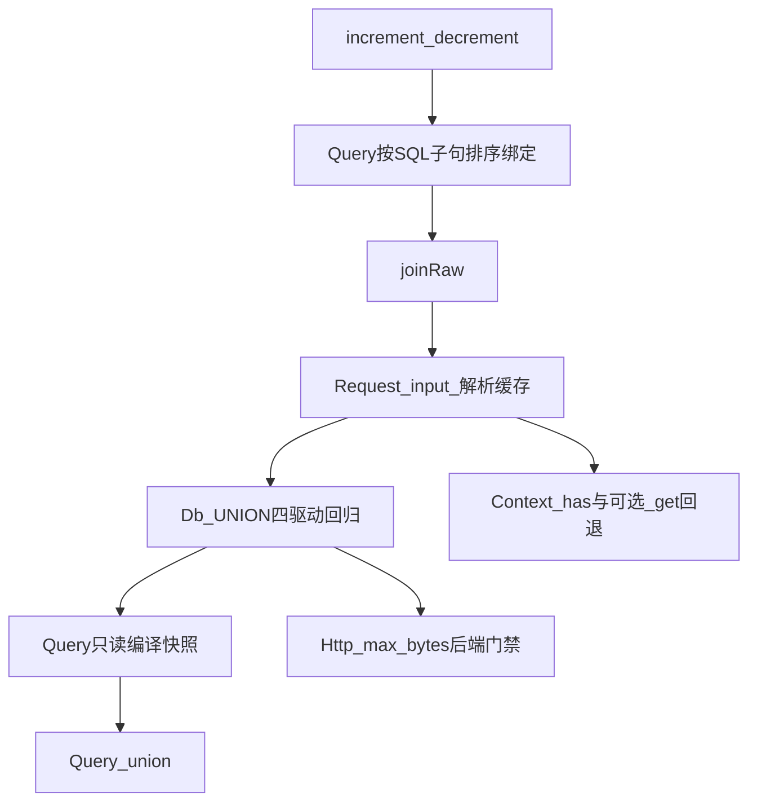

# 典型用法驱动：Gene 6.2 候选增强（源码复核版）

> Gene 版本基线：**6.1.x（ORM v2、生命周期原语、REST 互调已落地）**。  
> 交叉引用：[orm-v2.md](orm-v2.md) · [lifecycle-completeness.md](lifecycle-completeness.md) · [rest-invoke.md](rest-invoke.md) · [audit/plan/PLAN.md](../audit/plan/PLAN.md)  
> 立项依据：典型 Web 应用采用 6.1 后仍反复出现、无业务语义且可跨项目复用的样板代码或 `sql()` 逃生舱。

**方案定位**：优先补齐 ORM 安全写、JOIN 条件和统一输入；UNION、Context 魔术属性和下载限额在满足各自前置条件后再落地。不把“少写一行分支”直接等同于框架能力或性能收益。

本文只写 Gene 扩展规格、约束和验收，不包含业务仓库迁移清单。

---

## 零、源码复核结论

原稿方向基本正确，但不能按原优先级直接施工。源码事实要求做以下修正：

| 候选能力 | 复核结论 | 调整 |
|----------|----------|------|
| `increment/decrement` | 通用、可消除非原子“读后写”和表达式裸 SQL | **P0，保留** |
| JOIN ON 附加谓词 | 通用，但新增 JOIN 绑定会与当前“WHERE 先入参、JOIN 后入参”的重放顺序冲突 | **P0，先修绑定顺序** |
| `Request::input()` | 能统一 FPM/Swoole，并可做到 JSON 每请求最多解析一次 | **P0，只做显式 input，不自动改 POST** |
| `Query::union/unionAll` | 有价值，但 `count/paginate`、共享 Db 句柄、分支括号和绑定快照都不是薄透出 | **P1，先补编译/方言前置** |
| `__get` 回退 Context | 可减少双写，但 DI 本身已是请求级；还存在名称碰撞和隐式依赖 | **P1，可选便利能力** |
| `Http::request(max_bytes)` | curl 可提前中止；当前 Swoole Client `execute()` 后才取得完整 body，无法兑现同等内存保证 | **P2，按后端能力门禁** |
| `cachedHotVersion` | `localCachedVersion` 用 APCu，不是 `Gene\Memory`；运行时分流既不新增缓存语义，也不消除版本查询 | **不进入 C 层** |

### 0.1 科学性判断

- **能力缺口覆盖**：优化后可覆盖最常见的表达式更新、带值 JOIN、JSON 输入和部分复合查询缺口。
- **应用复杂度**：前三项能实质删除应用层 SQL/合并代码；Context 回退只是便利语法；缓存分流仅省一个 `if`，不值得扩展公共 API。
- **性能**：原子增量可由“读 + 写”降为一次 UPDATE；JSON 解码缓存可避免重复解析；JOIN/UNION 主要提升正确性和可维护性，不能无基准宣称 SQL 本身更快。
- **运行时一致性**：输入和 ORM 可保证 FPM/Swoole 同语义；下载限额在当前 Swoole 后端不能假装具备提前中止能力。
- **兼容性**：不改变现有 `post()`、`request()`、`join()`、缓存方法和 DI 优先级；新增能力均为显式调用。

### 0.2 立项门槛

每项进入实现前必须同时满足：

1. 至少 3 个独立重复用法，或明确位于热路径/正确性路径。
2. API 不携带租户、权限、业务错误码、厂商协议等业务语义。
3. 能写出失败语义、方言差异、生命周期和可自动化验收。
4. 性能收益区分“少写代码”“少一次网络/SQL”“少内存峰值”，不得混写。

---

## 一、已有能力与边界

| 领域 | 6.1 已有 | 6.2 候选 |
|------|----------|----------|
| ORM 读 | `where/join/in/paginate/lockForUpdate/findMany` | `joinRaw`、受控 `union/unionAll` |
| ORM 写 | `createMany/upsert/toggle/update` | 原子 `increment/decrement` |
| 入站 | `request/post/json/rawContent` | 显式 `input` + JSON 解码缓存 |
| 请求态 | 请求级 DI、`Context`、`cleanup` | 可选的 MVC `__get` 回退 |
| 出站 | `Http::request/multi/files/stream` | 有能力门禁的 `max_bytes` |
| 缓存 | `cachedVersion/localCachedVersion/*Batch` | 不新增运行时分流别名 |
| 互调 | `Invoke::local`、Request 栈 | 不重复立项 |

### 1.1 已有能力只需应用收口

| 已有能力 | 应用动作 |
|----------|----------|
| `Http::multi` | 并行出站替换自研 `curl_multi`；Swoole 无 Native CURL 时接受已约定的顺序降级 |
| `Http::request(files)` | 上传统一走 multipart 选项 |
| `findMany` / `Query::in` | 替换循环 `find` 和全表后 PHP 过滤 |
| `Invoke::local` | 替换本地调用前后手工 `Request::init` |
| `cachedVersionBatch` | 批量热读先使用现有批量 API，不新增同义入口 |

### 1.2 明确留在应用层

REST 注册表、业务 CRUD 基类、版本键命名、业务响应信封、FULLTEXT/复杂报表、支付/公众号/云厂商 SDK 均不下沉。

---

## 二、P0：高复用且能闭合正确性

## 2.1 原子增量 `increment/decrement`

### API

```php
$affected = User::query()
    ->where('hash_key', $key)
    ->increment('hit_count');

$affected = Product::query()
    ->where('id', $id)
    ->where('stock', '>=', 2)
    ->decrement('stock', 2);
```

### 规格

- `increment(string $column, int|float $amount = 1): int` 和 `decrement(...)` 是 **Query 终端方法**，与当前 `Query::update()` 一样立即返回影响行数。
- `$column` 使用现有 `gene_orm_valid_ident()`；由驱动按自身方言引用，禁止任意 SET 表达式。
- `$amount` 必须是有限正数；方向由方法名决定，避免 `increment(-1)` 与 `decrement(-1)` 双重语义。
- 必须复用 `update/delete` 的“至少一个有效 where/in”保护；`in([])` 返回 0 且不发 SQL。
- 新增 Db 对称能力，或增加四驱动共用的内部 arithmetic-update helper；不得让 Query 手拼 MySQL 反引号。
- 不自动更新版本缓存；版本键是业务语义，仍由应用在成功写入和事务提交后更新。
- 不宣称防止库存为负；应用应把下界放进同一 UPDATE 的 WHERE，并检查 `$affected === 1`。
- `lockForUpdate()` 不能与该 UPDATE 在同一 Query 链生效。需要“先读后决策”时，由应用在事务中先执行独立的锁定 SELECT。

### 验收

1. 正常增减、小数（驱动支持的数值列）、非法列名、0/负数/非有限步长。
2. `where([])`、`where('')` 抛出；`in([])` 安全返回 0。
3. 条件库存更新只允许一次成功，避免丢失更新。
4. 事务回滚后值不变；返回值为影响行数。
5. MySQL/Sqlite/Pgsql/Mssql 至少做 SQL 生成测试；可用驱动做执行测试。

### 收益口径

- 正确性：避免应用“SELECT 当前值 → UPDATE 新值”的丢失更新。
- 性能：典型计数由两次数据库交互降为一次 UPDATE。

---

## 2.2 JOIN ON 附加谓词：`joinRaw`

保留现有安全、简单的等值数组 API：

```php
$q->join('message m', ['m.from_user' => 'c.to_user'], 'LEFT');
```

新增显式 raw 入口，避免在 `join()` 第三个参数现有 `$type` 上做类型重载：

```php
$q->joinRaw(
    'message m',
    'm.from_user = c.to_user AND m.is_read = ?',
    [0],
    'LEFT'
);
```

### 阻塞前置：修正绑定顺序

当前 Query 会先把数组 WHERE 送入 Db，再在第二遍重放 JOIN。现有 JOIN 无绑定所以没有问题；`joinRaw` 一旦带绑定，SQL 是 `JOIN ... ? WHERE ... ?`，参数却可能是 `[where, join]`。

实现前必须把 Query 编译/重放调整为 **SQL 子句顺序**：

```text
verb/SET → JOIN binds → WHERE/IN binds → GROUP/HAVING binds → UNION binds → ORDER/LIMIT/LOCK
```

同类子句内部仍保持调用顺序。不能仅在现有 `join()` 上多传一个数组。

### 规格

- `joinRaw(string $table, string $on, array $bind = [], string $type = 'INNER'): static`。
- Db 四驱动和 Query 同步提供；`join()` 原签名与行为不变。
- `$type` 继续使用现有白名单；空 `$on` 拒绝。
- `$on` 与 `where(string, bind)` 同属开发者可信 SQL 片段；只允许业务值来自 `$bind`。框架无法可靠判断字符串是否源于用户输入，不写“自动拒绝用户片段”这种不可验收承诺。
- `update/delete/increment/decrement` 与任何 JOIN 互斥，保持现有约束。

### 验收

1. JOIN 和 WHERE 同时含绑定，校验最终参数严格按 SQL 占位符顺序排列。
2. 多 JOIN 保持顺序；LEFT/RIGHT/INNER 方言正确。
3. 绑定值中的注入载荷不进入 SQL 文本。
4. 空 ON、非法 JOIN 类型、写操作组合均失败且不执行 SQL。
5. GROUP BY 聚合结果正确。

### 收益口径

减少 JOIN 聚合场景的裸 SQL 和别名错误；数据库仍执行等价 SQL，默认不宣称查询耗时下降。

---

## 2.3 统一输入 `Request::input()`

### API

```php
$all = \Gene\Request::input();
$name = \Gene\Request::input('name', '');
```

Controller 和 Hook 增加同签名代理，Service 可直接用 `Request::input()`。

### 合并语义

1. 先取现有 `request()`（GET + POST，POST 覆盖 GET）。
2. 从标准化 header 或 server 的 `CONTENT_TYPE` 读取媒体类型；为 `application/json` 或 `application/*+json` 且 body 非空时，解析顶层 JSON 对象。
3. JSON 字段覆盖 request 中的同名键。
4. 非 JSON Content-Type 不解析 body。
5. 空 body 等价无 JSON 字段。
6. 非法 JSON 或顶层非对象 **抛异常**，不得静默退回 POST；静默忽略会把损坏请求伪装成缺字段。

`Request::json()` 保持现有“对象或数组均返回、非法输入抛异常”的契约；`input()` 因需要键合并，只接受顶层对象。

### 实现约束

- 在 `gene_request_context` 增加解析结果和“未解析/成功/失败”状态，`json()` 与 `input()` 共用；同一 raw body 每请求最多解码一次，失败状态再次读取时仍抛出等价异常。
- `Request::init()` 设置新 raw body 时必须清除解析缓存；`clear()`、context reset/destroy 同步释放。
- 若未来 Request snapshot 会替换 raw body，解析缓存必须一并 snapshot/restore，或在切换时失效。当前 `Invoke::local` 不替换 raw body，不额外复制 Context。
- `rawContent()` 始终返回原始字节，不被 input 修改，保证 webhook 验签。
- **不增加自动 JSON→POST 配置**，也不在 `Application::run()` 修改 POST。显式 `input()` 已能统一 FPM/Swoole，自动改写会扩大兼容面并让 `post()` 语义依赖全局配置。

### 验收

1. GET、表单 POST、JSON 的覆盖顺序。
2. `application/problem+json` 等 `+json` 媒体类型。
3. 非法 JSON、标量、顶层列表、空 body、非 JSON body。
4. 连续调用 `json()/input()` 只解码一次；重新 `init()` raw 后不读旧缓存。
5. 合并前后 `rawContent()` 字节完全一致。
6. FPM 与 Swoole 初始化路径结果一致。

### 收益口径

应用删除 FPM Hook、Swoole 入口和自定义 input 三份合并代码；重复读取时避免重复 JSON 解码。

---

## 三、P1：有价值，但不是薄透出

## 3.1 `Query::union/unionAll`

### API

```php
$q1 = Relation::query()->fields('friend_id')->where('user_id', $uid);
$q2 = Relation::query()->fields('user_id AS friend_id')->where('friend_id', $uid);
$list = $q1->union($q2)->order('friend_id')->all();
```

公共 API 第一版只接受 `Gene\Orm\Query`，不接受裸 SQL 元组；需要裸 SQL 时继续显式使用 Db。

### 为什么不是简单新增一个 op

- 两个 Query 通常持有同一个请求级 Db 对象；编译子 Query 会改写该 builder 状态。
- 现有 Db `union(string)` 不合并绑定，`union(DbObject)` 才合并绑定。
- 各驱动对子分支括号、分支 `ORDER/LIMIT` 的接受度不同，现有实现缺少四驱动执行回归。
- 当前 `count()` 从基础表生成 `COUNT(*)`；直接附加 UNION 得到的是多行 count，而不是复合结果总数。
- `paginate()` 依赖正确的 count，因此不能沿用普通 Query 路径。

### 阻塞前置

1. 为 Query 增加内部只读编译结果 `{sql, params}`，编译后不执行且不残留 Db 状态。
2. 校验父子 Query 使用同一个 Db 句柄/连接配置；拒绝 self-union、环和超过 8 层嵌套。
3. 先补 Db 四驱动 UNION 执行测试，修正分支括号和绑定合并差异。

### 规格

- `union(Query $query): static`、`unionAll(Query $query): static`。
- 调用时冻结子 Query 的 table/fields/ops 快照，后续修改原 `$q2` 不改变父 Query。
- 第一版拒绝子分支自己的 `order/limit/lock`，只允许复合查询外层 `order/limit`，避免方言不一致。
- `update/delete/increment/decrement` 与 UNION 互斥。
- `lockForUpdate/sharedLock` 第一版与 UNION 互斥，不使用“驱动支持则测试”的模糊口径。
- `count/paginate` 必须按复合结果计数：

```sql
SELECT COUNT(*) FROM (<compound query without outer order/limit/lock>) gene_union_count
```

若某驱动无法可靠生成，第一版应明确让 `count/paginate` 抛异常，而不是返回错误数字。

### 验收

1. UNION 去重、UNION ALL 保留重复。
2. 父子 WHERE 均有绑定，参数不串；多分支绑定顺序稳定。
3. 子 Query 快照不受后续修改影响；父子 Query 终端调用后 Db 状态清空。
4. `all/row/cell/print`；`count/paginate` 要么正确计数，要么按明确限制抛异常。
5. self/cycle/depth、跨连接、写操作、锁、分支 order/limit 均有负例。
6. 四驱动 SQL 生成；Sqlite 至少执行 UNION 与分页回归。

### 收益口径

减少双向关系等复合列表的裸 SQL，提高绑定和方言一致性；不会减少数据库查询次数，默认不宣称性能提升。

---

## 3.2 MVC `__get` 回退 `Gene\Context`（可选）

### 事实修正

`ctx->di_regs` 已随请求/协程 context 清理，因此 `Di::set('user', ...)` 本身不是 worker 级脏写。问题是 Context 与 DI 双写可能遗漏或产生两个真相源，而不是 DI 跨请求泄漏。

### 规格

- 先为 Context 增加 `has(string $key): bool`，支持区分“不存在”和“显式 null”。
- `Controller/Service/Hook::__get($name)`：保持现有 class DI → global DI/配置解析；仅完全未命中时读取 Context。
- DI 优先，避免请求字段覆盖 `db/cache/request` 等组件。
- 不把 Context 键注册进 DI；Context 查找使用内部 helper，避免魔术属性再走一次用户态静态调用。
- Context 名称可能与组件冲突，文档推荐 `auth_user/tenant/request_id` 等明确键名。
- `Invoke::local` 只隔离 Request 参数袋，**Context 当前是同一请求内共享并继承**；内层修改会对外层可见。若未来需要隔离，必须单独设计 Context 栈，不能引用现有 Request 栈作为保证。

### 验收

1. 仅 Context 有值时三类基类均可读；显式 null 配合 `Context::has()` 行为稳定。
2. DI 与 Context 同名时 DI 优先，且配置组件只实例化一次。
3. context reset/cleanup 后不再可读。
4. Swoole 两协程隔离；`Invoke::local` 内外共享语义有显式测试。
5. 基准确认 DI 命中热路径没有新增 Context 查找。

### 取舍

该能力减少属性访问迁移成本，但增加隐式依赖。若实际重复不足 3 个项目，应只增加 `Context::has()`，应用显式调用 `Context::get()`。

---

## 四、P2：后端能力验证后再做

## 4.1 `Http::request(max_bytes)`

```php
$r = \Gene\Http::request([
    'method' => 'GET',
    'url' => $url,
    'max_bytes' => 52_428_800,
]);
```

### 可兑现的语义

- curl 后端：WRITEFUNCTION 在追加 body 和触发 stream 回调前累计字节；超过上限立即中止，返回 `status=0, error='body_too_large', body=''`。
- `body_too_large` 不重试；否则重试会重复消耗带宽。
- 与 `stream/sse` 互斥，避免调用方已经消费部分数据后又收到整体失败；可与 `discard_body` 组合并继续计数。
- `Content-Length` 只能提前拒绝，不能替代实际字节计数（分块、压缩或错误 header）。

### Swoole 限制

当前实现调用 `Swoole\Coroutine\Http\Client::execute()` 后读取完整 `body`，再按 8KB 伪分块。此路径只能事后 `strlen`，不能降低峰值内存或带宽。

因此第一版只能二选一：

1. Swoole 已启用 Native CURL hook 时，对 `max_bytes` 选择 curl 后端并真正提前中止；
2. 否则在发请求前抛出“不支持严格 max_bytes”的异常。

禁止在 Swoole Client 收完整 body 后仍宣称“传输层提前中止”。若未来 Swoole 提供可验证的响应 chunk callback，再接入同一契约。

### 验收

- 本地 server 分块持续发送，记录服务端已发送字节，证明客户端确实提前断开，而不只是最终 body 为空。
- 未超限完整返回；等于上限成功；超过 1 字节失败。
- redirect、retry、discard_body、压缩响应的计数口径明确。
- Swoole Native CURL 与无 Native CURL 两条路径分别验证；无环境必须 SKIP，不能假通过。

---

## 五、不进入 C 层：`cachedHotVersion`

不新增该方法，原因如下：

1. `localCachedVersion` 使用 APCu，不是 `Gene\Memory`；“Swoole 禁止写 Memory”不能推出“必须禁用 APCu”。
2. `localCachedVersion` 命中 APCu 后仍读取外部版本，因此运行时分流不会消除版本查询，只可能减少外部数据 payload 获取。
3. `cachedHotVersion` 只是按 runtime 调两个既有方法，节省的是应用一处分支，不是新原语。
4. 单项方法还会引出 Batch 对称 API，扩大命名面。

应用可在自己的 Cache facade 中按部署策略选择 `cachedVersion`、`localCachedVersion` 或批量版本；如果未来要立项，应先提供真实基准，并设计“允许多长陈旧窗口”的 L1 版本缓存策略，而不是按 runtime 名称硬编码。

---

## 六、明确不做

| 诉求 | 原因 |
|------|------|
| 自动 JSON→POST | 改变既有 `post()` 语义，显式 `input()` 已解决统一入口 |
| 任意 `SET expression` | 注入和方言面过大；仅提供受控算术更新 |
| UNION 裸 SQL 输入 | ORM 第一版只收 Query；裸 SQL 留 Db |
| 事务 commit 后自动 `updateVersion` | 版本键与一致性边界属于业务 |
| REST 注册表/服务发现 | 本地已有 `Invoke::local`，远端元数据有业务语义 |
| ORM FULLTEXT/复杂报表 | 方言重、重复度不足 |
| 路由中间件管道 | 既有审计约束不变 |
| 队列/迁移/厂商 SDK | 不属于轻量框架原语 |

---

## 七、实施顺序与停止条件



1. **里程碑 A（P0）**：原子增减、绑定顺序、`joinRaw`、`input`。
2. **里程碑 B（P1）**：Db UNION 回归与 Query 编译快照完成后，才实现 ORM UNION。
3. **里程碑 C（可选/P2）**：用真实重复证据决定 Context 回退；用后端能力决定 `max_bytes`。
4. 任一能力若无法在四驱动或 FPM/Swoole 下给出明确失败语义，先缩小公开契约，不做静默降级。

---

## 八、统一验收与收益度量

### 8.1 正确性

- 所有字符串 SQL 片段均有绑定值不进入 SQL 文本的测试。
- 所有写终端均复用有效 WHERE 保护。
- Query 终端成功、异常后 Db builder 都被 reset。
- Swoole context reset/cleanup 后新增状态全部释放。

### 8.2 兼容性

- 旧 `join($table, array $on, $type)`、`post()`、`request()`、`json()` 和缓存 API 行为不变。
- 同步 `gene-ide-helper/Gene/**/*.php` 与 `gene-ai-helper/skills/gene-framework/reference.md`。
- 新 API 在无可用后端时抛清晰异常，不返回看似成功的降级结果。

### 8.3 性能

只接受可重复基准：

| 能力 | 指标 |
|------|------|
| increment/decrement | SQL 次数、并发最终值、P95 延迟 |
| joinRaw/union | 构建开销不显著回退；数据库 SQL 与手写基线等价 |
| Request::input | 单请求 JSON 解码次数、10KB/1MB body CPU 与分配 |
| Context 回退 | DI 命中路径开销；DI miss + Context hit 开销 |
| max_bytes | 实际接收字节、峰值 RSS、服务端断开点 |

“少写代码”单列为编码效率，不作为运行时性能结论。

---

## 九、最终优先级

| 优先级 | 能力 | 主要价值 | 前置/风险 |
|--------|------|----------|-----------|
| P0 | `increment/decrement` | 原子正确性 + 少一次 DB 交互 | 四驱动算术引用、写保护 |
| P0 | `joinRaw` + bind | 移除常见 JOIN 裸 SQL | 必须先修参数顺序 |
| P0 | `Request::input` | 删除三份输入合并逻辑 | 解码缓存失效与媒体类型 |
| P1 | `Query::union/unionAll` | 移除复合列表裸 SQL | 编译快照、方言、正确计数 |
| P1 可选 | `Context::has` + `__get` 回退 | 减少 Context/DI 双写 | 隐式依赖、名称碰撞 |
| P2 | `Http max_bytes` | curl 下真实降内存/带宽 | Swoole Client 当前不支持提前中止 |
| 不做 | `cachedHotVersion` | 仅省一处分支 | 前提混淆 APCu 与 Memory，收益不足 |

**状态**：本文档为 **6.2 候选立项稿（源码复核版）**。先完成里程碑 A；其余项目必须通过各节前置条件后再进入实现。