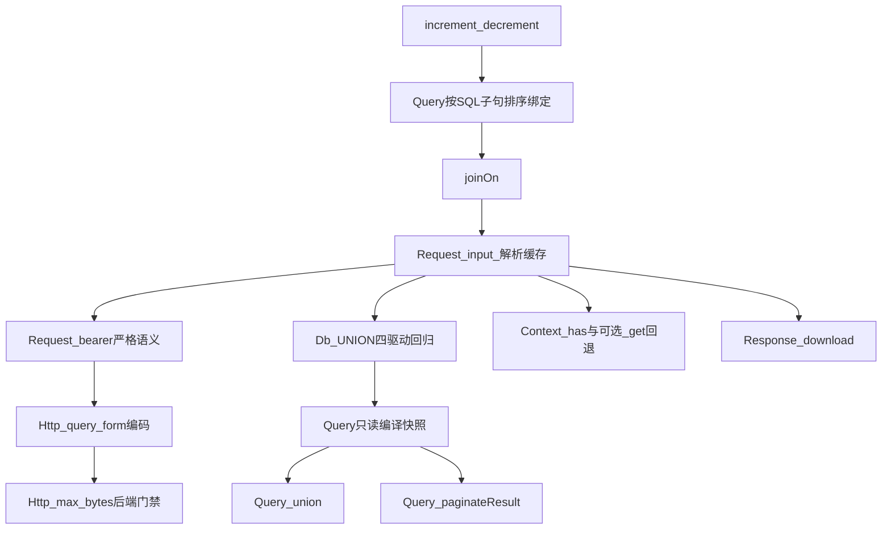

# 典型用法驱动：Gene 6.2 候选增强（源码复核版）

> Gene 版本基线：**6.1.x（ORM v2、生命周期原语、REST 互调已落地）**。  
> 交叉引用：[orm-v2.md](orm-v2.md) · [lifecycle-completeness.md](lifecycle-completeness.md) · [rest-invoke.md](rest-invoke.md) · [audit/plan/PLAN.md](../audit/plan/PLAN.md)  
> 立项依据：典型 Web 应用采用 6.1 后仍反复出现、无业务语义且可跨项目复用的样板代码或 `sql()` 逃生舱。

**方案定位**：优先补齐 ORM 安全写、JOIN 条件、统一输入和 HTTP 标准编码；UNION、复杂结果集分页、Context 魔术属性、文件下载响应和出站下载限额在满足各自前置条件后再落地。不把“少写一行分支”直接等同于框架能力或性能收益。

本文包含四个匿名应用的静态审计汇总，用于证明需求重复度；仅保留与 Gene 扩展规格、约束和验收有关的技术模式，不记录应用名称、业务模块或仓库路径。

---

## 零、源码复核结论

原稿方向基本正确，但不能按原优先级直接施工。源码事实要求做以下修正：

| 候选能力 | 复核结论 | 调整 |
|----------|----------|------|
| `increment/decrement` | 通用、可消除非原子“读后写”和表达式裸 SQL | **P0，保留** |
| JOIN ON 附加谓词 | 通用，但新增 JOIN 绑定会与当前“WHERE 先入参、JOIN 后入参”的重放顺序冲突 | **P0，先修绑定顺序** |
| `Request::input()` | 能统一 FPM/Swoole，并可做到 JSON 每请求最多解析一次 | **P0，只做显式 input，不自动改 POST** |
| `Http::request(query/form)` | 当前实现不解析这两个选项，应用已有调用会静默丢参数 | **P0，补齐并严格定义互斥关系** |
| `Request::bearer()` 严格语义 | 当前非 Bearer Authorization 也会原样返回，与方法名和应用正则语义不符 | **P0，兼容性缺陷修复** |
| `Query::union/unionAll` | 有价值，但 `count/paginate`、共享 Db 句柄、分支括号和绑定快照都不是薄透出 | **P1，先补编译/方言前置** |
| `Query::paginateResult` | JOIN/GROUP/UNION 的结果条数不能沿用当前直接 `COUNT(*)` | **P1，与只读编译器共建** |
| `Response::download` | 多应用重复 Content-Disposition/Length/readfile，已有 `sendFile` 可复用 | **P1，薄封装本地文件响应** |
| `__get` 回退 Context | 可减少双写，但 DI 本身已是请求级；还存在名称碰撞和隐式依赖 | **P1，可选便利能力** |
| `Http::request(max_bytes)` | curl 可提前中止；当前 Swoole Client `execute()` 后才取得完整 body，无法兑现同等内存保证 | **P2，按后端能力门禁** |
| `cachedHotVersion` | `localCachedVersion` 用 APCu，不是 `Gene\Memory`；运行时分流既不新增缓存语义，也不消除版本查询 | **不进入 C 层** |

### 0.1 科学性判断

- **能力缺口覆盖**：优化后可覆盖最常见的表达式更新、带值 JOIN、JSON 输入、HTTP query/form、复杂分页和部分复合查询缺口。
- **应用复杂度**：P0 项能实质删除应用层 SQL、输入合并和 HTTP 编码代码；Context/文件下载薄封装主要改善 DX；缓存分流仅省一个 `if`，不值得扩展公共 API。
- **性能**：原子增量可由“读 + 写”降为一次 UPDATE；JSON 解码缓存可避免重复解析；文件发送可避免整文件缓冲；JOIN/UNION/HTTP 编码主要提升正确性和可维护性，不能无基准宣称 SQL 或编码本身更快。
- **运行时一致性**：输入和 ORM 可保证 FPM/Swoole 同语义；下载限额在当前 Swoole 后端不能假装具备提前中止能力。
- **兼容性**：不改变现有 `post()`、`request()`、`join()`、缓存方法和 DI 优先级；新增能力均为显式调用。

### 0.2 立项门槛

每项进入实现前必须同时满足：

1. 至少 3 个独立重复用法，或明确位于热路径/正确性路径。
2. API 不携带租户、权限、业务错误码、厂商协议等业务语义。
3. 能写出失败语义、方言差异、生命周期和可自动化验收。
4. 性能收益区分“少写代码”“少一次网络/SQL”“少内存峰值”，不得混写。

### 0.3 匿名应用审计证据（2026-08-30）

统计为静态模式匹配，用来判断重复度，不代表每一处都能机械迁移。为保持框架文档与具体业务无关，应用名称、业务模块、类名和仓库路径均已移除；第三方依赖及应用内特定运行时模块不纳入框架候选分析。

| 应用 | Gene 使用与绕行 | 匿名化审计证据 | 对计划的影响 |
|------|-----------------|----------------|----------------|
| 应用 A | Gene 6.1 使用较完整；约 64 处 `sql()`、21 处直接 `Http::request`，同时有应用 HTTP 门面 | JSON 输入合并重复 3 处；Context/DI 双写 4 组；存在原子增量、双向 UNION、带谓词 JOIN、尚未实现的 `form/query` 调用，以及下载完成后才检查大小的逻辑 | 强证据支持 input、increment、joinOn、union、Context 回退、HTTP form/query、max_bytes |
| 应用 B | 约 370 处 Gene 引用，但 Gene Http/Context/Validate 基本未采用；17 处 `php://input`、26 处 `curl_init`、大量原始 SQL | 重复读取和解析 JSON；`Request::init` 未传 header/raw，另一路径直接读取 `php://input`，造成运行时语义不一致；存在非原子读后写、自建下载和重复 Bearer 解析 | 强证据支持 input；支持 Http 收口和带下界的原子递减；Bearer 提取在严格 scheme 修正后收口，不新增同义 API |
| 应用 C | 传统 FPM 应用；约 46 处 `sql()`、37 个事务起点、57 处版本缓存、414 处业务 REST 初始化 | 多处手工 JOIN count+list；13 处 `status=abs(status-1)`；重复手工事务；至少 5 处 `readfile` 下载 | joinOn 与结果集分页有价值；toggle、transaction、sendFile、批量缓存主要是已有能力收口 |
| 应用 D | 传统 FPM 应用；约 82 处 `sql()`、27 个事务起点、114 处版本缓存、348 处业务 REST 初始化 | 多组重复 JOIN count+list；重复手工事务；至少 4 处 `readfile` 下载；存在手工 GET/POST 合并 | 强证据支持 joinOn、结果集分页；transaction、paginate、Validate、sendFile 属已有能力优先迁移 |

### 0.4 跨应用归并

| 模式 | 应用 A | 应用 B | 应用 C | 应用 D | 结论 |
|------|--------|--------|--------|--------|------|
| JSON/raw 输入重复 | 强 | 强 | 弱 | 中 | `Request::input` P0 |
| JOIN ON/手工 JOIN 分页 | 强 | 强 | 强 | 强 | `joinOn` P0；`paginateResult` P1 |
| 原子算术写 | 强 | 中 | 主要是已有 toggle | 弱 | `increment/decrement` P0 |
| UNION | 强 | 无直接证据 | 仅递归 CTE | 无直接证据 | 保持 P1，不因单应用升为 P0 |
| HTTP form/query | 已有调用且当前静默无效 | 大量 curl 可收口 | SDK 有 form/query | 少量旧 HTTP | 新增 P0 |
| Bearer 提取 | 重复兼容 server/header + 正则 | 多组重复解析 | 无入站证据 | 无入站证据 | 修正现有 `Request::bearer` 严格语义 P0 |
| 下载体积上限 | 强 | 中 | 无 | 无 | `max_bytes` 保持 P2 后端门禁 |
| Context/DI 双写 | 强 | 无 | 无 | 无 | 保持 P1 可选，不扩大为默认隐式语义 |
| 手工事务 | 少 | 少 | 强 | 强 | 四个 Db 驱动与 `Orm\Model::transaction` 已有闭包事务，只做采用规范 |
| 状态翻转 | 少 | 强 | 强 | 弱 | Gene 已有 `toggle`，不新增任意表达式 |
| 手工文件下载 | 少 | 中 | 强 | 强 | 新增 `Response::download` P1；已有 `sendFile` 先收口 |

---

## 一、已有能力与边界

| 领域 | 6.1 已有 | 6.2 候选 |
|------|----------|----------|
| ORM 读 | `where/join/in/paginate/lockForUpdate/findMany` | `joinOn`、受控 `union/unionAll`、`paginateResult` |
| ORM 写 | `createMany/upsert/toggle/update` | 原子 `increment/decrement` |
| 入站 | `request/post/json/rawContent/bearer` | 显式 `input` + JSON 解码缓存、严格 Bearer scheme |
| 请求态 | 请求级 DI、`Context`、`cleanup` | 可选的 MVC `__get` 回退 |
| 出站 | `Http::request/multi/files/stream` | `query/form`、有能力门禁的 `max_bytes` |
| 响应 | `header/end/sendFile` | 可选的本地文件 `download` 薄封装 |
| 缓存 | `cachedVersion/localCachedVersion/*Batch` | 不新增运行时分流别名 |
| 互调 | `Invoke::local`、Request 栈 | 不重复立项 |

### 1.1 已有能力只需应用收口

| 已有能力 | 应用动作 |
|----------|----------|
| `Http::multi` | 并行出站替换自研 `curl_multi`；Swoole 无 Native CURL 时接受已约定的顺序降级 |
| `Http::request(files)` | 上传统一走 multipart 选项 |
| `findMany` / `Query::in` | 替换循环 `find` 和全表后 PHP 过滤 |
| `Gene\Validate` | 使用自定义或缺失 Validate 的应用优先迁移现有规则；业务提示和跨字段规则仍留应用 |
| `Invoke::local` | 替换本地调用前后手工 `Request::init` |
| `Request::bearer()` | 完成 §2.5 严格 scheme 修正后，替换 `HTTP_AUTHORIZATION`/`REDIRECT_HTTP_AUTHORIZATION`/header 遍历与正则解析；Token 校验仍留业务 |
| 四驱动 `transaction(callable)` / `Orm\Model::transaction` | 替换手工 begin/commit/catch/rollback；回调必须以异常表达回滚，普通 `return false` 不会自动回滚；嵌套调用由最外层拥有 commit/rollback |
| `Model::toggle` | 替换 `status=abs(status-1)`；需要额外业务字段时显式 update，不扩展任意 SET 表达式 |
| `Query/Model::paginate` | 单表和普通 JOIN 先迁移现有分页；GROUP/UNION 正确计数等待 `paginateResult` |
| `Response::sendFile` | 本地文件优先走内核/分块发送，替换 `readfile`；Disposition 等重复 header 等待可选 `download` |
| `cachedVersionBatch` | 批量热读先使用现有批量 API，不新增同义入口 |

### 1.2 明确留在应用层

REST 注册表、业务 CRUD 基类、版本键命名、业务响应信封、FULLTEXT/复杂报表及垂直领域或厂商 SDK 均不下沉。

---

## 二、P0：高复用且能闭合正确性

## 2.1 原子增量 `increment/decrement`

### API

```php
$affected = Metric::query()
    ->where('metric_key', $key)
    ->increment('value');

$affected = Resource::query()
    ->where('id', $id)
    ->where('available_count', '>=', 2)
    ->decrement('available_count', 2);
```

### 规格

- `increment(string $column, int|float $amount = 1): int` 和 `decrement(...)` 是 **Query 终端方法**，与当前 `Query::update()` 一样立即返回影响行数。
- `$column` 使用现有 `gene_orm_valid_ident()`；由驱动按自身方言引用，禁止任意 SET 表达式。
- `$amount` 必须是有限正数；方向由方法名决定，避免 `increment(-1)` 与 `decrement(-1)` 双重语义。
- 必须复用 `update/delete` 的“至少一个有效 where/in”保护；`in([])` 返回 0 且不发 SQL。
- 新增 Db 对称能力，或增加四驱动共用的内部 arithmetic-update helper；不得让 Query 手拼 MySQL 反引号。
- 不自动更新版本缓存；版本键是业务语义，仍由应用在成功写入和事务提交后更新。
- 不宣称自动保证数值下界；应用应把下界条件放进同一 UPDATE 的 WHERE，并检查 `$affected === 1`。
- `lockForUpdate()` 不能与该 UPDATE 在同一 Query 链生效。需要“先读后决策”时，由应用在事务中先执行独立的锁定 SELECT。

### 验收

1. 正常增减、小数（驱动支持的数值列）、非法列名、0/负数/非有限步长。
2. `where([])`、`where('')` 抛出；`in([])` 安全返回 0。
3. 带下界条件的并发递减只允许一次成功，避免丢失更新或越过下界。
4. 事务回滚后值不变；返回值为影响行数。
5. MySQL/Sqlite/Pgsql/Mssql 至少做 SQL 生成测试；可用驱动做执行测试。

### 收益口径

- 正确性：避免应用“SELECT 当前值 → UPDATE 新值”的丢失更新。
- 性能：典型计数由两次数据库交互降为一次 UPDATE。

---

## 2.2 JOIN ON 附加谓词：结构化 `joinOn`

保留现有简单等值映射 API：

```php
$q->join('related_record r', ['r.owner_id' => 'e.owner_id'], 'LEFT');
```

新增结构化谓词，常量值始终绑定，列名和操作符始终走白名单：

```php
$q->joinOn('related_record r', [
    ['left' => 'r.owner_id', 'op' => '=', 'column' => 'e.owner_id'],
    ['left' => 'r.state', 'op' => '=', 'value' => 0],
], 'LEFT');

$q->joinOn('relation_entry r', [
    ['left' => 'r.parent_id', 'op' => '=', 'column' => 'e.parent_id'],
    ['left' => 'r.sequence', 'op' => '>', 'column' => 'e.position'],
], 'LEFT');
```

不把 raw SQL 字符串设为首选公共 API。复杂函数、OR 树等结构化版本无法表达时继续显式使用 Db `sql()`；待出现跨项目重复后再评估带明确 `RawSql` 标记对象的逃生舱。

### 阻塞前置：修正绑定顺序

当前 Query 会先把数组 WHERE 送入 Db，再在第二遍重放 JOIN。现有 JOIN 无绑定所以没有问题；`joinOn` 增加值谓词后，SQL 是 `JOIN ... ? WHERE ... ?`，参数却可能是 `[where, join]`。

实现前必须把 Query 编译/重放调整为 **SQL 子句顺序**：

```text
verb/SET → JOIN binds → WHERE/IN binds → GROUP/HAVING binds → UNION binds → ORDER/LIMIT/LOCK
```

同类子句内部仍保持调用顺序。不能只在现有 `join()` 中追加绑定。

### 规格

- `joinOn(string $table, array $predicates, string $type = 'INNER'): static`。
- 每个 predicate 必须包含白名单标识符 `left`、白名单操作符 `op`，并且只含 `column` 或 `value` 二者之一。
- 第一版操作符仅支持 `= != > >= < <=`；`value === null` 只允许 `=`/`!=`，分别生成 `IS NULL`/`IS NOT NULL` 且不绑定。
- `column` 必须通过现有 identifier 校验并按驱动引用；`value` 只能生成占位符，不得拼进 SQL。
- predicate 数组不能为空；未知键、同时出现 column/value、缺右值均抛异常。
- Db 四驱动和 Query 同步提供；`join()` 原签名与行为不变，可在内部归一到同一 ON 编译器。
- `$type` 继续使用现有白名单。
- `update/delete/increment/decrement` 与任何 JOIN 互斥，保持现有约束。

### 验收

1. 列=列、列=值、非等值列比较和 null 谓词。
2. JOIN 和 WHERE 同时含绑定，最终参数严格按 SQL 占位符顺序排列。
3. 多 JOIN 保持顺序；LEFT/RIGHT/INNER 方言正确。
4. 标识符、操作符和结构注入负例；绑定中的注入载荷不进入 SQL 文本。
5. 空 predicates、非法 JOIN 类型、写操作组合均失败且不执行 SQL。
6. GROUP BY 聚合结果正确。

### 收益口径

减少常见 JOIN 聚合场景的裸 SQL 和注入面；数据库仍执行等价 SQL，默认不宣称查询耗时下降。

---

## 2.3 统一输入 `Request::input()`

### API

```php
$all = \Gene\Request::input();
$name = \Gene\Request::input('name', '');
```

正式签名：`input(?string $key = null, mixed $default = null): mixed`。无 key 返回合并数组；有 key 时未命中返回 default。Controller 和 Hook 增加同签名代理，Service 可直接用 `Request::input()`。

### 合并语义

1. 先取现有 `request()`（GET + POST，POST 覆盖 GET）。
2. 从标准化 header 或 server 的 `CONTENT_TYPE` 读取媒体类型；为 `application/json` 或 `application/*+json` 且 body 非空时，解析顶层 JSON 对象。
3. JSON 字段覆盖 request 中的同名键。
4. 非 JSON Content-Type 不解析 body。
5. 空 body 等价无 JSON 字段。
6. 非法 JSON 或顶层非对象 **抛异常**，不得静默退回 POST；静默忽略会把损坏请求伪装成缺字段。

`Request::json()` 保持现有“对象或数组均返回、非法输入抛异常”的契约；`input()` 因需要键合并，只接受顶层对象。

### 实现约束

- 在 `gene_request_context` 增加解析结果和“未解析/成功/失败”状态，`json()` 与 `input()` 共用；同一 raw body 每请求最多解码一次，失败状态再次读取时仍抛出等价异常。
- `input()` 通过 raw body 第一个非空白字节确认顶层是 `{`，不能只用 `zend_array_is_list()`，否则空对象 `{}` 与空数组 `[]` 解码后无法区分。
- `Request::init()` 设置新 raw body 时必须清除解析缓存；`clear()`、context reset/destroy 同步释放。
- 若未来 Request snapshot 会替换 raw body，解析缓存必须一并 snapshot/restore，或在切换时失效。当前 `Invoke::local` 不替换 raw body，不额外复制 Context。
- `rawContent()` 始终返回原始字节，不被 input 修改，保证 webhook 验签。
- **不增加自动 JSON→POST 配置**，也不在 `Application::run()` 修改 POST。显式 `input()` 已能统一 FPM/Swoole，自动改写会扩大兼容面并让 `post()` 语义依赖全局配置。

### 验收

1. GET、表单 POST、JSON 的覆盖顺序。
2. `application/problem+json` 等 `+json` 媒体类型。
3. 非法 JSON、标量、顶层列表、空 body、非 JSON body。
4. 连续调用 `json()/input()` 只解码一次；重新 `init()` raw 后不读旧缓存。
5. 合并前后 `rawContent()` 字节完全一致。
6. FPM 与 Swoole 初始化路径结果一致。

### 收益口径

应用删除 FPM Hook、Swoole 入口和自定义 input 三份合并代码；重复读取时避免重复 JSON 解码。

---

## 2.4 `Http::request()` 标准 `query/form` 编码

静态审计发现应用层统一 HTTP 门面已经调用以下形态：

```php
\Gene\Http::request([
    'method' => 'GET',
    'url' => $url,
    'query' => ['page' => 2, 'tag' => ['a', 'b']],
]);

\Gene\Http::request([
    'method' => 'POST',
    'url' => $url,
    'form' => ['grant_type' => 'client_credentials'],
]);
```

当前 `Http::request()` 只读取 `json/body/files` 等选项，`query/form` 会被静默忽略。这不是便利性问题，而是请求语义错误；多个受审计应用仍保留大量 curl 的 query/form 编码样板。

### 规格

- `query?: array`：使用 RFC 3986 规则编码，追加到 URL 已有 query 之后；保留 fragment 在末尾。空数组不改 URL。
- `form?: array`：无文件时编码为 `application/x-www-form-urlencoded`；有 `files` 时作为 multipart 普通字段。
- `query` 可与任一 body 类型组合；`json`、字符串 `body`、无文件 `form` 三者互斥。
- 保留 `files + array body` 作为兼容写法，但文档推荐 `files + form`；二者同时出现时报错。
- 自动 Content-Type 仅在调用方未提供时设置，header 名比较不区分大小写，禁止产生两个 Content-Type。
- 两个后端必须使用同一编码结果，不能让 curl 数组 POSTFIELDS 变成 multipart、Swoole 却变成 urlencoded。
- 数组/嵌套值遵循 `http_build_query(..., PHP_QUERY_RFC3986)` 语义；对象和资源拒绝。
- 不增加 `postJson/get/postForm` 等方法别名，避免扩大 API；这些是一行 options 组合。

### 未知选项防错

6.2 对未知 option 至少发一次 `E_NOTICE`（消息含 key）；下一主版本可改为异常。这样可发现拼写错误，又不立即破坏历史透传数组。内部 `Rest` 在调用 Http 前应剥离自己的 `decode` 等非传输选项。

### 验收

1. 已有 query、fragment、空值、空数组、重复/数字 key、嵌套数组和 UTF-8 编码。
2. 同一输入在 curl/Swoole 产生字节级一致的 query string、urlencoded wire body 和 Content-Type；空格统一按 RFC 3986 `%20`。
3. `files + form` multipart 的字段集合和值一致（multipart boundary 无需相同）；兼容 `files + array body`；所有互斥负例。
4. 调用方自定义 Content-Type 不重复；header 大小写覆盖正确。
5. echo server 断言应用层 HTTP 门面的 form/query 调用不再丢参数。
6. 未知选项只诊断，不发送到后端。

### 收益口径

修复静默错误并删除应用的 URL/form 编码和部分 curl 封装。编码本身不是性能优化；Swoole 下从裸 curl 迁移到协程后端才是并发收益。

---

## 2.5 `Request::bearer()` 严格 Bearer scheme

多个受审计应用均重复兼容 header、`HTTP_AUTHORIZATION`、`REDIRECT_HTTP_AUTHORIZATION` 后再用正则提取 Bearer。Gene 已有 `Request::bearer()` 和统一 header 查找，但当前实现仅在前缀是 `Bearer ` 时去掉前缀，遇到 `Basic xxx`、`Digest xxx` 等会把整串当 token 返回，这与方法名和 ide-helper 文档不一致。

### 规格

- 仅接受大小写不敏感的 `Bearer` auth-scheme，scheme 后至少一个 SP/HTAB，再 trim 两端 OWS。
- 缺 header、非 Bearer scheme、空 token、仅空白均返回 `null`。
- 不解析/校验 JWT、opaque token、scope、租户或哈希；token 内容按原字节返回。
- header 查找继续覆盖标准化 Header、`HTTP_AUTHORIZATION`、`REDIRECT_HTTP_AUTHORIZATION`；不得回退直接遍历用户态 `getallheaders()`。
- 这是现有文档契约的缺陷修复，不新增 `bearerToken()` 同义方法；升级说明明确指出“无 scheme 的裸 Authorization 不再返回”，需要原始值的调用方改用 `header/server`。

### 验收

1. `Bearer abc`、大小写 scheme、多个空格和 `Bearer<HTAB>abc`。
2. Basic/Digest/API-Key、`Bearerxxx`、`Bearer:`、空 Bearer、缺 header 均为 null。
3. Header 与 server 来源在 FPM/Swoole 一致；显式 header 优先级不变。
4. token 中非空白可见字符不被改写。

### 收益口径

删除两个应用的 header 兼容与正则样板，并避免把其他 Authorization scheme 误当 Bearer token；无显著性能收益，主要是安全边界和一致性。

---

## 三、P1：有价值，但不是薄透出

## 3.1 `Query::union/unionAll`

### API

```php
$q1 = Relation::query()->fields('target_id')->where('source_id', $id);
$q2 = Relation::query()->fields('source_id AS target_id')->where('target_id', $id);
$list = $q1->union($q2)->order('target_id')->all();
```

公共 API 第一版只接受 `Gene\Orm\Query`，不接受裸 SQL 元组；需要裸 SQL 时继续显式使用 Db。

### 为什么不是简单新增一个 op

- 两个 Query 通常持有同一个请求级 Db 对象；编译子 Query 会改写该 builder 状态。
- 现有 Db `union(string)` 不合并绑定，`union(DbObject)` 才合并绑定。
- 各驱动对子分支括号、分支 `ORDER/LIMIT` 的接受度不同，现有实现缺少四驱动执行回归。
- 当前 `count()` 从基础表生成 `COUNT(*)`；直接附加 UNION 得到的是多行 count，而不是复合结果总数。
- `paginate()` 依赖正确的 count，因此不能沿用普通 Query 路径。

### 阻塞前置

1. 为 Query 增加内部只读编译器，概念接口为 `compile(query, flags) -> {sql:string, params:array}`；结果使用请求内存持有，不能执行 SQL，不能改变 Query dirty 状态或 Db 的 sql/join/where/data 等属性。
2. 编译器必须从 table/fields/ops 的冻结快照生成结果；嵌套 op 数组和绑定 zval 按所有权规则复制，不能借用随后可能被修改的 HashTable 指针。
3. 校验父子 Query 使用同一个 Db 句柄/连接配置；拒绝 self-union、环和超过 8 层嵌套。
4. 先补 Db 四驱动 UNION 执行测试，明确每个驱动的分支括号、外层 ORDER/LIMIT 和派生表 alias 语法，再修正绑定合并差异。

### 规格

- `union(Query $query): static`、`unionAll(Query $query): static`。
- 调用时冻结子 Query 的 table/fields/ops 快照，后续修改原 `$q2` 不改变父 Query。
- 第一版拒绝子分支自己的 `order/limit/lock`，只允许复合查询外层 `order/limit`，避免方言不一致。
- `update/delete/increment/decrement` 与 UNION 互斥。
- `lockForUpdate/sharedLock` 第一版与 UNION 互斥，不使用“驱动支持则测试”的模糊口径。
- `count/paginate` 必须按复合结果计数：

```sql
SELECT COUNT(*) FROM (<compound query without outer order/limit/lock>) gene_union_count
```

若某驱动无法可靠生成，第一版应明确让 `count/paginate` 抛异常，而不是返回错误数字。

### 验收

1. UNION 去重、UNION ALL 保留重复。
2. 父子 WHERE 均有绑定，参数不串；多分支绑定顺序稳定。
3. 子 Query 快照不受后续修改影响；只读编译前后 Query dirty 与 Db 全部 builder 属性逐项相同。
4. 父子 Query 终端调用成功或抛异常后 Db 状态清空，无借用 zval/UAF。
5. `all/row/cell/print`；`count/paginate` 要么正确计数，要么按明确限制抛异常。
6. self/cycle/depth、跨连接、写操作、锁、分支 order/limit 均有负例。
7. MySQL/Sqlite/Pgsql/Mssql 的括号、alias、外层 ORDER/LIMIT SQL 快照；Sqlite 至少执行 UNION 与分页回归。

### 收益口径

减少双向关系等复合列表的裸 SQL，提高绑定和方言一致性；不会减少数据库查询次数，默认不宣称性能提升。

---

## 3.2 复杂结果集分页 `Query::paginateResult`

四个受审计应用均有“同一 JOIN/GROUP 条件写两遍：一次 COUNT、一次列表”的实现，覆盖多组聚合模型与关联列表。当前 `Query::paginate()` 对 GROUP 明确拒绝，对 JOIN 统计的是连接后行数，不能安全替代这些代码。

### API

```php
$result = Report::query()
    ->fields('report.owner_id, COUNT(item.id) AS item_count')
    ->join('item', ['item.report_id' => 'report.id'], 'LEFT')
    ->group('report.owner_id')
    ->paginateResult(0, 20);
// ['count' => 分组后的结果行数, 'list' => 当前页]
```

### 规格

- `paginateResult(int $offset, int $limit): array` 统计“最终 SELECT 结果行数”，不是基础表行数或 JOIN 展开行数。
- 使用 UNION 所需的同一只读编译器，先生成移除外层 `order/limit/lock` 的 SQL，再包装：

```sql
SELECT COUNT(*) FROM (<compiled result>) gene_result_count
```

- 列表阶段保留原 `fields/join/where/group/having/union/order`，仅覆盖外层 limit。
- 原 `paginate()` 语义和性能路径不变；普通单表查询继续使用它，避免所有分页都引入派生表。
- `paginateResult()` 必须支持 GROUP/HAVING；UNION 在 3.1 前置完成后接入。
- 分支/子查询中的 limit 不得被误删；只移除当前 Query 的外层 order/limit/lock。
- count 与 list 使用同一份冻结编译快照，避免两阶段之间修改 ops 或串用共享 Db builder。
- 返回契约继续保持 `{count:int,list:array}`，任一驱动错误不得返回非数组 list。

### 验收

1. 一对多 JOIN + GROUP 的 count 等于分组数，而不是明细行数。
2. HAVING 会影响 count；外层 ORDER 不进入 count。
3. UNION/UNION ALL 分页总数正确，或在 UNION 尚未落地时明确抛异常。
4. 父查询外层 limit 被覆盖，子查询 limit 保留。
5. count/list 参数顺序一致，执行后 Db builder reset。
6. 与现有 `paginate()` 做基准，证明普通路径无回退。

### 收益口径

主要收益是消除两份条件和计数漂移；仍执行 count + list 两条 SQL，不宣称减少数据库往返。复杂查询的派生表 count 可能更慢，应用应以执行计划决定是否使用。

---

## 3.3 MVC `__get` 回退 `Gene\Context`（可选）

### 事实修正

`ctx->di_regs` 已随请求/协程 context 清理，因此 `Di::set('user', ...)` 本身不是 worker 级脏写。问题是 Context 与 DI 双写可能遗漏或产生两个真相源，而不是 DI 跨请求泄漏。

### 规格

- 先为 Context 增加 `has(string $key): bool`，支持区分“不存在”和“显式 null”。
- `Controller/Service/Hook::__get($name)`：保持现有 class DI → global DI/配置解析；仅完全未命中时读取 Context。
- DI 优先，避免请求字段覆盖 `db/cache/request` 等组件。
- 不把 Context 键注册进 DI；Context 查找使用内部 helper，避免魔术属性再走一次用户态静态调用。
- Context 名称可能与组件冲突，文档推荐 `auth_user/tenant/request_id` 等明确键名。
- `Invoke::local` 只隔离 Request 参数袋，**Context 当前是同一请求内共享并继承**；内层修改会对外层可见。若未来需要隔离，必须单独设计 Context 栈，不能引用现有 Request 栈作为保证。

### 验收

1. 仅 Context 有值时三类基类均可读；显式 null 配合 `Context::has()` 行为稳定。
2. DI 与 Context 同名时 DI 优先，且配置组件只实例化一次。
3. context reset/cleanup 后不再可读。
4. Swoole 两协程隔离；`Invoke::local` 内外共享语义有显式测试。
5. 基准确认 DI 命中热路径没有新增 Context 查找。

### 取舍

该能力减少属性访问迁移成本，但增加隐式依赖。当前强证据仅来自一个受审计应用，应先增加 `Context::has()`；`__get` 回退继续以第二个独立 Context 应用为实施门槛。

---

## 3.4 本地文件响应 `Response::download`（可选）

多个受审计应用存在 `header + filesize + readfile + exit` 或重复构造 Content-Disposition 的实现。Gene 已有跨运行时 `Response::sendFile()`，但应用层仍重复处理下载文件名和响应头。

### API

```php
return \Gene\Response::download(
    $localPath,
    'example.xlsx',
    'application/vnd.openxmlformats-officedocument.spreadsheetml.sheet'
);
```

建议签名：

```text
download(string $file, ?string $downloadName = null,
         string $mime = 'application/octet-stream', bool $inline = false): bool
```

### 规格

- 只接受本地普通文件，沿用 `sendFile()` 的 wrapper/SSRF 防护。
- FPM 必须先成功打开同一文件句柄再设置 header，并复用该句柄发送；Swoole 先 stat/readability preflight 再设置 header 和调用 sendfile。后者仍有不可消除的文件替换 TOCTOU，失败必须返回 false 且不得调用 `end()` 伪装成功。
- 设置 `Content-Type`、`Content-Length` 和 RFC 6266/RFC 5987 兼容的 Content-Disposition（安全 ASCII fallback + `filename*=UTF-8''...`）。
- 文件名去除 CR/LF、NUL 和路径部分；不能形成 header injection。
- `inline=false` 为 attachment，`true` 为 inline。
- 实际发送复用 `sendFile()` 的内部发送 helper，而不是在 `download()` 中再次调用会重新打开文件的公共方法：Swoole 走内核 sendfile，FPM 对已打开句柄 8KB 分块；禁止把文件读成完整字符串。
- 不自动删除文件、不猜业务 Cache-Control、不调用 `exit`；调用方负责临时文件生命周期并立即返回。
- 内存中的 bytes 不走该 API，继续 `header + end($bytes)`；避免把“文件发送”和“已有内存响应”混为一体。

### 验收

1. 中文、引号、路径字符和 CRLF 文件名。
2. Content-Length 与文件大小一致，空文件可发送。
3. FPM 分块和 Swoole sendfile 两条路径；不存在文件返回 false 且不发送半套 header。
4. 本地 wrapper 负例；inline/attachment。
5. 100MB 文件峰值内存不随文件大小线性增长。

### 取舍

这是基于现有 `sendFile` 的低成本 DX 能力；若实现前应用可通过三行统一 helper 完全收口，也可只加强 ide-helper 示例而不新增 C 方法。

---

## 四、P2：后端能力验证后再做

## 4.1 `Http::request(max_bytes)`

```php
$r = \Gene\Http::request([
    'method' => 'GET',
    'url' => $url,
    'max_bytes' => 52_428_800,
]);
```

### 可兑现的语义

- curl 后端：WRITEFUNCTION 在追加 body 和触发 stream 回调前累计字节；超过上限立即中止，返回 `status=0, error='body_too_large', body=''`。
- `body_too_large` 不重试；否则重试会重复消耗带宽。
- 与 `stream/sse` 互斥，避免调用方已经消费部分数据后又收到整体失败；可与 `discard_body` 组合并继续计数。
- `Content-Length` 只能提前拒绝，不能替代实际字节计数（分块、压缩或错误 header）。

### Swoole 限制

当前实现调用 `Swoole\Coroutine\Http\Client::execute()` 后读取完整 `body`，再按 8KB 伪分块。此路径只能事后 `strlen`，不能降低峰值内存或带宽。

因此第一版只能二选一：

1. Swoole 已启用 Native CURL hook 时，对 `max_bytes` 选择 curl 后端并真正提前中止；
2. 否则在发请求前抛出“不支持严格 max_bytes”的异常。

禁止在 Swoole Client 收完整 body 后仍宣称“传输层提前中止”。若未来 Swoole 提供可验证的响应 chunk callback，再接入同一契约。

### 验收

- 本地 server 分块持续发送，记录服务端已发送字节，证明客户端确实提前断开，而不只是最终 body 为空。
- 未超限完整返回；等于上限成功；超过 1 字节失败。
- redirect、retry、discard_body、压缩响应的计数口径明确。
- Swoole Native CURL 与无 Native CURL 两条路径分别验证；无环境必须 SKIP，不能假通过。

---

## 五、不进入 C 层：`cachedHotVersion`

不新增该方法，原因如下：

1. `localCachedVersion` 使用 APCu，不是 `Gene\Memory`；“Swoole 禁止写 Memory”不能推出“必须禁用 APCu”。
2. `localCachedVersion` 命中 APCu 后仍读取外部版本，因此运行时分流不会消除版本查询，只可能减少外部数据 payload 获取。
3. `cachedHotVersion` 只是按 runtime 调两个既有方法，节省的是应用一处分支，不是新原语。
4. 单项方法还会引出 Batch 对称 API，扩大命名面。

应用可在自己的 Cache facade 中按部署策略选择 `cachedVersion`、`localCachedVersion` 或批量版本；如果未来要立项，应先提供真实基准，并设计“允许多长陈旧窗口”的 L1 版本缓存策略，而不是按 runtime 名称硬编码。

---

## 六、明确不做

| 诉求 | 原因 |
|------|------|
| 自动 JSON→POST | 改变既有 `post()` 语义，显式 `input()` 已解决统一入口 |
| 任意 `SET expression` | 注入和方言面过大；仅提供受控算术更新 |
| UNION 裸 SQL 输入 | ORM 第一版只收 Query；裸 SQL 留 Db |
| 事务 commit 后自动 `updateVersion` | 版本键与一致性边界属于业务 |
| REST 注册表/服务发现 | 本地已有 `Invoke::local`，远端元数据有业务语义 |
| ORM FULLTEXT/复杂报表 | 方言重、重复度不足；`paginateResult` 只负责通用计数，不承诺表达所有报表 |
| 业务 CRUD/Base 基类 | 6.1 ORM 已覆盖通用 CRUD；字段过滤、版本键、信封和默认排序属于应用约定 |
| `Money/Guid/Arr/Csv` 工具大全 | Money 舍入、ID 格式、CSV 列定义常含业务语义；优先标准库/应用 PHP helper，热度不足不进 C |
| Bearer Token 校验/权限 | `Request::bearer()` 只负责提取；哈希、scope、租户与错误码留应用 |
| 路由中间件管道 | 既有审计约束不变 |
| 队列/迁移/厂商 SDK | 不属于轻量框架原语 |

---

## 七、实施顺序与停止条件



1. **里程碑 A（P0）**：原子增减、绑定顺序、`joinOn`、`input`、严格 `bearer`、Http `query/form`。
2. **里程碑 B（P1）**：Db UNION 回归与 Query 编译快照完成后，实现 ORM UNION 和 `paginateResult`。
3. **里程碑 C（可选/P2）**：先落 `Context::has`；等第二个独立应用采用 Context 再决定魔术回退；按 DX 收益决定 `Response::download`；按后端能力决定 `max_bytes`。
4. **应用收口里程碑（零 C）**：受审计应用优先采用现有 `Request::bearer`、`transaction`、`toggle`、普通 `paginate`、`sendFile`、`cachedVersionBatch` 和 `Http::request/multi`。
5. 任一能力若无法在四驱动或 FPM/Swoole 下给出明确失败语义，先缩小公开契约，不做静默降级。

---

## 八、统一验收与收益度量

### 8.1 正确性

- 所有字符串 SQL 片段均有绑定值不进入 SQL 文本的测试。
- 所有写终端均复用有效 WHERE 保护。
- Query 终端成功、异常后 Db builder 都被 reset。
- Swoole context reset/cleanup 后新增状态全部释放。

### 8.2 兼容性

- 旧 `join($table, array $on, $type)`、`post()`、`request()`、`json()`、`Http` 已支持选项和缓存 API 行为不变；唯一有意收紧是 `bearer()` 不再返回非 Bearer Authorization，并写入升级说明。
- `files + array body` multipart 保持兼容；未知 Http option 在 6.2 只诊断、不直接抛异常。
- 同步 `gene-ide-helper/Gene/**/*.php` 与 `gene-ai-helper/skills/gene-framework/reference.md`。
- 新 API 在无可用后端时抛清晰异常，不返回看似成功的降级结果。

### 8.3 性能

只接受可重复基准：

| 能力 | 指标 |
|------|------|
| increment/decrement | SQL 次数、并发最终值、P95 延迟 |
| joinOn/union | 构建开销不显著回退；数据库 SQL 与手写基线等价 |
| paginateResult | count 正确性、执行计划、P95；与手工 count 基线比较 |
| Request::input | 单请求 JSON 解码次数、10KB/1MB body CPU 与分配 |
| Request::bearer | 各 Authorization scheme 返回值矩阵；FPM/Swoole 来源一致性 |
| Http query/form | wire body/query 一致性；不单独宣称性能收益 |
| Response::download | 100MB 文件峰值 RSS、吞吐、Swoole sendfile 路径 |
| Context 回退 | DI 命中路径开销；DI miss + Context hit 开销 |
| max_bytes | 实际接收字节、峰值 RSS、服务端断开点 |

“少写代码”单列为编码效率，不作为运行时性能结论。

---

## 九、最终优先级

| 优先级 | 能力 | 主要价值 | 前置/风险 |
|--------|------|----------|-----------|
| P0 | `increment/decrement` | 原子正确性 + 少一次 DB 交互 | 四驱动算术引用、写保护 |
| P0 | 结构化 `joinOn` | 移除常见 JOIN 裸 SQL | 值谓词绑定前必须先修参数顺序 |
| P0 | `Request::input` | 删除重复 JSON/raw 输入逻辑 | 解码缓存失效与媒体类型 |
| P0 | 严格 `Request::bearer` | 删除重复解析，拒绝 scheme 混淆 | 现有错误语义修复与兼容测试 |
| P0 | `Http query/form` | 修复静默丢参数，收敛 curl 编码 | 双后端 wire 语义、互斥兼容 |
| P1 | `Query::union/unionAll` | 移除复合列表裸 SQL | 编译快照、方言、正确计数 |
| P1 | `Query::paginateResult` | 统一 JOIN/GROUP/UNION 正确分页 | 依赖编译器，派生表 count 成本 |
| P1 可选 | `Response::download` | 统一安全文件名与零整文件缓冲发送 | 临时文件生命周期、header 兼容 |
| P1 可选 | `Context::has`；`__get` 待证据 | 减少 Context/DI 双写 | 当前仅一个应用有双写，隐式依赖 |
| P2 | `Http max_bytes` | curl 下真实降内存/带宽 | Swoole Client 当前不支持提前中止 |
| 不做 | `cachedHotVersion` | 仅省一处分支 | 前提混淆 APCu 与 Memory，收益不足 |

---

## 十、落地结果（2026-08-30）

### 10.1 已完成

| 能力 | 结果 |
|------|------|
| `increment/decrement` | Query 与 Mysql/Sqlite/Pgsql/Mssql 四驱动均已实现；有限正数与列名校验、有效 WHERE 保护、`in([])` 零 SQL、影响行数和事务回滚语义已覆盖 |
| SQL 子句绑定顺序 / `joinOn` | Query 改为 JOIN 先于 WHERE/IN 绑定；结构化列比较、常量绑定、NULL、操作符/键集合/JOIN 类型负例及四驱动引用已覆盖 |
| `Request::input` | GET+POST+JSON 覆盖语义、`application/*+json`、顶层对象限制、`json()` 共用解析缓存、`init/clear/restore/reset/destroy` 失效释放及 Controller/Hook 代理已实现；`rawContent()` 保持原字节 |
| 严格 `Request::bearer` | 仅接受大小写不敏感的 Bearer + SP/HTAB；Basic、裸 token、空 token 等返回 `null` |
| `Http query/form` | RFC 3986 query、已有 query/fragment、urlencoded form、files+form multipart、files+array body 兼容、自定义 Content-Type 与互斥负例已实现；未知 option 发 `E_NOTICE` |
| Query 编译快照 / UNION | `union/unionAll` 已实现冻结快照、同 Db/self/cycle/depth/分支限制、稳定绑定与最终结果 count；只读编译使用不持有 PDO/pool 的 builder clone，避免析构误回滚活动事务 |
| `paginateResult` | GROUP/HAVING/UNION 最终结果派生表计数与列表共用冻结快照，保留外层排序并覆盖分页 limit |
| `Context::has` | 已实现并可区分缺失键与显式 `null` |
| API 面 | 版本提升为 `6.2.0`；IDE helper 与 AI reference 已同步 |

### 10.2 按方案暂缓/不做

- `Controller/Service/Hook::__get` 回退 Context：仍只有一个独立应用的强证据，未达到第二个应用门槛；DI 优先级不变。
- `Response::download`：本轮不扩大可选 API，应用先使用已有 `sendFile()` 收口；待确认薄封装的实际 DX 收益后再决定。
- `Http::request(max_bytes)`：Swoole Coroutine Http Client 仍只能在 `execute()` 后取得完整 body，无法兑现提前中止与峰值内存保证，因此未提供伪降级。
- `cachedHotVersion`、自动 JSON→POST、任意 SET expression 等继续按“明确不做”处理。

### 10.3 构建与验证

环境：PHP 8.1.34 NTS x64、VS2019/vs16、PHP SDK 2.3.0；产物 `F:\php_src\php-8.1.30-src\x64\Release\php_gene.dll`。

- `nmake php_gene.dll`：通过。
- `test/OrmTest.php`：177 passed，0 failed；包含四驱动 SQL/绑定快照、Sqlite 执行、UNION 活动事务保持。
- `test/LifecycleTest.php`：22 passed，0 failed；覆盖 input/bearer/Context 与缓存生命周期。
- `test/HttpClientTest.php`：curl/FPM 路径全部通过；真实 Swoole 后端因本机无 Swoole 明确 SKIP。
- `audit/repro/orm_v2_leak_probe.php`：全部 10k 循环 `+0 B`，`LEAK PROBE OK`。
- `audit/repro/lifecycle_leak_probe.php`：FPM/CLI 与模拟 Swoole 常驻上下文循环均 `+0 B`，`LEAK PROBE OK`；真实 Swoole coroutine 分支已写入探针，无扩展时明确 SKIP。
- 完整 `TestRunner.php`：与本次改动相关的 Orm、Http、Lifecycle、Mvc、Hook、Database、RestInvoke 均通过；总计 819/822，另 3 个失败来自未修改的 Cache/Router/Benchmark 测试自身环境/计数项，不作为本方案验收通过项。
- 所有修改 PHP 文件 `php -l` 与 `git diff --check`：通过。

### 10.4 验证边界

本机没有 Swoole 扩展，也没有 Pgsql/Mssql/MySQL 服务端，因此本轮对 Swoole 完成了 context 生命周期模拟与可执行 coroutine 探针，对四数据库完成 SQL/绑定生成快照，并以 Sqlite 完成真实执行。发布前仍应在 Linux Swoole 环境运行 `audit/repro/lifecycle_leak_probe.php` 与 `test/HttpClientTest.php`，在目标数据库 CI 执行四驱动集成回归；不以 SKIP 冒充动态通过。

**状态**：本文档为 **6.2 候选立项稿（源码复核版）**。先完成里程碑 A；其余项目必须通过各节前置条件后再进入实现。